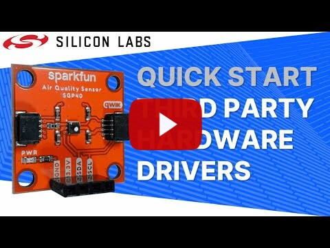

# Third Party Hardware Drivers #

[](https://github.com/SiliconLabs/third_party_hw_drivers_extension/releases)
[](https://github.com/SiliconLabs/gecko_sdk/releases)


This repo contains example drivers developed by Silicon Labs engineers and are provided as [an SDK extension](https://docs.silabs.com/simplicity-studio-5-users-guide/latest/ss-5-users-guide-getting-started/install-sdk-extensions). These drivers interface with different types of external hardware and are tested against a specific device listed in the driver name. These drivers are intended to be fully compatible with Silicon Labs' wireless stacks. All drivers provide a minimal Simplicity Studio project for testing and to show an example usage of the driver. The driver source is provided for modification and extension as needed. All drivers in this repository are considered to be EVALUATION QUALITY which implies that the code provided in the repos is subjected to limited testing and is provided provided as-is. It is not suitable for production environments.

A full list of all drivers in this repository is defined below:

| Driver name | Link to driver | Link to example | Link to documentation |
|:----------|:------------------:|:----------:|:------------------:|
| captouch2_cap1166 | [Click Here](./driver/public/mikroe/captouch2_cap1166) | [Click Here](./app/example/mikroe_captouch2_cap1166) | [Click Here](./app/documentation/example/mikroe_captouch2_cap1166) |
| heartrate2_maxm86161 | [Click Here](./driver/public/mikroe/heartrate2_maxm86161) | [Click Here](./app/example/mikroe_heartrate2_maxm86161) | [Click Here](./app/documentation/example/mikroe_heartrate2_maxm86161) |
| temphum9_shtc3 | [Click Here](./driver/public/mikroe/temphum9_shtc3) | [Click Here](./app/example/mikroe_temphum9_shtc3) | [Click Here](./app/documentation/example/mikroe_temphum9_shtc3) |
| oledw_ssd1306 | [Click Here](./driver/public/mikroe/oledw_ssd1306) | [Click Here](./app/example/mikroe_oledw_ssd1306) | [Click Here](./app/documentation/example/mikroe_oledw_ssd1306) |
| mikroe_oledw_ssd1306_glib | [Click Here](./driver/public/silabs/services_tphd_glib) | [Click Here](./app/example/mikroe_oledw_ssd1306_glib) | [Click Here](./app/documentation/example/mikroe_oledw_ssd1306_glib) |
| buzz2_cmt_8540s_smt | [Click Here](./driver/public/mikroe/buzz2_cmt_8540s_smt) | [Click Here](./app/example/mikroe_buzz2_cmt_8540s_smt) | [Click Here](./app/documentation/example/mikroe_buzz2_cmt_8540s_smt) |
| brushless16_lb11685av | [Click Here](./driver/public/mikroe/brushless16_lb11685av) | [Click Here](./app/example/mikroe_brushless16_lb11685av) | [Click Here](./app/documentation/example/mikroe_brushless16_lb11685av) |
| accel5_bma400 | [Click Here](./driver/public/silabs/accel5_bma400) | [Click Here](./app/example/mikroe_accel5_bma400) | [Click Here](./app/documentation/example/mikroe_accel5_bma400) |
| dosimeter_type5 | [Click Here](./driver/public/silabs/dosimeter_type5) | [Click Here](./app/example/sparkfun_dosimeter_type5) | [Click Here](./app/documentation/example/sparkfun_dosimeter_type5) |
| micro_oled_ssd1306 | [Click Here](./driver/public/silabs/micro_oled_ssd1306) | [Click Here](./app/example/sparkfun_micro_oled_ssd1306) | [Click Here](./app/documentation/example/sparkfun_micro_oled_ssd1306) |
| rfid_id12la | [Click Here](./driver/public/silabs/rfid_id12la) | [Click Here](./app/example/sparkfun_rfid_id12la) | [Click Here](./app/documentation/example/sparkfun_rfid_id12la) |
| distance_vl53l1x | [Click Here](./driver/public/silabs/distance_vl53l1x) | [Click Here](./app/example/sparkfun_distance_vl53l1x) | [Click Here](./app/documentation/example/sparkfun_distance_vl53l1x) |
| co_mq7 | [Click Here](./driver/public/mikroe/co_mq7) | [Click Here](./app/example/mikroe_co_mq7) | [Click Here](./app/documentation/example/mikroe_co_mq7) |
| relay2_lca717 | [Click Here](./driver/public/mikroe/relay2_lca717) | [Click Here](./app/example/mikroe_relay2_lca717) | [Click Here](./app/documentation/example/mikroe_relay2_lca717) |
| accelerometer_mma8452q | [Click Here](./driver/public/silabs/accelerometer_mma8452q) | [Click Here](./app/example/sparkfun_accelerometer_mma8452q) | [Click Here](./app/documentation/example/sparkfun_accelerometer_mma8452q) |
| spectroscopy_as7265x | [Click Here](./driver/public/silabs/spectroscopy_as7265x) | [Click Here](./app/example/sparkfun_spectroscopy_as7265x) | [Click Here](./app/documentation/example/sparkfun_spectroscopy_as7265x) |
| qwiic_joystick | [Click Here](./driver/public/silabs/qwiic_joystick) | [Click Here](./app/example/sparkfun_qwiic_joystick) | [Click Here](./app/documentation/example/sparkfun_qwiic_joystick) |
| utm7segr_max6969 | [Click Here](./driver/public/mikroe/utm7segr_max6969) | [Click Here](./app/example/mikroe_utm7segr_max6969) | [Click Here](./app/documentation/example/mikroe_utm7segr_max6969) |
| human_presence_ak9753 | [Click Here](./driver/public/silabs/human_presence_ak9753) | [Click Here](./app/example/sparkfun_human_presence_ak9753) | [Click Here](./app/documentation/example/sparkfun_human_presence_ak9753) |
| soil_moisture | [Click Here](./driver/public/silabs/soil_moisture) | [Click Here](./app/example/sparkfun_soil_moisture) | [Click Here](./app/documentation/example/sparkfun_soil_moisture) |
| ir_aray_mlx90640 | [Click Here](./driver/public/silabs/ir_array_mlx90640) | [Click Here](./app/example/sparkfun_ir_array_mlx90640) | [Click Here](./app/documentation/example/sparkfun_ir_array_mlx90640) |
| proximity_vcnl4040 | [Click Here](./driver/public/silabs/proximity_vcnl4040) | [Click Here](./app/example/sparkfun_proximity_vcnl4040) | [Click Here](./app/documentation/example/sparkfun_proximity_vcnl4040) |
| eth_wiz_w5500 | [Click Here](./driver/public/mikroe/eth_wiz_w5500) | [Click Here](./app/example/mikroe_eth_wiz_w5500) | [Click Here](./app/documentation/example/mikroe_eth_wiz_w5500) |
| fuel_gauge_max17048 | [Click Here](./driver/public/silabs/fuel_gauge_max17048) | [Click Here](./app/example/maxim_fuel_gauge_max17048) | [Click Here](./app/documentation/example/maxim_fuel_gauge_max17048) |
| barcode2_em3080w | [Click Here](./driver/public/mikroe/barcode2_em3080w) | [Click Here](./app/example/mikroe_barcode2_em3080w) | [Click Here](./app/documentation/example/mikroe_barcode2_em3080w) |
| water_detect | [Click Here](./driver/public/mikroe/water_detect) | [Click Here](./app/example/mikroe_water_detect) | [Click Here](./app/documentation/example/mikroe_water_detect) |
| radar_mm5d91_00 | [Click Here](./driver/public/mikroe/radar_mm5d91_00) | [Click Here](./app/example/mikroe_radar_mm5d91_00) | [Click Here](./app/documentation/example/mikroe_radar_mm5d91_00) |
| rgb_led_is31fl3741 | [Click Here](./driver/public/silabs/rgb_led_is31fl3741) | [Click Here](./app/example/adafruit_rgb_led_is31fl3741) | [Click Here](./app/documentation/example/adafruit_rgb_led_is31fl3741) |
| fingerprint2_a172mrq | [Click Here](./driver/public/mikroe/fingerprint2_a172mrq) | [Click Here](./app/example/mikroe_fingerprint2_a172mrq) | [Click Here](./app/documentation/example/mikroe_fingerprint2_a172mrq) |
| air_quality_sgp40 | [Click Here](./driver/public/silabs/air_quality_sgp40) | [Click Here](./app/example/sparkfun_air_quality_sgp40) | [Click Here](./app/documentation/example/sparkfun_air_quality_sgp40) |
| environment2_sht40_sgp40 | [Click Here](./driver/public/mikroe/environment2_sht40_sgp40) | [Click Here](./app/example/mikroe_environment2_sht40_sgp40) | [Click Here](./app/documentation/example/mikroe_environment2_sht40_sgp40) |
| heartrate4_max30101 | [Click Here](./driver/public/mikroe/heartrate4_max30101) | [Click Here](./app/example/mikroe_heartrate4_max30101) | [Click Here](./app/documentation/example/mikroe_heartrate4_max30101) |
| hr_po_max30101_max32664 | [Click Here](./driver/public/silabs/hr_po_max30101_max32664) | [Click Here](./app/example/sparkfun_hr_po_max30101_max32664) | [Click Here](./app/documentation/example/sparkfun_hr_po_max30101_max32664) |
| alcohol_mq3 | [Click Here](./driver/public/mikroe/alcohol_mq3) | [Click Here](./app/example/mikroe_alcohol_mq3) | [Click Here](./app/documentation/example/mikroe_alcohol_mq3) |
| gps_lea6s | [Click Here](./driver/public/mikroe/gps_lea6s) | [Click Here](./app/example/mikroe_gps_lea6s) | [Click Here](./app/documentation/example/mikroe_gps_lea6s) |
| temphum15_sht40 | [Click Here](./driver/public/mikroe/temphum15_sht40) | [Click Here](./app/example/mikroe_temphum15_sht40) | [Click Here](./app/documentation/example/mikroe_temphum15_sht40) |
| irthermo3_mlx90632 | [Click Here](./driver/public/mikroe/irthermo3_mlx90632) | [Click Here](./app/example/mikroe_irthermo3_mlx90632) | [Click Here](./app/documentation/example/mikroe_irthermo3_mlx90632) |
| stepper_a3967 | [Click Here](./driver/public/silabs/stepper_a3967) | [Click Here](./app/example/mikroe_stepper_a3967) | [Click Here](./app/documentation/example/mikroe_stepper_a3967) |
| stepper2_a4988 | [Click Here](./driver/public/mikroe/stepper2_a4988) | [Click Here](./app/example/mikroe_stepper2_a4988) | [Click Here](./app/documentation/example/mikroe_stepper2_a4988) |
| dcmotor3_tb6549fg | [Click Here](./driver/public/mikroe/dcmotor3_tb6549fg) | [Click Here](./app/example/mikroe_dcmotor3_tb6549fg) | [Click Here](./app/documentation/example/mikroe_dcmotor3_tb6549fg) |
| environmental_bme280_ccs811 | [Click Here](./driver/public/silabs/environmental_bme280_ccs811) | [Click Here](./app/example/sparkfun_environmental_bme280_ccs811) | [Click Here](./app/documentation/example/sparkfun_environmental_bme280_ccs811) |
| oledc_ssd1351 | [Click Here](./driver/public/mikroe/oledc_ssd1351) | [Click Here](./app/example/mikroe_oledc_ssd1351) | [Click Here](./app/documentation/example/mikroe_oledc_ssd1351) |
| pressure3_dps310 | [Click Here](./driver/public/mikroe/pressure3_dps310) | [Click Here](./app/example/mikroe_pressure3_dps310) | [Click Here](./app/documentation/example/mikroe_pressure3_dps310) |
| lte_iot2_bg96 | [Click Here](./driver/public/mikroe/lte_iot2_bg96) | [Click Here](./app/example/mikroe_lte_iot2_bg96) | [Click Here](./app/documentation/example/mikroe_lte_iot2_bg96) |
| e_paper_154_inch | [Click Here](./driver/public/mikroe/e_paper_154_inch) | [Click Here](./app/example/mikroe_e_paper_154_inch) | [Click Here](./app/documentation/example/mikroe_e_paper_154_inch) |
| ir_array_amg88xx | [Click Here](./driver/public/silabs/ir_array_amg88xx) | [Click Here](./app/example/sparkfun_ir_array_amg88xx) | [Click Here](./app/documentation/example/sparkfun_ir_array_amg88xx) |
| nfc2_pn7150 | [Click Here](./driver/public/mikroe/nfc2_pn7150) | [Click Here](./app/example/mikroe_nfc2_pn7150) | [Click Here](./app/documentation/example/mikroe_nfc2_pn7150) |
| nfc2_pn7150_t2t_read | [Click Here](./driver/public/silabs/services_nfc) | [Click Here](./app/example/mikroe_nfc2_pn7150_nci_t2t_read) | [Click Here](./app/documentation/example/mikroe_nfc2_pn7150_nci_t2t_read) |
| nfc2_pn7150_t2t_write | [Click Here](./driver/public/silabs/services_nfc) | [Click Here](./app/example/mikroe_nfc2_pn7150_nci_t2t_write) | [Click Here](./app/documentation/example/mikroe_nfc2_pn7150_nci_t2t_write) |
| ir_generate | [Click Here](./driver/public/silabs/ir_generate) | [Click Here](./app/example/silabs_ir_generate) | [Click Here](./app/documentation/example/silabs_ir_generate) |
| triac | [Click Here](./driver/public/silabs/triac) | [Click Here](./app/example/silabs_triac) | [Click Here](./app/documentation/example/silabs_triac) |
| mikroe_microsd | [Click Here](./driver/public/mikroe/mikroe_microsd) | [Click Here](./app/example/mikroe_microsd) | [Click Here](./app/documentation/example/mikroe_microsd) |
| pir_ira_s210st01 | [Click Here](./driver/public/silabs/pir_ira_s210st01) | [Click Here](./app/example/silabs_pir_ira_s210st01) | [Click Here](./app/documentation/example/silabs_pir_ira_s210st01) |
| rf_meter_ad8318 | [Click Here](./driver/public/mikroe/rf_meter_ad8318) | [Click Here](./app/example/mikroe_rf_meter_ad8318) | [Click Here](./app/documentation/example/mikroe_rf_meter_ad8318) |
| nfctag2_nt3h2111 | [Click Here](./driver/public/silabs/nfctag2_nt3h2111) | [Click Here](./app/example/mikroe_nfctag2_nt3h2111) | [Click Here](./app/documentation/example/mikroe_nfctag2_nt3h2111) |
| pwm_driver_si8711cc | [Click Here](./driver/public/mikroe/pwm_driver_si8711cc) | [Click Here](./app/example/mikroe_pwm_driver_si8711cc) | [Click Here](./app/documentation/example/mikroe_pwm_driver_si8711cc) |
| mikroe_mic2 | [Click Here](./driver/public/mikroe/mic2) | [Click Here](./app/example/mikroe_mic2) | [Click Here](./app/documentation/example/mikroe_mic2) |
| turbidity_tsd10 | [Click Here](./driver/public/mikroe/turbidity_tsd10) | [Click Here](./app/example/mikroe_turbidity_tsd10) | [Click Here](./app/documentation/example/mikroe_turbidity_tsd10) |
| environment3_bme688 | [Click Here](./driver/public/silabs/environment3_bme688) | [Click Here](./app/example/mikroe_environment3_bme688) | [Click Here](./app/documentation/example/mikroe_environment3_bme688) |
| ozone2_mq131 | [Click Here](./driver/public/mikroe/ozone2_mq131) | [Click Here](./app/example/mikroe_ozone2_mq131) | [Click Here](./app/documentation/example/mikroe_ozone2_mq131) |
| uv_ml8511a | [Click Here](./driver/public/mikroe/uv_ml8511a) | [Click Here](./app/example/mikroe_uv_ml8511a) | [Click Here](./app/documentation/example/mikroe_uv_ml8511a) |
| tft_lcd_ili9341 | [Click Here](./driver/public/silabs/tft_lcd_ili9341) | [Click Here](./app/example/adafruit_tft_lcd_ili9341) | [Click Here](./app/documentation/example/adafruit_tft_lcd_ili9341) |
| tft_lcd_ili9341_lvgl | [Click Here](./driver/public/silabs/services_lvgl) | [Click Here](./app/example/adafruit_tft_lcd_ili9341_lvgl) | [Click Here](./app/documentation/example/adafruit_tft_lcd_ili9341_lvgl) |
| servo_pca9685 | [Click Here](./driver/public/mikroe/servo_pca9685) | [Click Here](./app/example/mikroe_servo_pca9685) | [Click Here](./app/documentation/example/mikroe_servo_pca9685) |
| force3_fsr400 | [Click Here](./driver/public/mikroe/force3_fsr400) | [Click Here](./app/example/mikroe_force3_fsr400) | [Click Here](./app/documentation/example/mikroe_force3_fsr400) |
| emg | [Click Here](./driver/public/mikroe/emg) | [Click Here](./app/example/mikroe_emg) | [Click Here](./app/documentation/example/mikroe_emg) |
| bthome_v2 | [Click Here](./driver/public/silabs/bthome_v2) | [Click Here](./app/example/bthome_v2) | [Click Here](./app/documentation/example/bthome_v2) |
| bthome_v2_server | [Click Here](./driver/public/silabs/bthome_v2_server) | [Click Here](./app/example/bthome_v2_server) | [Click Here](./app/documentation/example/bthome_v2_server) |
| services_enocean_switch_proxy_server | [Click Here](./driver/public/silabs/services_enocean_switch_proxy_server) | N/A | N/A |
| services_lin_bus_slave | [Click Here](./driver/public/silabs/services_lin_bus_slave) | [Click Here](./app/example/silabs_lin_bus) | [Click Here](./app/documentation/example/silabs_lin_bus) |
| obdii_stn1110 | [Click Here](./driver/public/mikroe/obdii_stn1110) | [Click Here](./app/example/mikroe_obdii_stn1110) | [Click Here](./app/documentation/example/mikroe_obdii_stn1110) |
| thunder_as3935 | [Click Here](./driver/public/mikroe/thunder_as3935) | [Click Here](./app/example/mikroe_thunder_as3935) | [Click Here](./app/documentation/example/mikroe_thunder_as3935) |
| mikroe_rng | [Click Here](./driver/public/mikroe/rng) | [Click Here](./app/example/mikroe_rng) | [Click Here](./app/documentation/example/mikroe_rng) |
| smoke2_adpd188bi | [Click Here](./driver/public/mikroe/smoke2_adpd188bi) | [Click Here](./app/example/mikroe_smoke2_adpd188bi) | [Click Here](./app/documentation/example/mikroe_smoke2_adpd188bi) |
| qwiic_keypad | [Click Here](./driver/public/silabs/qwiic_keypad) | [Click Here](./app/example/sparkfun_qwiic_keypad) | [Click Here](./app/documentation/example/sparkfun_qwiic_keypad) |
| tft_lcd_st7789 | [Click Here](./driver/public/silabs/tft_lcd_st7789) | [Click Here](./app/example/adafruit_tft_lcd_st7789) | [Click Here](./app/documentation/example/adafruit_tft_lcd_st7789) |
| tft_lcd_st7789_lvgl | [Click Here](./driver/public/silabs/services_lvgl) | [Click Here](./app/example/adafruit_tft_lcd_st7789_lvgl_dma) | [Click Here](./app/documentation/example/adafruit_tft_lcd_st7789_lvgl_dma) |
| tft_lcd_hxd8357d | [Click Here](./driver/public/silabs/tft_lcd_hxd8357d) | [Click Here](./app/example/adafruit_tft_lcd_hxd8357d) | [Click Here](./app/documentation/example/adafruit_tft_lcd_hxd8357d) |
| tft_lcd_hxd8357d_lvgl | [Click Here](./driver/public/silabs/tft_lcd_hxd8357d) | [Click Here](./app/example/adafruit_tft_lcd_hxd8357d_lvgl) | [Click Here](./app/documentation/example/adafruit_tft_lcd_hxd8357d_lvgl) |
| mikroe_stretch | [Click Here](./driver/public/mikroe/stretch) | [Click Here](./app/example/mikroe_stretch) | [Click Here](./app/documentation/example/mikroe_stretch) |
| adafruit_touchscreen_tsc2007 | [Click Here](./driver/public/silabs/touchscreen_tsc2007) | [Click Here](./app/example/adafruit_touchscreen_tsc2007) | [Click Here](./app/documentation/example/adafruit_touchscreen_tsc2007) |
| mikroe_dcmotor24_l9958 | [Click Here](./driver/public/mikroe/dcmotor24_l9958) | [Click Here](./app/example/mikroe_dcmotor24_l9958) | [Click Here](./app/documentation/example/mikroe_dcmotor24_l9958) |
| rtc10_ds3231m | [Click Here](./driver/public/mikroe/rtc10_ds3231m) | [Click Here](./app/example/mikroe_rtc10_ds3231m) | [Click Here](./app/documentation/example/mikroe_rtc10_ds3231m) |
| mikroe_hvac | [Click Here](./driver/public/mikroe/hvac_scd41) | [Click Here](./app/example/mikroe_hvac_scd41) | [Click Here](./app/documentation/example/mikroe_hvac_scd41) |
| mikroe_dcmotor26_tb9053ftg | [Click Here](./driver/public/mikroe/dcmotor26_tb9053ftg) | [Click Here](./app/example/mikroe_dcmotor26_tb9053ftg) | [Click Here](./app/documentation/example/mikroe_dcmotor26_tb9053ftg) |
| particulate_matter_sensor_sps30 | [Click Here](./driver/public/silabs/particulate_matter_sensor_sps30) | [Click Here](./app/example/sparkfun_particulate_matter_sensor_sps30) | [Click Here](./app/documentation/example/sparkfun_particulate_matter_sensor_sps30) |
| adafruit_neotrellis_keypad_atsamd09 | [Click Here](./driver/public/silabs/adafruit_neotrellis_keypad_atsamd09) | [Click Here](./app/example/adafruit_neotrellis_keypad_atsamd09) | [Click Here](./app/documentation/example/adafruit_neotrellis_keypad_atsamd09) |
| hvac_bundle_scd41_sps30 | [Click Here](./driver/public/mikroe/hvac_scd41) <br> [Click Here](./driver/public/silabs/particulate_matter_sensor_sps30)| [Click Here](./app/example/mikroe_hvac_bundle_scd41_sps30) | [Click Here](./app/documentation/example/mikroe_hvac_bundle_scd41_sps30) |
| mikroe_uwb_dwm1000 | [Click Here](./driver/public/mikroe/uwb_dwm1000) | [Click Here](./app/example/mikroe_uwb_dwm1000) | [Click Here](./app/documentation/example/mikroe_uwb_dwm1000) |
| mikroe_pir_pl_n823_01 | [Click Here](./driver/public/mikroe/pir_pl_n823_01) | [Click Here](./app/example/mikroe_pir_pl_n823_01) | [Click Here](./app/documentation/example/mikroe_pir_pl_n823_01) |
## Requirements ##

- Desired Silicon Labs Starter Kit
- Driver specific test hardware
- Simplicity Studio v5.6.0.0 or newer
- Gecko SDK Suite 4.3.1, available via Simplicity Studio

## How to add to Simplicity Studio IDE ##

[](https://youtu.be/vjOGhZXcWGw "Quick Look - SparkFun Micro OLED Display - Silicon Labs")

> **Detailed documentation available on [https://docs.silabs.com](https://docs.silabs.com/application-examples/1.0.0/ae-getting-started/how-do-you-use-it#adding-sdk-extensions-for-hardware-drivers) or [here](doc/readme.md)**.

- Clone the repository somewhere on your PC

  `git clone https://github.com/SiliconLabs/third_party_hw_drivers_extension.git`

- Add the SDK extension to the GSDK

  - In Simplicity Studio go to **Preferences** → **Simplicity Studio** → **SDKs** and select the Gecko SDK Suite to which the SDK extension will be added. Click **Add Extension…**
  - Click **Browse** and navigate to the root folder of the package above and click **Select Folder**.
  - The SDK extension should be displayed in the Detected SDK Extension window with the **Third Party Hardware Drivers** name, version, and path. Click **OK** and then **Trust** and **Apply and Close**.
  - Restart Simplicity Studio

> Make sure that **Evaluation** quality software components are enabled in the Software Component view.

## SDK Outline ##

The Third Party Hardware Drivers SDK contains the following files and folders.

```txt
  +--third_party_hw_drivers.slce  > The UC SDK Extension description file
  +--third_party_hw_drivers.slsdk > File provides the ability to auto-scan protocols from the extension folder
  +--templates.xml                > This file contains meta data for showing the project example on Simplicity Studio
  +--app
  |  +--documentation             > Contains the simple documentations for each application example
  |  +--example                   > Simpler examples to demonstrate specific features
  |-
  +--driver
  |  +--component                 > Contains UC component description files (SLCC)
  |  +--inc                       > Contains Third Party Hardware Driver SDK Extension helpers file
  |  +--peripheral_drivers        > Contains the implementation of the peripheral driver layer's components.
  |-
  +--public                      > Contains the public interfaces for each integrated driver
  |  +--mikroe                   > Contains the public interfaces for integrated drivers from MikroE
  |     +--temphum9_shtc3
  |     +--heartrate2_maxm86161
  |     +--...
  |  +--sparkfun                 > Contains the public interfaces for integrated drivers from SparkFun
  |  +--silabs                   > Contains the public interfaces for integrated drivers from Silabs
  |  +--...
  |-
  +--third_party                 > Contains third-party libraries, and repositories like Mikroe Click library.
  |  +--mikrosdk_click_v2        > Contains the MikroE Click Board™ library sources
  |  +--...
  +--doc                         > Contains the doxygen documentation files
  |-
```

## Reporting Bugs/Issues and Posting Questions and Comments ##

To report bugs in the Application Examples projects, please create a new "Issue" in the "Issues" section of this repo. Please reference the board, project, and source files associated with the bug, and reference line numbers. If you are proposing a fix, also include information on the proposed fix. Since these examples are provided as-is, there is no guarantee that these examples will be updated to fix these issues.

Questions and comments related to these examples should be made by creating a new "Issue" in the "Issues" section of this repo.
