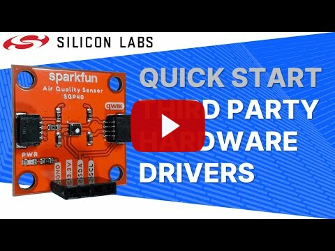

# Third Party Hardware Drivers #

[](https://github.com/SiliconLabsSoftware/third_party_hw_drivers_extension/releases)
[](https://github.com/SiliconLabs/simplicity_sdk/releases)
[](https://github.com/SiliconLabs/wiseconnect/releases)


This repo contains example drivers developed by Silicon Labs engineers and are provided as [an SDK extension](https://docs.silabs.com/simplicity-studio-5-users-guide/latest/ss-5-users-guide-getting-started/install-sdk-extensions). These drivers interface with different types of external hardware and are tested against a specific device listed in the driver name. These drivers are intended to be fully compatible with Silicon Labs' wireless stacks. All drivers provide a minimal Simplicity Studio project for testing and to show an example usage of the driver. The driver source is provided for modification and extension as needed. All drivers in this repository are considered to be EVALUATION QUALITY which implies that the code provided in the repos is subjected to limited testing and is provided provided as-is. It is not suitable for production environments.

## SoC Compatibility ##

The following table shows extension support for Silicon Labs SoCs where  and  denote preview and support, respectively.

| Chip family | v1.x.x | [v2.x.x](https://github.com/SiliconLabsSoftware/third_party_hw_drivers_extension/tree/release/v2) | [v3.x.x](https://github.com/SiliconLabsSoftware/third_party_hw_drivers_extension/tree/release/v3) | v4.x.x |
|---|---|---|---|---|
|Series 1|||||
|Series 2|||||
|SiWx917|||||

This extension supports Simplicity SDK from v2024.6.0, prior versions support GSDK.

For the SiW917 chip family, WiseConnect SDK is supported from  v3.0.0.

Each release provides SDK compatibility information in the README file, for further details check the version-specific readmes.

A full list of all examples and drivers in this repository is defined below:

## Examples ##

| No | Name | Example | Documentation |
|:--:|:-------------|:-------------------:|:---------------:|
| 1 | A-172-MRQ - Fingerprint 2 Click (Mikroe) | [Example](./app/example/mikroe_fingerprint2_a172mrq) | [Documentation](./app/documentation/example/mikroe_fingerprint2_a172mrq) |
| 2 | A3967 - Stepper Click (Mikroe) | [Example](./app/example/mikroe_stepper_a3967) | [Documentation](./app/documentation/example/mikroe_stepper_a3967) |
| 3 | A4988 - Stepper 2 Click (Mikroe) | [Example](./app/example/mikroe_stepper2_a4988) | [Documentation](./app/documentation/example/mikroe_stepper2_a4988) |
| 4 | AC Current Click (Mikroe) | [Example](./app/example/mikroe_accurrent) | [Documentation](./app/documentation/example/mikroe_accurrent) |
| 5 | AD8318 - RF Meter Click (Mikroe) | [Example](./app/example/mikroe_rf_meter_ad8318) | [Documentation](./app/documentation/example/mikroe_rf_meter_ad8318) |
| 6 | AK9753 - Human Presence Sensor (Sparkfun) | [Example](./app/example/sparkfun_human_presence_ak9753) | [Documentation](./app/documentation/example/sparkfun_human_presence_ak9753) |
| 7 | AMG88XX - Grid-EYE Infrared Array Breakout (Sparkfun) | [Example](./app/example/sparkfun_ir_array_amg88xx) | [Documentation](./app/documentation/example/sparkfun_ir_array_amg88xx) |
| 8 | AS3935 - Thunder Click (Mikroe) | [Example](./app/example/mikroe_thunder_as3935) | [Documentation](./app/documentation/example/mikroe_thunder_as3935) |
| 9 | AS7265X - Triad Spectroscopy Sensor (SparkFun) | [Example](./app/example/sparkfun_spectroscopy_as7265x) | [Documentation](./app/documentation/example/sparkfun_spectroscopy_as7265x) |
| 10 | BG96 - LTE IoT 2 (Mikroe) | [Example](./app/example/mikroe_lte_iot2_bg96) | [Documentation](./app/documentation/example/mikroe_lte_iot2_bg96) |
| 11 | BMA400 - Accel 5 Click (Mikroe) - I2C | [Example](./app/example/mikroe_accel5_bma400) | [Documentation](./app/documentation/example/mikroe_accel5_bma400) |
| 12 | BMA400 - Accel 5 Click (Mikroe) - SPI | [Example](./app/example/mikroe_accel5_bma400) | [Documentation](./app/documentation/example/mikroe_accel5_bma400) |
| 13 | BME280 & CCS811 - Environmental Sensor Combo Breakout (Sparkfun) | [Example](./app/example/sparkfun_environmental_bme280_ccs811) | [Documentation](./app/documentation/example/sparkfun_environmental_bme280_ccs811) |
| 14 | BME688 - Environment 3 Click (Mikroe) - I2C | [Example](./app/example/mikroe_environment3_bme688) | [Documentation](./app/documentation/example/mikroe_environment3_bme688) |
| 15 | BME688 - Environment 3 Click (Mikroe) - SPI | [Example](./app/example/mikroe_environment3_bme688) | [Documentation](./app/documentation/example/mikroe_environment3_bme688) |
| 16 | BMI270 - 6DOF IMU (SparkFun) | [Example](./app/example/sparkfun_6dof_imu_bmi270) | [Documentation](./app/documentation/example/sparkfun_6dof_imu_bmi270) |
| 17 | BTHome v2 | [Example](./app/example/bthome_v2) | [Documentation](./app/documentation/example/bthome_v2) |
| 18 | BTHome v2 - Server | [Example](./app/example/bthome_v2_server) | [Documentation](./app/documentation/example/bthome_v2_server) |
| 19 | CAP1166 - Cap Touch 2 Click (Mikroe) | [Example](./app/example/mikroe_captouch2_cap1166) | [Documentation](./app/documentation/example/mikroe_captouch2_cap1166) |
| 20 | CMT-8540S-SMT - Buzz 2 Click (Mikroe) | [Example](./app/example/mikroe_buzz2_cmt_8540s_smt) | [Documentation](./app/documentation/example/mikroe_buzz2_cmt_8540s_smt) |
| 21 | DPS310 - Pressure 3 Click (Mikroe) - I2C | [Example](./app/example/mikroe_pressure3_dps310) | [Documentation](./app/documentation/example/mikroe_pressure3_dps310) |
| 22 | DPS310 - Pressure 3 Click (Mikroe) - SPI | [Example](./app/example/mikroe_pressure3_dps310) | [Documentation](./app/documentation/example/mikroe_pressure3_dps310) |
| 23 | DS3231M - RTC 10 (Mikroe) | [Example](./app/example/mikroe_rtc10_ds3231m) | [Documentation](./app/documentation/example/mikroe_rtc10_ds3231m) |
| 24 | DWM1000 - UWB Click (Mikroe) | [Example](./app/example/mikroe_uwb_dwm1000) | [Documentation](./app/documentation/example/mikroe_uwb_dwm1000) |
| 25 | DWM3000 - UWB 2 Click (Mikroe) | [Example](./app/example/mikroe_uwb2_dwm3000/SimplicityStudio) | [Documentation](./app/documentation/example/mikroe_uwb2_dwm3000) |
| 26 | E-Paper Display - eINK Click (Mikroe) | [Example](./app/example/mikroe_eink_display) | [Documentation](./app/documentation/example/mikroe_eink_display) |
| 27 | E-paper EXT3-1 | [Example](./app/example/epaper_ext3_1) | [Documentation](./app/documentation/example/epaper_ext3_1) |
| 28 | EM3080-W - Barcode 2 Click (Mikroe) | [Example](./app/example/mikroe_barcode2_em3080w) | [Documentation](./app/documentation/example/mikroe_barcode2_em3080w) |
| 29 | EMG Click (Mikroe) | [Example](./app/example/mikroe_emg) | [Documentation](./app/documentation/example/mikroe_emg) |
| 30 | FSR400 - Force 3 Click (Mikroe) | [Example](./app/example/mikroe_force3_fsr400) | [Documentation](./app/documentation/example/mikroe_force3_fsr400) |
| 31 | HXD8357D - TFT LCD with Touchscreen (Adafruit) - SPI | [Example](./app/example/adafruit_tft_lcd_hxd8357d) | [Documentation](./app/documentation/example/adafruit_tft_lcd_hxd8357d) |
| 32 | HXD8357D - TFT LCD with Touchscreen (Adafruit) - SPI with DMA | [Example](./app/example/adafruit_tft_lcd_hxd8357d) | [Documentation](./app/documentation/example/adafruit_tft_lcd_hxd8357d) |
| 33 | HXD8357D - TFT LCD with Touchscreen (Adafruit) with LVGL | [Example](./app/example/adafruit_tft_lcd_hxd8357d_lvgl) | [Documentation](./app/documentation/example/adafruit_tft_lcd_hxd8357d_lvgl) |
| 34 | HXD8357D - TFT LCD with Touchscreen (Adafruit) with LVGL + DMA | [Example](./app/example/adafruit_tft_lcd_hxd8357d_lvgl) | [Documentation](./app/documentation/example/adafruit_tft_lcd_hxd8357d_lvgl) |
| 35 | ID-12LA - RFID Qwiic Reader (Sparkfun) | [Example](./app/example/sparkfun_rfid_id12la) | [Documentation](./app/documentation/example/sparkfun_rfid_id12la) |
| 36 | ILI9341 - TFT LCD with Touchscreen (Adafruit) - SPI | [Example](./app/example/adafruit_tft_lcd_ili9341) | [Documentation](./app/documentation/example/adafruit_tft_lcd_ili9341) |
| 37 | ILI9341 - TFT LCD with Touchscreen (Adafruit) - SPI with DMA | [Example](./app/example/adafruit_tft_lcd_ili9341) | [Documentation](./app/documentation/example/adafruit_tft_lcd_ili9341) |
| 38 | ILI9341 - TFT LCD with Touchscreen (Adafruit) with LVGL | [Example](./app/example/adafruit_tft_lcd_ili9341_lvgl) | [Documentation](./app/documentation/example/adafruit_tft_lcd_ili9341_lvgl) |
| 39 | ILI9341 - TFT LCD with Touchscreen (Adafruit) with LVGL + DMA | [Example](./app/example/adafruit_tft_lcd_ili9341_lvgl) | [Documentation](./app/documentation/example/adafruit_tft_lcd_ili9341_lvgl) |
| 40 | IR Generator (Silabs) | [Example](./app/example/silabs_ir_generate) | [Documentation](./app/documentation/example/silabs_ir_generate) |
| 41 | IS31FL3741 - 13x9 PWM RGB LED Matrix (Adafruit) | [Example](./app/example/adafruit_rgb_led_is31fl3741) | [Documentation](./app/documentation/example/adafruit_rgb_led_is31fl3741) |
| 42 | L9958 - DC Motor 24 Click (Mikroe) | [Example](./app/example/mikroe_dcmotor24_l9958) | [Documentation](./app/documentation/example/mikroe_dcmotor24_l9958) |
| 43 | LB11685AV - Brushless 16 Click (Mikroe) | [Example](./app/example/mikroe_brushless16_lb11685av) | [Documentation](./app/documentation/example/mikroe_brushless16_lb11685av) |
| 44 | LCA717 - Relay 2 Click (Mikroe) | [Example](./app/example/mikroe_relay2_lca717) | [Documentation](./app/documentation/example/mikroe_relay2_lca717) |
| 45 | LEA-6S - GPS Click (Mikroe) | [Example](./app/example/mikroe_gps_lea6s) | [Documentation](./app/documentation/example/mikroe_gps_lea6s) |
| 46 | LIN Bus Master | [Example](./app/example/silabs_lin_bus/master) | [Documentation](./app/documentation/example/silabs_lin_bus) |
| 47 | LIN Bus Slave Device 1 | [Example](./app/example/silabs_lin_bus/slave) | [Documentation](./app/documentation/example/silabs_lin_bus) |
| 48 | LIN Bus Slave Device 2 | [Example](./app/example/silabs_lin_bus/slave) | [Documentation](./app/documentation/example/silabs_lin_bus) |
| 49 | MAX-M10S - GNSS Receiver Breakout (Sparkfun) | [Example](./app/example/sparkfun_gnss_max_m10s) | [Documentation](./app/documentation/example/sparkfun_gnss_max_m10s) |
| 50 | MAX17048 - MAX17048EVKIT Evaluation Kits (Maxim) | [Example](./app/example/maxim_fuel_gauge_max17048) | [Documentation](./app/documentation/example/maxim_fuel_gauge_max17048) |
| 51 | MAX30101 & MAX32664 - Pulse Oximeter and Heart Rate Sensor (Sparkfun) | [Example](./app/example/sparkfun_hr_po_max30101_max32664) | [Documentation](./app/documentation/example/sparkfun_hr_po_max30101_max32664) |
| 52 | MAX30101 - Heart Rate 4 Click (Mikroe) | [Example](./app/example/mikroe_heartrate4_max30101) | [Documentation](./app/documentation/example/mikroe_heartrate4_max30101) |
| 53 | MAX6969 - UT-M 7-SEG R Click (Mikroe) | [Example](./app/example/mikroe_utm7segr_max6969) | [Documentation](./app/documentation/example/mikroe_utm7segr_max6969) |
| 54 | MAXM86161 - Heartrate 2 Click (Mikroe) | [Example](./app/example/mikroe_heartrate2_maxm86161) | [Documentation](./app/documentation/example/mikroe_heartrate2_maxm86161) |
| 55 | MIC 2 Click (Mikroe) | [Example](./app/example/mikroe_mic2) | [Documentation](./app/documentation/example/mikroe_mic2) |
| 56 | microSD Click (Mikroe) | [Example](./app/example/mikroe_microsd) | [Documentation](./app/documentation/example/mikroe_microsd) |
| 57 | ML8511A - UV Click (Mikroe) | [Example](./app/example/mikroe_uv_ml8511a) | [Documentation](./app/documentation/example/mikroe_uv_ml8511a) |
| 58 | MLX90632 - IrThermo 3 Click (Mikroe) | [Example](./app/example/mikroe_irthermo3_mlx90632) | [Documentation](./app/documentation/example/mikroe_irthermo3_mlx90632) |
| 59 | MLX90640 - IR Array Breakout (Sparkfun) | [Example](./app/example/sparkfun_ir_array_mlx90640) | [Documentation](./app/documentation/example/sparkfun_ir_array_mlx90640) |
| 60 | MM5D91-00 - Radar Click (Mikroe) | [Example](./app/example/mikroe_radar_mm5d91_00) | [Documentation](./app/documentation/example/mikroe_radar_mm5d91_00) |
| 61 | MMA8452Q - Triple Axis Accelerometer Breakout (Sparkfun) | [Example](./app/example/sparkfun_accelerometer_mma8452q) | [Documentation](./app/documentation/example/sparkfun_accelerometer_mma8452q) |
| 62 | MQ131 - Ozone 2 Click (Mikroe) | [Example](./app/example/mikroe_ozone2_mq131) | [Documentation](./app/documentation/example/mikroe_ozone2_mq131) |
| 63 | MQ3 - Alcohol Click (Mikroe) | [Example](./app/example/mikroe_alcohol_mq3) | [Documentation](./app/documentation/example/mikroe_alcohol_mq3) |
| 64 | MQ7 - CO Click (Mikroe) | [Example](./app/example/mikroe_co_mq7) | [Documentation](./app/documentation/example/mikroe_co_mq7) |
| 65 | NeoTrellis 4x4 Keypad (Adafruit) | [Example](./app/example/adafruit_neotrellis_keypad_atsamd09) | [Documentation](./app/documentation/example/adafruit_neotrellis_keypad_atsamd09) |
| 66 | NT3H2111 - NFC Tag 2 Click (Mikroe) - I2C | [Example](./app/example/mikroe_nfctag2_nt3h2111) | [Documentation](./app/documentation/example/mikroe_nfctag2_nt3h2111) |
| 67 | PCA9685 - Servo Click (Mikroe) | [Example](./app/example/mikroe_servo_pca9685) | [Documentation](./app/documentation/example/mikroe_servo_pca9685) |
| 68 | PH 2 Click (Mikroe) | [Example](./app/example/mikroe_ph2) | [Documentation](./app/documentation/example/mikroe_ph2) |
| 69 | PL-N823-01 - PIR Click (Mikroe) | [Example](./app/example/mikroe_pir_pl_n823_01) | [Documentation](./app/documentation/example/mikroe_pir_pl_n823_01) |
| 70 | PN7150 - NFC 2 Click (Mikroe) - I2C | [Example](./app/example/mikroe_nfc2_pn7150) | [Documentation](./app/documentation/example/mikroe_nfc2_pn7150) |
| 71 | PN7150 - Read a T2T Tag with NCI | [Example](./app/example/mikroe_nfc2_pn7150_nci_t2t_read) | [Documentation](./app/documentation/example/mikroe_nfc2_pn7150_nci_t2t_read) |
| 72 | PN7150 - Write to a T2T Tag with NCI | [Example](./app/example/mikroe_nfc2_pn7150_nci_t2t_write) | [Documentation](./app/documentation/example/mikroe_nfc2_pn7150_nci_t2t_write) |
| 73 | Pocket Geiger Radiation Sensor - Type 5 (Sparkfun) | [Example](./app/example/sparkfun_dosimeter_type5) | [Documentation](./app/documentation/example/sparkfun_dosimeter_type5) |
| 74 | Qwiic Joystick (Sparkfun) | [Example](./app/example/sparkfun_qwiic_joystick) | [Documentation](./app/documentation/example/sparkfun_qwiic_joystick) |
| 75 | Qwiic Keypad (Sparkfun) | [Example](./app/example/sparkfun_qwiic_keypad) | [Documentation](./app/documentation/example/sparkfun_qwiic_keypad) |
| 76 | Qwiic Soil Moisture Sensor (Sparkfun) - I2C | [Example](./app/example/sparkfun_soil_moisture) | [Documentation](./app/documentation/example/sparkfun_soil_moisture) |
| 77 | RA-08 - LR 9 Click (Mikroe) | [Example](./app/example/mikroe_lr9_ra_08) | [Documentation](./app/documentation/example/mikroe_lr9_ra_08) |
| 78 | RNG Click (Mikroe) | [Example](./app/example/mikroe_rng) | [Documentation](./app/documentation/example/mikroe_rng) |
| 79 | SCD41 & SPS30 - HVAC Click Bundle (Mikroe) | [Example](./app/example/mikroe_hvac_bundle_scd41_sps30) | [Documentation](./app/documentation/example/mikroe_hvac_bundle_scd41_sps30) |
| 80 | SCD41 - HVAC Click (Mikroe) | [Example](./app/example/mikroe_hvac_scd41) | [Documentation](./app/documentation/example/mikroe_hvac_scd41) |
| 81 | SGP40 - Air Quality Sensor (Sparkfun) | [Example](./app/example/sparkfun_air_quality_sgp40) | [Documentation](./app/documentation/example/sparkfun_air_quality_sgp40) |
| 82 | SHT40 & SGP40 - Environment 2 Click (Mikroe) | [Example](./app/example/mikroe_environment2_sht40_sgp40) | [Documentation](./app/documentation/example/mikroe_environment2_sht40_sgp40) |
| 83 | SHT40 - Temp&Hum 15 Click (Mikroe) | [Example](./app/example/mikroe_temphum15_sht40) | [Documentation](./app/documentation/example/mikroe_temphum15_sht40) |
| 84 | SHTC3 - Temp&Hum 9 Click (Mikroe) | [Example](./app/example/mikroe_temphum9_shtc3) | [Documentation](./app/documentation/example/mikroe_temphum9_shtc3) |
| 85 | Si8711CC - PWM Driver Click (Mikroe) | [Example](./app/example/mikroe_pwm_driver_si8711cc) | [Documentation](./app/documentation/example/mikroe_pwm_driver_si8711cc) |
| 86 | Smoke 2 Click (Mikroe) - I2C | [Example](./app/example/mikroe_smoke2_adpd188bi) | [Documentation](./app/documentation/example/mikroe_smoke2_adpd188bi) |
| 87 | SPS30 - Particulate Matter Sensor (Sparkfun) - I2C | [Example](./app/example/sparkfun_particulate_matter_sensor_sps30) | [Documentation](./app/documentation/example/sparkfun_particulate_matter_sensor_sps30) |
| 88 | SPS30 - Particulate Matter Sensor (Sparkfun) - UART | [Example](./app/example/sparkfun_particulate_matter_sensor_sps30) | [Documentation](./app/documentation/example/sparkfun_particulate_matter_sensor_sps30) |
| 89 | SSD1306 - Micro OLED Breakout Qwiic (Sparkfun) | [Example](./app/example/sparkfun_micro_oled_ssd1306) | [Documentation](./app/documentation/example/sparkfun_micro_oled_ssd1306) |
| 90 | SSD1306 - Mikroe OLEDW Click (Mikroe) | [Example](./app/example/mikroe_oledw_ssd1306) | [Documentation](./app/documentation/example/mikroe_oledw_ssd1306) |
| 91 | SSD1306 - Mikroe OLEDW Click (Mikroe) with GLIB | [Example](./app/example/mikroe_oledw_ssd1306_glib) | [Documentation](./app/documentation/example/mikroe_oledw_ssd1306_glib) |
| 92 | SSD1351 - OLED C Click (Mikroe) | [Example](./app/example/mikroe_oledc_ssd1351) | [Documentation](./app/documentation/example/mikroe_oledc_ssd1351) |
| 93 | ST7789 - TFT LCD Display (Adafruit) - SPI | [Example](./app/example/adafruit_tft_lcd_st7789) | [Documentation](./app/documentation/example/adafruit_tft_lcd_st7789) |
| 94 | ST7789 - TFT LCD Display (Adafruit) - SPI with DMA | [Example](./app/example/adafruit_tft_lcd_st7789) | [Documentation](./app/documentation/example/adafruit_tft_lcd_st7789) |
| 95 | ST7789 - TFT LCD Display (Adafruit) - with LVGL + DMA | [Example](./app/example/adafruit_tft_lcd_st7789_lvgl_dma) | [Documentation](./app/documentation/example/adafruit_tft_lcd_st7789_lvgl_dma) |
| 96 | STN1110 - OBDII Click (Mikroe) | [Example](./app/example/mikroe_obdii_stn1110) | [Documentation](./app/documentation/example/mikroe_obdii_stn1110) |
| 97 | Stretch Click (Mikroe) | [Example](./app/example/mikroe_stretch) | [Documentation](./app/documentation/example/mikroe_stretch) |
| 98 | TB6549FG - DC Motor 3 Click (Mikroe) | [Example](./app/example/mikroe_dcmotor3_tb6549fg) | [Documentation](./app/documentation/example/mikroe_dcmotor3_tb6549fg) |
| 99 | TB9053FTG - DC Motor 26 Click (Mikroe) | [Example](./app/example/mikroe_dcmotor26_tb9053ftg) | [Documentation](./app/documentation/example/mikroe_dcmotor26_tb9053ftg) |
| 100 | TSC2007 - Resistive Touch Screen Controller (Adafruit) | [Example](./app/example/adafruit_touchscreen_tsc2007) | [Documentation](./app/documentation/example/adafruit_touchscreen_tsc2007) |
| 101 | TSD-10 - Turbidity Click (Mikroe) | [Example](./app/example/mikroe_turbidity_tsd10) | [Documentation](./app/documentation/example/mikroe_turbidity_tsd10) |
| 102 | VCNL4040 - Proximity Sensor (Sparkfun) | [Example](./app/example/sparkfun_proximity_vcnl4040) | [Documentation](./app/documentation/example/sparkfun_proximity_vcnl4040) |
| 103 | VL53L1X - Distance Sensor (Sparkfun) | [Example](./app/example/sparkfun_distance_vl53l1x) | [Documentation](./app/documentation/example/sparkfun_distance_vl53l1x) |
| 104 | W5500 - ETH Wiz Click (Mikroe) | [Example](./app/example/mikroe_eth_wiz_w5500) | [Documentation](./app/documentation/example/mikroe_eth_wiz_w5500) |
| 105 | Water Detect Click (Mikroe) | [Example](./app/example/mikroe_water_detect) | [Documentation](./app/documentation/example/mikroe_water_detect) |
| 106 | Weather Station (Sparkfun) | [Example](./app/example/sparkfun_weatherstation) | [Documentation](./app/documentation/example/sparkfun_weatherstation) |
| 107 | XM125 - PCR Click (Mikroe) | [Example](./app/example/mikroe_pcr_xm125) | [Documentation](./app/documentation/example/mikroe_pcr_xm125) |
| 108 | RGB Driver Click (Mikroe) | [Example](./app/example/mikroe_rgb_driver) | [Documentation](./app/documentation/example/mikroe_rgb_driver) |
| 109 | DRV8245P - DC Motor 29 Click (Mikroe) | [Example](./app/example/mikroe_dcmotor29_drv8245p) | [Documentation](./app/documentation/example/mikroe_dcmotor29_drv8245p) |
| 110 | WS2812 - Addressable LED (Adafruit) | [Example](./app/example/adafruit_addressable_led_ws2812) | [Documentation](./app/documentation/example/adafruit_addressable_led_ws2812) |
| 111 | VEML6035 - Ambient 11 Click (Mikroe) | [Example](./app/example/mikroe_ambient11_veml6035) | [Documentation](./app/documentation/example/mikroe_ambient11_veml6035) |
| 112 | Modbus - RTU | [Example](./app/example/modbus_rtu) | [Documentation](./app/documentation/example/modbus_rtu) |
| 113 | GD5F2G - Flash 8 Click (Mikroe) | [Example](./app/example/mikroe_flash8_gd5f2g) | [Documentation](./app/documentation/example/mikroe_flash8_gd5f2g) |
| 114 | RM126X - LoRa AT command driver | [Example](./app/example/ezurio_lora_rm126x) | [Documentation](./app/documentation/example/ezurio_lora_rm126x) |
| 115 | HC-SR04 (RCWL-9610A) - Ultrasonic Distance Sensor (Sparkfun) | [Example](./app/example/sparkfun_hc_sr04_rcwl_9610a) | [Documentation](./app/documentation/example/sparkfun_hc_sr04_rcwl_9610a) |
| 116 | MPU6050 - Accel 8 Click (Mikroe) | [Example](./app/example/mikroe_accel8_mpu6050) | [Documentation](./app/documentation/example/mikroe_accel8_mpu6050) |
| 117 | LM75A - Temperature Sensor | [Example](./app/example/lm75a_temp_sensor) | [Documentation](./app/documentation/example/lm75a_temp_sensor) |
| 118 | DHT11/DHT22 Temperature and Humidity Sensors | [Example](./app/example/asair_temp_hum_dht11_dht22) | [Documentation](./app/documentation/example/asair_temp_hum_dht11_dht22) |

## Drivers ##

<table>
    <tbody>
        <tr>
                <td colspan="3" align="left"><b>Audio & Voice</b></td>
            </tr>
            <tr></tr>
            <tr>
                    <td colspan="2" align="left">&nbsp;&nbsp;&nbsp;&nbsp;CMT-8540S-SMT - Buzz 2 Click (Mikroe)</td>
                    <td>
                        <a href="./driver/public/mikroe/buzz2_cmt_8540s_smt">Driver</a>
                        </td>
                </tr>
        <tr></tr>
        <tr>
                    <td colspan="2" align="left">&nbsp;&nbsp;&nbsp;&nbsp;MIC 2 Click (Mikroe)</td>
                    <td>
                        <a href="./driver/public/mikroe/mic2">Driver</a>
                        </td>
                </tr>
        <tr></tr>
        <tr>
                <td colspan="3" align="left"><b>Clock & Timing</b></td>
            </tr>
            <tr></tr>
            <tr>
                    <td colspan="2" align="left">&nbsp;&nbsp;&nbsp;&nbsp;DS3231M - RTC 10 Click (Mikroe)</td>
                    <td>
                        <a href="./driver/public/mikroe/rtc10_ds3231m">Driver</a>
                        </td>
                </tr>
        <tr></tr>
        <tr>
                <td colspan="3" align="left"><b>Display & LED</b></td>
            </tr>
            <tr></tr>
            <tr>
                    <td colspan="2" align="left">&nbsp;&nbsp;&nbsp;&nbsp;E-Paper Display - eINK Click (Mikroe)</td>
                    <td>
                        <a href="./driver/public/mikroe/eink_display">Driver</a>
                        </td>
                </tr>
        <tr></tr>
        <tr>
                    <td colspan="2" align="left">&nbsp;&nbsp;&nbsp;&nbsp;E-Paper EXT3-1 (Pervasive Displays)</td>
                    <td>
                        <a href="./driver/public/silabs/epaper_ext3_1">Driver</a>
                        </td>
                </tr>
        <tr></tr>
        <tr>
                    <td colspan="2" align="left">&nbsp;&nbsp;&nbsp;&nbsp;HXD8357D - TFT LCD Display (Adafruit) - SPI</td>
                    <td>
                        <a href="./driver/public/silabs/tft_lcd_hxd8357d">Driver</a>
                        </td>
                </tr>
        <tr></tr>
        <tr>
                    <td colspan="2" align="left">&nbsp;&nbsp;&nbsp;&nbsp;HXD8357D - TFT LCD Display (Adafruit) - SPI with DMA</td>
                    <td>
                        <a href="./driver/public/silabs/tft_lcd_hxd8357d">Driver</a>
                        </td>
                </tr>
        <tr></tr>
        <tr>
                    <td colspan="2" align="left">&nbsp;&nbsp;&nbsp;&nbsp;ILI9341 - TFT LCD Display (Adafruit) - SPI</td>
                    <td>
                        <a href="./driver/public/silabs/tft_lcd_ili9341">Driver</a>
                        </td>
                </tr>
        <tr></tr>
        <tr>
                    <td colspan="2" align="left">&nbsp;&nbsp;&nbsp;&nbsp;ILI9341 - TFT LCD Display (Adafruit) - SPI with DMA</td>
                    <td>
                        <a href="./driver/public/silabs/tft_lcd_ili9341">Driver</a>
                        </td>
                </tr>
        <tr></tr>
        <tr>
                    <td colspan="2" align="left">&nbsp;&nbsp;&nbsp;&nbsp;IS31FL3741 - 13x9 PWM RGB LED Matrix (Adafruit) - I2C</td>
                    <td>
                        <a href="./driver/public/silabs/rgb_led_is31fl3741">Driver</a>
                        </td>
                </tr>
        <tr></tr>
        <tr>
                    <td colspan="2" align="left">&nbsp;&nbsp;&nbsp;&nbsp;MAX6969 - UT-M 7-SEG R Click (Mikroe)</td>
                    <td>
                        <a href="./driver/public/mikroe/utm7segr_max6969">Driver</a>
                        </td>
                </tr>
        <tr></tr>
        <tr>
                    <td colspan="2" align="left">&nbsp;&nbsp;&nbsp;&nbsp;SSD1306 - Micro OLED Breakout (Sparkfun) - I2C</td>
                    <td>
                        <a href="./driver/public/silabs/micro_oled_ssd1306">Driver</a>
                        </td>
                </tr>
        <tr></tr>
        <tr>
                    <td colspan="2" align="left">&nbsp;&nbsp;&nbsp;&nbsp;SSD1306 - OLED W Click (Mikroe) - SPI</td>
                    <td>
                        <a href="./driver/public/mikroe/oledw_ssd1306">Driver</a>
                        </td>
                </tr>
        <tr></tr>
        <tr>
                    <td colspan="2" align="left">&nbsp;&nbsp;&nbsp;&nbsp;SSD1351 - OLED C Click (Mikroe)</td>
                    <td>
                        <a href="./driver/public/mikroe/oledc_ssd1351">Driver</a>
                        </td>
                </tr>
        <tr></tr>
        <tr>
                    <td colspan="2" align="left">&nbsp;&nbsp;&nbsp;&nbsp;ST7789 - TFT LCD Display (Adafruit) - SPI</td>
                    <td>
                        <a href="./driver/public/silabs/tft_lcd_st7789">Driver</a>
                        </td>
                </tr>
        <tr></tr>
        <tr>
                    <td colspan="2" align="left">&nbsp;&nbsp;&nbsp;&nbsp;ST7789 - TFT LCD Display (Adafruit) - SPI with DMA</td>
                    <td>
                        <a href="./driver/public/silabs/tft_lcd_st7789">Driver</a>
                        </td>
                </tr>
        <tr></tr>
                    <td colspan="2" align="left">&nbsp;&nbsp;&nbsp;&nbsp;RGB Driver Click (Mikore)</td>
                    <td>
                        <a href="./driver/public/mikroe/rgb">Driver</a>
                        </td>
                </tr>
        <tr></tr>
        <tr>
                    <td colspan="2" align="left">&nbsp;&nbsp;&nbsp;&nbsp;WS2812 - Addressable LED (Adafruit) - SPI</td>
                    <td>
                        <a href="./driver/public/silabs/addressable_led_ws2812">Driver</a>
                        </td>
                </tr>
        <tr></tr>
        <tr>
                <td colspan="3" align="left"><b>Human Machine Interface</b></td>
            </tr>
            <tr></tr>
            <tr>
                    <td colspan="2" align="left">&nbsp;&nbsp;&nbsp;&nbsp;A-172-MRQ - Fingerprint 2 Click (Mikroe)</td>
                    <td>
                        <a href="./driver/public/mikroe/fingerprint2_a172mrq">Driver</a>
                        </td>
                </tr>
        <tr></tr>
        <tr>
                    <td colspan="2" align="left">&nbsp;&nbsp;&nbsp;&nbsp;CAP1166 - Capacitive Touch 2 Click (Mikroe)</td>
                    <td>
                        <a href="./driver/public/mikroe/captouch2_cap1166">Driver</a>
                        </td>
                </tr>
        <tr></tr>
        <tr>
                    <td colspan="2" align="left">&nbsp;&nbsp;&nbsp;&nbsp;NeoTrellis 4x4 Keypad (Adafruit)</td>
                    <td>
                        <a href="./driver/public/silabs/adafruit_neotrellis_keypad_atsamd09">Driver</a>
                        </td>
                </tr>
        <tr></tr>
        <tr>
                    <td colspan="2" align="left">&nbsp;&nbsp;&nbsp;&nbsp;Qwiic Joystick (Sparkfun)</td>
                    <td>
                        <a href="./driver/public/silabs/qwiic_joystick">Driver</a>
                        </td>
                </tr>
        <tr></tr>
        <tr>
                    <td colspan="2" align="left">&nbsp;&nbsp;&nbsp;&nbsp;Qwiic Keypad (Sparkfun)</td>
                    <td>
                        <a href="./driver/public/silabs/qwiic_keypad">Driver</a>
                        </td>
                </tr>
        <tr></tr>
        <tr>
                    <td colspan="2" align="left">&nbsp;&nbsp;&nbsp;&nbsp;Touch Screen (Analog)</td>
                    <td>
                        <a href="./driver/public/silabs/services_touch_screen">Driver</a>
                        </td>
                </tr>
        <tr></tr>
        <tr>
                    <td colspan="2" align="left">&nbsp;&nbsp;&nbsp;&nbsp;Touch Screen Analog Interface (Gecko)</td>
                    <td>
                        <a href="./driver/public/silabs/services_touch_screen">Driver</a>
                        </td>
                </tr>
        <tr></tr>
        <tr>
                    <td colspan="2" align="left">&nbsp;&nbsp;&nbsp;&nbsp;Touch Screen Analog Interface (Si91x)</td>
                    <td>
                        <a href="./driver/public/silabs/services_touch_screen">Driver</a>
                        </td>
                </tr>
        <tr></tr>
        <tr>
                    <td colspan="2" align="left">&nbsp;&nbsp;&nbsp;&nbsp;TSC2007 - Resistive Touch Screen Controller (Adafruit)</td>
                    <td>
                        <a href="./driver/public/silabs/touchscreen_tsc2007">Driver</a>
                        </td>
                </tr>
        <tr></tr>
        <tr>
                <td colspan="3" align="left"><b>Interface</b></td>
            </tr>
            <tr></tr>
            <tr>
                    <td colspan="2" align="left">&nbsp;&nbsp;&nbsp;&nbsp;STN1110 - OBDII Click (Mikroe)</td>
                    <td>
                        <a href="./driver/public/mikroe/obdii_stn1110">Driver</a>
                        </td>
                </tr>
        <tr></tr>
        <tr>
                    <td colspan="2" align="left">&nbsp;&nbsp;&nbsp;&nbsp;W5500 - ETH WIZ Click (Mikroe)</td>
                    <td>
                        <a href="./driver/public/mikroe/eth_wiz_w5500">Driver</a>
                        </td>
                </tr>
        <tr></tr>
        <tr>
                <td colspan="3" align="left"><b>Miscellaneous</b></td>
            </tr>
            <tr></tr>
            <tr>
                    <td colspan="2" align="left">&nbsp;&nbsp;&nbsp;&nbsp;IR Generator (Silabs)</td>
                    <td>
                        <a href="./driver/public/silabs/ir_generate">Driver</a>
                        </td>
                </tr>
        <tr></tr>
        <tr>
                    <td colspan="2" align="left">&nbsp;&nbsp;&nbsp;&nbsp;LCA717 - Relay 2 Click (Mikroe)</td>
                    <td>
                        <a href="./driver/public/mikroe/relay2_lca717">Driver</a>
                        </td>
                </tr>
        <tr></tr>
        <tr>
                    <td colspan="2" align="left">&nbsp;&nbsp;&nbsp;&nbsp;RNG Click (Mikroe)</td>
                    <td>
                        <a href="./driver/public/mikroe/rng">Driver</a>
                        </td>
                </tr>
        <tr></tr>
        <tr>
                <td colspan="3" align="left"><b>Motor Control</b></td>
            </tr>
            <tr></tr>
            <tr>
                    <td colspan="2" align="left">&nbsp;&nbsp;&nbsp;&nbsp;A3967 - Stepper Click (Mikroe)</td>
                    <td>
                        <a href="./driver/public/silabs/stepper_a3967">Driver</a>
                        </td>
                </tr>
        <tr></tr>
        <tr>
                    <td colspan="2" align="left">&nbsp;&nbsp;&nbsp;&nbsp;A4988 - Stepper 2 Click (Mikroe)</td>
                    <td>
                        <a href="./driver/public/silabs/stepper2_a4988">Driver</a>
                        </td>
                </tr>
        <tr></tr>
        <tr>
                    <td colspan="2" align="left">&nbsp;&nbsp;&nbsp;&nbsp;L9958 - DC Motor 24 Click (Mikroe)</td>
                    <td>
                        <a href="./driver/public/mikroe/dcmotor24_l9958">Driver</a>
                        </td>
                </tr>
        <tr></tr>
        <tr>
                    <td colspan="2" align="left">&nbsp;&nbsp;&nbsp;&nbsp;LB11685AV - Brushless 16 Click (Mikroe)</td>
                    <td>
                        <a href="./driver/public/mikroe/brushless16_lb11685av">Driver</a>
                        </td>
                </tr>
        <tr></tr>
        <tr>
                    <td colspan="2" align="left">&nbsp;&nbsp;&nbsp;&nbsp;PCA9685 - Servo Click (Mikroe)</td>
                    <td>
                        <a href="./driver/public/mikroe/servo_pca9685">Driver</a>
                        </td>
                </tr>
        <tr></tr>
        <tr>
                    <td colspan="2" align="left">&nbsp;&nbsp;&nbsp;&nbsp;Si8711CC - PWM Driver Click (Mikroe)</td>
                    <td>
                        <a href="./driver/public/mikroe/pwm_driver_si8711cc">Driver</a>
                        </td>
                </tr>
        <tr></tr>
        <tr>
                    <td colspan="2" align="left">&nbsp;&nbsp;&nbsp;&nbsp;TB6549FG - DC Motor 3 Click (Mikroe)</td>
                    <td>
                        <a href="./driver/public/mikroe/dcmotor3_tb6549fg">Driver</a>
                        </td>
                </tr>
        <tr></tr>
        <tr>
                    <td colspan="2" align="left">&nbsp;&nbsp;&nbsp;&nbsp;TB9053FTG - DC Motor 26 Click (Mikroe)</td>
                    <td>
                        <a href="./driver/public/mikroe/dcmotor26_tb9053ftg">Driver</a>
                        </td>
                </tr>
        <tr></tr>
        <tr>
                    <td colspan="2" align="left">&nbsp;&nbsp;&nbsp;&nbsp;TB9053FTG - DC Motor 29 Click (Mikroe)</td>
                    <td>
                        <a href="./driver/public/mikroe/dcmotor29_drv8245p">Driver</a>
                        </td>
                </tr>
        <tr></tr>
        <tr>
                <td colspan="3" align="left"><b>Power Management</b></td>
            </tr>
            <tr></tr>
            <tr>
                    <td colspan="2" align="left">&nbsp;&nbsp;&nbsp;&nbsp;MAX17048 - MAX17048EVKIT Evaluation Kits (Maxim)</td>
                    <td>
                        <a href="./driver/public/silabs/fuel_gauge_max17048">Driver</a>
                        </td>
                </tr>
        <tr></tr>
        <tr>
                <td colspan="3" align="left"><b>Sensors</b></td>
            </tr>
            <tr></tr>
            <tr>
                    <td colspan="2" align="left">&nbsp;&nbsp;&nbsp;&nbsp;AC Current Click (Mikroe)</td>
                    <td>
                        <a href="./driver/public/mikroe/accurrent">Driver</a>
                        </td>
                </tr>
        <tr></tr>
        <tr>
                    <td colspan="2" align="left">&nbsp;&nbsp;&nbsp;&nbsp;AD8318 - RF Meter Click (Mikroe)</td>
                    <td>
                        <a href="./driver/public/mikroe/rf_meter_ad8318">Driver</a>
                        </td>
                </tr>
        <tr></tr>
        <tr>
                    <td colspan="2" align="left">&nbsp;&nbsp;&nbsp;&nbsp;ADPD188BI - Smoke 2 Click (Mikroe) - I2C</td>
                    <td>
                        <a href="./driver/public/mikroe/smoke2_adpd188bi">Driver</a>
                        </td>
                </tr>
        <tr></tr>
        <tr>
                    <td colspan="2" align="left">&nbsp;&nbsp;&nbsp;&nbsp;AK9753 - Human Presence Sensor (Sparkfun) - I2C</td>
                    <td>
                        <a href="./driver/public/silabs/human_presence_ak9753">Driver</a>
                        </td>
                </tr>
        <tr></tr>
        <tr>
                    <td colspan="2" align="left">&nbsp;&nbsp;&nbsp;&nbsp;AMG88XX - Grid-EYE Infrared Array Breakout (Sparkfun)</td>
                    <td>
                        <a href="./driver/public/silabs/ir_array_amg88xx">Driver</a>
                        </td>
                </tr>
        <tr></tr>
        <tr>
                    <td colspan="2" align="left">&nbsp;&nbsp;&nbsp;&nbsp;LM75A - Temperature Sensor</td>
                    <td>
                        <a href="./driver/public/silabs/lm75a_temp_sensor">Driver</a>
                        </td>
                </tr>
        <tr></tr>
        <tr>
                    <td colspan="2" align="left">&nbsp;&nbsp;&nbsp;&nbsp;AS3935 - Thunder Click (Mikroe)</td>
                    <td>
                        <a href="./driver/public/mikroe/thunder_as3935">Driver</a>
                        </td>
                </tr>
        <tr></tr>
        <tr>
                    <td colspan="2" align="left">&nbsp;&nbsp;&nbsp;&nbsp;AS7265x - Triad Spectroscopy Sensor (Sparkfun) - I2C</td>
                    <td>
                        <a href="./driver/public/silabs/spectroscopy_as7265x">Driver</a>
                        </td>
                </tr>
        <tr></tr>
        <tr>
                    <td colspan="2" align="left">&nbsp;&nbsp;&nbsp;&nbsp;BMA400 - Accel 5 Click (Mikroe) - I2C</td>
                    <td>
                        <a href="./driver/public/silabs/accel5_bma400">Driver</a>
                        </td>
                </tr>
        <tr></tr>
        <tr>
                    <td colspan="2" align="left">&nbsp;&nbsp;&nbsp;&nbsp;BMA400 - Accel 5 Click (Mikroe) - SPI</td>
                    <td>
                        <a href="./driver/public/silabs/accel5_bma400">Driver</a>
                        </td>
                </tr>
        <tr></tr>
        <tr>
                    <td colspan="2" align="left">&nbsp;&nbsp;&nbsp;&nbsp;BME280 - Atmospheric Sensor (Sparkfun)</td>
                    <td>
                        <a href="./driver/public/silabs/environmental_bme280_ccs811">Driver</a>
                        </td>
                </tr>
        <tr></tr>
        <tr>
                    <td colspan="2" align="left">&nbsp;&nbsp;&nbsp;&nbsp;BME688 - Environment 3 Click (Mikroe) - I2C</td>
                    <td>
                        <a href="./driver/public/silabs/environment3_bme688">Driver</a>
                        </td>
                </tr>
        <tr></tr>
        <tr>
                    <td colspan="2" align="left">&nbsp;&nbsp;&nbsp;&nbsp;BME688 - Environment 3 Click (Mikroe) - SPI</td>
                    <td>
                        <a href="./driver/public/silabs/environment3_bme688">Driver</a>
                        </td>
                </tr>
        <tr></tr>
        <tr>
                    <td colspan="2" align="left">&nbsp;&nbsp;&nbsp;&nbsp;BMI270 - 6DOF IMU Breakout (Sparkfun)</td>
                    <td>
                        <a href="./driver/public/silabs/sparkfun_6dof_imu_bmi270">Driver</a>
                        </td>
                </tr>
        <tr></tr>
        <tr>
                    <td colspan="2" align="left">&nbsp;&nbsp;&nbsp;&nbsp;CCS811 - Air Quality Sensor (Sparkfun)</td>
                    <td>
                        <a href="./driver/public/silabs/environmental_bme280_ccs811">Driver</a>
                        </td>
                </tr>
        <tr></tr>
        <tr>
                    <td colspan="2" align="left">&nbsp;&nbsp;&nbsp;&nbsp;DPS310 - Pressure 3 Click (Mikroe) - I2C</td>
                    <td>
                        <a href="./driver/public/mikroe/pressure3_dps310">Driver</a>
                        </td>
                </tr>
        <tr></tr>
        <tr>
                    <td colspan="2" align="left">&nbsp;&nbsp;&nbsp;&nbsp;DPS310 - Pressure 3 Click (Mikroe) - SPI</td>
                    <td>
                        <a href="./driver/public/mikroe/pressure3_dps310">Driver</a>
                        </td>
                </tr>
        <tr></tr>
        <tr>
                    <td colspan="2" align="left">&nbsp;&nbsp;&nbsp;&nbsp;EM3080-W - Barcode 2 Click (Mikroe)</td>
                    <td>
                        <a href="./driver/public/mikroe/barcode2_em3080w">Driver</a>
                        </td>
                </tr>
        <tr></tr>
        <tr>
                    <td colspan="2" align="left">&nbsp;&nbsp;&nbsp;&nbsp;EMG Click (Mikroe)</td>
                    <td>
                        <a href="./driver/public/mikroe/emg">Driver</a>
                        </td>
                </tr>
        <tr></tr>
        <tr>
                    <td colspan="2" align="left">&nbsp;&nbsp;&nbsp;&nbsp;FSR400 - Force 3 Click (Mikroe)</td>
                    <td>
                        <a href="./driver/public/mikroe/force3_fsr400">Driver</a>
                        </td>
                </tr>
        <tr></tr>
        <tr>
                    <td colspan="2" align="left">&nbsp;&nbsp;&nbsp;&nbsp;MAX30101 & MAX32664  - Pulse Oximeter and Heart Rate Sensor (Sparkfun)</td>
                    <td>
                        <a href="./driver/public/silabs/hr_po_max30101_max32664">Driver</a>
                        </td>
                </tr>
        <tr></tr>
        <tr>
                    <td colspan="2" align="left">&nbsp;&nbsp;&nbsp;&nbsp;MAX30101 - Heart Rate 4 Click (Mikroe)</td>
                    <td>
                        <a href="./driver/public/mikroe/heartrate4_max30101">Driver</a>
                        </td>
                </tr>
        <tr></tr>
        <tr>
                    <td colspan="2" align="left">&nbsp;&nbsp;&nbsp;&nbsp;MAXM86161 - Heart Rate 2 Click (Mikroe)</td>
                    <td>
                        <a href="./driver/public/mikroe/heartrate2_maxm86161">Driver</a>
                        </td>
                </tr>
        <tr></tr>
        <tr>
                    <td colspan="2" align="left">&nbsp;&nbsp;&nbsp;&nbsp;MCP606 - Water Detect Click (Mikroe)</td>
                    <td>
                        <a href="./driver/public/mikroe/water_detect">Driver</a>
                        </td>
                </tr>
        <tr></tr>
        <tr>
                    <td colspan="2" align="left">&nbsp;&nbsp;&nbsp;&nbsp;ML8511A - UV Click (Mikroe)</td>
                    <td>
                        <a href="./driver/public/mikroe/uv_ml8511a">Driver</a>
                        </td>
                </tr>
        <tr></tr>
        <tr>
                    <td colspan="2" align="left">&nbsp;&nbsp;&nbsp;&nbsp;MLX90632 - IrThermo 3 Click (Mikroe)</td>
                    <td>
                        <a href="./driver/public/mikroe/irthermo3_mlx90632">Driver</a>
                        </td>
                </tr>
        <tr></tr>
        <tr>
                    <td colspan="2" align="left">&nbsp;&nbsp;&nbsp;&nbsp;MLX90640 - IR Array Breakout (Sparkfun)</td>
                    <td>
                        <a href="./driver/public/silabs/ir_array_mlx90640">Driver</a>
                        </td>
                </tr>
        <tr></tr>
        <tr>
                    <td colspan="2" align="left">&nbsp;&nbsp;&nbsp;&nbsp;MM5D91-00 - Radar Click (Mikroe)</td>
                    <td>
                        <a href="./driver/public/mikroe/radar_mm5d91_00">Driver</a>
                        </td>
                </tr>
        <tr></tr>
        <tr>
                    <td colspan="2" align="left">&nbsp;&nbsp;&nbsp;&nbsp;MMA8452Q - Triple Axis Accelerometer Breakout (Sparkfun)</td>
                    <td>
                        <a href="./driver/public/silabs/accelerometer_mma8452q">Driver</a>
                        </td>
                </tr>
        <tr></tr>
        <tr>
                    <td colspan="2" align="left">&nbsp;&nbsp;&nbsp;&nbsp;MQ131 - Ozone 2 Click (Mikroe)</td>
                    <td>
                        <a href="./driver/public/mikroe/ozone2_mq131">Driver</a>
                        </td>
                </tr>
        <tr></tr>
        <tr>
                    <td colspan="2" align="left">&nbsp;&nbsp;&nbsp;&nbsp;MQ3 - Alcohol Click (Mikroe)</td>
                    <td>
                        <a href="./driver/public/mikroe/alcohol_mq3">Driver</a>
                        </td>
                </tr>
        <tr></tr>
        <tr>
                    <td colspan="2" align="left">&nbsp;&nbsp;&nbsp;&nbsp;MQ7 - CO Click (Mikroe)</td>
                    <td>
                        <a href="./driver/public/mikroe/co_mq7">Driver</a>
                        </td>
                </tr>
        <tr></tr>
        <tr>
                    <td colspan="2" align="left">&nbsp;&nbsp;&nbsp;&nbsp;PH2 Click (Mikroe)</td>
                    <td>
                        <a href="./driver/public/mikroe/ph2">Driver</a>
                        </td>
                </tr>
        <tr></tr>
        <tr>
                    <td colspan="2" align="left">&nbsp;&nbsp;&nbsp;&nbsp;PL-N823-01 - PIR Click (Mikroe)</td>
                    <td>
                        <a href="./driver/public/mikroe/pir_pl_n823_01">Driver</a>
                        </td>
                </tr>
        <tr></tr>
        <tr>
                    <td colspan="2" align="left">&nbsp;&nbsp;&nbsp;&nbsp;Pocket Geiger Radiation - Type 5 (Sparkfun)</td>
                    <td>
                        <a href="./driver/public/silabs/dosimeter_type5">Driver</a>
                        </td>
                </tr>
        <tr></tr>
        <tr>
                    <td colspan="2" align="left">&nbsp;&nbsp;&nbsp;&nbsp;Qwiic Soil Moisture Sensor (Sparkfun) - I2C</td>
                    <td>
                        <a href="./driver/public/silabs/soil_moisture">Driver</a>
                        </td>
                </tr>
        <tr></tr>
        <tr>
                    <td colspan="2" align="left">&nbsp;&nbsp;&nbsp;&nbsp;SCD41 & SPS30 - HVAC Click Bundle (Mikroe)</td>
                    <td>
                        <a href="./driver/public/mikroe/hvac_scd41">Driver</a>
                        </td>
                </tr>
        <tr></tr>
        <tr>
                    <td colspan="2" align="left">&nbsp;&nbsp;&nbsp;&nbsp;SCD41 - HVAC Click (Mikroe)</td>
                    <td>
                        <a href="./driver/public/mikroe/hvac_scd41">Driver</a>
                        </td>
                </tr>
        <tr></tr>
        <tr>
                    <td colspan="2" align="left">&nbsp;&nbsp;&nbsp;&nbsp;SGP40 - Air Quality Sensor (Sparkfun)</td>
                    <td>
                        <a href="./driver/public/silabs/air_quality_sgp40">Driver</a>
                        </td>
                </tr>
        <tr></tr>
        <tr>
                    <td colspan="2" align="left">&nbsp;&nbsp;&nbsp;&nbsp;SHT40 & SGP40 - Environment 2 Click (Mikroe)</td>
                    <td>
                        <a href="./driver/public/mikroe/environment2_sht40_sgp40">Driver</a>
                        </td>
                </tr>
        <tr></tr>
        <tr>
                    <td colspan="2" align="left">&nbsp;&nbsp;&nbsp;&nbsp;SHT40 - Temp&Hum 15 Click (Mikroe)</td>
                    <td>
                        <a href="./driver/public/mikroe/temphum15_sht40">Driver</a>
                        </td>
                </tr>
        <tr></tr>
        <tr>
                    <td colspan="2" align="left">&nbsp;&nbsp;&nbsp;&nbsp;SHTC3 - Temp&Hum 9 Click (Mikroe)</td>
                    <td>
                        <a href="./driver/public/mikroe/temphum9_shtc3">Driver</a>
                        </td>
                </tr>
        <tr></tr>
        <tr>
                    <td colspan="2" align="left">&nbsp;&nbsp;&nbsp;&nbsp;SPS30 - Particulate Matter Sensor (Sparkfun) - I2C</td>
                    <td>
                        <a href="./driver/public/silabs/particulate_matter_sensor_sps30">Driver</a>
                        </td>
                </tr>
        <tr></tr>
        <tr>
                    <td colspan="2" align="left">&nbsp;&nbsp;&nbsp;&nbsp;SPS30 - Particulate Matter Sensor (Sparkfun) - UART</td>
                    <td>
                        <a href="./driver/public/silabs/particulate_matter_sensor_sps30">Driver</a>
                        </td>
                </tr>
        <tr></tr>
        <tr>
                    <td colspan="2" align="left">&nbsp;&nbsp;&nbsp;&nbsp;Stretch Click (Mikroe)</td>
                    <td>
                        <a href="./driver/public/mikroe/stretch">Driver</a>
                        </td>
                </tr>
        <tr></tr>
        <tr>
                    <td colspan="2" align="left">&nbsp;&nbsp;&nbsp;&nbsp;TSD-10 - Turbidity Click (Mikroe)</td>
                    <td>
                        <a href="./driver/public/mikroe/turbidity_tsd10">Driver</a>
                        </td>
                </tr>
        <tr></tr>
        <tr>
                    <td colspan="2" align="left">&nbsp;&nbsp;&nbsp;&nbsp;VCNL4040 - Proximity Sensor (Sparkfun)</td>
                    <td>
                        <a href="./driver/public/silabs/proximity_vcnl4040">Driver</a>
                        </td>
                </tr>
        <tr></tr>
        <tr>
                    <td colspan="2" align="left">&nbsp;&nbsp;&nbsp;&nbsp;VL53L1X - Distance Sensor Breakout (Sparkfun)</td>
                    <td>
                        <a href="./driver/public/silabs/distance_vl53l1x">Driver</a>
                        </td>
                </tr>
        <tr></tr>
        <tr>
                    <td colspan="2" align="left">&nbsp;&nbsp;&nbsp;&nbsp;Weather Meter Kit - Rainfall (Sparkfun)</td>
                    <td>
                        <a href="./driver/public/silabs/weather_station_rainfall">Driver</a>
                        </td>
                </tr>
        <tr></tr>
        <tr>
                    <td colspan="2" align="left">&nbsp;&nbsp;&nbsp;&nbsp;Weather Meter Kit - Wind Direction (Sparkfun)</td>
                    <td>
                        <a href="./driver/public/silabs/weather_station_wind_direction">Driver</a>
                        </td>
                </tr>
        <tr></tr>
        <tr>
                    <td colspan="2" align="left">&nbsp;&nbsp;&nbsp;&nbsp;Weather Meter Kit - Wind Speed (Sparkfun)</td>
                    <td>
                        <a href="./driver/public/silabs/weather_station_wind_speed">Driver</a>
                        </td>
                </tr>
        <tr></tr>
        <tr>
                    <td colspan="2" align="left">&nbsp;&nbsp;&nbsp;&nbsp;XM125 - PCR Click (Mikroe)</td>
                    <td>
                        <a href="./driver/public/mikroe/pcr_xm125">Driver</a>
                        </td>
                </tr>
        <tr></tr>
                <tr>
                    <td colspan="2" align="left">&nbsp;&nbsp;&nbsp;&nbsp;VEML6035 - Ambient 11 Click (Mikroe)</td>
                    <td>
                        <a href="./driver/public/mikroe/ambient11_veml6035">Driver</a>
                        </td>
                        </tr>
        <tr></tr>
                <tr>
                    <td colspan="2" align="left">&nbsp;&nbsp;&nbsp;&nbsp;HC-SR04 (RCWL-9610A) - Ultrasonic Distance Sensor (Sparkfun)</td>
                    <td>
                        <a href="./driver/public/silabs/hc_sr04_rcwl_9610a">Driver</a>
                        </td>
                        </tr>
        <tr></tr>
                <tr>
                    <td colspan="2" align="left">&nbsp;&nbsp;&nbsp;&nbsp;MPU6050 - Accel 8 Click (Mikroe)</td>
                    <td>
                        <a href="./driver/public/mikroe/accel8_mpu6050">Driver</a>
                        </td>
                        </tr>
        <tr></tr>
        <tr>
                    <td colspan="2" align="left">&nbsp;&nbsp;&nbsp;&nbsp;DHT11/DHT22 Temperature and Humidity Sensors</td>
                    <td>
                        <a href="./driver/public/silabs/asair_temp_hum_dht11_dht22">Driver</a>
                    </td>
        </tr>
        <tr></tr>
        <tr>
                <td colspan="3" align="left"><b>Services</b></td>
            </tr>
            <tr></tr>
            <tr>
                    <td colspan="2" align="left">&nbsp;&nbsp;&nbsp;&nbsp;BTHome v2</td>
                    <td>
                        <a href="./driver/public/silabs/bthome_v2">Driver</a>
                        </td>
                </tr>
        <tr></tr>
        <tr>
                    <td colspan="2" align="left">&nbsp;&nbsp;&nbsp;&nbsp;BTHome v2 - Server</td>
                    <td>
                        <a href="./driver/public/silabs/bthome_v2_server">Driver</a>
                        </td>
                </tr>
        <tr></tr>
        <tr>
                    <td colspan="2" align="left">&nbsp;&nbsp;&nbsp;&nbsp;EnOcean Switch Proxy Server</td>
                    <td>
                        <a href="./driver/public/silabs/services_enocean_switch_proxy_server">Driver</a>
                        </td>
                </tr>
        <tr></tr>
        <tr>
                    <td colspan="2" align="left">&nbsp;&nbsp;&nbsp;&nbsp;FatFS - Generic FAT Filesystem</td>
                    <td>
                        <a href="./driver/public/silabs/services_fatfs">Driver</a>
                        </td>
                </tr>
        <tr></tr>
        <tr>
                    <td colspan="2" align="left">&nbsp;&nbsp;&nbsp;&nbsp;GLIB - OLED Graphics Library</td>
                    <td>
                        <a href="./driver/public/silabs/services_tphd_glib">Driver</a>
                        </td>
                </tr>
        <tr></tr>
        <tr>
                    <td colspan="2" align="left">&nbsp;&nbsp;&nbsp;&nbsp;GPIO helper for SI91X platform</td>
                    <td>
                        <a href="./driver/public/silabs/services_gpio_helper_si91x">Driver</a>
                        </td>
                </tr>
        <tr></tr>
        <tr>
                    <td colspan="2" align="left">&nbsp;&nbsp;&nbsp;&nbsp;LIN bus slave</td>
                    <td>
                        <a href="./driver/public/silabs/services_lin_bus_slave">Driver</a>
                        </td>
                </tr>
        <tr></tr>
        <tr>
                    <td colspan="2" align="left">&nbsp;&nbsp;&nbsp;&nbsp;LVGL - Graphics Library</td>
                    <td>
                        <a href="./driver/public/silabs/services_lvgl">Driver</a>
                        </td>
                </tr>
        <tr></tr>
        <tr>
                    <td colspan="2" align="left">&nbsp;&nbsp;&nbsp;&nbsp;Modbus</td>
                    <td>
                        <a href="./driver/public/silabs/services_modbus">Driver</a>
                        </td>
                </tr>
        <tr></tr>
        <tr>
                    <td colspan="2" align="left">&nbsp;&nbsp;&nbsp;&nbsp;MIPI Display Bus Interface (SPI - 4Wire)</td>
                    <td>
                        <a href="./driver/public/silabs/services_mipi_dbi">Driver</a>
                        </td>
                </tr>
        <tr></tr>
        <tr>
                <td colspan="3" align="left"><b>&nbsp;&nbsp;&nbsp;&nbsp;mikroSDK 2.0 SDK - Peripheral Drivers</b></td>
            </tr>
            <tr></tr>
            <tr>
                    <td colspan="2" align="left">&nbsp;&nbsp;&nbsp;&nbsp;&nbsp;&nbsp;&nbsp;&nbsp;ADC</td>
                    <td>
                        <a href="./driver/peripheral_drivers/mikroe">Driver</a>
                        </td>
                </tr>
        <tr></tr>
        <tr>
                    <td colspan="2" align="left">&nbsp;&nbsp;&nbsp;&nbsp;&nbsp;&nbsp;&nbsp;&nbsp;Digital I/O</td>
                    <td>
                        <a href="./driver/peripheral_drivers/mikroe">Driver</a>
                        </td>
                </tr>
        <tr></tr>
        <tr>
                    <td colspan="2" align="left">&nbsp;&nbsp;&nbsp;&nbsp;&nbsp;&nbsp;&nbsp;&nbsp;I2C</td>
                    <td>
                        <a href="./driver/peripheral_drivers/mikroe">Driver</a>
                        </td>
                </tr>
        <tr></tr>
        <tr>
                    <td colspan="2" align="left">&nbsp;&nbsp;&nbsp;&nbsp;&nbsp;&nbsp;&nbsp;&nbsp;OneWire</td>
                    <td>
                        <a href="./driver/peripheral_drivers/mikroe">Driver</a>
                        </td>
                </tr>
        <tr></tr>
        <tr>
                    <td colspan="2" align="left">&nbsp;&nbsp;&nbsp;&nbsp;&nbsp;&nbsp;&nbsp;&nbsp;PWM</td>
                    <td>
                        <a href="./driver/peripheral_drivers/mikroe">Driver</a>
                        </td>
                </tr>
        <tr></tr>
        <tr>
                    <td colspan="2" align="left">&nbsp;&nbsp;&nbsp;&nbsp;&nbsp;&nbsp;&nbsp;&nbsp;SPI</td>
                    <td>
                        <a href="./driver/peripheral_drivers/mikroe">Driver</a>
                        </td>
                </tr>
        <tr></tr>
        <tr>
                    <td colspan="2" align="left">&nbsp;&nbsp;&nbsp;&nbsp;&nbsp;&nbsp;&nbsp;&nbsp;UART</td>
                    <td>
                        <a href="./driver/peripheral_drivers/mikroe">Driver</a>
                        </td>
                </tr>
        <tr></tr>
        <tr>
                <td colspan="3" align="left"><b>&nbsp;&nbsp;&nbsp;&nbsp;NFC</b></td>
            </tr>
            <tr></tr>
            <tr>
                    <td colspan="2" align="left">&nbsp;&nbsp;&nbsp;&nbsp;&nbsp;&nbsp;&nbsp;&nbsp;NFC - Common</td>
                    <td>
                        <a href="./driver/public/silabs/services_nfc/common">Driver</a>
                        </td>
                </tr>
        <tr></tr>
        <tr>
                    <td colspan="2" align="left">&nbsp;&nbsp;&nbsp;&nbsp;&nbsp;&nbsp;&nbsp;&nbsp;NFC - NCI</td>
                    <td>
                        <a href="./driver/public/silabs/services_nfc/nci">Driver</a>
                        </td>
                </tr>
        <tr></tr>
        <tr>
                    <td colspan="2" align="left">&nbsp;&nbsp;&nbsp;&nbsp;&nbsp;&nbsp;&nbsp;&nbsp;NFC - NDEF</td>
                    <td>
                        <a href="./driver/public/silabs/services_nfc/ndef">Driver</a>
                        </td>
                </tr>
        <tr></tr>
        <tr>
                    <td colspan="2" align="left">&nbsp;&nbsp;&nbsp;&nbsp;&nbsp;&nbsp;&nbsp;&nbsp;NFC - Tag</td>
                    <td>
                        <a href="./driver/public/silabs/services_nfc/tag">Driver</a>
                        </td>
                </tr>
        <tr></tr>
        <tr>
                <td colspan="3" align="left"><b>Storage</b></td>
            </tr>
            <tr></tr>
            <tr>
                    <td colspan="2" align="left">&nbsp;&nbsp;&nbsp;&nbsp;microSD - microSD Click (Mikroe)</td>
                    <td>
                        <a href="./driver/public/mikroe/microsd">Driver</a>
                        </td>
                </tr>
        <tr></tr>
                <tr>
                    <td colspan="2" align="left">&nbsp;&nbsp;&nbsp;&nbsp;GD5F2G - Flash 8 Click (Mikroe)</td>
                    <td>
                        <a href="‎./driver/public/mikroe/flash8_gd5f2g">Driver</a>
                        </td>
                </tr>
        <tr></tr>
        <tr>
                <td colspan="3" align="left"><b>Wireless Connectivity</b></td>
            </tr>
            <tr></tr>
            <tr>
                    <td colspan="2" align="left">&nbsp;&nbsp;&nbsp;&nbsp;BG96 - LTE IoT 2 Click (Mikroe)</td>
                    <td>
                        <a href="./driver/public/mikroe/lte_iot2_bg96">Driver</a>
                        </td>
                </tr>
        <tr></tr>
        <tr>
                    <td colspan="2" align="left">&nbsp;&nbsp;&nbsp;&nbsp;DWM1000 - UWB Click (Mikroe)</td>
                    <td>
                        <a href="./driver/public/mikroe/uwb_dwm1000">Driver</a>
                        </td>
                </tr>
        <tr></tr>
        <tr>
                    <td colspan="2" align="left">&nbsp;&nbsp;&nbsp;&nbsp;DWM3000 - UWB 2 Click (Mikroe)</td>
                    <td>
                        <a href="./driver/public/silabs/uwb2_dwm3000">Driver</a>
                        </td>
                </tr>
        <tr></tr>
        <tr>
                    <td colspan="2" align="left">&nbsp;&nbsp;&nbsp;&nbsp;ID-12LA - RFID Reader (Sparkfun) - I2C</td>
                    <td>
                        <a href="./driver/public/silabs/rfid_id12la">Driver</a>
                        </td>
                </tr>
        <tr></tr>
        <tr>
                    <td colspan="2" align="left">&nbsp;&nbsp;&nbsp;&nbsp;LEA-6S - GPS Click (Mikroe)</td>
                    <td>
                        <a href="./driver/public/mikroe/gps_lea6s">Driver</a>
                        </td>
                </tr>
        <tr></tr>
        <tr>
                    <td colspan="2" align="left">&nbsp;&nbsp;&nbsp;&nbsp;MAX-M10S - GNSS Receiver Breakout - I2C</td>
                    <td>
                        <a href="./driver/public/silabs/gnss_max_m10s">Driver</a>
                        </td>
                </tr>
        <tr></tr>
        <tr>
                    <td colspan="2" align="left">&nbsp;&nbsp;&nbsp;&nbsp;NT3H2111 - NFC Tag 2 Click (Mikroe) - I2C</td>
                    <td>
                        <a href="./driver/public/silabs/nfctag2_nt3h2111">Driver</a>
                        </td>
                </tr>
        <tr></tr>
        <tr>
                    <td colspan="2" align="left">&nbsp;&nbsp;&nbsp;&nbsp;PN7150 - NFC 2 Click (Mikroe) - I2C</td>
                    <td>
                        <a href="./driver/public/mikroe/nfc2_pn7150">Driver</a>
                        </td>
                </tr>
        <tr></tr>
        <tr>
                    <td colspan="2" align="left">&nbsp;&nbsp;&nbsp;&nbsp;RM126x - LoRa (Ezurio)</td>
                    <td>
                        <a href="./driver/public/silabs/ezurio_lora_rm126x">Driver</a>
                        </td>
                </tr>
        <tr></tr>
        <tr>
                    <td colspan="2" align="left">&nbsp;&nbsp;&nbsp;&nbsp;RA-08 - LR 9 Click (Mikroe)</td>
                    <td>
                        <a href="./driver/public/mikroe/lr9_ra_08">Driver</a>
                        </td>
                </tr>
        </tbody>
</table>

## Requirements ##

- Desired Silicon Labs Starter Kit
- Driver specific test hardware
- Simplicity Studio v5.11.0.0 or newer
- Simplicity SDK 2025.6.2
- WiSeConnect SDK 3.5.2

## How to add to Simplicity Studio IDE ##

[](https://youtu.be/vjOGhZXcWGw "Quick Look - SparkFun Micro OLED Display - Silicon Labs")

> **Detailed documentation available on [https://docs.silabs.com](https://docs.silabs.com/application-examples/1.0.0/ae-getting-started/how-do-you-use-it#adding-sdk-extensions-for-hardware-drivers) or [here](doc/readme.md)**.

- Clone the repository somewhere on your PC

  `git clone https://github.com/SiliconLabsSoftware/third_party_hw_drivers_extension.git`

- Add the SDK extension to the Simplicity SDK

  - In Simplicity Studio go to **Preferences** → **Simplicity Studio** → **SDKs** and select the Simplicity SDK Suite to which the SDK extension will be added. Click **Add Extension…**
  - Click **Browse** and navigate to the root folder of the package above and click **Select Folder**.
  - The SDK extension should be displayed in the Detected SDK Extension window with the **Third Party Hardware Drivers** name, version, and path. Click **OK** and then **Trust** and **Apply and Close**.
  - Restart Simplicity Studio

> Make sure that **Evaluation** quality software components are enabled in the Software Component view.

## SDK Outline ##

The Third Party Hardware Drivers SDK contains the following files and folders.

```txt
  +--third_party_hw_drivers.slce  > The UC SDK Extension description file
  +--third_party_hw_drivers.slsdk > File provides the ability to auto-scan protocols from the extension folder
  +--templates.xml                > This file contains meta data for showing the project example on Simplicity Studio
  +--app
  |  +--documentation             > Contains the simple documentations for each application example
  |  +--example                   > Simpler examples to demonstrate specific features
  |-
  +--driver
  |  +--component                 > Contains UC component description files (SLCC)
  |  +--inc                       > Contains Third Party Hardware Driver SDK Extension helpers file
  |  +--peripheral_drivers        > Contains the implementation of the peripheral driver layer's components.
  |-
  +--public                      > Contains the public interfaces for each integrated driver
  |  +--mikroe                   > Contains the public interfaces for integrated drivers from MikroE
  |     +--temphum9_shtc3
  |     +--heartrate2_maxm86161
  |     +--...
  |  +--sparkfun                 > Contains the public interfaces for integrated drivers from SparkFun
  |  +--silabs                   > Contains the public interfaces for integrated drivers from Silabs
  |  +--...
  |-
  +--third_party                 > Contains third-party libraries, and repositories like Mikroe Click library.
  |  +--mikrosdk_click_v2        > Contains the MikroE Click Board™ library sources
  |  +--...
  +--doc                         > Contains the doxygen documentation files
  |-
```

## Reporting Bugs/Issues and Posting Questions and Comments ##

To report bugs in the Application Examples projects, please create a new "Issue" in the "Issues" section of this repo. Please reference the board, project, and source files associated with the bug, and reference line numbers. If you are proposing a fix, also include information on the proposed fix. Since these examples are provided as-is, there is no guarantee that these examples will be updated to fix these issues.

Questions and comments related to these examples should be made by creating a new "Issue" in the "Issues" section of this repo.
