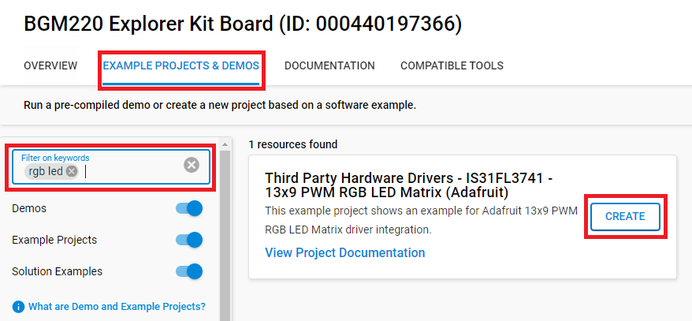
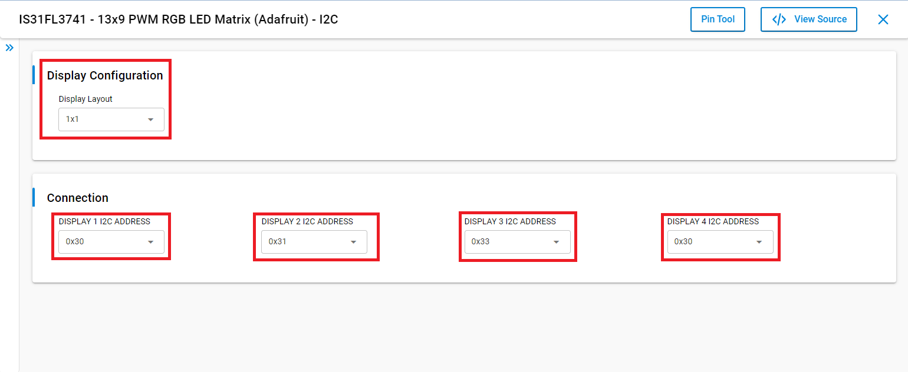

# IS31FL3741 Adafruit 13x9 PWM RGB LED Matrix Driver #

## Summary ##

This project aims to implement a hardware driver interacting with the [IS31FL3741 Adafruit 13x9 PWM RGB LED Matrix](https://learn.adafruit.com/adafruit-is31fl3741) via APIs of GSDK.

Adafruit RGB LED Matrix is a 13x9 RGB LED matrix breakout. It features 117 RGB LEDs, each one 2x2mm in size, in a 13x9 grid with 3mm pitch spacing. The IS31FL3741 communicates over I2C and can set each LED element to have 16-bit color by using an 8-bit PWM signal. There's an adjustable current driver, so you can brighten or dim the whole display without losing color resolution. The module can be tiled side-to-side with others if desired up to 4 boards on the I2C bus.

## Required Hardware ##

- [BGM220 Explorer Kit board](https://www.silabs.com/development-tools/wireless/bluetooth/bgm220-explorer-kit)
- [Adafruit IS31FL3741 - 13x9 PWM RGB LED Matrix](https://learn.adafruit.com/adafruit-is31fl3741)

## Hardware Connection ##

Adafruit RGB LED Matrix can connect with the BGM220 Explorer Kit easily via two STEMMA QT connectors which are compatible with Qwiic. Qwiic is a special connector that includes two I2C wires (SDA and SCL), 3v3, and GND. All of these wires are combined into 1 connection port so that it makes the connection between 2 devices become easier and more convenient.


## Setup ##

You can either create a project based on a example project or start with an empty example project.

### Create a project based on a example project ###

1. From the Launcher Home, add the BRD4314A to MyProducts, click on it, and click on the **EXAMPLE PROJECTS & DEMOS** tab. Find the example project with filter "rgb led".

2. Click **Create** button on the **Third Party Hardware Drivers - IS31FL3741 - 13x9 PWM RGB LED Matrix (Adafruit)** example. Example project creation dialog pops up -> click Create and Finish and Project should be generated.


3. Build and flash this example to the board.

### Start with an empty example project ###

1. Create an "Empty C Project" for the "BGM220 Explorer Kit Board" using Simplicity Studio v5. Use the default project settings.

2. Copy the file [app.c](https://github.com/SiliconLabs/third_party_hw_drivers_extension/tree/master/app/example/adafruit_rgb_led_is31fl3741/app.c) (overwriting existing file), into the project root folder.

3. Install the software components:

   - Open the .slcp file in the project.

   - Select the SOFTWARE COMPONENTS tab.

   - Install the following components:

      - [Services] → [Sleep Timer]
      - [Services] → [IO Stream] → [IO Stream: USART] → default instance name: vcom
      - [Application] → [Utility] → [Log]
      - [Application] → [Utility] → [Assert]
      - [Third Party Hardware Drivers] → [Display & LED] → [IS31FL3741 - 13x9 PWM RGB LED Matrix (Adafruit) - I2C]
      - [Third Party Hardware Drivers] → [Services] → [GLIB - OLED Graphics Library]

4. Build and flash the project to your device.

**Note:**

- Make sure the SDK extension already be installed. If not please follow [this documentation](https://github.com/SiliconLabs/third_party_hw_drivers_extension/blob/master/README.md).

- SDK Extension must be enabled for the project to install **IS31FL3741 - 13x9 PWM RGB LED Matrix (Adafruit) - I2C** component. Selecting this component will also include the "I2CSPM" component with default configurated instance: qwiic.

- The example project are built on the BRD4314A board. For another boards, selecting the **IS31FL3741 - 13x9 PWM RGB LED Matrix (Adafruit) - I2C** component will include the "I2CSPM" component with unconfigured instance: inst0. This instance should be configurated by users.

### Display Configuration ###

Adafruit IS31FL3741 module supports up to 4 devices on a single I2C bus. Therefore, We provided 4 following display layout configurations: **1x1**, **1x2**, **1x3**, **1x4**, **2x2**. Users can choose their desired layout and the position of each display in the layout by setting its I2C address. But the order of the display has to follow the below diagram:

- **Horizontal**

```c
 -----------------------------------------------
| Display 1 | Display 2 | Display 3 | Display 4 |
 -----------------------------------------------
```

- **2x1** and **2x2**

```c
 -----------             -----------------------
| Display 1 |           | Display 1 | Display 2 |
|-----------|           |-----------------------|
| Display 2 |           | Display 3 | Display 4 |
 -----------             -----------------------
```

All of this can be done in the configuration part of **IS31FL3741 - 13x9 PWM RGB LED Matrix (Adafruit) - I2C** component.

- **Note**: The address of the display which is not used should be set to "None". For example, if the layout configuration is set to **1x2** and users want to use Display 1 and Display 2, They should set the address of two others display to None.



## How It Works ##

### API Overview ###

```c
 ---------------------------------------------
|                  application                |
|---------------------------------------------|
|                     glib.c                  |
|---------------------------------------------|
|            adafruit_is31fl3741.c            |
|---------------------------------------------|
|          adafruit_is31fl3741_i2c.c          |
|---------------------------------------------|
|                     emlib                   |
 ---------------------------------------------
```

The Adafruit IS31FL3741 driver is implemented to be compatible with the GLIB service. Hence, the application can use the APIs of the GLIB service driver instead of calling the APIs from Adafruit IS31FL3741 driver.

- [adafruit_is31fl3741.c](https://github.com/SiliconLabs/third_party_hw_drivers_extension/tree/master/driver/public/silabs/rgb_led_is31fl3741/src/adafruit_is31fl3741.c): Use to handle display features of the Adafruit IS31FL3741 module.
- [adafruit_is31fl3741_i2c.c](https://github.com/SiliconLabs/third_party_hw_drivers_extension/tree/master/driver/public/silabs/rgb_led_is31fl3741/src/adafruit_is31fl3741_i2c.c): Use to communicate with the Microcontroller via emlib of GSDK.

### Testing ###

- The testing program will try to display the following text "Silicon Labs - Third Party Hardware Drivers Extension".

   

## Report Bugs & Get Support ##

To report bugs in the Application Examples projects, please create a new "Issue" in the "Issues" section of [third_party_hw_drivers_extension](https://github.com/SiliconLabs/third_party_hw_drivers_extension) repo. Please reference the board, project, and source files associated with the bug, and reference line numbers. If you are proposing a fix, also include information on the proposed fix. Since these examples are provided as-is, there is no guarantee that these examples will be updated to fix these issues.

Questions and comments related to these examples should be made by creating a new "Issue" in the "Issues" section of [third_party_hw_drivers_extension](https://github.com/SiliconLabs/third_party_hw_drivers_extension) repo.
