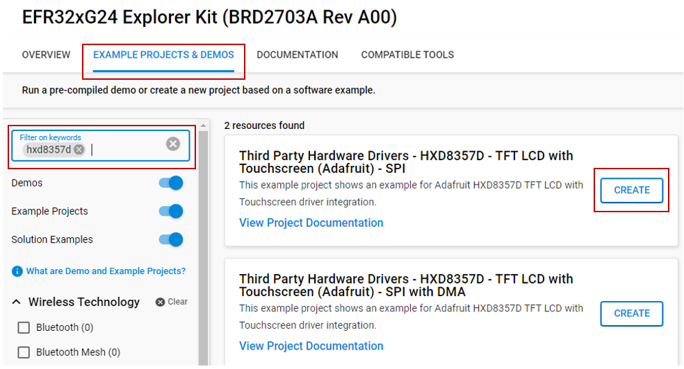
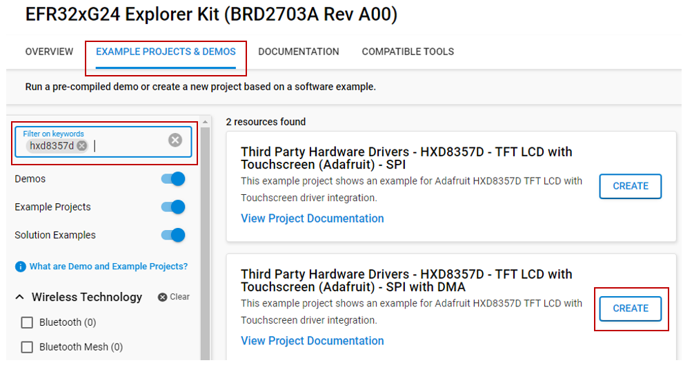
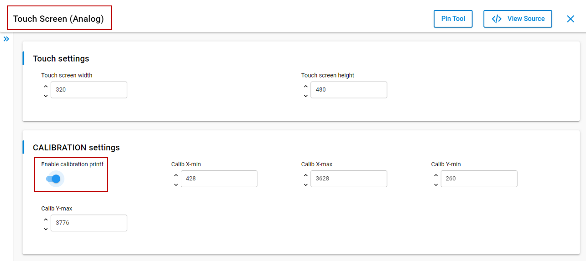
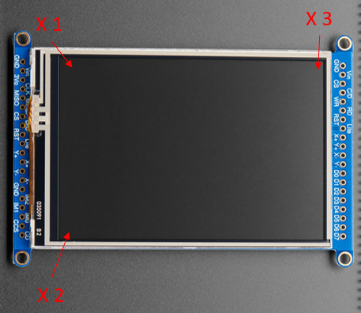

# HXD8357D - TFT LCD with Touchscreen (Adafruit) #

## Summary ##

This project aims to demonstrate how to integrate the HXD8357D TFT Display into your application using the HXD8357D TFT driver.

3.5" TFT 320x480 + Touchscreen Breakout Board w/MicroSD Socket - HXD8357D is a useful and convenient product from Adafruit. This display is an excellent choice to integrate with your project for monitoring, controlling, or gaming functionality. With a resolution of up to 320x480, along with a 3.5" diagonal screen size and bright (6 white-LED backlight), this display allows you to show images, graphics, and other content in detail and sharpness. The screen also features touchscreen functionality, allowing you to interact with applications in an intuitive way.

This display supports SPI communication mode, making it highly compatible with the most controllers.

For testing, you will need a HXD8357D display breakout, like [this large 3.5" TFT display breakout](https://www.adafruit.com/product/2050).  Make sure that the display you are using has the HXD8357D driver chip.

## Required Hardware ##

- [EFR32xG24 Explorer Kit](https://www.silabs.com/development-tools/wireless/efr32xg24-explorer-kit?tab=overview)
- [Adafruit HXD8357D - 3.5" TFT LCD with Touchscreen](https://www.adafruit.com/product/2050)

**NOTE:**
Tested boards for working with this example:

| Board ID | Description  |
| ---------------------- | ------ |
| BRD2703A | [EFR32xG24 Explorer Kit - XG24-EK2703A ](https://www.silabs.com/development-tools/wireless/efr32xg24-explorer-kit?tab=overview)    |
| BRD4314A | [BGM220 Bluetooth Module Explorer Kit - BGM220-EK4314A](https://www.silabs.com/development-tools/wireless/bluetooth/bgm220-explorer-kit?tab=overview)  |
| BRD4108A | [EFR32BG22 Explorer Kit Board](https://www.silabs.com/development-tools/wireless/bluetooth/bg22-explorer-kit?tab=overview)  |

## Hardware Connection ##

To connect the Adafruit 3.5" TFT LCD (with Touchscreen) with the EFR32xG24 Explorer Kit, you can see the pins mapping table below.

| Pin | Connection | Pin function |
|:---:|:-------------:|:---------------|
| PC8 | D/C | GPIO |
| PC0 | CS | SPI CS |
| PC1 | CLK | SPI SCK |
| PC2 | MISO | SPI MISO |
| PC3 | MOSI | SPI MOSI |
| PD5 | XP(X+) | AN |
| PD4 | YP(Y+) | AN |
| PB1 | YM(Y-) | AN |
| PA0 | XM(X-) | AN |

*Note: To be able to communicate with TFT LCD using SPI mode, you need to solder closed the IM2 jumper on the back of the PCB.*

## Setup ##

You can either create a project based on an example project or start with an empty example project.

### Create a project based on an example project ###

1. From the Launcher Home, add the BRD2703A to My Products, click on it, and click on the **EXAMPLE PROJECTS & DEMOS** tab. Find the example project with filter **hxd8357d**.

2. Click **Create** button on the example:

    - **Third Party Hardware Drivers - HXD8357D - TFT LCD with Touchscreen (Adafruit) - SPI** if using without DMA.  
    

    - **Third Party Hardware Drivers - HXD8357D - TFT LCD with Touchscreen (Adafruit) - SPI with DMA** if using with DMA.
    

    Example project creation dialog pops up -> click Create and Finish and Project should be generated.

3. Build and flash this example to the board.

### Start with an empty example project ###

1. Create an "Empty C Project" for the "EFR32xG24 Explorer Kit Board" using Simplicity Studio v5. Use the default project settings.

2. Copy the file `app/example/adafruit_tft_lcd_hxd8357d/app.c` into the project root folder (overwriting the existing file).

3. Install the software components:

   - Open the .slcp file in the project.

   - Select the SOFTWARE COMPONENTS tab.

   - Install the following components:

      - [Services] → [Timers] → [Sleep Timer]
      - [Services] → [IO Stream] → [IO Stream: EUSART] → default instance name: vcom
      - [Application] → [Utility] → [Log]
      - [Application] → [Utility] → [Assert]
      - If using without DMA: [Third Party Hardware Drivers] → [Display & LED] → [HXD8357D - TFT LCD Display (Adafruit) - SPI]
      - If using with DMA: [Third Party Hardware Drivers] → [Display & LED] → [HXD8357D - TFT LCD Display (Adafruit) - SPI with DMA]
      - [Third Party Hardware Drivers] → [Services] → [GLIB - OLED Graphics Library]
      - [Third Party Hardware Drivers] → [Human Machine Interface] → [Touch Screen (Analog)] → use the default configuration

4. Build and flash the project to your device.

**Note:**

- Make sure that the SDK extension is already installed. If not, please follow [this documentation](https://github.com/SiliconLabs/third_party_hw_drivers_extension/blob/master/README.md#how-to-add-to-simplicity-studio-ide).

- SDK Extension must be enabled for the project to install **HXD8357D - TFT LCD Display (Adafruit) - SPI** or **HXD8357D - TFT LCD Display (Adafruit) - SPI with DMA** component.

## Calibration for Touch function ##

Adafruit HXD8357D uses 4 resistive touch pins (Y+ X+ Y- X-) to determine touch points. We will read the analog values from these pins to detect where the touched point is on the screen. This process will surely have uncertainties so we have to calibrate it to detect touched points properly. Please follow the steps below to calibrate the touch screen.

- Open configuration for Touch Screen (Analog) component. Enable **calibration printf** option.
   

- Open the console window to monitor values of the 'x' and 'y' when touching some special points then update them in CALIBRATION settings.

   

- Touch X1 point then update x for **Calib X-min** and y for **Calib Y-min**.

- Touch X2 point then update x for **Calib X-max**

- Touch X3 point then update y for **Calib Y-max**

## How It Works ##

### Testing ###

To demonstrate the display and touchscreen functionalities, this project implements a drawing application that you see on some tablets. This application will display everything that is drawn on the screen. Users can select colors to draw. To erase anything on the screen, select the 'ERA' button on the corner. To reset the screen, select 'RTS'. Now you only need to prepare a pen and start to draw things in your mind.

## Report Bugs & Get Support ##

To report bugs in the Application Examples projects, please create a new "Issue" in the "Issues" section of [third_party_hw_drivers_extension](https://github.com/SiliconLabs/third_party_hw_drivers_extension) repo. Please reference the board, project, and source files associated with the bug, and reference line numbers. If you are proposing a fix, also include information on the proposed fix. Since these examples are provided as-is, there is no guarantee that these examples will be updated to fix these issues.

Questions and comments related to these examples should be made by creating a new "Issue" in the "Issues" section of [third_party_hw_drivers_extension](https://github.com/SiliconLabs/third_party_hw_drivers_extension) repo.
