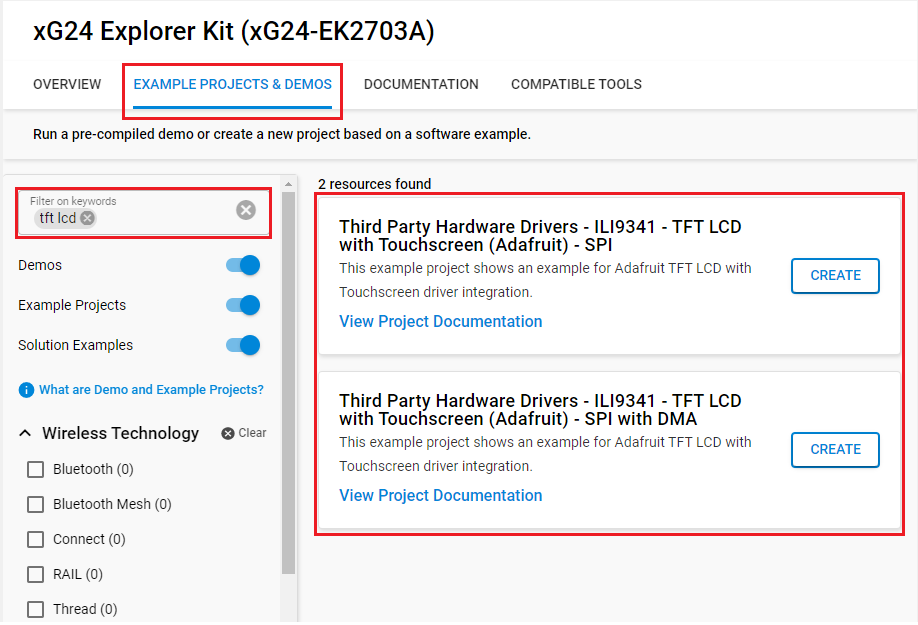
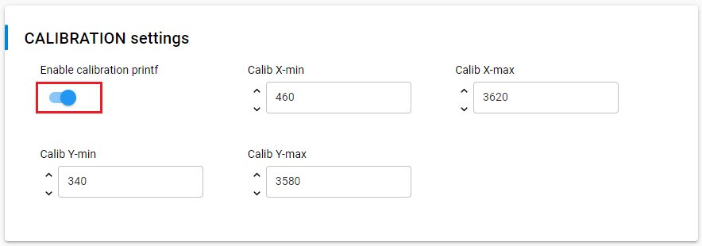
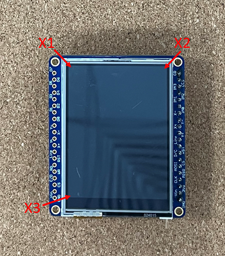

# ILI9341 - TFT LCD with Touchscreen (Adafruit) #

## Summary ##

Small TFT displays are a great way to add graphics to your projects. These are like tiny little LCD monitors that you can drive with a simple SPI serial interface.
This project aims to implement a hardware driver interacting with the ILI9341 TFT displays via APIs of GSDK.

For testing, you'll need a ILI9341 display breakout, like [this large 2.8" TFT display breakout](https://www.adafruit.com/product/1770) or [2.4" TFT breakout](https://www.adafruit.com/product/2478) should work too.  Make sure that the display you're using has the ILI9341 driver chip!

## Required Hardware ##

- [EFR32xG24 Explorer Kit](https://www.silabs.com/development-tools/wireless/efr32xg24-explorer-kit?tab=overview)
- A ILI9341 TFT display as listed below:
  - [Adafruit ILI9341 - 2.4" TFT LCD with Touchscreen](https://www.adafruit.com/product/2478)
  - [2.8" TFT LCD with Touchscreen Breakout Board w/MicroSD Socket - ILI9341](https://www.adafruit.com/product/1770)
  - [3.2" TFT LCD with Touchscreen Breakout Board w/MicroSD Socket - ILI9341](https://www.adafruit.com/product/1743)

## Hardware Connection ##

To connect the Adafruit 2.4" TFT LCD (with Touchscreen) with the EFR32xG24 Explorer Kit, you can see the pins mapping table below.

| Pin | Connection | Pin function |
|:---:|:-------------:|:---------------|
| PC8 | D/C | GPIO |
| PC0 | CS | SPI CS |
| PC1 | CLK | SPI SCK |
| PC2 | MISO | SPI MISO |
| PC3 | MOSI | SPI MOSI |
| PD5 | XP(X+) | AN |
| PD4 | YP(Y+) | AN |
| PB1 | YM(Y-) | AN |
| PA0 | XM(Y+) | AN |

## Setup ##

You can either create a project based on an example project or start with an empty example project.

### Create a project based on an example project ###

1. From the Launcher Home, add the BRD2703A to My Products, click on it, and click on the **EXAMPLE PROJECTS & DEMOS** tab. Find the example project with filter **tft lcd**.

2. Click **Create** button on the example:

    - **Third Party Hardware Drivers - ILI9341 - TFT LCD with Touchscreen (Adafruit) - SPI** if using without DMA.  

    - **Third Party Hardware Drivers - ILI9341 - TFT LCD with Touchscreen (Adafruit) - SPI with DMA** if using with DMA.

    Example project creation dialog pops up -> click Create and Finish and Project should be generated.
    

3. Build and flash this example to the board.

### Start with an empty example project ###

1. Create an "Empty C Project" for the "EFR32xG24 Explorer Kit Board" using Simplicity Studio v5. Use the default project settings.

2. Copy the file `app/example/adafruit_tft_lcd_ili9341/app.c` into the project root folder (overwriting existing file).

3. Install the software components:

   - Open the .slcp file in the project.

   - Select the SOFTWARE COMPONENTS tab.

   - Install the following components:

      - [Services] → [Timers] → [Sleep Timer]
      - [Services] → [IO Stream] → [IO Stream: EUSART] → default instance name: vcom
      - [Application] → [Utility] → [Log]
      - [Application] → [Utility] → [Assert]
      - If using without DMA: [Third Party Hardware Drivers] → [Display & LED] → [ILI9341 - TFT LCD Display (Adafruit) - SPI]
      - If using with DMA: [Third Party Hardware Drivers] → [Display & LED] → [ILI9341 - TFT LCD Display (Adafruit) - SPI with DMA]
      - [Third Party Hardware Drivers] → [Services] → [GLIB - OLED Graphics Library]
      - [Third Party Hardware Drivers] → [Human Machine Interface] → [Touch Screen (Analog)] → use default configuration

4. Build and flash the project to your device.

**Note:**

- Make sure that the SDK extension already be installed. If not please follow [this documentation](https://github.com/SiliconLabs/third_party_hw_drivers_extension/blob/master/README.md#how-to-add-to-simplicity-studio-ide).

- SDK Extension must be enabled for the project to install **ILI9341 - TFT LCD Display (Adafruit) - SPI** or **ILI9341 - TFT LCD Display (Adafruit) - SPI with DMA** component.

## Calibration for Touch function ##

Adafruit ILI9341 uses 4 resistive touch pins (Y+ X+ Y- X-) to determine touch points. We will read the analog values from these pins to detect where the touched point is on the screen. This process will surely have uncertainties so we have to calibrate it to detect touched points properly. Please follow these steps below to calibrate the touch screen.

- Open configuration for Touch Screen (Analog) component. Enable **calibration printf** option.
   

- Open the console window to monitor values of the 'x' and 'y' when touching in some special points then update them in CALIBRATION settings.

   

- Touch X1 point then update x for **Calib X-min** and y for **Calib Y-min**.

- Touch X2 point then update x for **Calib X-max**

- Touch X3 point then update y for **Calib Y-max**

## How It Works ##

### Testing ###

The Adafruit ILI9341 TFT LCD with Touchscreen supports both display and touch functions. During the testing, program attempts to display everything that is written on the screen with the chosen color. You can choose, which color you want to write on the screen by touching its corresponding block at the bottom of the screen. You can also delete the whole screen by touching the **DEL** block at the upper right corner of the screen.

## Report Bugs & Get Support ##

To report bugs in the Application Examples projects, please create a new "Issue" in the "Issues" section of [third_party_hw_drivers_extension](https://github.com/SiliconLabs/third_party_hw_drivers_extension) repo. Please reference the board, project, and source files associated with the bug, and reference line numbers. If you are proposing a fix, also include information on the proposed fix. Since these examples are provided as-is, there is no guarantee that these examples will be updated to fix these issues.

Questions and comments related to these examples should be made by creating a new "Issue" in the "Issues" section of [third_party_hw_drivers_extension](https://github.com/SiliconLabs/third_party_hw_drivers_extension) repo.
