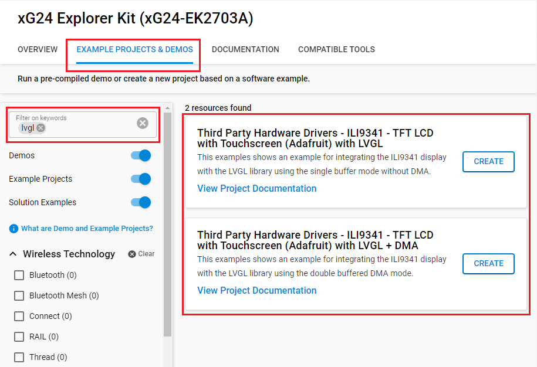
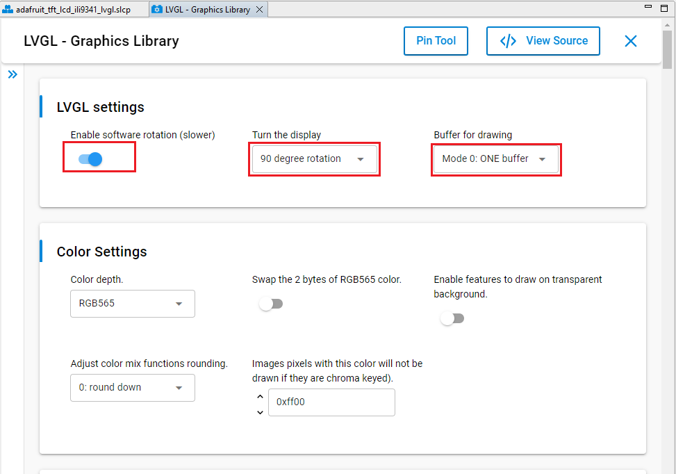
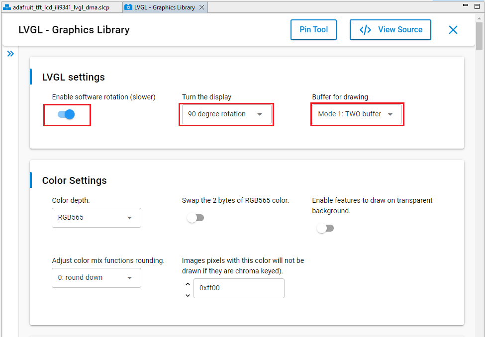

# ILI9341 - TFT LCD with Touchscreen (Adafruit) with LVGL #

## Summary ##

This example shows an example for integrating the ILI9341 display with the [LVGL library](https://lvgl.io/).
There are several settings to adjust the number draw buffers and buffering/refreshing modes in the LVGL library. For more information, please refer to [this documemtation](https://docs.lvgl.io/8.3/porting/display.html#buffering-modes).

This example uses the source files which are generated from [SquareLine Studio](https://squareline.io/). These files are provided in the `app_ui` folder. SquareLine Studio is a professional and easy-to-use UI editor software to speed up and simplify the UI development. Visiting [this page](https://squareline.io/) for more information.

## Required Hardware ##

- [EFR32xG24 Explorer Kit](https://www.silabs.com/development-tools/wireless/efr32xg24-explorer-kit?tab=overview)
- A ILI9341 TFT display as listed below:
  - [Adafruit ILI9341 - 2.4" TFT LCD with Touchscreen](https://www.adafruit.com/product/2478)
  - [2.8" TFT LCD with Touchscreen Breakout Board w/MicroSD Socket - ILI9341](https://www.adafruit.com/product/1770)
  - [3.2" TFT LCD with Touchscreen Breakout Board w/MicroSD Socket - ILI9341](https://www.adafruit.com/product/1743)

## Hardware Connection ##

To connect the Adafruit 2.4" TFT LCD (with Touchscreen) with the EFR32xG24 Explorer Kit, you can see the pins mapping table below.

| Pin | Connection | Pin function |
|:---:|:-------------:|:---------------|
| PC8 | D/C | GPIO |
| PC0 | CS | SPI CS |
| PC1 | CLK | SPI SCK |
| PC2 | MISO | SPI MISO |
| PC3 | MOSI | SPI MOSI |
| PD5 | XP(X+) | AN |
| PD4 | YP(Y+) | AN |
| PB1 | YM(Y-) | AN |
| PA0 | XM(Y+) | AN |

## Setup ##

You can either create a project based on an example project or start with an empty example project.

### Create a project based on an example project ###

1. From the Launcher Home, add the BRD2703A to My Products, click on it, and click on the **EXAMPLE PROJECTS & DEMOS** tab. Find the example project with filter **lvgl**.

2. Click **Create** button on the example:

    - **Third Party Hardware Drivers - TFT LCD with Touchscreen (Adafruit) with LVGL** if using single buffer mode without DMA.  

    - **Third Party Hardware Drivers - TFT LCD with Touchscreen (Adafruit) with LVGL + DMA** if using double buffered DMA mode.

    Example project creation dialog pops up -> click Create and Finish and Project should be generated.
    

3. Build and flash this example to the board.

### Start with an empty example project ###

1. Create an "Empty C Project" for the "EFR32xG24 Explorer Kit Board" using Simplicity Studio v5. Use the default project settings.

2. Copy the file `app/example/adafruit_tft_lcd_ili9341_lvgl/app.c` into the project root folder (overwriting existing file).

3. Copy all files in the folder below into the project root folder.

   - `app_ui/brd2703a/single_buffer_without_dma` if using single buffer mode without DMA:

   - `app_ui/brd2703a/double_buffered_dma` if using double buffered DMA mode:

4. Install the software components:

   - Open the .slcp file in the project.

   - Select the SOFTWARE COMPONENTS tab.

   - Install the following components:

      - [Services] → [Timers] → [Sleep Timer]
      - If using single buffer mode without DMA:
        - [Platform] → [Driver] → [LED] → [Simple LED] → [led0]
        - [Third Party Hardware Drivers] → [Display & LED] → [ILI9341 - TFT LCD Display (Adafruit) - SPI]
        - [Third Party Hardware Drivers] → [Human Machine Interface] → [Touch Screen (Analog)] → use default configuration
        - [Third Party Hardware Drivers] → [Services] → [LVGL - Graphic Library] → Using settings as below:
          
      - If using double buffered DMA mode:
        - [Platform] → [Driver] → [LED] → [Simple LED] → [led0, led1]
        - [Platform] → [Driver] → [Button] → [Simple Button] → [btn0, btn1]
        - [Third Party Hardware Drivers] → [Display & LED] → [ILI9341 - TFT LCD Display (Adafruit) - SPI with DMA]
        - [Third Party Hardware Drivers] → [Human Machine Interface] → [Touch Screen (Analog)] → use default configuration
        - [Third Party Hardware Drivers] → [Services] → [LVGL - Graphic Library] → Using settings as below:
          

5. Build and flash the project to your device.

**Note:**

- Make sure that the SDK extension already be installed. If not please follow [this documentation](https://github.com/SiliconLabs/third_party_hw_drivers_extension/blob/master/README.md#how-to-add-to-simplicity-studio-ide).

## How It Works ##

### Testing ###

After resetting, the loader screen is loaded in 3s. Then the main screen provides interfaces to control the onboard LED(s) via touchscreen.

Testing with double buffered DMA mode:

Testing single buffer mode without DMA:

## Report Bugs & Get Support ##

To report bugs in the Application Examples projects, please create a new "Issue" in the "Issues" section of [third_party_hw_drivers_extension](https://github.com/SiliconLabs/third_party_hw_drivers_extension) repo. Please reference the board, project, and source files associated with the bug, and reference line numbers. If you are proposing a fix, also include information on the proposed fix. Since these examples are provided as-is, there is no guarantee that these examples will be updated to fix these issues.

Questions and comments related to these examples should be made by creating a new "Issue" in the "Issues" section of [third_party_hw_drivers_extension](https://github.com/SiliconLabs/third_party_hw_drivers_extension) repo.
