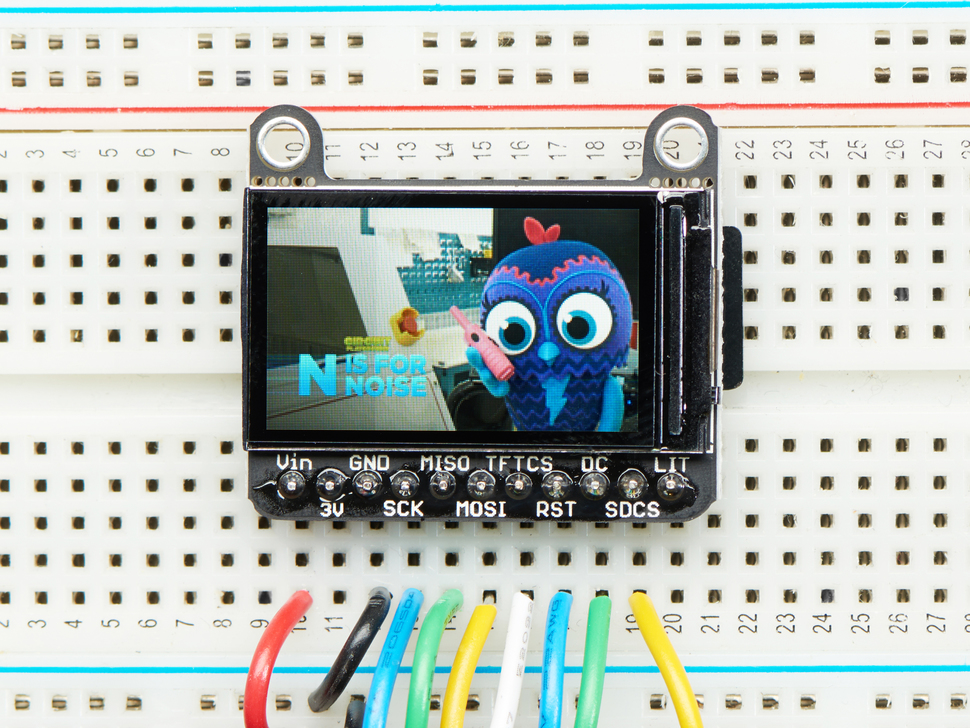
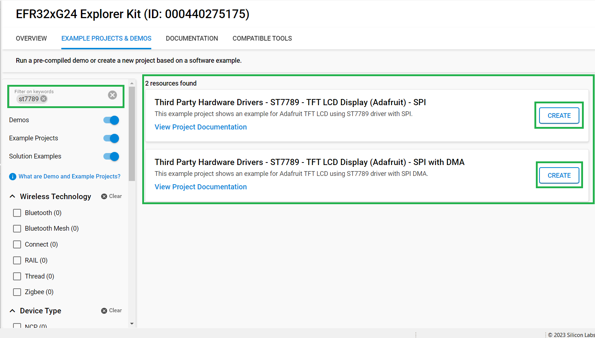
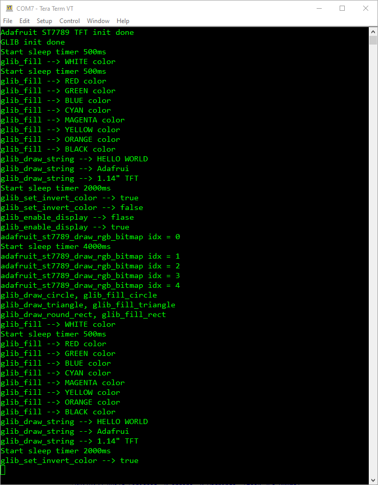

# ST7789 - Color TFT Display (Adafruit) #

## Summary ##

Small TFT displays are a great way to add graphics to your projects. They are like tiny LCD displays that you can control using a simple SPI serial interface. With a resolution of 240x135 pixels, 16-bit full color and an IPS screen, colors display great when off-axis up to 80 degrees in any direction. This TFT display can be used in smart watches and small electronic devices.

This project aims to implement a hardware driver interacting with the ST7789 TFT displays via APIs of GSDK.

For testing, you will need a ST7789 display breakout, like [Adafruit 1.14" 240x135 Color TFT Display + MicroSD Card Breakout - ST7789](https://www.adafruit.com/product/4383). Make sure that the display you are using has the ST7789 driver chip.

**NOTE:**
Tested boards for working with this example:

| Board ID | Description  |
| ---------------------- | ------ |
| BRD2703A | [EFR32xG24 Explorer Kit - XG24-EK2703A](https://www.silabs.com/development-tools/wireless/efr32xg24-explorer-kit?tab=overview)    |
| BRD4314A | [BGM220 Bluetooth Module Explorer Kit - BGM220-EK4314A](https://www.silabs.com/development-tools/wireless/bluetooth/bgm220-explorer-kit?tab=overview)  |
| BRD4108A | [EFR32BG22 Explorer Kit Board](https://www.silabs.com/development-tools/wireless/bluetooth/bg22-explorer-kit?tab=overview)  |
| BRD2704A | [Sparkfun Thing Plus MGM240P](https://www.sparkfun.com/products/20270)  |
| BRD2601B | [EFR32xG24 Dev Kit Board](https://www.silabs.com/development-tools/wireless/efr32xg24-dev-kit?tab=overview)  |

## Required Hardware ##

- [EFR32xG24 Explorer Kit](https://www.silabs.com/development-tools/wireless/efr32xg24-explorer-kit?tab=overview)
- A ST7789 Color TFT display as listed below:
  - [Adafruit 1.14" 240x135 Color TFT Display + MicroSD Card Breakout - ST7789](https://www.adafruit.com/product/4383)

## Hardware Connection ##

To connect the Adafruit 1.14" 240x135 Color TFT Display + MicroSD Card Breakout - ST7789 with the EFR32xG24 Explorer Kit, you can see the pins mapping table below.

| Pin | Connection | Pin function |
|:---:|:-------------:|:---------------|
| PC8 | D/C | GPIO |
| PC0 | CS | SPI CS |
| PC1 | CLK | SPI SCK |
| PC2 | MISO | SPI MISO |
| PC3 | MOSI | SPI MOSI |

## Setup ##

You can either create a project based on an example project or start with an empty example project.

### Create a project based on an example project ###

1. From the Launcher Home, add the BRD2703A to My Products, click on it, and click on the **EXAMPLE PROJECTS & DEMOS** tab. Find the example project with filter **"st7789"**.

2. Click **Create** button on the example:

    - **Third Party Hardware Drivers - ST7789 - TFT LCD Display (Adafruit) - SPI** if using without DMA.  

    - **Third Party Hardware Drivers - ST7789 - TFT LCD Display (Adafruit) - SPI with DMA** if using with DMA.

    Example project creation dialog pops up -> click Create and Finish and Project should be generated.
    

3. Build and flash this example to the board.

### Start with an empty example project ###

1. Create an "Empty C Project" for the "EFR32xG24 Explorer Kit Board" using Simplicity Studio v5. Use the default project settings.

2. Copy all the *.c files in the  `app/example/adafruit_tft_lcd_st7789` directory into the project root folder (overwriting existing file).

3. Install the software components:

   - Open the .slcp file in the project.

   - Select the SOFTWARE COMPONENTS tab.

   - Install the following components:

      - [Services] → [Timers] → [Sleep Timer]
      - [Services] → [IO Stream] → [IO Stream: EUSART] → default instance name: vcom
      - [Application] → [Utility] → [Log]
      - [Application] → [Utility] → [Assert]
      - If using without DMA: [Third Party Hardware Drivers] → [Display & LED] → [ST7789 - TFT LCD Display (Adafruit) - SPI]
      - If using with DMA: [Third Party Hardware Drivers] → [Display & LED] → [ST7789 - TFT LCD Display (Adafruit) - SPI with DMA]
      - [Third Party Hardware Drivers] → [Services] → [GLIB - OLED Graphics Library]

4. Build and flash the project to your device.

**Note:**

- Make sure that the SDK extension already be installed. If not please follow [this documentation](https://github.com/SiliconLabs/third_party_hw_drivers_extension/blob/master/README.md#how-to-add-to-simplicity-studio-ide).

- SDK Extension must be enabled for the project to install **ST7789 - TFT LCD Display (Adafruit) - SPI** or **ST7789 - TFT LCD Display (Adafruit) - SPI with DMA** component.

## How It Works ##

You can see, as soon as the chip is reset, the program is started. First, the display will show full screen basic colors (white, red, green, blue, cyan, purple, yellow, orange, black). Next, the screen will display the words "HELLO WORLD", "Adafruit", "1.14" TFT". Next is a demo of basic functions such as inverting colors, enable / disable display. Next, the screen The screen will display 5 different images with dimensions of 135x240 pixels. And finally, demo the functions of drawing shapes such as (circle, triangle, rectangle).The demo process will be repeated from the beginning.
There is a timer used in the program - the value is changed through specific demos, by which the users see the detailed content. If you want to do so, you can change them via the macros at the top of the "app.c" file.

## Report Bugs & Get Support ##

To report bugs in the Application Examples projects, please create a new "Issue" in the "Issues" section of [third_party_hw_drivers_extension](https://github.com/SiliconLabs/third_party_hw_drivers_extension) repo. Please reference the board, project, and source files associated with the bug, and reference line numbers. If you are proposing a fix, also include information on the proposed fix. Since these examples are provided as-is, there is no guarantee that these examples will be updated to fix these issues.

Questions and comments related to these examples should be made by creating a new "Issue" in the "Issues" section of [third_party_hw_drivers_extension](https://github.com/SiliconLabs/third_party_hw_drivers_extension) repo.
