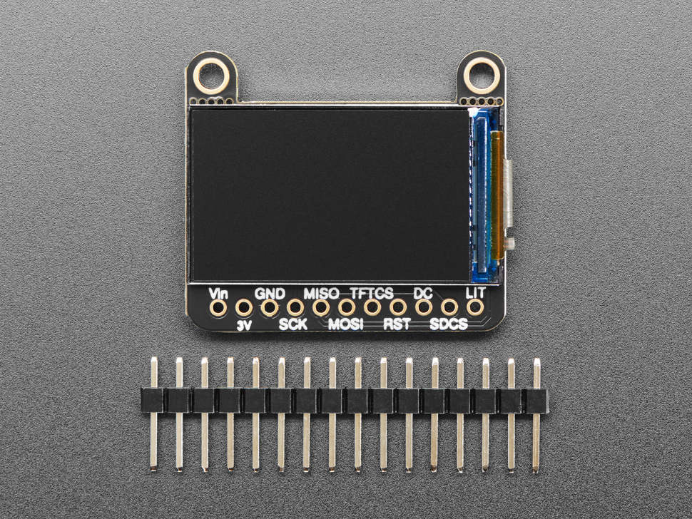
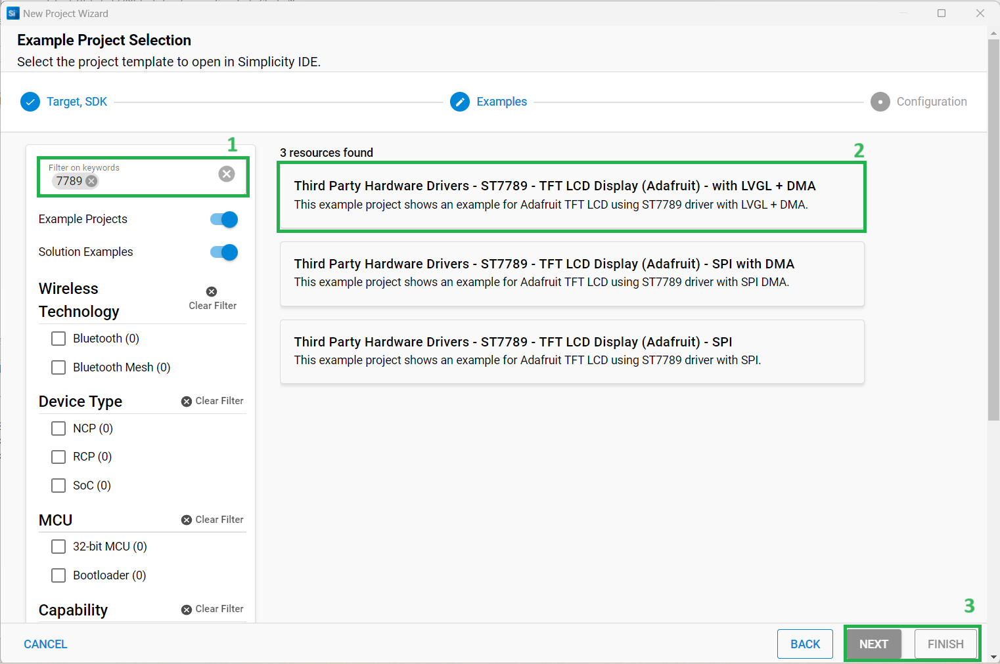
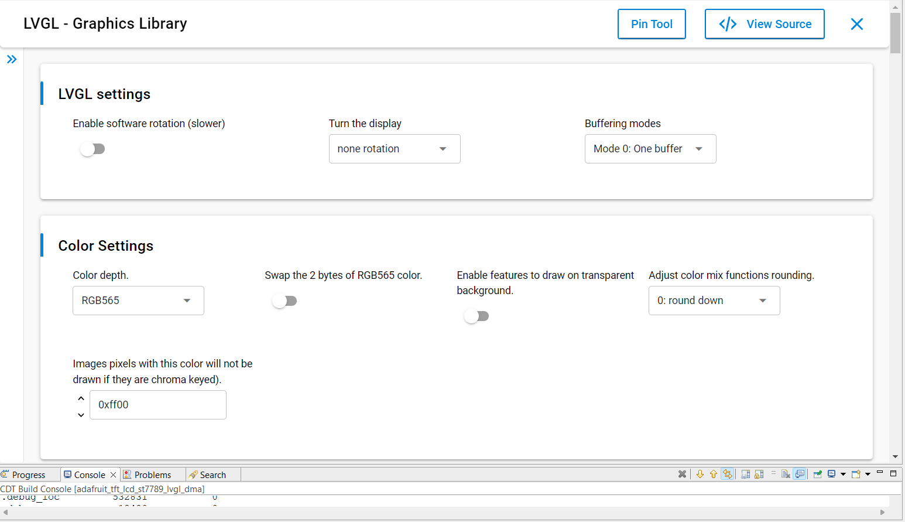
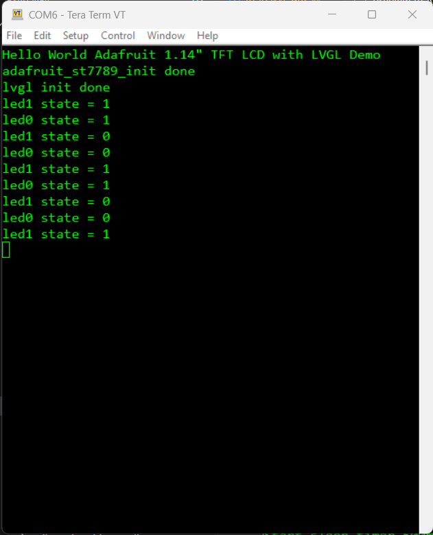

# ST7789 - Color TFT Display (Adafruit) with LVGL DMA #

## Summary ##

This example shows an example for integrating the ST7789 display with the [LVGL library](https://lvgl.io/).
There are several settings to adjust the number draw buffers and buffering/refreshing modes in the LVGL library. For more information, please refer to [this documemtation](https://docs.lvgl.io/8.3/porting/display.html#buffering-modes).

This example uses the source files which are generated from [SquareLine Studio](https://squareline.io/). These files are provided in the `app_ui` folder. SquareLine Studio is a professional and easy-to-use UI editor software to speed up and simplify the UI development. Visiting [this page](https://squareline.io/) for more information.

## Required Hardware ##

- [EFR32xG24 Explorer Kit](https://www.silabs.com/development-tools/wireless/efr32xg24-explorer-kit?tab=overview)
- A ST7789 TFT display as listed below:
  - [Adafruit 1.14" 240x135 Color TFT Display + MicroSD Card Breakout - ST7789](https://www.adafruit.com/product/4383)

**NOTE:**
Tested boards for working with this example:

| Board ID | Description  |
| ---------------------- | ------ |
| BRD2703A | [EFR32xG24 Explorer Kit - XG24-EK2703A](https://www.silabs.com/development-tools/wireless/efr32xg24-explorer-kit?tab=overview)    |

## Hardware Connection ##

To connect the Adafruit 1.14" 240x135 Color TFT Display + MicroSD Card Breakout - ST7789 with the EFR32xG24 Explorer Kit, you can see the pins mapping table below.

| Pin | Connection | Pin function |
|:---:|:-------------:|:---------------|
| PC8 | D/C | GPIO |
| PC0 | CS | SPI CS |
| PC1 | CLK | SPI SCK |
| PC2 | MISO | SPI MISO |
| PC3 | MOSI | SPI MOSI |

## Setup ##

You can either create a project based on an example project or start with an empty example project.

### Create a project based on an example project ###

1. From the Launcher Home, add the BRD2703A to My Products, click on it, and click on the **EXAMPLE PROJECTS & DEMOS** tab. Find the example project with filter **"st7789"**.

2. Click **Create** button on the example:

    - **Third Party Hardware Drivers - ST7789 - TFT LCD Display (Adafruit) - with LVGL + DMA**

    Example project creation dialog pops up -> click Create and Finish and Project should be generated.
    

3. Build and flash this example to the board.

### Start with an empty example project ###

1. Create an "Empty C Project" for the "EFR32xG24 Explorer Kit Board" using Simplicity Studio v5. Use the default project settings.

2. Copy source file:
   - Copy the file `app/example/adafruit_tft_lcd_st7789_lvgl_dma/app.c` into the project root folder (overwriting existing file).

   - Copy the `app/example/adafruit_tft_lcd_st7789_lvgl_dma/app_ui` folder and all the files in it into the project root folder.

3. Install the software components:

   - Open the .slcp file in the project.

   - Select the SOFTWARE COMPONENTS tab.

   - Install the following components:

      - [Services] → [Timers] → [Sleep Timer]
      - [Services] → [IO Stream] → [IO Stream: EUSART] → default instance name: vcom
      - [Application] → [Utility] → [Log]
      - [Application] → [Utility] → [Assert]
      - [Platform] → [Driver] → [LED] → [Simple LED] → [led0, led1]
      - [Platform] → [Driver] → [Button] → [Simple Button] → [btn0, btn1]
      - [Third Party Hardware Drivers] → [Display & LED] → [ST7789 - TFT LCD Display (Adafruit) - SPI with DMA]
      - [Third Party Hardware Drivers] → [Services] → [LVGL - Graphic Library] → Using settings as below:

      

4. Build and flash the project to your device.

**Note:**

- Make sure that the SDK extension already be installed. If not please follow [this documentation](https://github.com/SiliconLabs/third_party_hw_drivers_extension/blob/master/README.md#how-to-add-to-simplicity-studio-ide).

- SDK Extension must be enabled for the project to install **Third Party Hardware Drivers - ST7789 - TFT LCD Display (Adafruit) - with LVGL + DMA** component.

## How It Works ##

### Testing ###

After the chip is started, the main program is launched. The main screen will appear with the Silabs logo and 2 LED status icons. The user presses 2 buttons on the board to change the status of the LED. BTN0 is used to control LED0, BTN1 is used to control LED1. The status of the LED on the board is synced with the status of the LED on the screen.

## Report Bugs & Get Support ##

To report bugs in the Application Examples projects, please create a new "Issue" in the "Issues" section of [third_party_hw_drivers_extension](https://github.com/SiliconLabs/third_party_hw_drivers_extension) repo. Please reference the board, project, and source files associated with the bug, and reference line numbers. If you are proposing a fix, also include information on the proposed fix. Since these examples are provided as-is, there is no guarantee that these examples will be updated to fix these issues.

Questions and comments related to these examples should be made by creating a new "Issue" in the "Issues" section of [third_party_hw_drivers_extension](https://github.com/SiliconLabs/third_party_hw_drivers_extension) repo.
