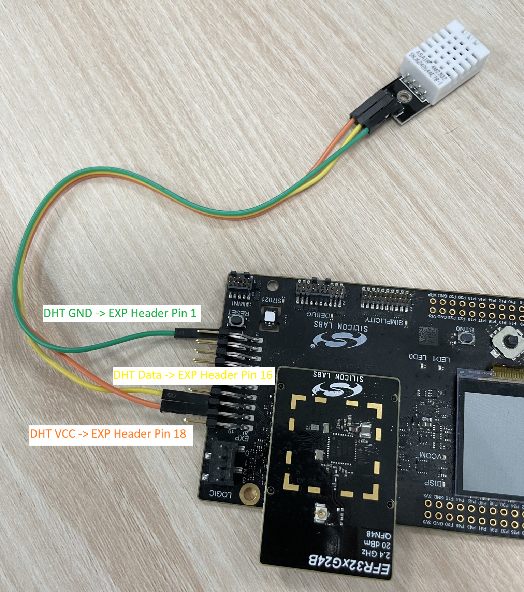
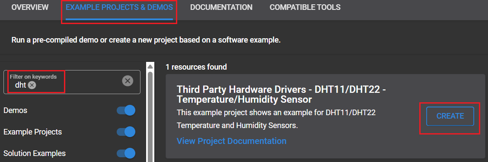
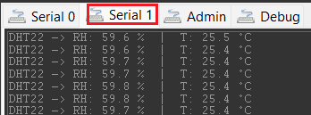

# DHT11/DHT22 Temperature and Humidity Sensors #

## Summary ##

This project shows the integration of the Asair DHT11 and DHT22 Temperature and Humidity Sensors with Silicon Labs' GPIO APIs.

DHT11 and DHT22 are low-cost digital sensors used to measure temperature and relative humidity, commonly integrated into embedded and IoT systems. The DHT11 offers basic accuracy and a narrower measurement range, making it suitable for simple applications, while the DHT22 provides higher precision and a wider operating range for more demanding use cases. Both sensors communicate over a single-wire protocol, making them easy to interface with microcontrollers like Silicon Labs devices.

## Table Of Contents ##

- [Summary](#summary)
- [Table Of Contents](#table-of-contents)
- [Required Hardware](#required-hardware)
- [Hardware Connection](#hardware-connection)
- [Setup](#setup)
  - [Create a project based on an example project](#create-a-project-based-on-an-example-project)
  - [Start with an empty example project](#start-with-an-empty-example-project)
- [How It Works](#how-it-works)
- [Report Bugs & Get Support](#report-bugs--get-support)

## Required Hardware ##

- 1x **Silicon Labs Radio Board** such as:
  - EFR32 SoC based:
    - [xG24-RB4187C](https://www.silabs.com/development-tools/wireless/xg24-rb4187c-efr32xg24-wireless-gecko-radio-board?tab=overview)
    - [XG22-SLWRB4182A](https://www.silabs.com/development-tools/wireless/slwrb4182a-efr32xg22-wireless-gecko-radio-board?tab=overview)
  - SiWG91x Wi-Fi SoC based:
    - [SiWx917-RB4338A](https://www.silabs.com/development-tools/wireless/wi-fi/siwx917-rb4338a-wifi-6-bluetooth-le-soc-radio-board?tab=overview)
- The Radio boards above are designed to work with the WPK main board (not included).
  - [Si-MB4002A](https://www.silabs.com/development-tools/wireless/wireless-pro-kit-mainboard?tab=overview)
- 1x ASAIR DHT series sensor:
  - [DHT11](https://asairsensors.com/product/dht11-sensor/)
  - [DHT22](https://asairsensors.com/product/am2302-dht22-temperature-and-humidity-sensor/)

## Hardware Connection ##

1. Radio Board and WPK Setup
   Mount the selected Silicon Labs radio board onto the Wireless Pro Kit (WPK) mainboard via the board-to-board connector socket. Then, connect the WPK mainboard to your PC using a USB cable to provide power and enable debugging/programming.
2. DHT Sensor Connection (DHT11/DHT22)
   Connect the DHT11 or DHT22 sensor to the WPK expansion (EXP) header using jumper wires.
   The GPIO connections are shown as below:

   ```
   DHT VCC (+) -> EXP Header Pin 18 (5V)
   DHT DATA (OUT) -> EXP Header Pin 16 (PC07 for BRD4187C; PB03 for BRD4182A; ULP_6 for BRD4338A)
   DHT GND (-) -> EXP Header Pin 1 (GND)
   ```



## Setup ##

You can either create a project based on an example project or start with an empty example project.
Make sure your board has connected to the PC and it should appear in **Debug Adapters** view in Simplicity Studio.

> **_NOTE_:** This example project doesn't need a separate bootloader to be present on the device.

> [!IMPORTANT]
>
> - Make sure that the [Third Party Hardware Drivers](https://github.com/SiliconLabsSoftware/third_party_hw_drivers_extension) extension is installed as part of the SiSDK. If not, follow [this documentation](https://github.com/SiliconLabsSoftware/third_party_hw_drivers_extension/blob/master/README.md#how-to-add-to-simplicity-studio-ide).
> - **Third Party Hardware Drivers** extension must be enabled for the project to install the required components from this extension.

> [!TIP]
> To show all components in the **Third Party Hardware Drivers** extension, the **Evaluation** quality must be enabled in the Software Component view.

### Create a project based on an example project ###

1. From the Launcher Home, select the board, and click on the **EXAMPLE PROJECTS & DEMOS** tab. Find the example project filtering by *DHT*.

2. Click the **Create** button on the **Third Party Hardware Drivers - DHT11/DHT22 - Temperature/Humidity Sensor** example. When the project creation dialog appears, click **Create and Finish** to generate the project.

   

3. Build and flash this example to the board.

### Start with an empty example project ###

1. Create an "Empty C Project" for your board using Simplicity Studio v5. Use the default project settings.

2. Copy the file `app/example/asair_temp_hum_dht11_dht22/app.c` into the project root folder (overwriting the existing file).

3. Open the .slcp file. Select the **SOFTWARE COMPONENTS** tab and install the following components:

   - If the **EFR32 Radio Board** is used:
     - [Services] → [IO Stream] → [Driver] → [IO Stream: USART] → instance name: **vcom** → Configure it if needed
     - [Application] → [Utility] → [Log]
     - [Platform] → [Board] → [Board Control] → Enable *Virtual COM UART*
     - [Platform] → [Utilities] → [Microsecond Delay]
     - [Services] → [Timers] → [Sleep Timer]
     - **[Third Party Hardware Drivers] → [Sensors] → [DHT11/DHT22 - Temperature & Humidity Sensor]**

   - If the **SiWG91x Radio Board** is used:
     - [WiSeConnect 3 SDK] → [Device] → [Si91x] → [MCU] → [Peripheral] → [GPIO]
     - [WiSeConnect 3 SDK] → [Device] → [Si91x] → [MCU] → [Service] → [Sleep Timer for Si91x]
     - **[Third Party Hardware Drivers] → [Sensors] → [DHT11/DHT22 - Temperature & Humidity Sensor]**

4. Build and flash the project to your device.

## How It Works ##

### Sensor Selection Example

Select the target DHT sensor in `app.c` by modifying the `DHT_SENSOR_MODEL` definition:

```c
// Select DHT sensor model
#define DHT_SENSOR_MODEL    DHT_SENSOR_DHT11
```

or

```c
// Select DHT sensor model
#define DHT_SENSOR_MODEL    DHT_SENSOR_DHT22
```

### GPIO Configuration Example

Select the GPIO used for the DHT data pin by modifying `DHT_DATA_PORT` and `DHT_DATA_PIN` in `app.c`.

Example for EFR32:

```c
#define DHT_DATA_PORT    SL_GPIO_PORT_C
#define DHT_DATA_PIN     7
```

Example for Si917:

```c
#define DHT_DATA_PORT    SL_SI91X_ULP_GPIO_6_PORT
#define DHT_DATA_PIN     SL_SI91X_ULP_GPIO_6_PIN
```

### API Overview ###

The driver provides a simple interface for initializing the DHT sensor and reading temperature and humidity data.

#### `sl_status_t dht_init(uint8_t gpioPort, uint8_t gpioPin, dht_sensor_t sensor)`

Initializes the DHT driver and configures the GPIO used by the sensor.

#### `sl_status_t dht_read_x10(int16_t *humidity_x10, int16_t *temperature_x10)`

Reads temperature and humidity data from the sensor.
Returned values are scaled by 10 to keep one decimal place without floating-point operations.

Example:
- `253` → `25.3 °C`
- `654` → `65.4 %RH`

### Testing ###

1. Connect the device to the PC via USB and open Simplicity Studio.

2. In the Debug Adapters view, right-click on the detected device and select Launch Console.

3. A console window (J-Link Silicon Labs console pane) will open.

4. Navigate to the "Serial 1" tab within the console window. This tab provides access to the physical serial (UART/VCOM) interface of your device and will display application output.



## Report Bugs & Get Support ##

To report bugs in the Application Examples projects, please create a new "Issue" in the "Issues" section of [third_party_hw_drivers_extension](https://github.com/SiliconLabsSoftware/third_party_hw_drivers_extension) repo. Please reference the board, project, and source files associated with the bug, and reference line numbers. If you are proposing a fix, also include information on the proposed fix. Since these examples are provided as-is, there is no guarantee that these examples will be updated to fix these issues.

Questions and comments related to these examples should be made by creating a new "Issue" in the "Issues" section of [third_party_hw_drivers_extension](https://github.com/SiliconLabsSoftware/third_party_hw_drivers_extension) repo.
