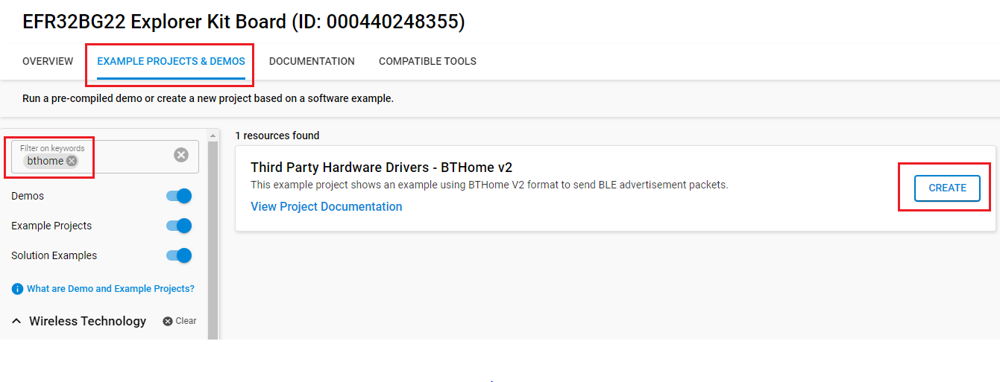
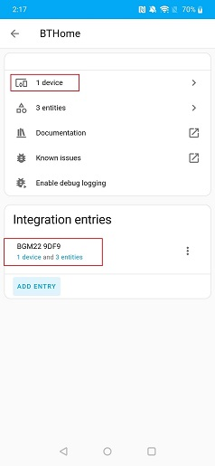
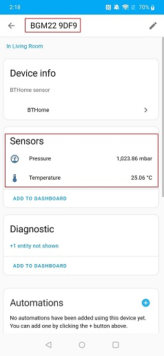

# BTHome v2

## Overview

BTHome is an energy-efficient, but flexible BT format for devices to broadcast their sensor data and button presses.

Devices can run over a year on a single battery. It allows data encryption and is supported by popular home automation platforms, like Home Assistant, out of the box.

For more information, please visit [BThome](https://bthome.io/).

The project aims to implement a library to provide a one-click solution to create a BTHome v2 compatible device.

## Required Hardware

- [**BGM220-EK4314A** BGM220 Bluetooth Module Explorer Kit (BRD4314A BGM220 Explorer Kit Board)](https://www.silabs.com/development-tools/wireless/bluetooth/bgm220-explorer-kit)

## Hardware Connection

To track data in this example, you can use the app *Home Assistant* like the picture below.

## Setup

To test this application, you can either create a project based on an example project or start with a "Bluetooth - SoC Empty" project based on your hardware.

### Create a project based on an example project

1. From the Launcher Home, add your hardware to My Products, click on it, and click on the **EXAMPLE PROJECTS & DEMOS** tab. Find the example project with the filter "bthome".

2. Click **Create** button on **Third Party Hardware Drivers - BTHome v2** examples. Example project creation dialog pops up -> click Create and Finish and Project should be generated.

3. Build and flash this example to the board.

### Start with a "Bluetooth - SoC Empty" project

1. Create a **Bluetooth - SoC Empty** project for your hardware using Simplicity Studio 5.

2. Copy the file `app/example/bluetooth_bthome_v2/app.c` into the project root folder (overwriting the existing file).

3. Install the software components:

    - Open the .slcp file in the project

    - Select the SOFTWARE COMPONENTS tab

    - Install the following components:
    
      - [Platform] → [Driver] → [Button] → [Simple Button] → default instance name: btn0
      - [Third-Party Hardware Drivers] → [Services] → [BTHome v2]

4. Build and flash the project to your device.

**Note:**

- Make sure that the SDK extension is already installed. If not please follow [this documentation](https://github.com/SiliconLabs/third_party_hw_drivers_extension/blob/master/README.md#how-to-add-to-simplicity-studio-ide).

- Third-party Drivers Extension must be enabled for the project to install "BTHome v2" component.

## How It Works

This example uses a device to send BLE advertisement packets in the BTHome v2 format like and energy efficient sensor. Between the broadcasting of BLE advertisements, the device is in a sleeping state, which makes it suitable for battery powered sensors.

This project aims to show how you can use a EFR32 to send BLE advertisement packets in the BTHome format.

The **Home Assistant** application utilizes the Bluetooth adapter on your phone/tablet to scan BLE devices.

Open the *Home Assistant* application on your smartphone. Click [Settings] → [Devices & Services] → [BTHome], and you will see a list of nearby devices, which are sending BTHome advertisements. Find the one named "BGM220P" and click the *ADD ENTRY*. Enter the BindKey then submit, add device to your home. Now you can see the *Pressure* data and the *Temperature* data show in the screen.

## Report Bugs & Get Support

To report bugs in the Application Examples projects, please create a new "Issue" in the "Issues" section of [third_party_hw_drivers_extension](https://github.com/SiliconLabs/third_party_hw_drivers_extension) repo. Please reference the board, project, and source files associated with the bug, and reference line numbers. If you are proposing a fix, also include information on the proposed fix. Since these examples are provided as-is, there is no guarantee that these examples will be updated to fix these issues.

Questions and comments related to these examples should be made by creating a new "Issue" in the "Issues" section of [third_party_hw_drivers_extension](https://github.com/SiliconLabs/third_party_hw_drivers_extension) repo.