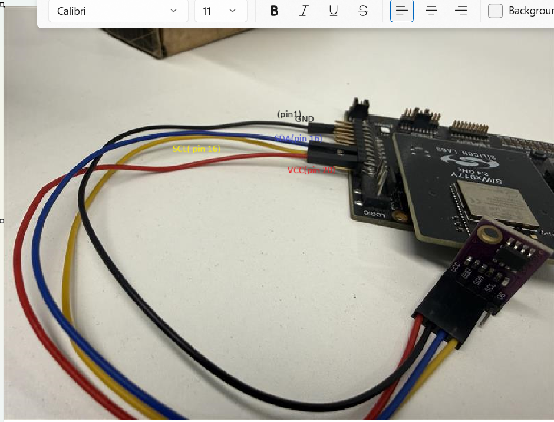
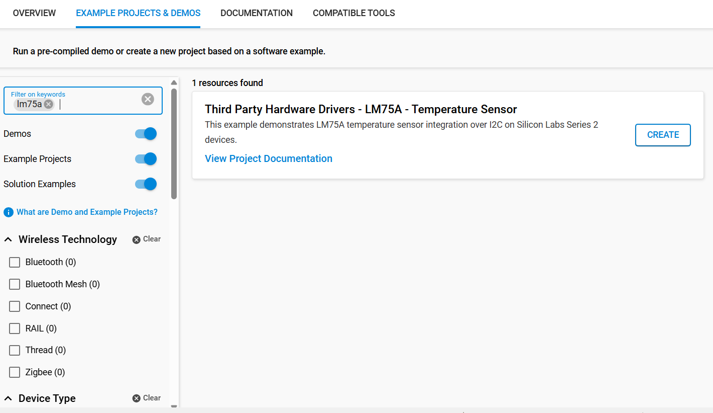
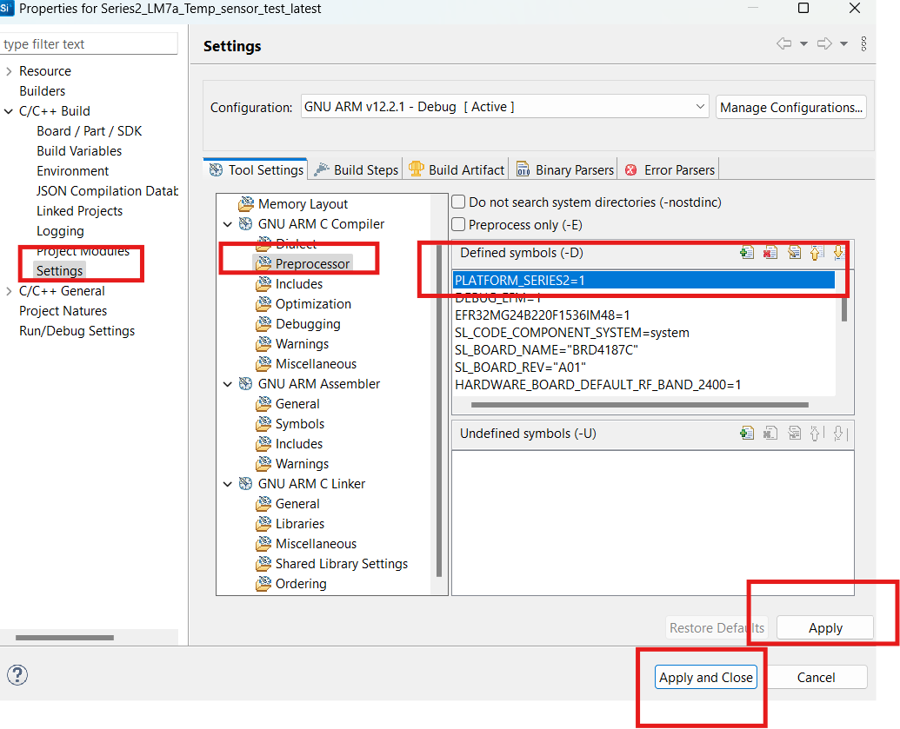
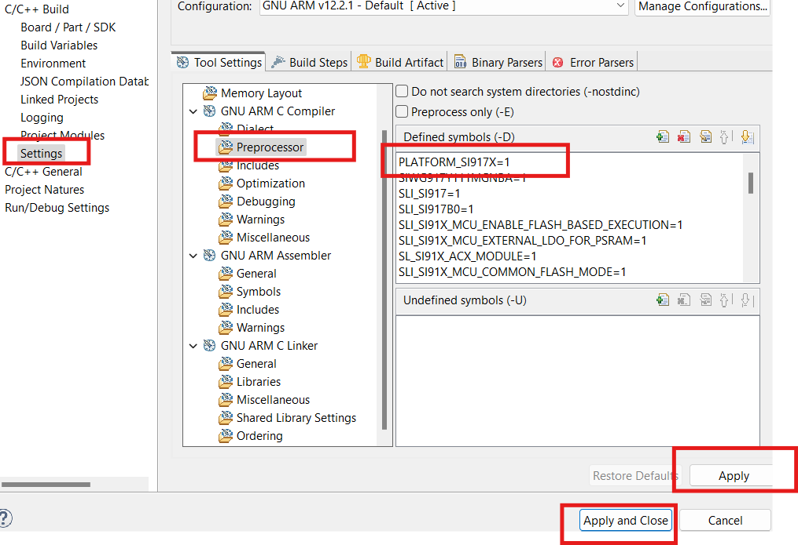
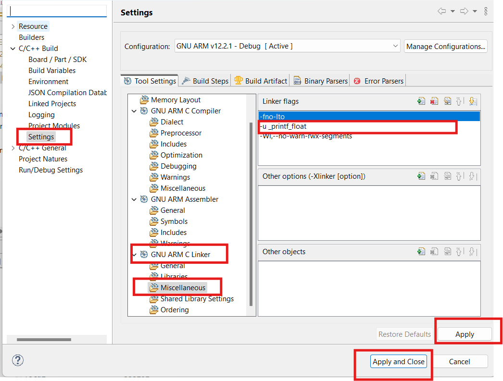
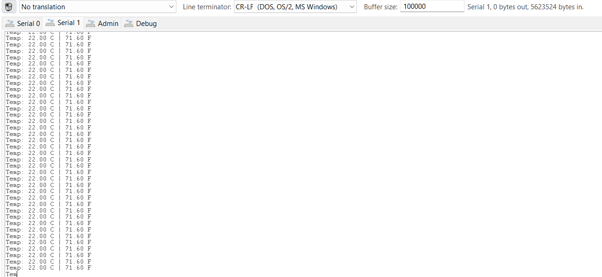

# LM75A - Temperature Sensor #

## Summary ##

This project shows the integration of the LM75a Temp Sensor with I2c driver(https://hw101.tbs1.de/lm75/doc/nxp_lm75_datasheet_short.pdf) APIs using Silicon Labs platform.

The LM75A is a temperature to digital converter using an on-chip band gap temperature sensor and Sigma-delta Analog to Digital  conversion technique. The device is also a thermaldetector providing an overtemperature detection output.
## Table Of Contents ##

- [Required Hardware](#required-hardware)
- [Hardware Connection](#hardware-connection)
- [Setup](#setup)
  - [Create a project based on an example project](#create-a-project-based-on-an-example-project)
  - [Start with an empty example project](#start-with-an-empty-example-project)
- [How It Works](#how-it-works)
- [Report Bugs & Get Support](#report-bugs--get-support)

## Required Hardware ##

- 1x [Silicon Labs BLE Development Kit](https://www.silabs.com/development-tools/wireless/bluetooth) based on the EFR32 SoC, such as:
  - [XG24-rb4187c](https://www.silabs.com/development-tools/wireless/xg24-rb4187c-efr32xg24-wireless-gecko-radio-board?tab=overview) + [Si-MB4002A](https://www.silabs.com/development-tools/wireless/wireless-pro-kit-mainboard?tab=overview)
  - [XG22-SLWRB4182A](https://www.silabs.com/development-tools/wireless/slwrb4182a-efr32xg22-wireless-gecko-radio-board?tab=overview) + [Si-MB4002A](https://www.silabs.com/development-tools/wireless/wireless-pro-kit-mainboard?tab=overview)
  - [xG21-SLWRB4181C](https://www.silabs.com/development-tools/wireless/slwrb4181c-efr32xg21-wireless-gecko-radio-board?tab=overview) + [Si-MB4002A](https://www.silabs.com/development-tools/wireless/wireless-pro-kit-mainboard?tab=overview)
  - [xG27-RB4194A](https://www.silabs.com/development-tools/wireless/xg27-rb4194a-efr32xg27-8-dbm-wireless-radio-board?tab=overview) + [Si-MB4002A](https://www.silabs.com/development-tools/wireless/wireless-pro-kit-mainboard?tab=overview)
  - [lm75a- TI](https://www.ti.com/lit/ds/symlink/lm75a.pdf?ts=1771677975375&ref_url=https%253A%252F%252Fwww.ti.com%252Fproduct%252FLM75A)

  *or*

  1x [Silicon Labs Wi-Fi Development Kit](https://www.silabs.com/development-tools/wireless/wi-fi) based on SiWG917, such as:
  - [SiW917Y-RB4343A](https://www.silabs.com/development-tools/wireless/wi-fi/siw917y-rb4343a-wi-fi-6-bluetooth-le-8mb-flash-radio-board-for-module?tab=overview) + [Si-MB4002A](https://www.silabs.com/development-tools/wireless/wireless-pro-kit-mainboard?tab=overview)
  

- 1x [LM75A Temperature Sensor -https://www.ti.com/product/LM75A#tech-docs)]() 

## Hardware Connection ##

For the Silicon Labs boards that feature a Qwiic connector, a [Qwiic Cable](https://www.sparkfun.com/flexible-qwiic-cable-100mm.html) is used to connect to the LM75a Temp sensor, as illustrated in the figure below.

For the Silicon Labs boards that do not have a Qwiic connector, consider using the [Qwiic Breadboard Cable](https://www.sparkfun.com/flexible-qwiic-cable-female-jumper-4-pin.html).

The tables below provide an overview of the pin connections.

**Silicon Labs BLE Development Kit:**

| Description | BRD4187C + BRD4002A | BRD4182A + BRD4002A | BRD4181C + BRD4002A | BRD4194A + BRD4002A | ↔ | LM75A Temperature Sensor Sensor Breakout |
| --- | --- | --- | --- | --- | --- | --- | --- |  --- |
| I2C_SDA | PA5 | PB0 | PB0 | PB0 |  ↔ | SDA |
| I2C_SCL | PA6 | PD2 | PD2 | PB1 |  ↔ | SCL |

**Silicon Labs Wi-Fi Development Kit:**

| Description | BRD4343A + BRD4002A | | ↔ | SparkFun Distance Sensor Breakout |
| --- | --- | --- | --- | --- | --- |
| I2C_SDA | ULP_GPIO_6 [EXP_16] | | ↔ | SDA |
| I2C_SCL | ULP_GPIO_7 [EXP_15] | | ↔ | SCL |

## Setup ##

You can either create a project based on an example project or start with an empty example project.

> [!IMPORTANT]
>
> - Make sure that the [Third Party Hardware Drivers](https://github.com/SiliconLabsSoftware/third_party_hw_drivers_extension) extension is installed as part of the SiSDK. If not, follow [this documentation](https://github.com/SiliconLabsSoftware/third_party_hw_drivers_extension/blob/master/README.md#how-to-add-to-simplicity-studio-ide).
> - **Third Party Hardware Drivers** extension must be enabled for the project to install the required components from this extension.

> [!TIP]
> To show all components in the **Third Party Hardware Drivers** extension, the **Evaluation** quality must be enabled in the Software Component view.

### Create a project based on an example project ###

1. From the Launcher Home, add used board BRD4787C(XG24) or BRD4343A(SiWx917)  to My Products, click on it, and click on the **EXAMPLE PROJECTS & DEMOS** tab. Find the example project filtering by *LM75A*.

2. Click **Create** button on the **Third Party Hardware Drivers - LM75A - Temperature Sensor** example. Example project creation dialog pops up -> click Create and Finish and Project should be generated.

   

3. While Building for the Series 2(BlE Development kit ) , Navigate by Right clicking on Project → Properties → C/C++ Build → Settings → Tool Settings → GNU ARM C Compiler → Preprocessor and Add the Macro PLATFORM_SERIES2 = 1 or For Siwx917 Platform Add the Macro PLATFORM_SI917X = 1

   

   

4. Particularly Adding for Series 2 (BlE Developement Kit) , Navigate by Right clicking on Project → Properties → C/C++ Build → Settings → Tool Settings → GNU ARM C Linker → Miscellaneous and Add the Linker Flags -u _printf_float

  

4. Build and flash this example to the board.

### Start with an empty example project ###

1. Create an "Empty C Project" for your board using Simplicity Studio v5. Use the default project settings.

2. Copy the file `app/example/LM75a_temp_sensor/app.c` into the project root folder (overwriting the existing file).

3. Open the .slcp file. Select the **SOFTWARE COMPONENTS** tab and install the following components:

   - If the **BLE Development Kit** is used:
     - [Services] → [IO Stream] → [IO Stream: USART] → instance name: **vcom**
     - [Application] →  [Utility] → [Log]
     - [Platform] → [Driver] → [I2C] → [I2CSPM] → default instance name: **qwiic** → Select the corresponding pins according to the table provided in [Hardware Connection](#hardware-connection)
     - [Third Party Hardware Drivers] → [Sensors] → [**tempsensor_lm75a **]

   - If the **Wi-Fi Development Kit** is used:
     - [WiSeConnect 3 SDK] → [Device] → [Si91x] → [MCU] → [Peripheral] → [I2C] → [i2c2] → Select the corresponding pins according to the table provided in [Hardware Connection](#hardware-connection)
     - [Third Party Hardware Drivers] → [Sensors] → [**LM75a - Temperature Sensor Breakout **]

4. Build and flash the project to your device.

## How It Works ##

### API Overview ###

The driver is divided into three layers, a platform, a core, and an interface layer. The core layer implements the key features, the platform layer provides integration to the host microcontroller hardware-dependent codes. (In practice it integrates the I2CSPM platform service.). Above these levels, the upper layer provides an interface with standard Silabs return codes and complies with Silicon Labs coding standards.

### Testing ###

Use Putty or teraterm or serial console(by right clicking on hardware labelled on debug adapter → launch console → serial1 window) to read the serial output. Configure right baudrate for the connection. You should expect a similar output to the one below.

## Report Bugs & Get Support ##

To report bugs in the Application Examples projects, please create a new "Issue" in the "Issues" section of [third_party_hw_drivers_extension](https://github.com/SiliconLabsSoftware/third_party_hw_drivers_extension) repo. Please reference the board, project, and source files associated with the bug, and reference line numbers. If you are proposing a fix, also include information on the proposed fix. Since these examples are provided as-is, there is no guarantee that these examples will be updated to fix these issues.

Questions and comments related to these examples should be made by creating a new "Issue" in the "Issues" section of [third_party_hw_drivers_extension](https://github.com/SiliconLabsSoftware/third_party_hw_drivers_extension) repo.
