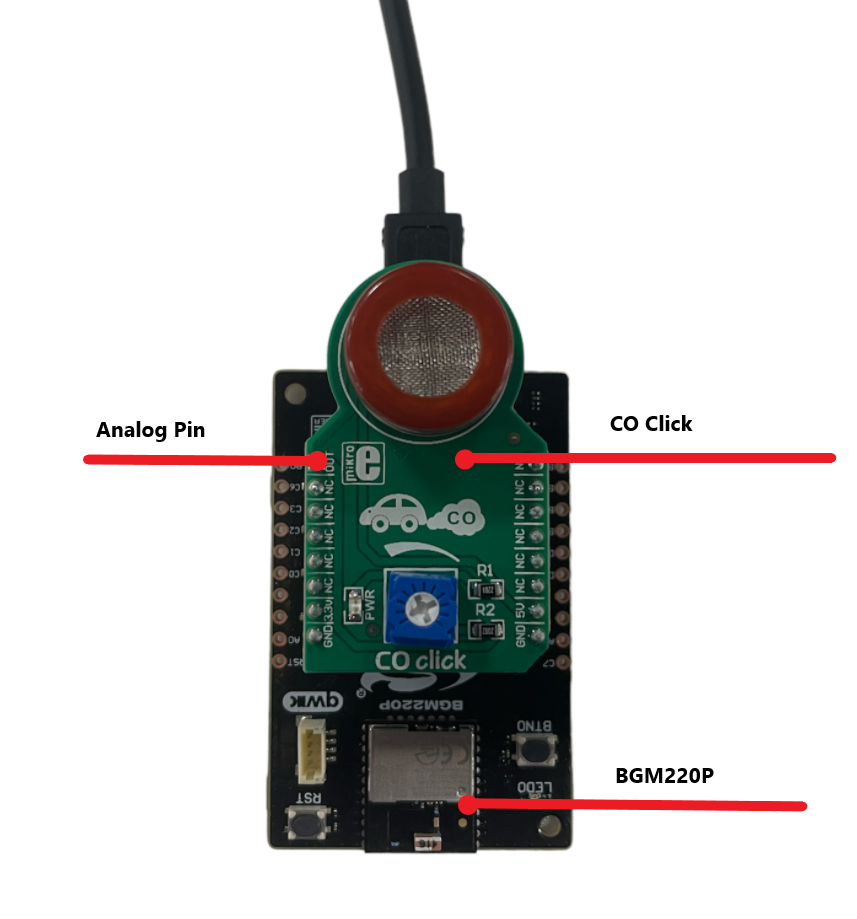
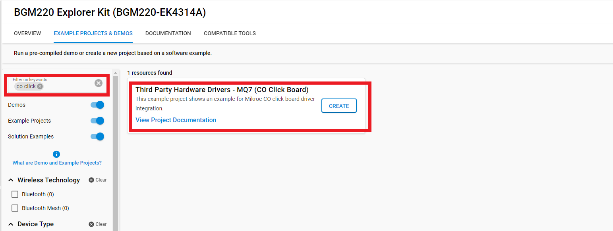
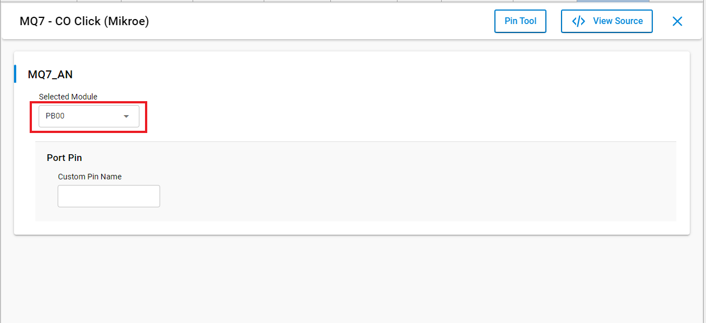
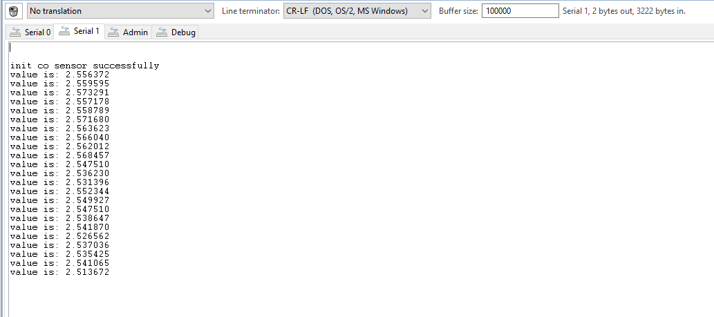

# CO Click Driver #

## Summary ##

This project aims to show the hardware driver that is used to interface with the MQ7 Sensor via APIs of GSDK.

CO Click is a compact add-on board that can detect the presence of carbon monoxide. This board features MQ-7, a carbon monoxide sensor from Zhengzhou Winsen Electronics Technology. The gas sensing layer on the MQ-7 sensor unit is made of Tin dioxide (SnO2), an inorganic compound with lower conductivity in clean air (the conductivity increases as the levels of carbon monoxide rise). It has a high sensitivity to carbon monoxide and can be used to detect alcohol in concentrations from 20 to 2000ppm communication with the host MCU through the analog mikroBUS line. This Click board is suitable as a domestic CO gas leakage alarm, industrial CO gas alarm, and portable CO gas detector.

## Required Hardware ##

- [A BGM220 Explorer Kit board](https://www.silabs.com/development-tools/wireless/bluetooth/bgm220-explorer-kit).

- [CO Click](https://www.mikroe.com/co-click).

## Hardware Connection ##

The CO Click board can just be "clicked" into its place. Be sure that the board's 45-degree corner matches the Explorer Kit's 45-degree white line.

## Setup ##

You can either create a project based on a example project or start with an empty example project.

### Create a project based on a example project ###

1. From the Launcher Home, add the BRD4314A to MyProducts, click on it, and click on the **EXAMPLE PROJECTS & DEMOS** tab. Find the example project with filter CO Click.

2. Click **Create** button on the **Third Party Hardware Drivers - MQ7 (CO Click Board)** example. Example project creation dialog pops up -> click Create and Finish and Project should be generated.

3. Build and flash this example to the board.

### Start with an empty example project ###

1. Create an "Empty C Project" for the "BGM220 Explorer Kit Board" using Simplicity Studio v5. Use the default project settings.

2. Copy the file [app.c](../../../example/mikroe_co_mq7/app.c) (overwriting existing file), into the project root folder.

3. Install the software components:

    - Open the .slcp file in the project.

    - Select the SOFTWARE COMPONENTS tab.

    - Install the following components:

        - **[Services] → [Sleep Timer]**
        - **[Services] → [IO Stream] → [IO Stream: USART]** → default instance name: vcom
        - **[Application] → [Utility] → [Log]**
        - **[Application] → [Service] → [Simple timer service]**
        - **[Third Party Hardware Drivers] → [Sensors] → [MQ7 - CO Click (Mikroe)]** → use default configuaration
        

4. Install printf float

    - Open Properties of the project.

    - Select C/C++ Build > Settings > Tool Settings >GNU ARM C Linker > General. Check Printf float.

        

5. Build and flash this example to the board.

**Note:**

- Make sure the SDK extension already be installed. If not please follow [this documentation](https://github.com/SiliconLabs/third_party_hw_drivers_extension/blob/master/README.md).

- SDK Extension must be enabled for the project to install **MQ7 - CO Click (Mikroe)** component.

- The example project are built on the BRD4314A board. So users should add the BRD4314A to MyProducts to able be see them on the Launcher Home of Simplicity Studio IDE.

## How It Works ##

You can launch Console that's integrated into Simplicity Studio or use a third-party terminal tool like TeraTerm to receive the data from the USB. A screenshot of the console output is shown in the figure below.

## Report Bugs & Get Support ##

To report bugs in the Application Examples projects, please create a new "Issue" in the "Issues" section of [third_party_hw_drivers_extension](https://github.com/SiliconLabs/third_party_hw_drivers_extension) repo. Please reference the board, project, and source files associated with the bug, and reference line numbers. If you are proposing a fix, also include information on the proposed fix. Since these examples are provided as-is, there is no guarantee that these examples will be updated to fix these issues.

Questions and comments related to these examples should be made by creating a new "Issue" in the "Issues" section of [third_party_hw_drivers_extension](https://github.com/SiliconLabs/third_party_hw_drivers_extension) repo.
