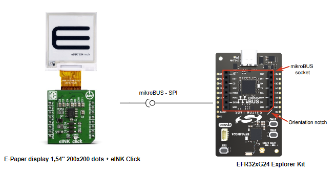
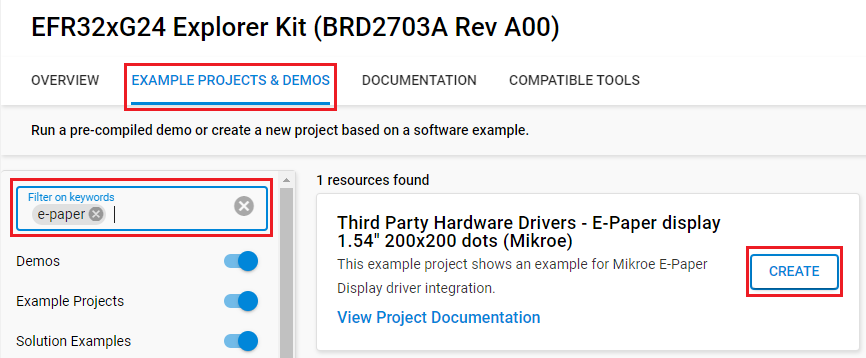
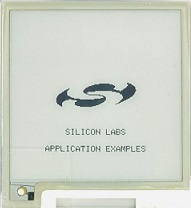

# E-Paper Display 1,54" 200x200 dots #

## Summary ##

This project aims to show the hardware driver that is used to interface with the E-Paper display 1,54" 200x200 dots driver from Mikroe via APIs of GSDK.

E-Paper display is based on Active Matrix Electrophoretic Display (AMEPD) technology and has an integrated pixel driver, which uses the SPI interface to communicate with the host MCU. E-Paper display has resolution of 200(V) X 200(H) pixels and an active display area of 27.6 X 27.6. The size of its square shaped pixels is 0.138mm x 0.138mm. The screen displays a clear and crisp graphics, and has an ultra-wide viewing range. Another key feature of the E-Ink technology is the extremely low power consumption, even when the display actively refresh its content.

## Required Hardware ##

- [EFR32xG24 Explorer Kit](https://www.silabs.com/development-tools/wireless/efr32xg24-explorer-kit?tab=overview)

- [EINK CLICK - WITHOUT DISPLAY](https://www.mikroe.com/eink-click-without-display)

- [E-Paper display 1,54" 200x200 dots](https://www.mikroe.com/e-paper-display-154-200x200-dots)

## Hardware Connection ##

eINK display needs an external adapter to interface with the EFR32xG24 Explorer Kit. The hardware connection is shown in the image below:

## Setup ##

You can either create a project based on an example project or start with an empty example project.

### Create a project based on an example project ###

1. From the Launcher Home, add the BRD2703A to My Products, click on it, and click on the **EXAMPLE PROJECTS & DEMOS** tab. Find the example project with filter **E-Paper**.

2. Click **Create** button on the **Third Party Hardware Drivers - E-Paper Display (Mikroe)** example. Example project creation dialog pops up -> click Create and Finish and Project should be generated.

3. Build and flash this example to the board.

### Start with an empty example project ###

1. Create an "Empty C Project" for the "EFR32xG24 Explorer Kit" using Simplicity Studio v5. Use the default project settings.

2. Copy the file [app.c](https://github.com/SiliconLabs/third_party_hw_drivers_extension/tree/master/app/example/mikroe_e_paper) (overwriting the existing file) into the project root folder.

3. Install the software components:

    - Open the .slcp file in the project.

    - Select the SOFTWARE COMPONENTS tab.

    - Install the following components:

        - **[Services] → [IO Stream] → [IO Stream: USART]** → default instance name: vcom
        - **[Third Party Hardware Drivers] → [Display & LED] → [E-Paper Display (Mikroe)]**
        - **[Third Party Hardware Drivers] → [Services] → [GLIB - OLED Graphics Library]**

4. Build and flash this example to the board.

**Note:**

- Make sure that the Third-party drivers extension has already been installed. If not please follow [this documentation](https://github.com/SiliconLabs/third_party_hw_drivers_extension/blob/master/README.md).

- Third-party drivers extension must be enabled for the project to install "E-Paper Display (Mikroe)" component. Selecting this component will also include the "SPIDRV" component with the default configurated instance: Mikroe.

## How It Works ##

### Testing ###

After setting up all the required components, flash the code to the Explorer Kit and you will see the result looks like below.

## Report Bugs & Get Support ##

To report bugs in the Application Examples projects, please create a new "Issue" in the "Issues" section of [third_party_hw_drivers_extension](https://github.com/SiliconLabs/third_party_hw_drivers_extension) repo. Please reference the board, project, and source files associated with the bug, and reference line numbers. If you are proposing a fix, also include information on the proposed fix. Since these examples are provided as-is, there is no guarantee that these examples will be updated to fix these issues.

Questions and comments related to these examples should be made by creating a new "Issue" in the "Issues" section of [third_party_hw_drivers_extension](https://github.com/SiliconLabs/third_party_hw_drivers_extension) repo.
