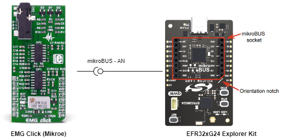
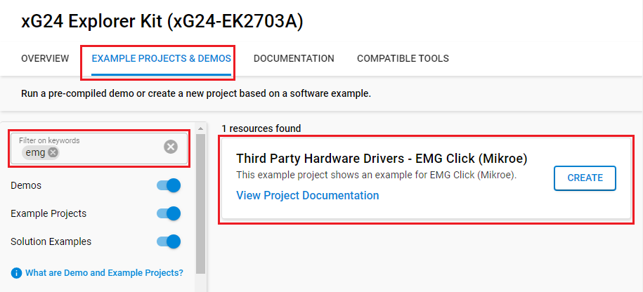
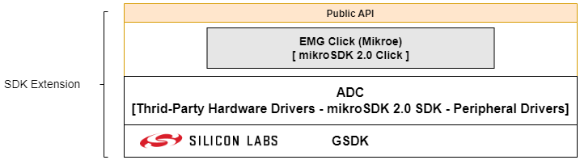
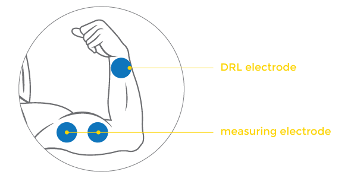
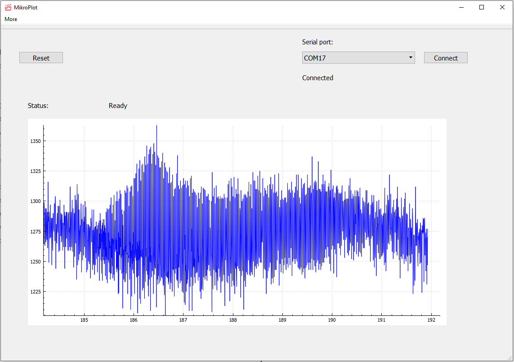

# EMG Click (Mikroe) #

## Summary ##

This example project shows an example of Mikroe EMG Click board driver integration with the Silicon Labs Platform.

EMG click measures the electrical activity produced by the skeletal muscles. It carries the MCP609 operational amplifier and the MAX6106 micropower voltage reference.
EMG click is designed to run on a 5V power supply. The click board™ has an analog output (AN pin).

This sensor is often used to diagnose the health of the muscles, and the neurons that control them.

## Required Hardware ##

- [**EFR32xG24-EK2703A** EFR32xG24 Explorer Kit](https://www.silabs.com/development-tools/wireless/efr32xg24-explorer-kit?tab=overview).
- [**Mikroe EMG Click**](https://www.mikroe.com/emg-click).
- [ECG/EMG cable](https://www.mikroe.com/ecg-cable)
- [Disposable adhesive pads](https://www.mikroe.com/ecg-30pcs)

## Hardware Connection ##

The EMG Click board supports MikroBus, so it can connect easily to EFR32xG24 Explorer Kit's MikroBus header. Be sure that the board's 45-degree corner matches the Explorer Kit's 45-degree white line.

The hardware connection is shown in the image below:

The electrodes are connected to the board with a cable that plugs into the onboard 3.5mm phone jack.

## Setup ##

You can either create a project based on an example project or start with an empty example project.

1. From the Launcher Home, add the BRD2703A to My Products, click on it, and click on the **EXAMPLE PROJECTS & DEMOS** tab. Find the example project with the filter **"emg"**.

2. Click **Create** button on the **Third Party Hardware Drivers - EMG Click (Mikroe)** example. Example project creation dialog pops up -> click Create and Finish and Project should be generated.

### Start with an empty example project ###

1. Create an "Empty C Project" for the "EFR32xG24 Explorer Kit Board" using Simplicity Studio v5. Use the default project settings.

2. Copy the file `app/example/mikroe_emg/app.c` into the project root folder (overwriting the existing file).

3. Install the software components:

    - Open the .slcp file in the project.

    - Select the SOFTWARE COMPONENTS tab.

    - Install the following components:

        - [Services] → [IO Stream] → [IO Stream: USART] → default instance name: **vcom**
        - [Application] → [Utility] → [Log]
        - [Services] → [Timers] → [Sleep Timer]
        - [Third Party Hardware Drivers] → [Sensors] → [EMG Click (Mikroe)] → use the default configuration.

4. Build and flash this example to the board.

**Note:**

- Make sure that the SDK extension already be installed. If not please follow [this documentation](https://github.com/SiliconLabs/third_party_hw_drivers_extension/blob/master/README.md#how-to-add-to-simplicity-studio-ide).

- SDK Extension must be enabled for the project to install the "EMG Click (Mikroe)" component. Selecting this component will also include the "IADC" component.

## How It Works ##

### Driver Layer Diagram ###

### Testing ###

This example reads the ADC value and sends results on the serial every 5 ms.
To record an EMG, you will need the following things:

- Flash the example to your board

- An onboard 3.5mm audio jack is used to connect cables/electrodes to the EMG Click board. The electrode collects voltage from the skin (few milliVolts).
For optimal results place the first DRL electrode on the wrist of the hand. Place the second and third electrodes on the muscle you want to measure

  

- On your PC, use [MikroPlot](https://libstock.mikroe.com/projects/view/1937/mikroplot-data-visualization-tool) tool (Windows) that can be used to generate an EMG graph. It’s a simple tool to help you visualize sensor data recorded over time.
The graph is generated from data sent from the microcontroller as below

  

## Report Bugs & Get Support ##

To report bugs in the Application Examples projects, please create a new "Issue" in the "Issues" section of [third_party_hw_drivers_extension](https://github.com/SiliconLabs/third_party_hw_drivers_extension) repo. Please reference the board, project, and source files associated with the bug, and reference line numbers. If you are proposing a fix, also include information on the proposed fix. Since these examples are provided as-is, there is no guarantee that these examples will be updated to fix these issues.

Questions and comments related to these examples should be made by creating a new "Issue" in the "Issues" section of [third_party_hw_drivers_extension](https://github.com/SiliconLabs/third_party_hw_drivers_extension) repo.
