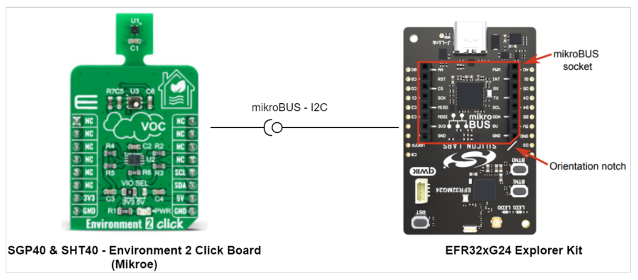
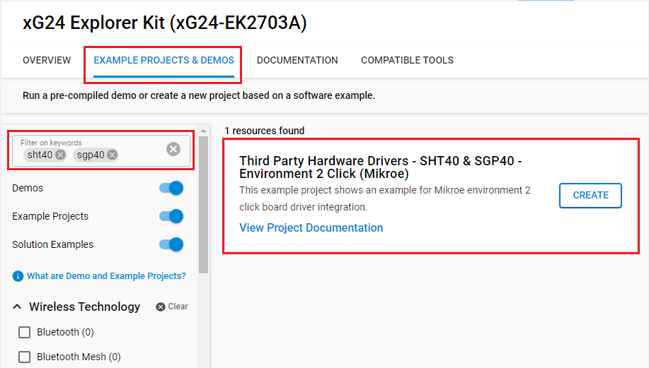
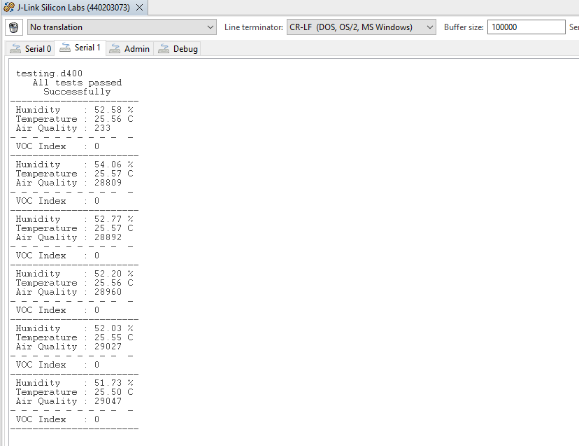

# SHT40 & SGP40 - Environment 2 Click (Mikroe) #

## Summary ##

This project shows the implementation of Environment-sensor driver using SHT40 & SGP40 from Mikroe Integrated with EFR32xG24 Explorer Kit based on I2C communication.

## Required Hardware ##

- [**BRD2703A-EFR32xG24** EFR32xG24 Bluetooth Module Explorer Kit (BRD2703A-EFR32xG24 Explorer Kit Board)](https://www.silabs.com/development-tools/wireless/efr32xg24-explorer-kit?tab=overview)

- [**Environment 2 Click** board based on SHT40 & SGP40 from Mikroe Integrated](https://www.mikroe.com/environment-2-click).

## Hardware Connection ##

The Environment 2 Click board can just be "clicked" into its place. Be sure that the board's 45-degree corner matches the Explorer Kit's 45-degree white line. The board also has the I2C-bus pull-ups. Just be sure that the click board is configured into I2C-mode (the default) by the resistors and not into SPI-mode.

## Setup ##

You can either create a project based on an example project or start with an empty example project.

### Create a project based on an example project ###

1. From the Launcher Home, add the BRD2703A to My Products, click on it, and click on the **EXAMPLE PROJECTS & DEMOS** tab. Find the example project with filter: 'sht40', 'sgp40'.

2. Click **Create** button on the **Third Party Hardware Drivers - SHT40 &amp; SGP40 - Environment 2 Click (Mikroe)** example. Example project creation dialog pops up -> click Create and Finish and Project should be generated.

3. Build and flash this example to the board.

### Start with an empty example project ###

1. Create an "Empty C Project" for the "EFR32xG24 Explorer Kit Board" using Simplicity Studio v5. Use the default project settings.

2. Copy the file `app/example/mikroe_environment2_sht40_sgp40/app.c` into the project root folder (overwriting existing file).

3. Install the software components:

    - Open the .slcp file in the project.

    - Select the SOFTWARE COMPONENTS tab.

    - Install the following components:

        - [Services] → [Timers] → [Sleep Timer]
        - [Services] → [IO Stream] → [IO Stream: USART] → default instance name: vcom
        - [Application] → [Utility] → [Log]
        - [Third Party Hardware Drivers] → [Sensors] → [SHT40 & SGP40 - Environment 2 Click (Mikroe)]

4. Install printf float

    - Open Properties of the project.

    - Select C/C++ Build → Settings → Tool Settings → GNU ARM C Linker → General. Check Printf float.

5. Build and flash this example to the board.

**Note:**

- Make sure that the SDK extension already be installed. If not please follow [this documentation](https://github.com/SiliconLabs/third_party_hw_drivers_extension/blob/master/README.md#how-to-add-to-simplicity-studio-ide).

- SDK Extension must be enabled for the project to install "SHT40 & SGP40 - Environment 2 Click (Mikroe)" component.

## How It Works ##

This is an example that demonstrates the use of the Environment 2 Click board. Measured and display air quality (raw data), temperature (degrees Celsius), relative humidity (%) and VOC Index. Results are being sent to the USART Terminal where you can track their changes.
You can launch Console that's integrated into Simplicity Studio or use a third-party terminal tool like TeraTerm to receive the data from the USB. A screenshot of the console output is shown in the figure below.

## Report Bugs & Get Support ##

To report bugs in the Application Examples projects, please create a new "Issue" in the "Issues" section of [third_party_hw_drivers_extension](https://github.com/SiliconLabs/third_party_hw_drivers_extension) repo. Please reference the board, project, and source files associated with the bug, and reference line numbers. If you are proposing a fix, also include information on the proposed fix. Since these examples are provided as-is, there is no guarantee that these examples will be updated to fix these issues.

Questions and comments related to these examples should be made by creating a new "Issue" in the "Issues" section of [third_party_hw_drivers_extension](https://github.com/SiliconLabs/third_party_hw_drivers_extension) repo.
