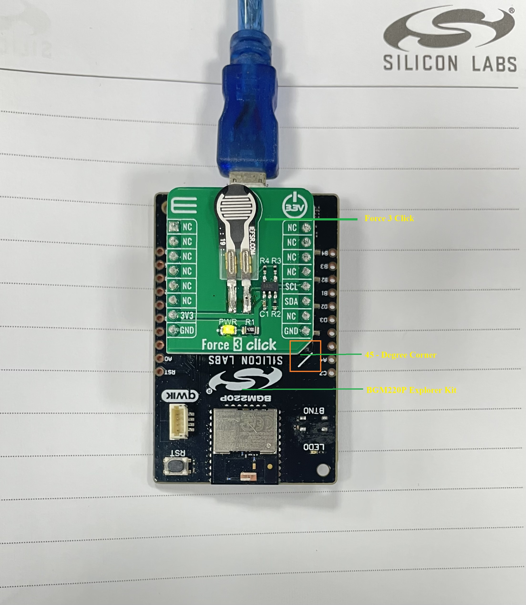
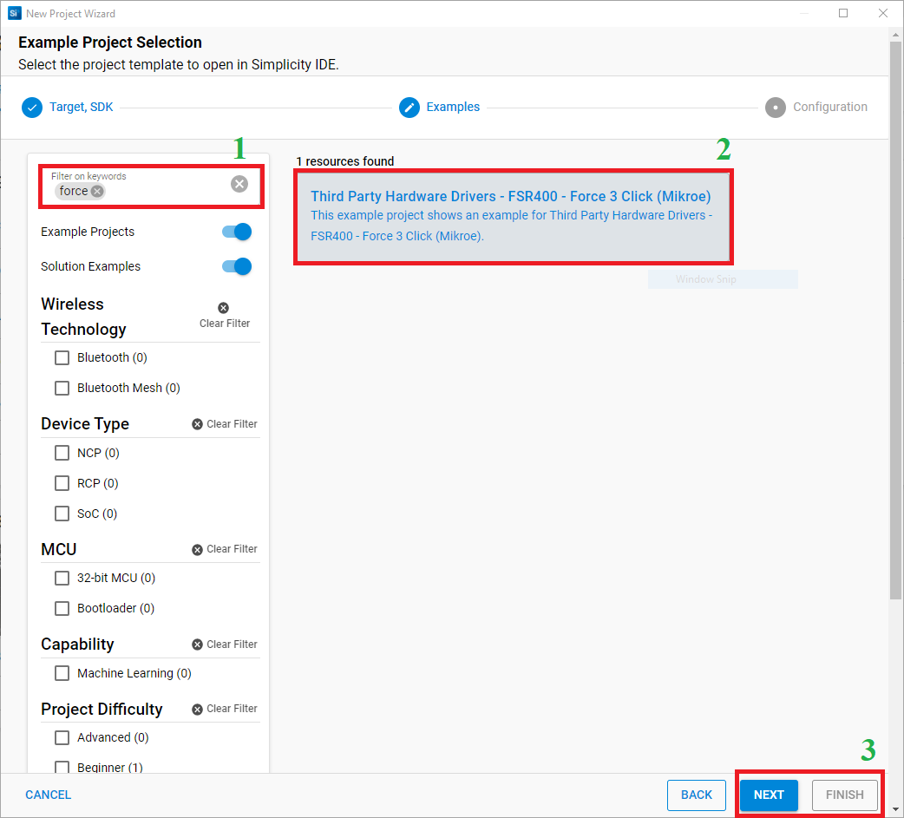
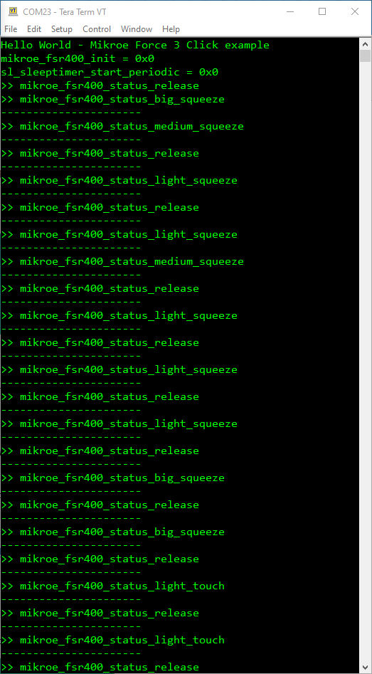

# FSR 400 - Force 3 Click (Mikroe) #

## Summary ##

This project shows the driver implementation of a Force Sensing Resistor sensor using the FSR 400 sensor with the Silicon Labs Platform.

Force 3 Click is a compact add-on board with circuitry for implementing Force Sensing Resistor into your projects whose resistance changes when a force, pressure, or mechanical stress is applied. This board features an FSR 400 series 34-00004 single zone Force Sensing Resistor from Interlink Electronics, a robust polymer thick film (PTF) device that exhibits a decrease in resistance with an increase in force applied to the surface of the sensor. Simple and easy to integrate, ultra-thin, and cost-effective, Force 3 Click has an actuation force as low as 0.2N and a sensitivity range of up to 20N. It also provides 2-Wire I2C compatible control interface using an MCP3221, low-power 12-bit resolution A/D converter. This Click board™ is optimized for use in human-machine interface devices including automotive electronics, medical systems, industrial controls and robotics.

Force 3 Click is based on the FSR 400 series 34-00004 single zone Force Sensing Resistor IC from Interlink Electronics. Force-sensing resistors consist of a conductive polymer, which predictably changes resistance following the application of force to its surface. As the force on the sensor is increased, the resistance is decreased. This thin sensor is made of two membranes that are separated by a spacer around the edges. The top layer of the sensor consists of the area of the force-sensitive layer on the flexible film, while the bottom layer is comprised of conductive circuit traces on the flexible film. When pressed, the gap between the two membranes gets closed. This shorts the two membranes together, with a resistance that is proportional to an applied force.

Force 3 Click also contains all the necessary circuitry, required to obtain precise measurements from the sensor. It communicates with the MCU using the MCP3221, a low-power 12-bit resolution A/D converter with an I2C interface. Data on the I2C bus can be transferred at rates of up to 100 kbit/s in the Standard-mode and up to 400 kbit/s in the Fast-mode. Maximum sample rates of 22.3 kSPS are possible with the MCP3221 in a continuous-conversion mode and SCL clock rate of 400 kHz.

The sensor is placed in a voltage divider configuration with a fixed resistor R2 (10k). The output voltage is measured across resistor R2 and then sent to the analog pin of the A/D converter MCP3221. Output voltage value was calculated using the voltage divider formula, whose value is later used in the Test Example to accurately determine the strength of the applied force. The Test Example is made in such a way that, based on the value of the applied force, it is possible to obtain four output values such as Light Touch, Weak Squeeze, Medium Squeeze, and Strong Squeeze.

## Required Hardware ##

- [**BGM220-EK4314A** BGM220 Bluetooth Module Explorer Kit (BRD4314A BGM220 Explorer Kit Board)](https://www.silabs.com/development-tools/wireless/bluetooth/bgm220-explorer-kit)

- [**Force 3 Click** board based on FSR 400 sensor](https://www.mikroe.com/force-3-click).

**NOTE:**
Tested boards for working with this example:

| Board ID | Description  |
| ---------------------- | ------ |
| BRD2703A | [EFR32xG24 Explorer Kit - XG24-EK2703A](https://www.silabs.com/development-tools/wireless/efr32xg24-explorer-kit?tab=overview)    |
| BRD4314A | [BGM220 Bluetooth Module Explorer Kit - BGM220-EK4314A](https://www.silabs.com/development-tools/wireless/bluetooth/bgm220-explorer-kit?tab=overview)  |
| BRD4108A | [EFR32BG22 Explorer Kit Board](https://www.silabs.com/development-tools/wireless/bluetooth/bg22-explorer-kit?tab=overview)  |

## Hardware Connection ##

The Force 3 Click board supports MikroBus, so it can connect easily to BGM220P Explorer Kit's MikroBus header. Be sure that the 45-degree corner of the Click Board™ matches the 45-degree white line of the Silicon Labs Explorer Kit.

The hardware connection is shown in the image below:

## Setup ##

You can either create a project based on an example project or start with an empty example project.

### Create a project based on an example project ###

1. From the Launcher Home, add the BRD4314A to My Products, click on it, and click on the **EXAMPLE PROJECTS & DEMOS** tab. Find the example project with the filter "force".

2. Click **Create** button on the **Third Party Hardware Drivers - FSR400 - Force 3 Click (Mikroe)** example. Example project creation dialog pops up -> click Create and Finish and Project should be generated.

3. Build and flash this example to the board.

### Start with an empty example project ###

1. Create an "Empty C Project" for the "BGM220 Explorer Kit Board" using Simplicity Studio v5. Use the default project settings.

2. Copy the file 'app/example/mikroe_force3_fsr400/app.c' into the project root folder (overwriting the existing file).

3. Install the software components:

    - Open the .slcp file in the project.

    - Select the SOFTWARE COMPONENTS tab.

    - Install the following components:

        - [Services] → [Timers] → [Sleep Timer]
        - [Services] → [IO Stream] → [IO Stream: USART] → default instance name: vcom
        - [Application] → [Utility] → [Log]
        - [Third Party Hardware Drivers] → [Sensors] → [FSR 400 - Force 3 Click (Mikroe)]

4. Build and flash this example to the board.

**Note:**

- Make sure that the SDK extension already be installed. If not please follow [this documentation](https://github.com/SiliconLabs/third_party_hw_drivers_extension/blob/master/README.md#how-to-add-to-simplicity-studio-ide).

- Third-party Drivers Extension must be enabled for the project to install "FSR 400 - Force 3 Click (Mikroe)" component.

## How It Works ##

After you flashed the code to the Explorer Kit and powered the connected boards, the application starts running automatically. Use Putty/Tera Term (or another program) to read the values of the serial output. Note that the BGM220P board uses the default baud rate of 115200.

In the below image, you can see an example of how the output is displayed. The main program reads the raw ADC value from the sensor. Then convert it to the relative pressure on the sensor.

There is a periodic timer in the code, which determines the sampling intervals; the default sensor sampling rate is 500 ms. If you need more frequent sampling, it is possible to change the corresponding timer value of the "app.c" file.

## Report Bugs & Get Support ##

To report bugs in the Application Examples projects, please create a new "Issue" in the "Issues" section of [third_party_hw_drivers_extension](https://github.com/SiliconLabs/third_party_hw_drivers_extension) repo. Please reference the board, project, and source files associated with the bug, and reference line numbers. If you are proposing a fix, also include information on the proposed fix. Since these examples are provided as-is, there is no guarantee that these examples will be updated to fix these issues.

Questions and comments related to these examples should be made by creating a new "Issue" in the "Issues" section of [third_party_hw_drivers_extension](https://github.com/SiliconLabs/third_party_hw_drivers_extension) repo.
