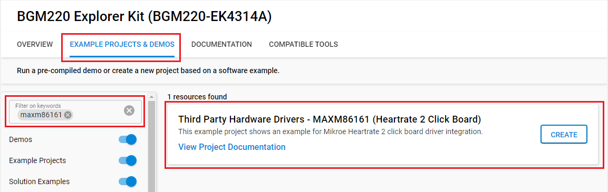
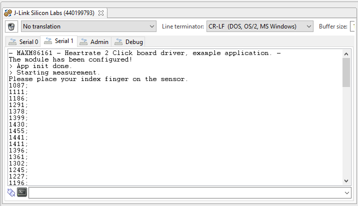

# Heart Rate 2 Click #

## Summary ##

This project shows the implementation of Bio-sensor driver using Maxm86161 from Maxim Integrated with BGM220 Explorer Kit based on I2C communication.

Heart Rate 2 Click board™ is an add-on board based on MAXM86161 integrated optical module from Analog Devices (AD). It is a complete, integrated, optical data acquisition system, ideal for optical pulse-oximetry (SpO2) and heart-rate (HR) detection applications. It can be implemented in various wearable health-related devices, like optimized for in-ear applications, or miniature package for mobile applications.

## Required Hardware ##

- [**BGM220-EK4314A** BGM220 Bluetooth Module Explorer Kit (BRD4314A BGM220 Explorer Kit Board)](https://www.silabs.com/development-tools/wireless/bluetooth/bgm220-explorer-kit)

- [**Heart Rate 2 Click** board based on MAXM86161 from Maxim Integrated](https://www.mikroe.com/heart-rate-2-click).

## Hardware Connection ##

The Heart Rate 2 Click board can just be "clicked" into its place. Be sure that the board's 45-degree corner matches the Explorer Kit's 45-degree white line. The board also has the I2C-bus pull-ups. Just be sure that the click board is configured into I2C-mode (the default) by the resistors and not into SPI-mode.

## Setup ##

You can either create a project based on a example project or start with an empty example project.

### Create a project based on a example project ###

1. From the Launcher Home, add the BRD4314A to MyProducts, click on it, and click on the **EXAMPLE PROJECTS & DEMOS** tab. Find the example project with filter maxm86161.

2. Click **Create** button on the **Third Party Hardware Drivers - MAXM86161 (Heartrate 2 Click Board)** example. Example project creation dialog pops up -> click Create and Finish and Project should be generated.

3. Build and flash this example to the board.

### Start with an empty example project ###

1. Create an "Empty C Project" for the "BGM220 Explorer Kit Board" using Simplicity Studio v5. Use the default project settings.

2. Copy the file [app.c](https://github.com/SiliconLabs/third_party_hw_drivers_extension/tree/master/app/example/mikroe_heartrate2_maxm86161) (overwriting existing file), into the project root folder.

3. Install the software components:

    - Open the .slcp file in the project.

    - Select the SOFTWARE COMPONENTS tab.

    - Install the following components:

        - [Services] → [Sleep Timer]
        - [Services] → [IO Stream] → [IO Stream: USART] → default instance name: vcom
        - [Application] → [Utility] → [Log]
        - [Third Party Hardware Drivers] → [Sensors] → [MAXM86161 - Heart Rate 2 Click (Mikroe)]

4. Build and flash this example to the board.

**Note:**

- Make sure the SDK extension already be installed. If not please follow [this documentation](https://github.com/SiliconLabs/third_party_hw_drivers_extension/blob/master/README.md).

- SDK Extension must be enabled for the project to install "MAXM86161 - Heart Rate 2 Click (Mikroe)" component. Selecting this component will also include the "I2CSPM" component with default configurated instance: mikroe.

- The example project are built on the BRD4314A board. For another boards, selecting the "MAXM86161 - Heart Rate 2 Click (Mikroe)" component will include the "I2CSPM" component with unconfigured instance: inst0. This instance should be configurated by users.

## How It Works ##

You can launch Console that's integrated into Simplicity Studio or use a third-party terminal tool like TeraTerm to receive the data from the USB. A screenshot of the console output is shown in the figure below.

## Report Bugs & Get Support ##

To report bugs in the Application Examples projects, please create a new "Issue" in the "Issues" section of [third_party_hw_drivers_extension](https://github.com/SiliconLabs/third_party_hw_drivers_extension) repo. Please reference the board, project, and source files associated with the bug, and reference line numbers. If you are proposing a fix, also include information on the proposed fix. Since these examples are provided as-is, there is no guarantee that these examples will be updated to fix these issues.

Questions and comments related to these examples should be made by creating a new "Issue" in the "Issues" section of [third_party_hw_drivers_extension](https://github.com/SiliconLabs/third_party_hw_drivers_extension) repo.
