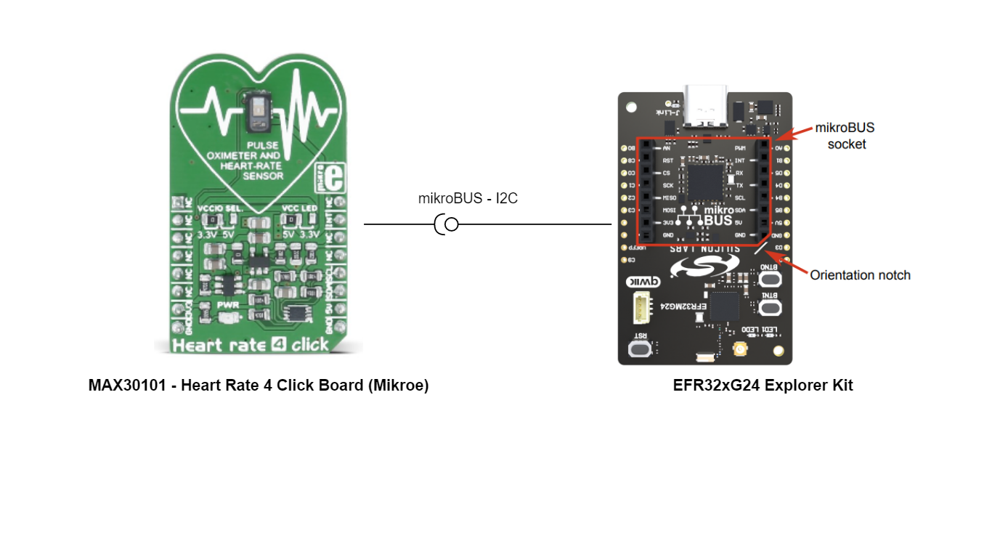
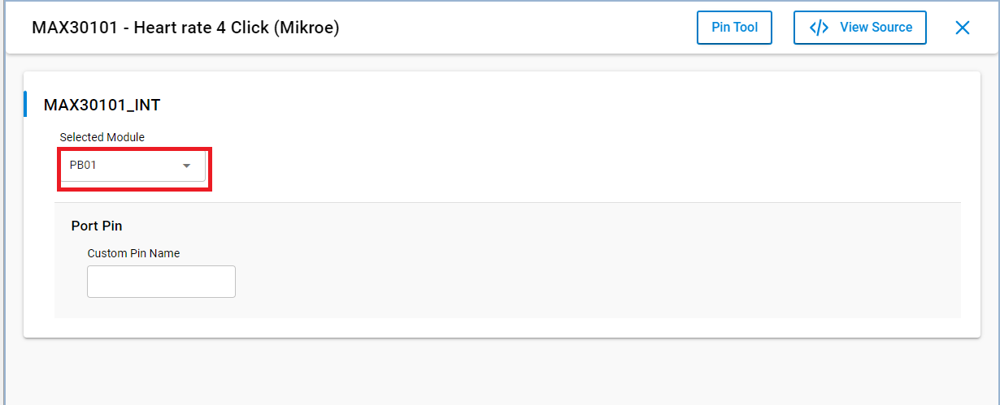
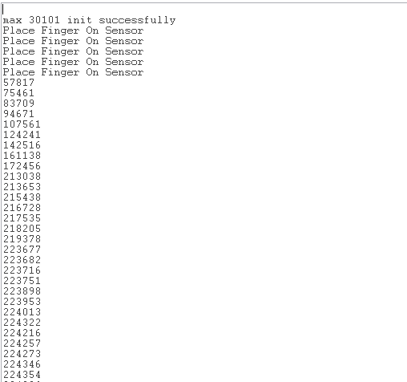

# MAX30101 - Heart Rate 4 Click (Mikroe) #

## Summary ##

This project aims to show the hardware driver that is used to interface with the heart rate sensor via APIs of GSDK.

Heart rate 4 click carries the MAX30101 high-sensitivity pulse oximeter and heart-rate sensor from Analog Devices. The MAX30101 is a pulse oximeter and heart rate sensor that uses a combination of red and infrared LEDs and a photodetector to measure the oxygen saturation of blood and the heart rate of a person. The sensor is non-invasive, and it can be placed on the fingertip, earlobe, or other parts of the body to measure the heart rate and oxygen saturation. The sensor provides a high level of accuracy, and it can be used in a wide range of applications such as medical monitoring, sports and fitness tracking, and sleep analysis. The MAX30101 sensor communicates with other devices using I2C interface and it is also low power consumption making it suitable for portable devices and wearables.

## Required Hardware ##

- [EFR32xG24 Explorer Kit](https://www.silabs.com/development-tools/wireless/efr32xg24-explorer-kit?tab=overview).

- [Heart Rate 4 Click](https://www.mikroe.com/heart-rate-4-click).

## Hardware Connection ##

The Heart Rate 4 Click board support MikroBus, so it can connect easily to EFR32xG24 Explorer Kit's MikroBus header. Be sure that the board's 45-degree corner matches the Explorer Kit's 45-degree white line.

The hardware connection is shown in the image below:

## Setup ##

You can either create a project based on an example project or start with an empty example project.

### Create a project based on an example project ###

1. From the Launcher Home, add the BRD2703A to My Products, click on it, and click on the **EXAMPLE PROJECTS & DEMOS** tab. Find the example project with filter max30101

2. Click **Create** button on the **Third Party Hardware Drivers - MAX30101 - Heart Rate 4 Click (Mikroe)** example. Example project creation dialog pops up -> click Create and Finish and Project should be generated.

3. Build and flash this example to the board.

### Start with an empty example project ###

1. Create an "Empty C Project" for the "EFR32xG24 Explorer Kit" using Simplicity Studio v5. Use the default project settings.

2. Copy the file `app/example/mikroe_heartrate4_max30101/app.c` into the project root folder (overwriting existing file).

3. Install the software components:

    - Open the .slcp file in the project.

    - Select the SOFTWARE COMPONENTS tab.

    - Install the following components:

        - **[Platform] → [Driver] → [GPIOINT]**
        - **[Services] → [IO Stream] → [IO Stream: USART]** → default instance name: vcom
        - **[Services] → [Timers] → [Sleep Timer]**
        - **[Application] → [Utility] → [Log]**
        - **[Third Party Hardware Drivers] → [Sensors] → [MAX30101 - Heart Rate 4 Click (Mikroe)]** -> use default configuration.
        

4. Build and flash this example to the board.

**Note:**

- Make sure that the SDK extension already be installed. If not please follow [this documentation](https://github.com/SiliconLabs/third_party_hw_drivers_extension/blob/master/README.md#how-to-add-to-simplicity-studio-ide).

- SDK Extension must be enabled for the project to install "MAX30101 - Heart Rate 4 Click (Mikroe)" component.

## How It Works ##

You can choose the mode of operation by selecting the corresponding macro MIKROE_HEARTRATE4_MODE_INTERRUPT or MIKROE_HEARTRATE4_MODE_POLLING.

You can launch Console that's integrated into Simplicity Studio or use a third-party terminal tool like TeraTerm to receive the data from the USB. A screenshot of the console output and an actual test image are shown in the figure below.

## Report Bugs & Get Support ##

To report bugs in the Application Examples projects, please create a new "Issue" in the "Issues" section of [third_party_hw_drivers_extension](https://github.com/SiliconLabs/third_party_hw_drivers_extension) repo. Please reference the board, project, and source files associated with the bug, and reference line numbers. If you are proposing a fix, also include information on the proposed fix. Since these examples are provided as-is, there is no guarantee that these examples will be updated to fix these issues.

Questions and comments related to these examples should be made by creating a new "Issue" in the "Issues" section of [third_party_hw_drivers_extension](https://github.com/SiliconLabs/third_party_hw_drivers_extension) repo.
