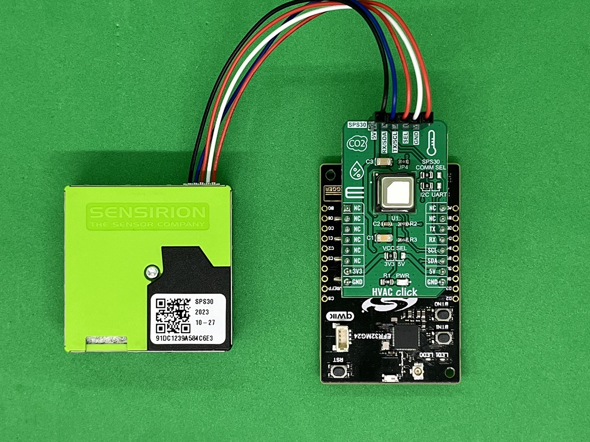
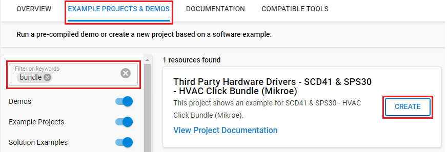
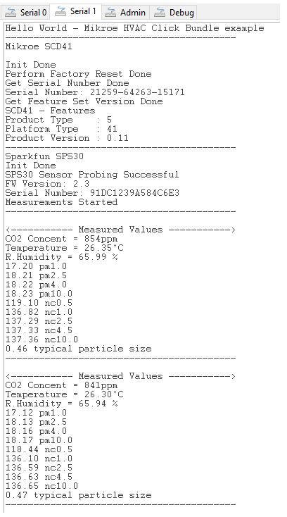

# SCD41 & SPS30 - HVAC Click Bundle (Mikroe) #

## Summary ##

This project aims to show the hardware driver that is used to interface with the HVAC Bunble Click including SCD41 carbon dioxide sensor and SPS30 optical particle sensor via APIs of GSDK.

The HVAC Click contains SCD41 sensor a carbon dioxide sensor built on the photoacoustic sensing principle. On-chip signal compensation is realized with the built-in humidity and temperature sensor. It operates within a specified range from 400 to 5’000 ppm, configurable through the I2C interface with a single shot mode supported. This Click board™ is also suitable for indoor air quality applications using an additional SPS30 that allows smart ventilation systems to regulate ventilation in the most energy-efficient and human-friendly way, maintaining low CO2 concentration for a healthy, productive environment. The Sensirion Particulate Matter Sensor SPS30 is a compact, high-quality, optical particle sensor that uses laser scattering and Sensirion's innovative contamination resistance technology to achieve superior binning and particle measurement. This sensor allows users to measure mass concentration and number of particles of 1 µg/m^3, 2.5 µg/m^3, 4 µg/m^3, and 10 µg/m^3.

## Required Hardware ##

- [**EFR32xG24-EK2703A** EFR32xG24 Explorer Kit](https://www.silabs.com/development-tools/wireless/efr32xg24-explorer-kit?tab=overview).

- [**HVAC Click** board based on SCD41 sensor](https://www.mikroe.com/hvac-click).

- [**SPS30** - Particulate Matter Sensor](https://www.sparkfun.com/products/15103)

**NOTE:**
Tested boards for working with this example:

| Board ID | Description  |
| ---------------------- | ------ |
| BRD2703A | [EFR32xG24 Explorer Kit - XG24-EK2703A](https://www.silabs.com/development-tools/wireless/efr32xg24-explorer-kit?tab=overview)    |
| BRD4314A | [BGM220 Bluetooth Module Explorer Kit - BGM220-EK4314A](https://www.silabs.com/development-tools/wireless/bluetooth/bgm220-explorer-kit?tab=overview)  |
| BRD4108A | [EFR32BG22 Explorer Kit Board](https://www.silabs.com/development-tools/wireless/bluetooth/bg22-explorer-kit?tab=overview)  |

## Hardware Connection ##

The HVAC Click board supports MikroBus, so it can connect easily to the MikroBus header of the EFR32xG24 Explorer Kit. Be sure that the 45-degree corner of the Click Board™ matches the 45-degree white line of the Silicon Labs Explorer Kit. The Click board™ also has extra connector to connect with the Particulate Matter Sensor SPS30.

The hardware connection is shown in the image below:

## Setup ##

You can either create a project based on an example project or start with an empty example project.

### Create a project based on an example project ###

1. From the Launcher Home, add the BRD2703A to My Products, click on it, and click on the **EXAMPLE PROJECTS & DEMOS** tab. Find the example project with the filter "bundle".

2. Click **Create** button on the **Third Party Hardware Drivers - SCD41 & SPS30 - HVAC Click Bundle (Mikroe)** example. Example project creation dialog pops up -> click Create and Finish and Project should be generated.

3. Build and flash this example to the board.

### Start with an empty example project ###

1. Create an "Empty C Project" for the "EFR32xG24 Explorer Kit Board" using Simplicity Studio v5. Use the default project settings.

2. Copy the file 'app/example/mikroe_hvac_bundle_scd41_sps30/app.c' into the project root folder (overwriting the existing file).

3. Install the software components:

    - Open the .slcp file in the project.

    - Select the SOFTWARE COMPONENTS tab.

    - Install the following components:

        - [Services] → [Timers] → [Sleep Timer]
        - [Services] → [IO Stream] → [IO Stream: USART] → default instance name: vcom
        - [Application] → [Utility] → [Log]
        - [Application] → [Utility] → [Assert]
        - [Third Party Hardware Drivers] → [Sensors] → [SCD41 & SPS30 - HVAC Click Bundle (Mikroe)]

4. Install printf float

    - Open Properties of the project.

    - Select C/C++ Build > Settings > Tool Settings >GNU ARM C Linker > General. Check Printf float.

        

5. Build and flash this example to the board.

**Note:**

- Make sure that the SDK extension is already installed. If not, please follow [this documentation](https://github.com/SiliconLabs/third_party_hw_drivers_extension/blob/master/README.md#how-to-add-to-simplicity-studio-ide).

- Third-party Drivers Extension must be enabled for the project to install the "SCD41 & SPS30 - HVAC Click Bundle (Mikroe)" component.

## How It Works ##

After you flash the code to the Explorer Kit and power the connected boards, the application starts running automatically. Use Putty/Tera Term (or another program) to read the values of the serial output. Note that the EFR32xG24 Explorer Kit board uses the default baud rate of 115200.

In the image below you can see an example of how the output is displayed. After initializing, the program will measure the Carbon Dioxide concentration, temperature, relative humidity, and other particle concentrations such as (pm1.0, pm2.5, pm4.0, pm10.0 ...).

There is a periodic timer in the code, which determines the sampling intervals; the default sensor sampling rate is 5000 ms. If you need more frequent sampling, it is possible to change the corresponding timer value of the "app.c" file.

## Report Bugs & Get Support ##

To report bugs in the Application Examples projects, please create a new "Issue" in the "Issues" section of [third_party_hw_drivers_extension](https://github.com/SiliconLabs/third_party_hw_drivers_extension) repo. Please reference the board, project, and source files associated with the bug, and reference line numbers. If you are proposing a fix, also include information on the proposed fix. Since these examples are provided as-is, there is no guarantee that these examples will be updated to fix these issues.

Questions and comments related to these examples should be made by creating a new "Issue" in the "Issues" section of [third_party_hw_drivers_extension](https://github.com/SiliconLabs/third_party_hw_drivers_extension) repo.
