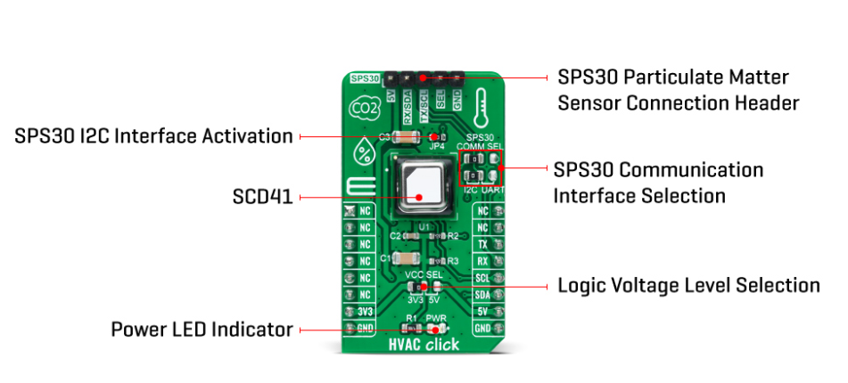
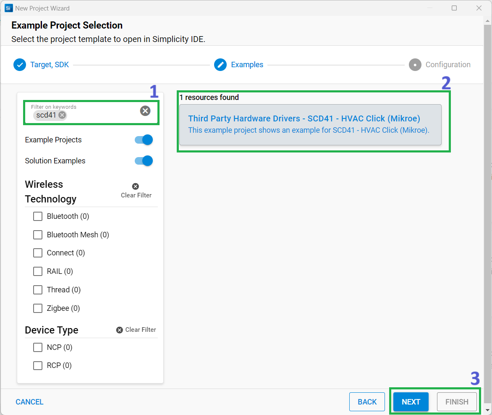
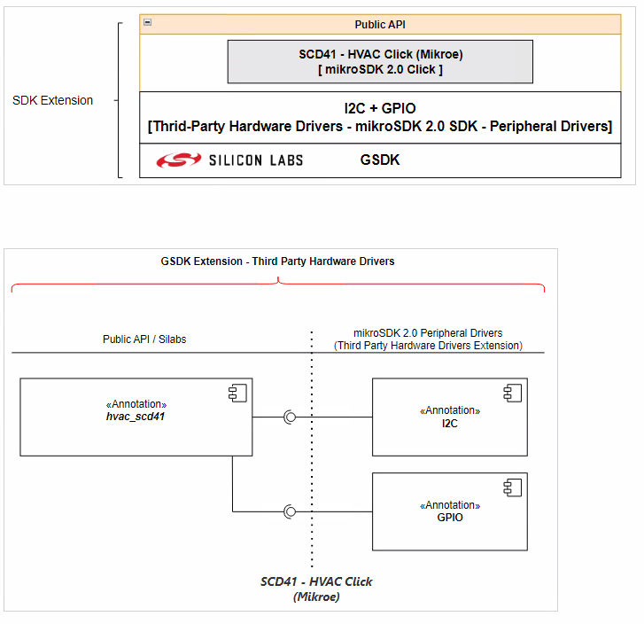
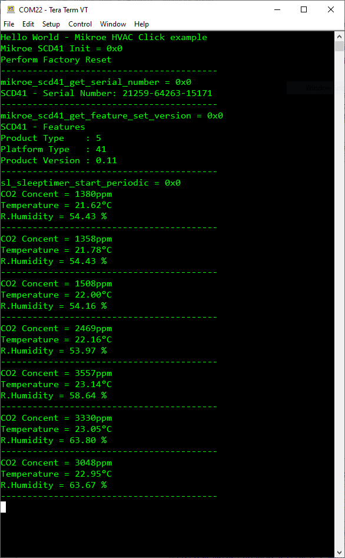

# SCD41 - HVAC Click (Mikroe) #

## Summary ##

This project shows the driver implementing a carbon dioxide sensor using the SCD41 with the Silicon Labs Platform.

The HVAC Click is a compact add-on device containing next generation miniature CO2 sensor of Sensirion. This board features the SCD41, a carbon dioxide sensor built on the photoacoustic sensing principle. On-chip signal compensation is performed using integrated temperature and humidity sensors. It operates within a defined range of 400 to 5000 ppm, configurable via an I2C interface with single shot mode supported. This Click board™ is also suitable for indoor air quality applications using additional SPS30 allowing the smart ventilation system to adjust ventilation in the most energy efficient and people friendly manner, maintaining low CO2 concentration for a healthy, productive environment.

## Required Hardware ##

- [**EFR32xG24-EK2703A** EFR32xG24 Explorer Kit](https://www.silabs.com/development-tools/wireless/efr32xg24-explorer-kit?tab=overview).

- [**HVAC Click** board based on SCD41 sensor](https://www.mikroe.com/hvac-click).

**NOTE:**
Tested boards for working with this example:

| Board ID | Description  |
| ---------------------- | ------ |
| BRD2703A | [EFR32xG24 Explorer Kit - XG24-EK2703A](https://www.silabs.com/development-tools/wireless/efr32xg24-explorer-kit?tab=overview)    |
| BRD4314A | [BGM220 Bluetooth Module Explorer Kit - BGM220-EK4314A](https://www.silabs.com/development-tools/wireless/bluetooth/bgm220-explorer-kit?tab=overview)  |
| BRD4108A | [EFR32BG22 Explorer Kit Board](https://www.silabs.com/development-tools/wireless/bluetooth/bg22-explorer-kit?tab=overview)  |

## Hardware Connection ##

The HVAC Click board supports MikroBus, so it can connect easily to the MikroBus header of the EFR32xG24 Explorer Kit. Be sure that the 45-degree corner of the Click Board™ matches the 45-degree white line of the Silicon Labs Explorer Kit.

The hardware connection is shown in the image below:

## Setup ##

You can either create a project based on an example project or start with an empty example project.

### Create a project based on an example project ###

1. From the Launcher Home, add the BRD2703A to My Products, click on it, and click on the **EXAMPLE PROJECTS & DEMOS** tab. Find the example project with the filter "scd41".

2. Click **Create** button on the **Third Party Hardware Drivers - SCD41 - HVAC Click (Mikroe)** example. Example project creation dialog pops up -> click Create and Finish and Project should be generated.

3. Build and flash this example to the board.

### Start with an empty example project ###

1. Create an "Empty C Project" for the "EFR32xG24 Explorer Kit Board" using Simplicity Studio v5. Use the default project settings.

2. Copy the file 'app/example/mikroe_hvac_scd41/app.c' into the project root folder (overwriting the existing file).

3. Install the software components:

    - Open the .slcp file in the project.

    - Select the SOFTWARE COMPONENTS tab.

    - Install the following components:

        - [Services] → [Timers] → [Sleep Timer]
        - [Services] → [IO Stream] → [IO Stream: EUSART] → default instance name: vcom
        - [Application] → [Utility] → [Log]
        - [Third Party Hardware Drivers] → [Sensors] → [SCD41 - HVAC Click (Mikroe)]

4. Build and flash this example to the board.

**Note:**

- Make sure that the SDK extension is already installed. If not, please follow [this documentation](https://github.com/SiliconLabs/third_party_hw_drivers_extension/blob/master/README.md#how-to-add-to-simplicity-studio-ide).

- Third-party Drivers Extension must be enabled for the project to install "SCD41 - HVAC Click (Mikroe)" component.

## How It Works ##

Driver Layer Diagram is shown in the image below:

After you flash the code to the Explorer Kit and power the connected boards, the application starts running automatically. Use Putty/Tera Term (or another program) to read the values of the serial output. Note that the EFR32xG24 Explorer Kit board uses the default baud rate of 115200.

In the image below you can see an example of how the output is displayed. The main program first performs a factory reset of the sensor and reads the serial number and feature set version. The main program continuously activates single shot measurements and receives measured values ​​(CO2 concentration, temperature and relative humidity).

There is a periodic timer in the code, which determines the sampling intervals; the default sensor sampling rate is 5000 ms. If you need more frequent sampling, it is possible to change the corresponding timer value of the "app.c" file.

## Report Bugs & Get Support ##

To report bugs in the Application Examples projects, please create a new "Issue" in the "Issues" section of [third_party_hw_drivers_extension](https://github.com/SiliconLabs/third_party_hw_drivers_extension) repo. Please reference the board, project, and source files associated with the bug, and reference line numbers. If you are proposing a fix, also include information on the proposed fix. Since these examples are provided as-is, there is no guarantee that these examples will be updated to fix these issues.

Questions and comments related to these examples should be made by creating a new "Issue" in the "Issues" section of [third_party_hw_drivers_extension](https://github.com/SiliconLabs/third_party_hw_drivers_extension) repo.
