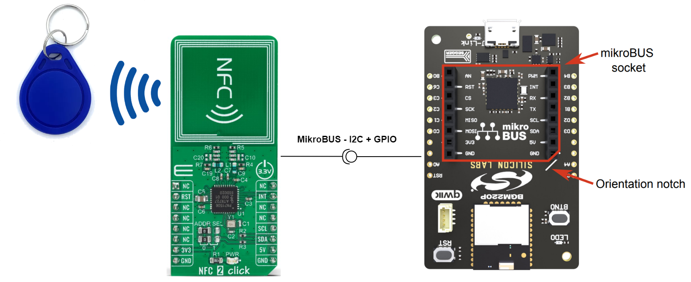
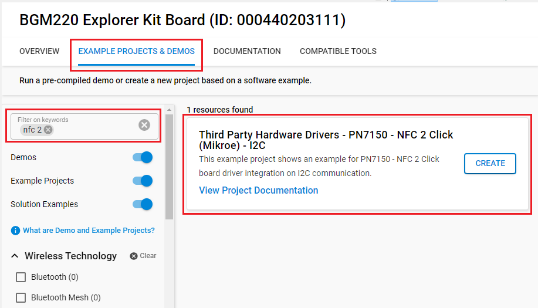
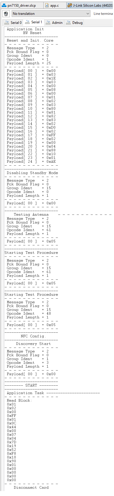

# PN7150 - NFC 2 Click (Mikroe) #

## Summary ##

This example demonstrates the usage of NFC 2 Click board with BGM220P Explorer Kit based on I2C communication.

NFC 2 Click is based on the PN7150, high-performance full NFC solution with integrated firmware and I2C interface designed for contactless communication at 13.56 MHz from NXP.

NFC 2 Click board can be used for the detection of NFC Tag and can be used for rapidly integrating NFC technology in any application.

## Required Hardware ##

- [A BGM220P Explorer Kit board](https://www.silabs.com/development-tools/wireless/bluetooth/bgm220-explorer-kit)

- [An NFC 2 Click](https://www.mikroe.com/nfc-2-click)

- A T2T tag

## Hardware Connection ##

The NFC 2 Click board can just be "clicked" into its place. Be sure that the board's 45-degree corner matches the Explorer Kit's 45-degree white line.

## Setup ##

You can either create a project based on an example project or start with an empty example project.

### Create a project based on an example project ###

1. From the Launcher Home, add the BRD4314A to My Products, click on it, and click on the **EXAMPLE PROJECTS & DEMOS** tab. Find the example project with the filter: *nfc 2*.

2. Click **Create** button on the **Third Party Hardware Drivers - PN7150 - NFC 2 Click (Mikroe) - I2C** example. Example project creation dialog pops up -> click Create and Finish and Project should be generated.

3. Build and flash this example to the board.

### Start with an empty example project ###

1. Create an "Empty C Project" for the "BGM220 Explorer Kit Board" using Simplicity Studio v5. Use the default project settings.

2. Copy the file `app/example/mikroe_nfc2_pn7150/app.c` into the project root folder (overwriting the existing file).

3. Install the software components:

    - Open the .slcp file in the project.

    - Select the SOFTWARE COMPONENTS tab.

    - Install the following components:

        - [Services] → [IO Stream] → [IO Stream: USART] → default instance name: vcom
        - [Application] → [Utility] → [Log]
        - [Third Party Hardware Drivers] → [Wireless Connectivity] → [PN7150 - NFC 2 Click (Mikroe) - I2C] → use default configuration

4. Build and flash this example to the board.

**Note:**

- Make sure that the SDK extension already be installed. If not please follow [this documentation](https://github.com/SiliconLabs/third_party_hw_drivers_extension/blob/master/README.md#how-to-add-to-simplicity-studio-ide).

- Third-party Hardware Drivers Extension must be enabled for the project to install "PN7150 - NFC 2 Click (Mikroe) - I2C" component.

## How It Works ##

The application is composed of three sections :

- Application Initialization: - Initialization driver enables - I2C,
 hw reset, reset and initialize core, disabling standby mode,
 starting test procedure, set configuration and start discovery, also write log.
- Application process: NFC 2 Click board can be used for the detection of NFC tag and displays its value via USART terminal.

## Testing ##

After initialization, the application automatically looks for nearby compatible tags. Place a T2T tag near NFC 2 Click board. After detecting a tag, the application shows logs on the terminal.

You can launch Console that's integrated into Simplicity Studio or use a third-party terminal tool like TeraTerm to receive the data from the USB. A screenshot of the console output is shown in the figure below.

## Report Bugs & Get Support ##

To report bugs in the Application Examples projects, please create a new "Issue" in the "Issues" section of [third_party_hw_drivers_extension](https://github.com/SiliconLabs/third_party_hw_drivers_extension) repo. Please reference the board, project, and source files associated with the bug, and reference line numbers. If you are proposing a fix, also include information on the proposed fix. Since these examples are provided as-is, there is no guarantee that these examples will be updated to fix these issues.

Questions and comments related to these examples should be made by creating a new "Issue" in the "Issues" section of [third_party_hw_drivers_extension](https://github.com/SiliconLabs/third_party_hw_drivers_extension) repo.
