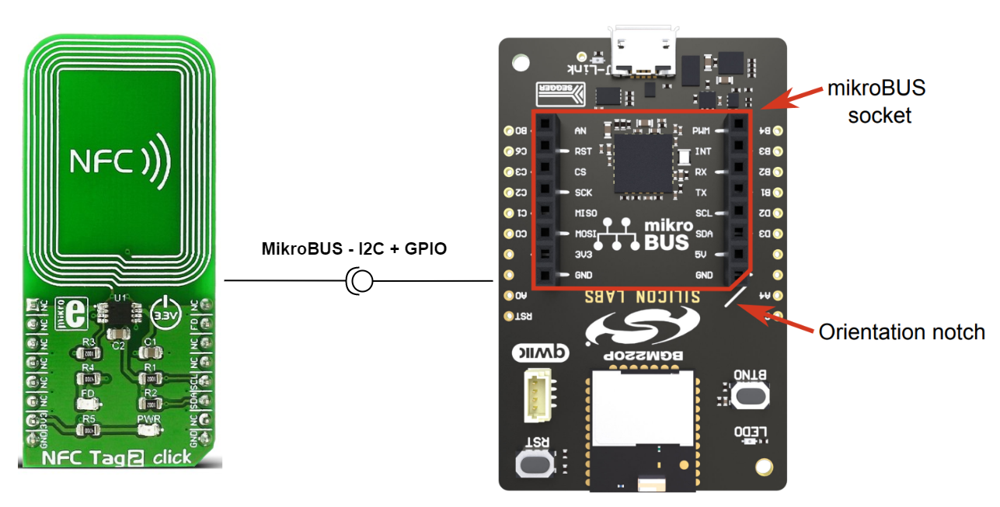
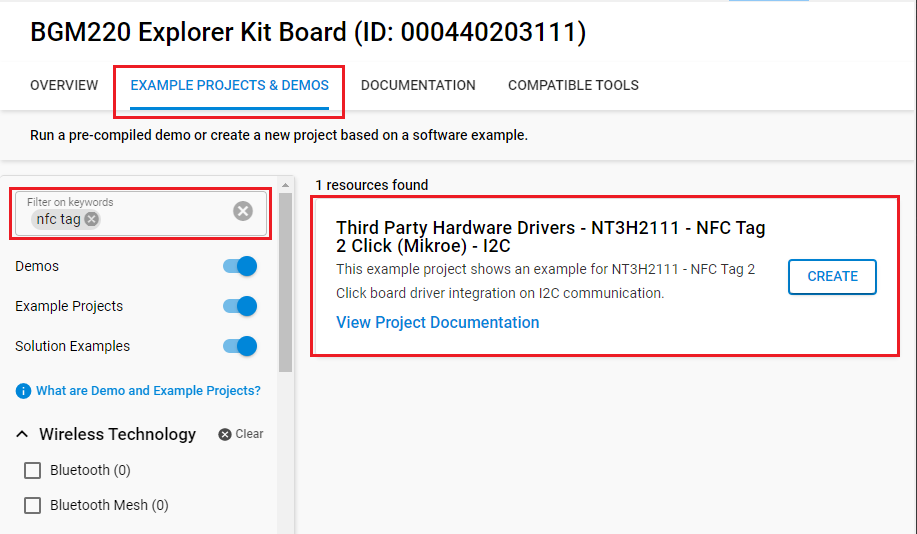
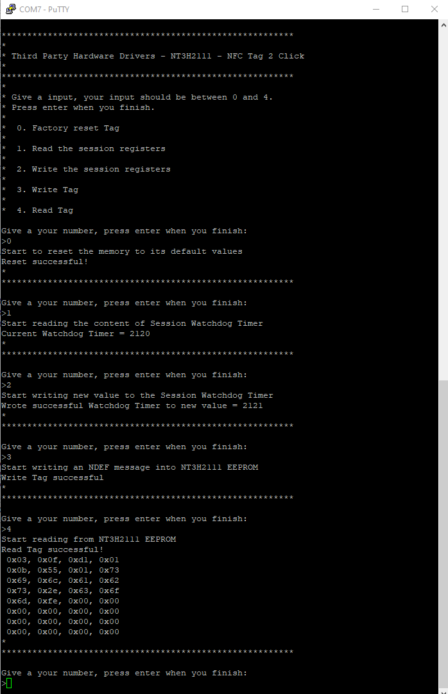
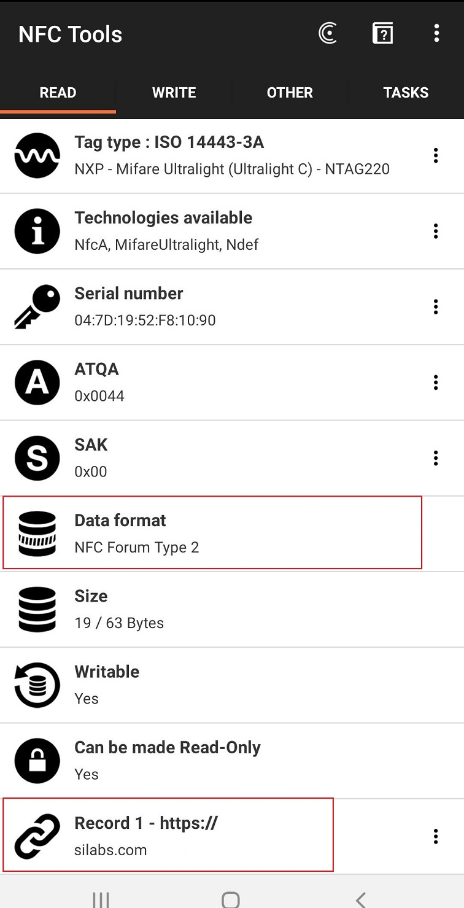

# NT3H2111 - NFC Tag 2 Click #

## Summary ##

This project shows the implementation of an NFC Tag module that carries the NT3H2111 from NXP.

NT3H2111 is an NFC Forum Type 2 Tag (T2T) compliant tag IC with an I2C interface to an MCU host. It is perfectly suited for NFC applications that require energy harvesting NFC Forum Type 2 Tag.

## Required Hardware ##

- [A BGM220P Explorer Kit board](https://www.silabs.com/development-tools/wireless/bluetooth/bgm220-explorer-kit)

- [An NFC Tag 2 Click](https://www.mikroe.com/nfc-tag-2-click)

## Hardware Connection ##

The Accel 5 Click board can just be "clicked" into its place. Be sure that the board's 45-degree corner matches the Explorer Kit's 45-degree white line.



## Setup ##

You can either create a project based on an example project or start with an empty example project.

### Create a project based on an example project ###

1. From the Launcher Home, add the BRD4314A to My Products, click on it, and click on the **EXAMPLE PROJECTS & DEMOS** tab. Find the example project with the filter: *nfc tag*.

2. Click **Create** button on the **Third Party Hardware Drivers - NT3H2111 - NFC Tag 2 Click (Mikroe) - I2C** example. Example project creation dialog pops up -> click Create and Finish and Project should be generated.


3. Build and flash this example to the board.

### Start with an empty example project ###

1. Create an "Empty C Project" for the "BGM220 Explorer Kit Board" using Simplicity Studio v5. Use the default project settings.

2. Copy the file app/example/mikroe_nfctag2_nt3h2111/app.c into the project root folder (overwriting existing file).

3. Install the software components:

    - Open the .slcp file in the project.

    - Select the SOFTWARE COMPONENTS tab.

    - Install the following components:

        - [Services] → [IO Stream] → [IO Stream: USART] → default instance name: vcom
        - [Application] → [Utility] → [Log]
        - [Third Party Hardware Drivers] → [Wireless Connectivity] → [NT3H2111 - NFC Tag 2 Click (Mikroe) - I2C] → use default configuration

4. Build and flash this example to the board.

**Note:**

- Make sure that the SDK extension already be installed. If not please follow [this documentation](https://github.com/SiliconLabs/third_party_hw_drivers_extension/blob/master/README.md).

- Third-party Hardware Drivers Extension must be enabled for the project to install "NT3H2111 - NFC Tag 2 Click (Mikroe) - I2C" component.

## How It Works ##

### API Overview ###

```txt
 ---------------------------------------------
|                 Application                 | 
|---------------------------------------------|
|              mikroe_nt3h2111.c              |
|---------------------------------------------|
|             mikroe_nt3h2111_i2c.c           |
|---------------------------------------------|
|                    emlib                    |
 ---------------------------------------------
```

`mikroe_nt3h2111.c`: implements the top-level APIs for application.

- Initialization API: Initialize I2C communication and FD interrupt.
- memory block R/W APIs: read/write a memory block, given memory address.
- specific register read/write APIs: specific register read/write to get and set settings for NT3H2x11.

`mikroe_nt3h2111_i2c.c`: implements NT3H2x11 specific I2C APIs, called by `mikroe_nt3h2111.c`.

- Initialization API: initialize I2C communication.
- I2C read/write APIs: read/write a memory block via I2C, given memory address.
- I2C read/write register APIs: read/write a register via I2C, given block memory address and register address.

### Testing ###

Application would first call `nt3h2111_init` to initialize needed peripherals(I2C, GPIO FD). Then use register read/write APIs to adjust the settings on the NT3H2111. The example will call any function based on the character it receives over the serial connection.

You can launch Console that's integrated into Simplicity Studio or use a third-party terminal tool like TeraTerm to receive the data from the USB. A screenshot of the console output is shown in the figure below.



**Note**: After an NDEF message is written into NT3H2111 EEPROM, you can either use an NFC-enabled smartphone or use an RFID-reader module to read the data it contains.

A screenshot of an NFC-enabled smartphone that uses the *NFC Tools* application to read data from NT3H2111 as shown below.



## Report Bugs & Get Support ##

To report bugs in the Application Examples projects, please create a new "Issue" in the "Issues" section of [third_party_hw_drivers_extension](https://github.com/SiliconLabs/third_party_hw_drivers_extension) repo. Please reference the board, project, and source files associated with the bug, and reference line numbers. If you are proposing a fix, also include information on the proposed fix. Since these examples are provided as-is, there is no guarantee that these examples will be updated to fix these issues.

Questions and comments related to these examples should be made by creating a new "Issue" in the "Issues" section of [third_party_hw_drivers_extension](https://github.com/SiliconLabs/third_party_hw_drivers_extension) repo.
