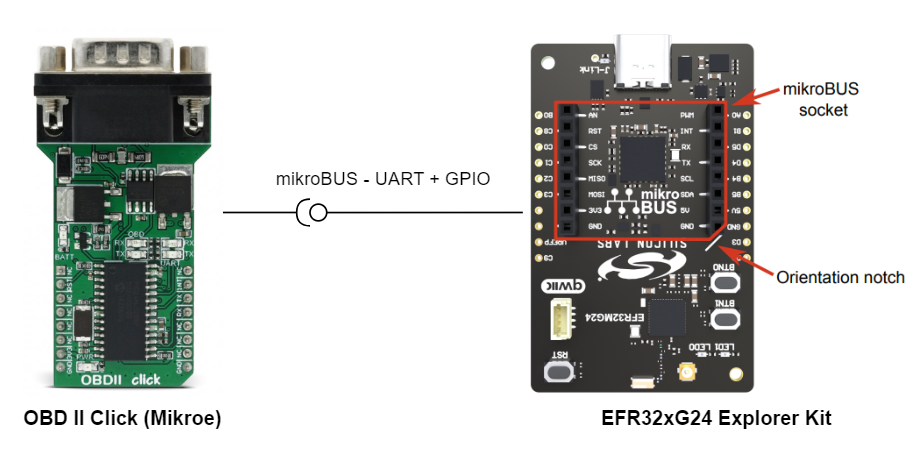
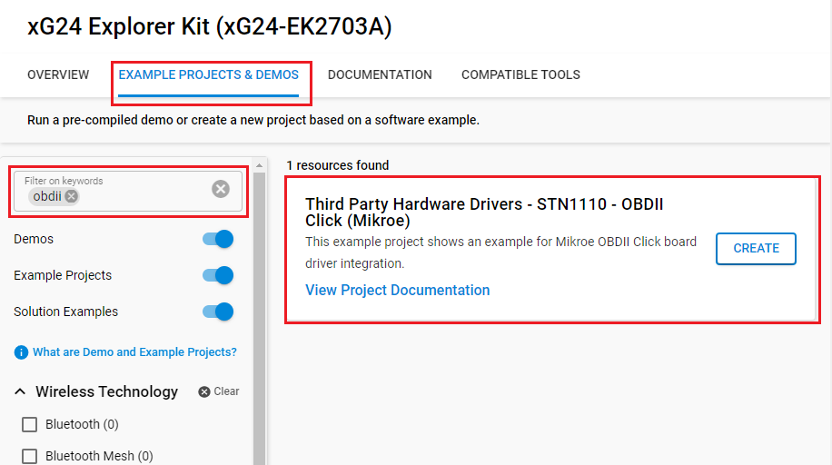
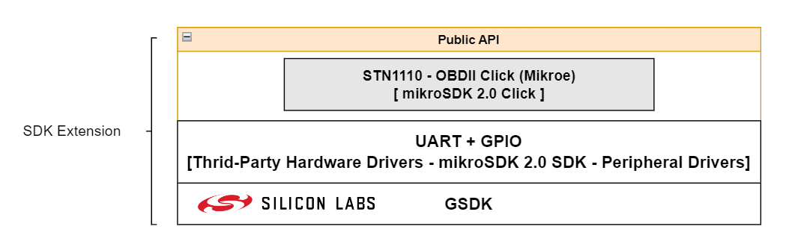
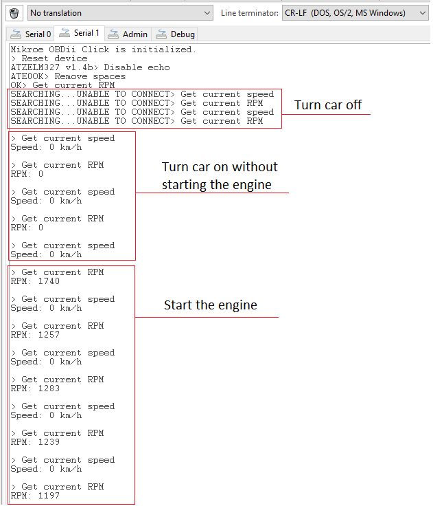

# STN1110 - OBDII Click (Mikroe) #

## Summary ##

This example project shows an example for Mikroe OBDII Click board driver integration with Silicon Labs Platform.

The OBDII Click can be used for the communication with the Electronic Control Unit (ECU) of a vehicle, via several different OBD II diagnostic protocols such as CAN, K LINE, L LINE and J1850. The STN1110 IC is used to process requests sent by the MCU via the UART interface and return back the responses from the ECU network nodes.

## Required Hardware ##

- [**EFR32xG24-EK2703A** EFR32xG24 Explorer Kit](https://www.silabs.com/development-tools/wireless/efr32xg24-explorer-kit?tab=overview).
- [**OBDII Click** board](https://www.mikroe.com/obdii-click).
- [OBDII cable](https://www.mikroe.com/obd-ii-to-db9-cable).

## Hardware Connection ##

The OBDII Click supports MikroBus, so it can connect easily to EFR32xG24 Explorer Kit's MikroBus header. Be sure that the board's 45-degree corner matches the Explorer Kit's 45-degree white line.

The hardware connection is shown in the image below:

## Setup ##

You can either create a project based on an example project or start with an empty example project.

### Create a project based on an example project ###

1. From the Launcher Home, add the BRD2703A to My Products, click on it, and click on the **EXAMPLE PROJECTS & DEMOS** tab. Find the example project with filter **obdii**.
2. Click **Create** button on the **Third Party Hardware Drivers - STN1110 - OBDII Click (Mikroe)** example. Example project creation dialog pops up -> click Create and Finish and Project should be generated.

### Start with an empty example project ###

1. Create an "Empty C Project" for the "EFR32xG24 Explorer Kit Board" using Simplicity Studio v5. Use the default project settings.

2. Copy the file `app/example/mikroe_obdii_stn1110/app.c` into the project root folder (overwriting existing file).

3. Install the software components:

    - Open the .slcp file in the project.

    - Select the SOFTWARE COMPONENTS tab.

    - Install the following components:

        - [Services] → [Timers] → [Sleep Timer]
        - [Services] → [IO Stream] → [IO Stream: EUSART] → default instance name: **vcom**
        - [Services] → [IO Stream] → [IO Stream: USART] → default instance name: **mikroe**
        - [Third Party Hardware Drivers] → [Interface] → [STN1110 - OBDII Click (Mikroe)] → use default configuration

            | Mikroe pin  | BRD2703A pin |
            |:----------|:------------------:|
            | STN1110_RESET | PC8 |
            | STN1110_INT | PB1 |

        - [Application] → [Utility] → [Assert]
        - [Application] → [Utility] → [Log]

4. Build and flash this example to the board.

**Note :**

- Make sure that the SDK extension already be installed. If not please follow [this documentation](https://github.com/SiliconLabs/third_party_hw_drivers_extension/blob/master/README.md#how-to-add-to-simplicity-studio-ide).

- SDK Extension must be enabled for the project to install "STN1110 - OBDII Click (Mikroe)" component.

## How It Works ##

### Driver Layer Diagram ###

### Testing ###

This example demonstrates the use of OBDII click board by reading the engine RPM and vehicle speed and displaying results on the USB UART once per second.

You can launch Console that's integrated into Simplicity Studio or use a third-party terminal tool like TeraTerm to receive the data from the USB. A screenshot of the console output is shown in the figure below.

## Report Bugs & Get Support ##

To report bugs in the Application Examples projects, please create a new "Issue" in the "Issues" section of [third_party_hw_drivers_extension](https://github.com/SiliconLabs/third_party_hw_drivers_extension) repo. Please reference the board, project, and source files associated with the bug, and reference line numbers. If you are proposing a fix, also include information on the proposed fix. Since these examples are provided as-is, there is no guarantee that these examples will be updated to fix these issues.

Questions and comments related to these examples should be made by creating a new "Issue" in the "Issues" section of [third_party_hw_drivers_extension](https://github.com/SiliconLabs/third_party_hw_drivers_extension) repo.
