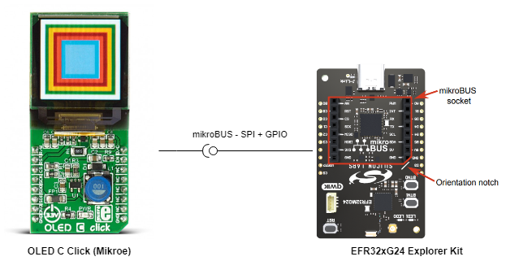
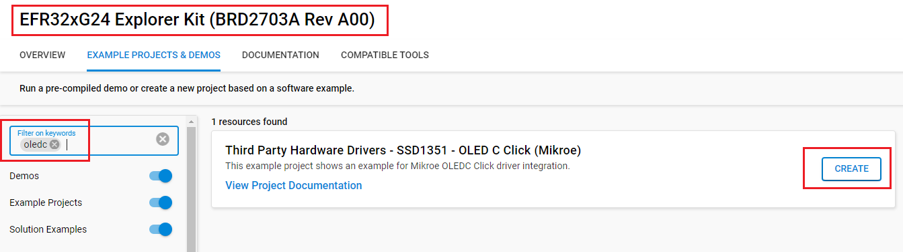

# OLED C Click #

## Summary ##

This project shows the driver implementation of a SPI OLED using the SSD1351 IC with Silicon Labs Platform.

OLED C click is equipped with the 96x96 high-color OLED display. It can display up to 65K/262K different colors and shades on a compact size display, based on the OLED technology. The OLED technology provides a very good brightness-to-contrast ratio, doesn’t require any backlight - since the pixel elements emit light on their own, better angle of viewing - compared to traditional TFT screens, better power consumption, better picture quality, better response times and more. The OLED technology is constantly being perfected and it is slowly taking over the existing liquid crystal technology (TFT).

## Required Hardware ##

**Silabs Development Kits**

- [EFR32xG24 Explorer Kit - XG24-EK2703A](https://www.silabs.com/development-tools/wireless/efr32xg24-explorer-kit?tab=overview)

**External Hardware**

- [OLED C Click](https://www.mikroe.com/oled-c-click)

**NOTE:**
Tested boards for working with this example:

| Board ID | Description  |
| ---------------------- | ------ |
| BRD2703A | [EFR32xG24 Explorer Kit - XG24-EK2703A ](https://www.silabs.com/development-tools/wireless/efr32xg24-explorer-kit?tab=overview)    |
| BRD4314A | [BGM220 Bluetooth Module Explorer Kit - BGM220-EK4314A](https://www.silabs.com/development-tools/wireless/bluetooth/bgm220-explorer-kit?tab=overview)  |
| BRD4108A | [EFR32BG22 Explorer Kit Board](https://www.silabs.com/development-tools/wireless/bluetooth/bg22-explorer-kit?tab=overview)  |

## Hardware Connection ##

The OLEDC Click board support MikroBus, so it can connect easily to EFR32xG24 Explorer Kit MikroBus header. Be sure that the board's 45-degree corner matches the Explorer Kit's 45-degree white line.

The hardware connection is shown in the image below:

## Setup ##

You can either create a project based on an example project or start with an empty example project.

### Create a project based on an example project ###

1. From the Launcher Home, add the BRD2703A  to My Products, click on it, and click on the **EXAMPLE PROJECTS & DEMOS** tab. Find the example project with filter *oledc*.

2. Click **Create** button on the **Third Party Hardware Drivers - SSD1351 - OLED C Click Board (Mikroe)** example. Example project creation dialog pops up -> click Create and Finish and Project should be generated.

3. Build and flash this example to the board.

### Start with an empty example project ###

1. Create an "Empty C Project" for the "EFR32xG24 Explorer Kit" using Simplicity Studio v5. Use the default project settings.

2. Copy the file /app/example/mikroe_oledc_ssd1351/app.c (overwriting existing file), into the project root folder.

3. Install the software components:

    - Open the .slcp file in the project.

    - Select the SOFTWARE COMPONENTS tab.

    - Install the following components:

        - [Services] → [Simple Timer]
        - [Services] → [IO Stream] → [IO Stream: USART] → default instance name: vcom
        - [Application] → [Utility] → [Assert]
        - [Third Party Hardware Drivers] → [Display & LED] → [SSD1351 - OLED C Click (Mikroe) - SPI]
        - [Third Party Hardware Drivers] → [Services] → [GLIB - OLED Graphics Library]
4. Build and flash this example to the board.

**Note:**

- Make sure the SDK extension already be installed. If not please follow [this documentation](https://github.com/SiliconLabs/third_party_hw_drivers_extension/blob/master/README.md).

## How It Works ##

The OLED display will look something like the GIF below.

## Report Bugs & Get Support ##

To report bugs in the Application Examples projects, please create a new "Issue" in the "Issues" section of [third_party_hw_drivers_extension](https://github.com/SiliconLabs/third_party_hw_drivers_extension) repo. Please reference the board, project, and source files associated with the bug, and reference line numbers. If you are proposing a fix, also include information on the proposed fix. Since these examples are provided as-is, there is no guarantee that these examples will be updated to fix these issues.

Questions and comments related to these examples should be made by creating a new "Issue" in the "Issues" section of [third_party_hw_drivers_extension](https://github.com/SiliconLabs/third_party_hw_drivers_extension) repo.

