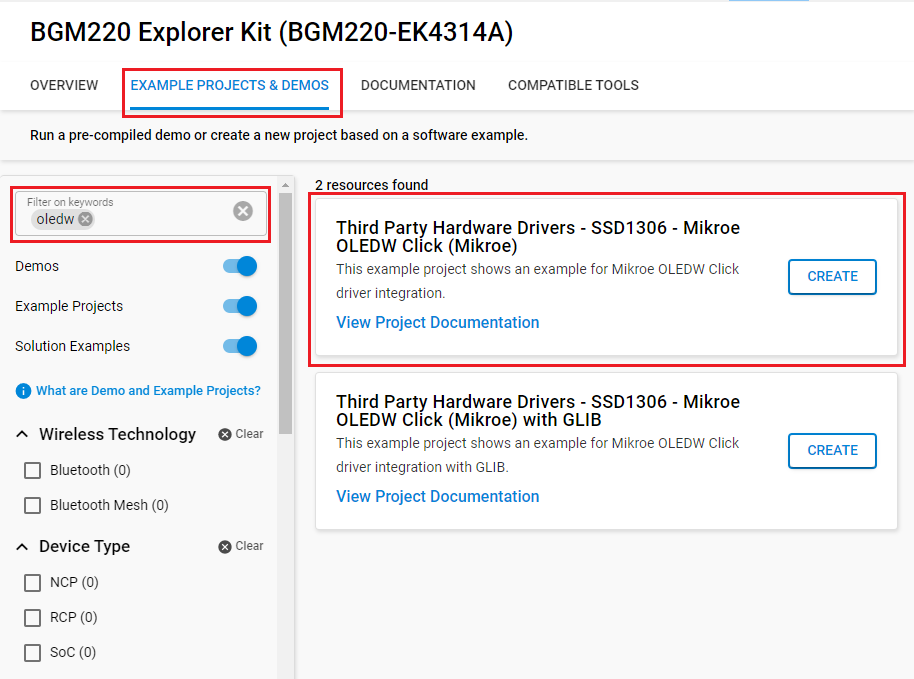

# SSD1306 - Mikroe OLEDW Click (Mikroe) #

## Summary ##

This project shows the driver implementation of a SPI OLED using the SSD1306 IC with Silicon Labs Platform.

MikroE OLED W Click is based on the MI9639BO-W OLED module which has a size of 19.3x7.8 mm and resolution of 96x39 pixels. This white light monochrome, passive matrix OLED display is from Multi-Inno Technology. The MI9639BO-W display features an SSD1306 device that is a 128x64 pixel, dot-matrix OLED/PLED segment/common driver with a controller. It can be used for applications where bright and crisp white text or icons are needed.

## Required Hardware ##

- [**BGM220-EK4314A** BGM220 Bluetooth Module Explorer Kit (BRD4314A BGM220 Explorer Kit Board)](https://www.silabs.com/development-tools/wireless/bluetooth/bgm220-explorer-kit)

- [**OLED W Click** board based on SSD1306 IC](https://www.mikroe.com/oled-w-click).

## Hardware Connection ##

The OLEDW Click board supports MikroBus, so it can connect easily to BGM220P Explorer Kit's MikroBus header. Be sure that the board's 45-degree corner matches the Explorer Kit's 45-degree white line.

The hardware connection is shown in the image below:

## Setup ##

You can either create a project based on an example project or start with an empty example project.

### Create a project based on an example project ###

1. From the Launcher Home, add the BRD4314A to My Products, click on it, and click on the **EXAMPLE PROJECTS & DEMOS** tab. Find the example project with filter oledw.

2. Click **Create** button on the **Third Party Hardware Drivers - SSD1306 - Mikroe OLEDW Click (Mikroe)** example. Example project creation dialog pops up -> click Create and Finish and Project should be generated.

3. Build and flash this example to the board.

### Start with an empty example project ###

1. Create an "Empty C Project" for the "BGM220 Explorer Kit Board" using Simplicity Studio v5. Use the default project settings.

2. Copy the file `app/example/mikroe_oledw_ssd1306/app.c` into the project root folder (overwriting existing file).

3. Install the software components:

    - Open the .slcp file in the project.

    - Select the SOFTWARE COMPONENTS tab.

    - Install the following components:

        - [Services] → [Sleep Timer]
        - [Services] → [IO Stream] → [IO Stream: USART] → default instance name: vcom
        - [Application] → [Utility] → [Assert]
        - [Third Party Hardware Drivers] → [Display & LED] → [SSD1306 - OLED W Click (Mikroe) - SPI] → use default config

4. Build and flash this example to the board.

**Note:**

- Make sure that the SDK extension already be installed. If not please follow [this documentation](https://github.com/SiliconLabs/third_party_hw_drivers_extension/blob/master/README.md#how-to-add-to-simplicity-studio-ide).

- SDK Extension must be enabled for the project to install "SSD1306 - OLED W Click (Mikroe) - SPI" component.

## How It Works ##

The OLED display will look something like the GIF below.

## Report Bugs & Get Support ##

To report bugs in the Application Examples projects, please create a new "Issue" in the "Issues" section of [third_party_hw_drivers_extension](https://github.com/SiliconLabs/third_party_hw_drivers_extension) repo. Please reference the board, project, and source files associated with the bug, and reference line numbers. If you are proposing a fix, also include information on the proposed fix. Since these examples are provided as-is, there is no guarantee that these examples will be updated to fix these issues.

Questions and comments related to these examples should be made by creating a new "Issue" in the "Issues" section of [third_party_hw_drivers_extension](https://github.com/SiliconLabs/third_party_hw_drivers_extension) repo.

