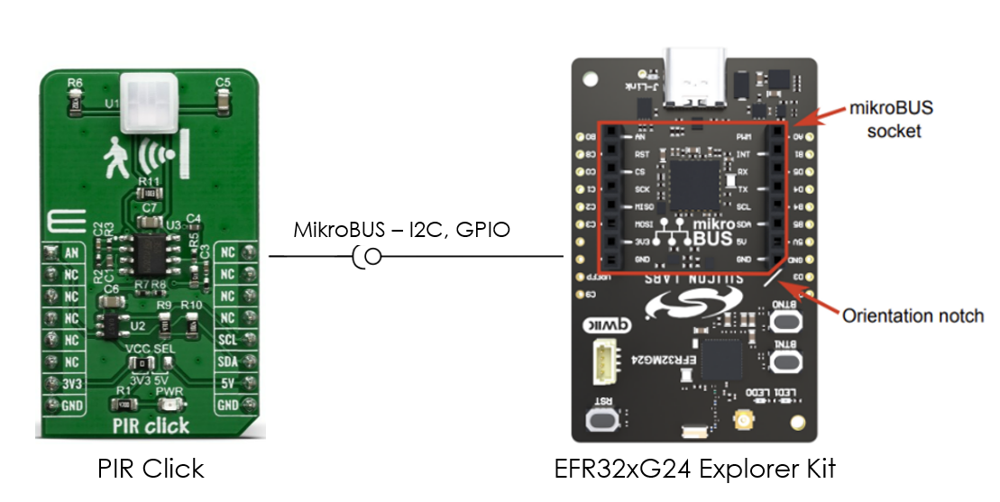
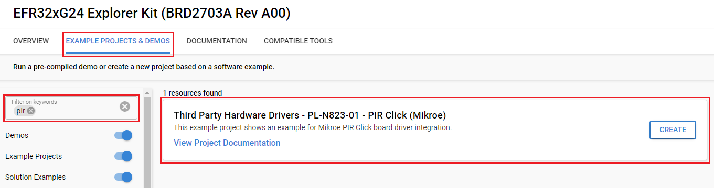
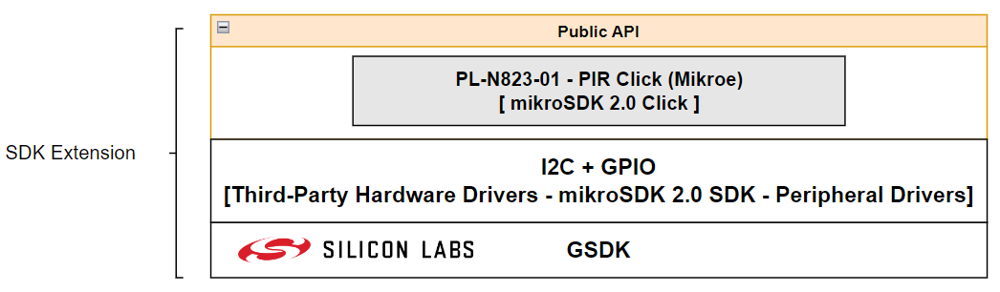
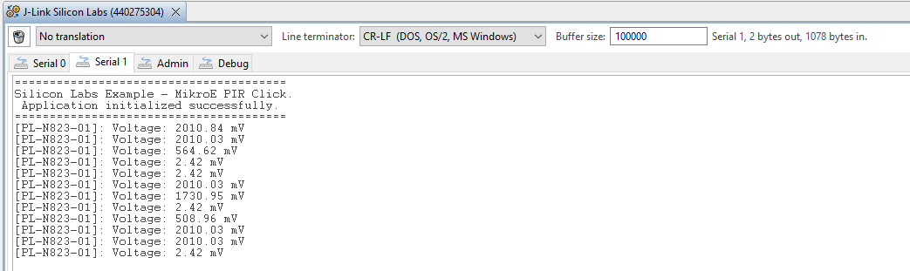

# PL-N823-01 - PIR Click (Mikroe) #

## Summary ##

This example project showcases the integration of the Mikroe PIR Click board driver with the Silicon Labs Platform.

The PIR sensor is a kind of thermal sensor that is able to detect the movement of a heat source. As the most general heat source in indoor environments, humans with motion can be detected by PIR sensors. The sensor can be used for developing various applications, the typical ones including human presence detection sensing for energy-saving functions including contactless switching, home appliances, lighting, air-conditioners, etc.

This example reads a voltage when exposed to infrared radiation by ADC and converts it to a scaled value in millivolts (mV).

## Required Hardware ##

- [EFR32xG24-EK2703A - EFR32xG24 Explorer Kit](https://www.silabs.com/development-tools/wireless/efr32xg24-explorer-kit?tab=overview)

- [Mikroe PIR Click](https://www.mikroe.com/pir-click) board based on a PL-N8230-01 infrared sensor

**NOTE:**
Tested boards for working with this example:

| Board ID | Description  |
| ---------------------- | ------ |
| BRD2703A | [EFR32xG24 Explorer Kit - XG24-EK2703A](https://www.silabs.com/development-tools/wireless/efr32xg24-explorer-kit?tab=overview)    |
| BRD4314A | [BGM220 Bluetooth Module Explorer Kit - BGM220-EK4314A](https://www.silabs.com/development-tools/wireless/bluetooth/bgm220-explorer-kit?tab=overview)  |
| BRD4108A | [EFR32BG22 Explorer Kit Board](https://www.silabs.com/development-tools/wireless/bluetooth/bg22-explorer-kit?tab=overview)  |

## Hardware Connection ##

The PIR Click supports MikroBus; therefore, it can easily connect to the MikroBus header of the EFR32xG24 Explorer Kit. Make sure that the 45-degree corner of the PIR Click matches the 45-degree white line of the Explorer Kit.

The hardware connection is shown in the image below:

## Setup ##

You can either create a project based on an example project or start with an empty example project.

### Create a project based on an example project ###

1. From the Launcher Home, add the BRD2703A to My Products, click on it, and click on the **EXAMPLE PROJECTS & DEMOS** tab. Find the example project with filter **pir**.

2. Click **Create** button on the **Third Party Hardware Drivers - PL-N823-01 - PIR Click (Mikroe)** example. Example project creation dialog pops up -> click Create and Finish and Project should be generated.

### Start with an empty example project ###

1. Create an "Empty C Project" for the "EFR32xG24 Explorer Kit Board" using Simplicity Studio v5. Use the default project settings.

2. Copy the file `app/example/mikroe_pir_pl_n823_01/app.c` into the project root folder (overwriting the existing file).

3. Install the software components:

    - Open the .slcp file in the project.

    - Select the SOFTWARE COMPONENTS tab.

    - Install the following components:

        - [Services] → [Timers] → [Sleep Timer]

        - [Services] → [IO Stream] → [IO Stream: USART] → default instance name: **vcom**

        - [Application] → [Utility] → [Log]

        - [Third Party Hardware Drivers] → [Sensors] → [PL-N823-01 - PIR Click (Mikroe)] → use default configuration

4. Install **printf float**

    - Open Properties of the project.

    - Select C/C++ Build → Settings → Tool Settings → GNU ARM C Linker → General. Check Printf float.
    

5. Build and flash this example to the board.

**Note :**

- Make sure that the SDK Extension has already been installed. If not, follow [this documentation](https://github.com/SiliconLabs/third_party_hw_drivers_extension/blob/master/README.md#how-to-add-to-simplicity-studio-ide).

- SDK Extension must be enabled for the project to install "PL-N823-01 - PIR Click (Mikroe)" component. Selecting this component will also include the "I2CSPM" component.

## How It Works ##

### Driver Layer Diagram ###

### Testing ###

This example reads a voltage when exposed to infrared radiation by ADC and converts it to a scaled value in millivolts (mV). By moving in front of the sensor, you can see how the measured voltage values change on the console screen.

You can launch Console, which is integrated into Simplicity Studio or you can use a third-party terminal tool like Tera Term to receive the data from USB. A screenshot of the console output is shown in the figure below.

## Report Bugs & Get Support ##

To report bugs in the Application Examples projects, please create a new "Issue" in the "Issues" section of [third_party_hw_drivers_extension](https://github.com/SiliconLabs/third_party_hw_drivers_extension) repo. Please reference the board, project, and source files associated with the bug, and reference line numbers. If you are proposing a fix, also include information on the proposed fix. Since these examples are provided as-is, there is no guarantee that these examples will be updated to fix these issues.

Questions and comments related to these examples should be made by creating a new "Issue" in the "Issues" section of [third_party_hw_drivers_extension](https://github.com/SiliconLabs/third_party_hw_drivers_extension) repo.