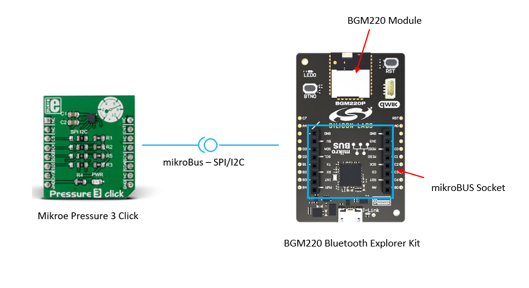
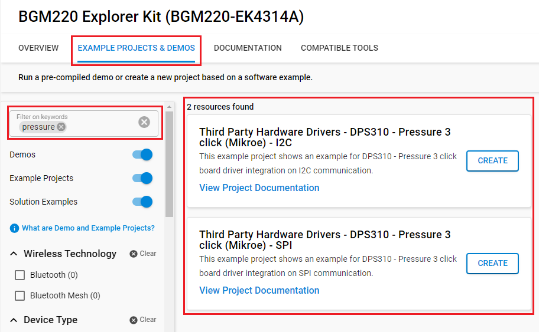
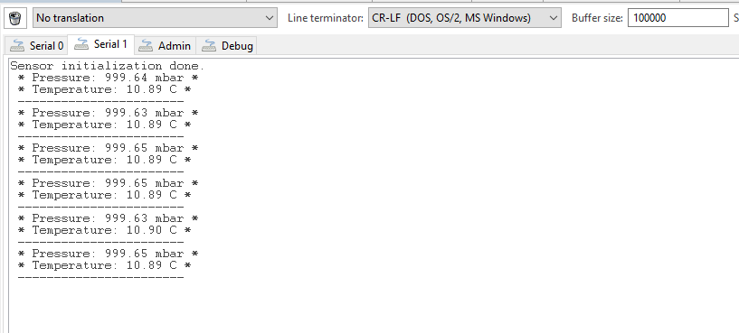

# Pressure 3 Click #

## Summary ##

This project shows the implementation of barometer-sensor driver using Pressure 3 click (DPS310) from Mikroe Integrated with BGM220 Explorer Kit.

## Required Hardware ##

- [**BRD4314A-BGM220** BGM220 Bluetooth Module Explorer Kit (BRD4314A-BGM220 Explorer Kit Board)](https://www.silabs.com/development-tools/wireless/bluetooth/bgm220-explorer-kit?tab=overview)

- [**Pressure 3 Click** board based on DPS310 from Mikroe Integrated](https://www.mikroe.com/pressure-3-click).

**NOTE:**
Tested boards for working with this example:

| Board ID | Description  |
| ---------------------- | ------ |
| BRD2703A | [EFR32xG24 Explorer Kit - XG24-EK2703A ](https://www.silabs.com/development-tools/wireless/efr32xg24-explorer-kit?tab=overview)    |
| BRD4314A | [BGM220 Bluetooth Module Explorer Kit - BGM220-EK4314A](https://www.silabs.com/development-tools/wireless/bluetooth/bgm220-explorer-kit?tab=overview)  |
| BRD4108A | [EFR32BG22 Explorer Kit Board](https://www.silabs.com/development-tools/wireless/bluetooth/bg22-explorer-kit?tab=overview)  |

## Hardware Connection ##

The Pressure 3 Click board can just be "clicked" into its place. Be sure that the board's 45-degree corner matches the Explorer Kit's 45-degree white line.

The hardware connection is shown in the image below:

## Setup ##

You can either create a project based on an example project or start with an empty example project.

### Create a project based on an example project ###

1. From the Launcher Home, add the BRD2703A to MyProducts, click on it, and click on the **EXAMPLE PROJECTS & DEMOS** tab. Find the example project with filter 'pressure'.

2. Click **Create** button on the example:

    - **Third Party Hardware Drivers - DPS310 - Pressure 3 click (Mikroe) - I2C** if using the I2C interface.  

    - **Third Party Hardware Drivers - DPS310 - Pressure 3 click (Mikroe) - SPI** if using the SPI interface.

    Example project creation dialog pops up -> click Create and Finish and Project should be generated.
    

3. Build and flash this example to the board.

### Start with an empty example project ###

1. Create an "Empty C Project" for the "BGM220 Explorer Kit Board" using Simplicity Studio v5. Use the default project settings.

2. Copy the file app/example/mikroe_pressure3_dps310/app.c into the project root folder (overwriting existing file).

3. Install the software components:

    - Open the .slcp file in the project.

    - Select the SOFTWARE COMPONENTS tab.

    - Install the following components:

        - [Services] → [Sleep Timer]
        - [Services] → [IO Stream] → [IO Stream: USART] → default instance name: vcom
        - [Application] → [Utility] → [Log]
        - If using the SPI interface: 
            - [Third Party Hardware Drivers] → [Sensors] → [DPS310 - Mikroe Pressure 3 Click (SPI)]
            - [Platform] → [Driver] → [SPI] → [SPIDRV] → [mikroe]: change the configuration for [SPI master chip select (CS) control scheme] to "CS controlled by the application" 
        - If using the I2C interface: [Third Party Hardware Drivers] → [Sensors] → [DPS310 - Mikroe Pressure 3 Click (I2C)]

4. Install printf float

    - Open Properties of the project.

    - Select C/C++ Build → Settings → Tool Settings → GNU ARM C Linker → General. Check Printf float.

      

5. Build and flash this example to the board.

**Note:**

- Make sure the SDK extension already be installed. If not please follow [this documentation](https://github.com/SiliconLabs/third_party_hw_drivers_extension/blob/master/README.md).

## How It Works ##

You can launch Console that's integrated into Simplicity Studio or use a third-party terminal tool like TeraTerm to receive the data from the USB. A screenshot of the console output is shown as the figure below.

## Report Bugs & Get Support ##

To report bugs in the Application Examples projects, please create a new "Issue" in the "Issues" section of [third_party_hw_drivers_extension](https://github.com/SiliconLabs/third_party_hw_drivers_extension) repo. Please reference the board, project, and source files associated with the bug, and reference line numbers. If you are proposing a fix, also include information on the proposed fix. Since these examples are provided as-is, there is no guarantee that these examples will be updated to fix these issues.

Questions and comments related to these examples should be made by creating a new "Issue" in the "Issues" section of [third_party_hw_drivers_extension](https://github.com/SiliconLabs/third_party_hw_drivers_extension) repo.
