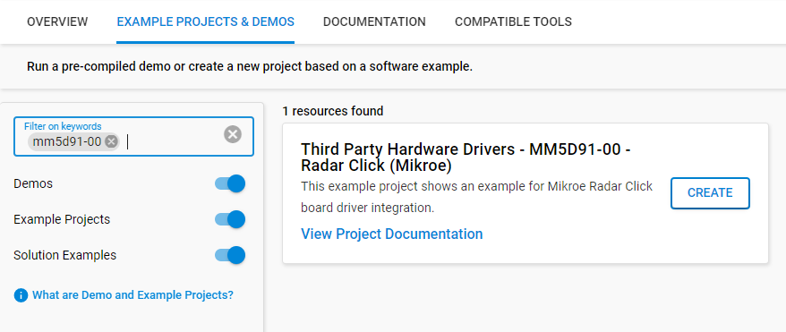
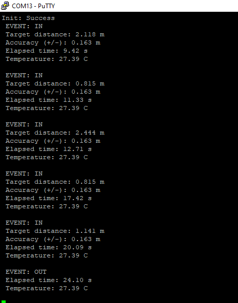

# Radar Click #

## Summary ##

This project shows the implementation of Radar-sensor driver using MM5D91-00
 with EFR32xG24 Explorer Kit based on UART communication.

Radar Click as its foundation uses the MM5D91-00 presence detection sensor module with an integrated mmWave technology from Jorjin Technologies Inc. It is capable of counting the number of people who passed an entrance or entered a room. It simplifies the implementation of mmWave sensors in the band of 61.0 to 61.5 GHz range. The board includes an ARM Cortex-M4F-based processor system with 1Tx 3Rx antenna and an onboard regulator.
The device is beneficial for various presence sensing applications, ranging from offices and homes to commercial buildings and infrastructures.

## Required Hardware ##

- [EFR32xG24 Explorer Kit (BRD2703A-EFR32xG24 Explorer Kit Board)](https://www.silabs.com/development-tools/wireless/efr32xg24-explorer-kit?tab=overview)

- [Radar Click board based on MM5D91-00 sensors](https://www.mikroe.com/radar-click).

## Hardware Connection ##

The Radar Click board can just be "clicked" into its place. Be sure that the board's 45-degree corner matches the Explorer Kit's 45-degree white line. The board also has the UART-bus.

## Setup ##

You can either create a project based on a example project or start with an empty example project.

### Create a project based on a example project ###

1. From the Launcher Home, add the BRD2703A to MyProducts, click on it, and click on the **EXAMPLE PROJECTS & DEMOS** tab. Find the example project with filter "MM5D91-00".

2. Click **Create** button on the **Third Party Hardware Drivers - MM5D91-00 - Radar Click (Mikroe)** example. Example project creation dialog pops up -> click Create and Finish and Project should be generated.

3. Build and flash this example to the board.

### Start with an empty example project ###

1. Create an "Empty C Project" for the "EFR32xG24 Explorer Kit Board" using Simplicity Studio v5. Use the default project settings.

2. Copy the file [app.c](https://github.com/SiliconLabs/third_party_hw_drivers_extension/blob/master/app/example/mikroe_radar_mm5d91_00/app.c) (overwriting existing file), into the project root folder.

3. Install the software components:

    - Open the .slcp file in the project.

    - Select the SOFTWARE COMPONENTS tab.

    - Install the following components:

        - [Services] → [Sleep Timer]
        - [Services] → [IO Stream] → [IO Stream: EUSART] → default instance name: vcom
        - [Services] → [IO Stream] → [IO Stream: USART] → default instance name: mikroe
        - [Application] → [Utility] → [Log]
        - [Third Party Hardware Drivers] → [Sensors] → [MM5D91-00 - Radar Click (Mikroe)]

4. Enable printf float support

    - Open Properties of the project.

    - Select C/C++ Build > Settings > Tool Settings > GNU ARM C Linker > General > Check "Printf float".

        

5. Build and flash this example to the board.

**Note:**

- Make sure the SDK extension already be installed. If not please follow [this documentation](https://github.com/SiliconLabs/third_party_hw_drivers_extension/blob/master/README.md).

- SDK Extension must be enabled for the project to install "MM5D91-00 - Radar Click (Mikroe)" component. Selecting this component will also include the "IO Stream: USART" component with default configurated instance: mikroe.

- The example project are built on the BRD2703A board. For another boards, selecting the "MM5D91-00 - Radar Click (Mikroe)" component will include the "IO Stream: USART" component with unconfigured instance: inst0. This instance should be configurated by users.

## How It Works ##

You can launch Console that's integrated into Simplicity Studio or use a third-party terminal tool like PuTTY to receive the data from the Serial port. A screenshot of the console output is shown in the figure below.

## Report Bugs & Get Support ##

To report bugs in the Application Examples projects, please create a new "Issue" in the "Issues" section of [third_party_hw_drivers_extension](https://github.com/SiliconLabs/third_party_hw_drivers_extension) repo. Please reference the board, project, and source files associated with the bug, and reference line numbers. If you are proposing a fix, also include information on the proposed fix. Since these examples are provided as-is, there is no guarantee that these examples will be updated to fix these issues.

Questions and comments related to these examples should be made by creating a new "Issue" in the "Issues" section of [third_party_hw_drivers_extension](https://github.com/SiliconLabs/third_party_hw_drivers_extension) repo.
