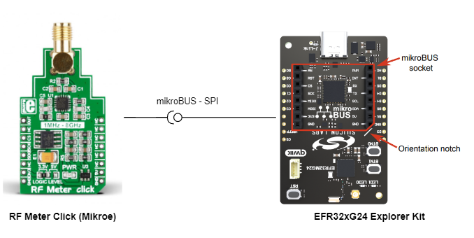
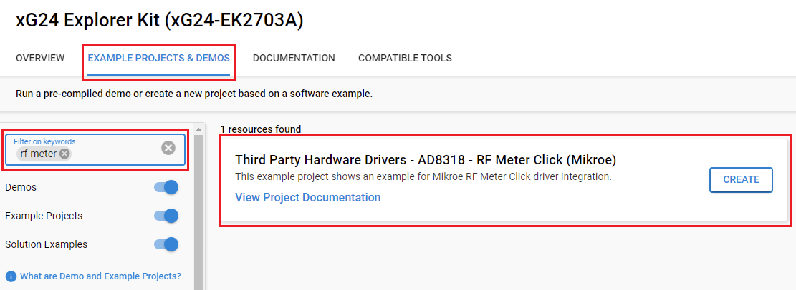

# RF Meter Click #

## Summary ##

This example project shows an example for Mikroe RF Meter Click board driver integration with the Silicon Labs Platform.

RF Meter Click is a compact add-on board that measures radio frequency power. It covers a frequency span from 1MHz up to 8GHz over a 60dB range, approximately. RF Meter Click is based on the AD8318, a logarithmic detector/controller from Analog Devices. It is a demodulating logarithmic amplifier capable of accurately converting an RF input signal to a corresponding decibel-scaled output voltage. The voltage output of the AD8318 goes to the MCP3201, a successive approximation 12-bit analog-to-digital converter with an onboard sample and holds circuitry from Microchip. The RF Meter uses a 3-wire SPI serial interface of the MCP3201 to communicate to the host MCU over the mikroBUS™ socket.

This example can be used for testing equipment that includes RF transmitters or relays. It enables monitoring and measuring frequency levels to ensure proper functioning and leak detection.

## Required Hardware ##

- [**EFR32xG24-EK2703A** EFR32xG24 Explorer Kit](https://www.silabs.com/development-tools/wireless/efr32xg24-explorer-kit?tab=overview).

- [**Mikroe RF Meter Click** board based on AD8318](https://www.mikroe.com/rf-meter-click-click).

**NOTE:**
Tested boards for working with this example:

| Board ID | Description  |
| ---------------------- | ------ |
| BRD2703A | [xG24-EK2703A - EFR32xG24 Explorer Kit ](https://www.silabs.com/development-tools/wireless/efr32xg24-explorer-kit?tab=overview)    |
| BRD4314A | [BGM220-EK4314A - BGM220 Bluetooth Module Explorer Kit](https://www.silabs.com/development-tools/wireless/bluetooth/bgm220-explorer-kit?tab=overview)  |
| BRD4108A | [BG22-EK4108A - EFR32BG22 Explorer Kit Board](https://www.silabs.com/development-tools/wireless/bluetooth/bg22-explorer-kit?tab=overview)  |

## Hardware Connection ##

The RF Meter Click board supports MikroBus, so it can connect easily to EFR32xG24 Explorer Kit's MikroBus header. Be sure that the board's 45-degree corner matches the Explorer Kit's 45-degree white line.

The hardware connection is shown in the image below:

## Setup ##

You can either create a project based on an example project or start with an empty example project.

### Create a project based on an example project ###

1. From the Launcher Home, add the BRD2703A to MyProducts, click on it, and click on the **EXAMPLE PROJECTS & DEMOS** tab. Find the example project with the filter **"rf meter"**.

2. Click **Create** button on the **Third Party Hardware Drivers - AD8318 - RF Meter Click (Mikroe)** example. Example project creation dialog pops up -> click Create and Finish and Project should be generated.

### Start with an empty example project ###

1. Create an "Empty C Project" for the "EFR32xG24 Explorer Kit Board" using Simplicity Studio v5. Use the default project settings.

2. Copy the file [app.c](../../../example/mikroe_rf_meter_ad8318/app.c) (overwriting existing file), into the project root folder.

3. Install the software components:

    - Open the .slcp file in the project.

    - Select the SOFTWARE COMPONENTS tab.

    - Install the following components:

        - [Services] → [IO Stream] → [IO Stream: EUSART] → default instance name: **vcom**

        - [Application] → [Utility] → [Log]

        - [Application] → [Service] → [Simple timer service]

        - [Third Party Hardware Drivers] → [Sensors] → [AD8318 - RF Meter Click (Mikroe)] → use default configuration.

4. Install printf float

    - Open Properties of the Project.

    - Select C/C++ Build → Settings → Tool Settings → GNU ARM C Linker → General. Check Printf float.
    

5. Build and flash this example to the board.

**Note :**

- Make sure the SDK extension already be installed. If not please follow [this documentation](https://github.com/SiliconLabs/third_party_hw_drivers_extension/blob/master/README.md).

- SDK Extension must be enabled for the project to install the " AD8318 - RF Meter Click (Mikroe)" component. Selecting this component will also include the "SPIDRV" component with instance "mikroe".

## How It Works ##

### Driver Layer Diagram ###

### Testing ###

This example uses for measuring radio frequency power, and convert it to decibels per milliwatt value (dBm). This value is used to define signal strength in wires and cables at radio frequencies.

You can launch Console that's integrated into Simplicity Studio or use a third-party terminal tool like TeraTerm to receive the data from the USB. A screenshot of the console output is shown in the figure below.

## Report Bugs & Get Support ##

To report bugs in the Application Examples projects, please create a new "Issue" in the "Issues" section of [third_party_hw_drivers_extension](https://github.com/SiliconLabs/third_party_hw_drivers_extension) repo. Please reference the board, project, and source files associated with the bug, and reference line numbers. If you are proposing a fix, also include information on the proposed fix. Since these examples are provided as-is, there is no guarantee that these examples will be updated to fix these issues.

Questions and comments related to these examples should be made by creating a new "Issue" in the "Issues" section of [third_party_hw_drivers_extension](https://github.com/SiliconLabs/third_party_hw_drivers_extension) repo.