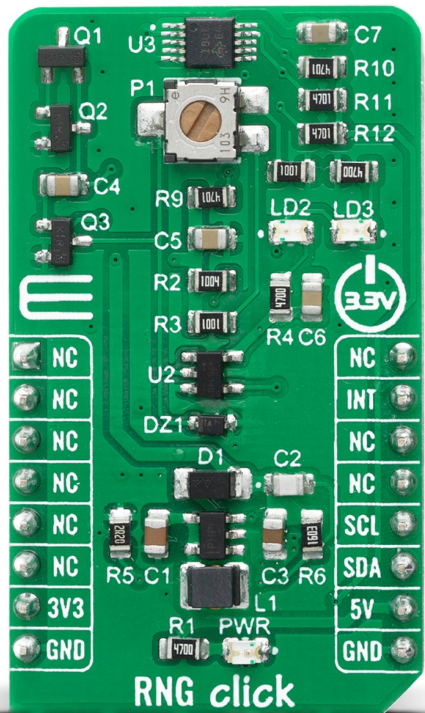
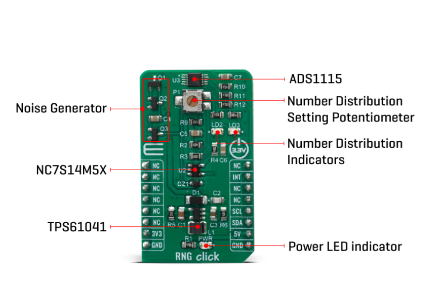
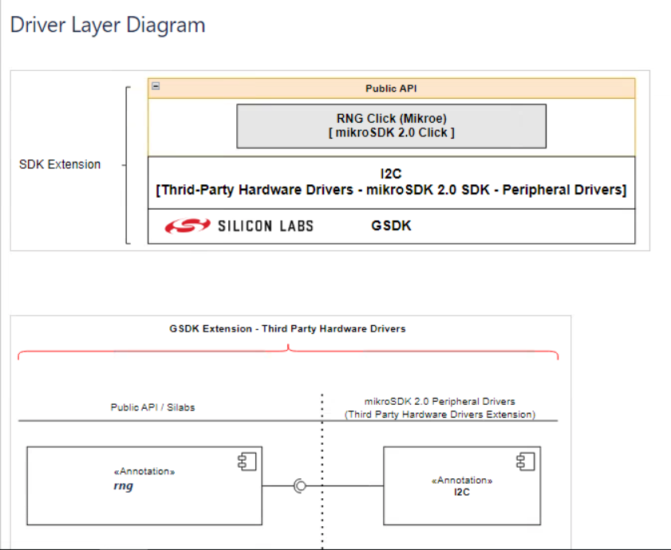
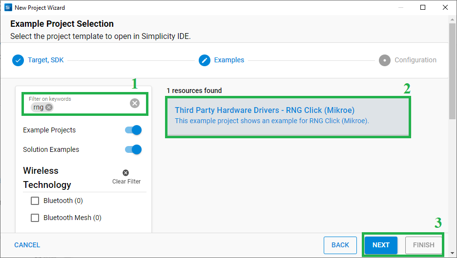
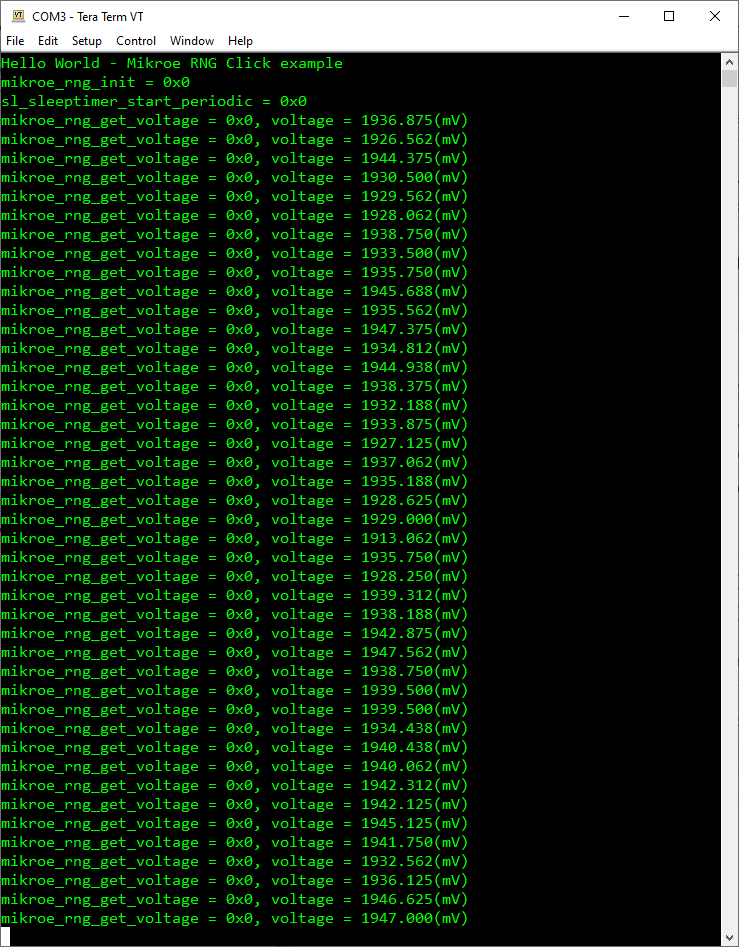

# RNG Click (Mikroe) #

## Summary ##

This project shows the driver implementation of a random number generator (RNG) using the ADS1115 - 16 bit sigma-delta ADC IC with the Silicon Labs Platform.

RNG Click (random number generator) is a device that generates a sequence of numbers or symbols that cannot be reasonably predicted better than by a random chance. This Click board™ is true hardware random-number generator (HRNG), which generate genuinely random numbers. Random number generators have applications in gambling, statistical sampling, computer simulation, cryptography, completely randomized design, and various other areas.

RNG Click is supported by a mikroSDK compliant library, which includes functions that simplify software development. This Click board™ comes as a fully tested product, ready to be used on a system equipped with the mikroBUS™ socket.

In computing, a hardware random number generator (HRNG) or true random number generator (TRNG) is a device that generates random numbers from a physical process, rather than by means of an algorithm. Such devices are often based on microscopic phenomena that generate low-level, statistically random "noise" signals, which is the case in this Click board™. That process is, in theory, completely unpredictable, and the theory's assertions of unpredictability are subject to experimental test. This is in contrast to the paradigm of pseudo-random number generation, which is commonly implemented by the software.

The heart of the RNG click is the avalanche noise generated from an internal diode of the transistor Q1 (BC846B). Avalanche breakdown is a phenomenon that can occur in both insulating and semiconducting materials. It is a form of electric current multiplication that can allow very large currents within materials which are otherwise good insulators. The avalanche process occurs when carriers in the transition region are accelerated by the electric field to energies sufficient to create mobile or free electron-hole pairs via collisions with bound electrons. In order to achieve that, RNG click has also boost converter onboard, which is based on TPS61041, from Texas Instruments, and it creates the +18V power supply for the job.

The noise signal, created by the transistors Q1 and Q2 is then amplified with Q3, voltage-limited using the Zener diode and digitalized using the NC7S14M5X inverter, from Fairchild Semiconductor. After that, the string of random ones and zeros is achieved, which is brought to the ADS1115 - 16 bit sigma-delta ADC, from Texas Instruments. The potentiometer P1 is used to set as near as possible distribution of ones and zeros, which is indicated by the LD2 and LD3 LED diodes. The potentiometer P1 should be set in a way that the LD2 and LD3 diodes illuminate as equally as possible. That way, when the single-shot measurement is performed using the ADS1115, over the I2C protocol, the true, 16-bit random number is obtained.

This Click Board™ uses I2C communication interface. It is designed to be operated only with 3.3V logic levels. A proper logic voltage level conversion should be performed before the Click board™ is used with MCUs with logic levels of 5V.

## Required Hardware ##

- [**XG24-EK2703A** EFR32xG24 Explorer Kit](https://www.silabs.com/development-tools/wireless/efr32xg24-explorer-kit?tab=overview)

- [**RNG Click**](https://www.mikroe.com/rng-click)

**NOTE:**
Tested boards for working with this example:

| Board ID | Description  |
| ---------------------- | ------ |
| BRD2703A | [EFR32xG24 Explorer Kit - XG24-EK2703A](https://www.silabs.com/development-tools/wireless/efr32xg24-explorer-kit?tab=overview)    |
| BRD4314A | [BGM220 Bluetooth Module Explorer Kit - BGM220-EK4314A](https://www.silabs.com/development-tools/wireless/bluetooth/bgm220-explorer-kit?tab=overview)  |
| BRD4108A | [EFR32BG22 Explorer Kit Board](https://www.silabs.com/development-tools/wireless/bluetooth/bg22-explorer-kit?tab=overview)  |

## Hardware Connection ##

The RNG Click board supports MikroBus, so it can connect easily to EFR32xG24 Explorer Kit's MikroBus header. Be sure that the 45-degree corner of the Click Board™ matches the 45-degree white line of the Silicon Labs Explorer Kit.

The hardware connection is shown in the image below:

## Setup ##

You can either create a project based on an example project or start with an empty example project.

### Create a project based on an example project ###

1. From the Launcher Home, add the BRD2703A to My Products, click on it, and click on the **EXAMPLE PROJECTS & DEMOS** tab. Find the example project with the filter "rng".

2. Click **Create** button on the **Third Party Hardware Drivers - RNG Click (Mikroe)** example. Example project creation dialog pops up -> click Create and Finish and Project should be generated.

3. Build and flash this example to the board.

### Start with an empty example project ###

1. Create an "Empty C Project" for the "EFR32xG24 Explorer Kit Board" using Simplicity Studio v5. Use the default project settings.

2. Copy the file 'app/example/mikroe_rng/app.c' into the project root folder (overwriting the existing file).

3. Install the software components:

    - Open the .slcp file in the project.

    - Select the SOFTWARE COMPONENTS tab.

    - Install the following components:

        - [Services] → [Timers] → [Sleep Timer]
        - [Services] → [IO Stream] → [IO Stream: USART] → default instance name: vcom
        - [Application] → [Utility] → [Log]
        - [Third Party Hardware Drivers] → [Miscellaneous] → [RNG Click (Mikroe)]

4. Build and flash this example to the board.

**Note:**

- Make sure that the SDK extension already be installed. If not please follow [this documentation](https://github.com/SiliconLabs/third_party_hw_drivers_extension/blob/master/README.md#how-to-add-to-simplicity-studio-ide).

- Third-party Drivers Extension must be enabled for the project to install "RNG Click (Mikroe)" component.

## How It Works ##

After you flashed the code to the Explorer Kit and powered the connected boards, the application starts running automatically. Use Putty/Tera Term (or another program) to read the values of the serial output. Note that the EFR32xG24 Explorer Kit board uses the default baud rate of 115200.

In the below image, you can see an example of how the output is displayed. The main program reads the raw ADC value from the sensor.

There is a periodic timer in the code, which determines the sampling intervals; the default sensor sampling rate is 500 ms. If you need more frequent sampling, it is possible to change the corresponding timer value of the "app.c" file.

## Report Bugs & Get Support ##

To report bugs in the Application Examples projects, please create a new "Issue" in the "Issues" section of [third_party_hw_drivers_extension](https://github.com/SiliconLabs/third_party_hw_drivers_extension) repo. Please reference the board, project, and source files associated with the bug, and reference line numbers. If you are proposing a fix, also include information on the proposed fix. Since these examples are provided as-is, there is no guarantee that these examples will be updated to fix these issues.

Questions and comments related to these examples should be made by creating a new "Issue" in the "Issues" section of [third_party_hw_drivers_extension](https://github.com/SiliconLabs/third_party_hw_drivers_extension) repo.
