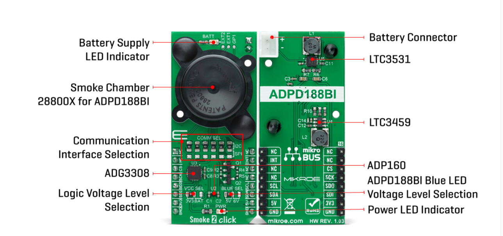
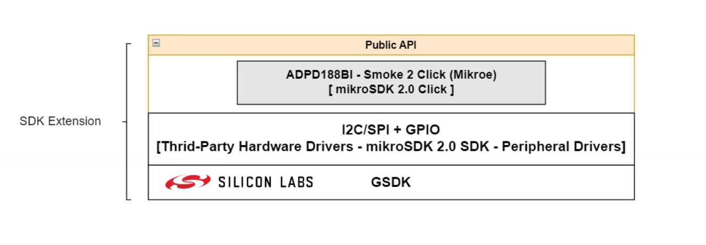
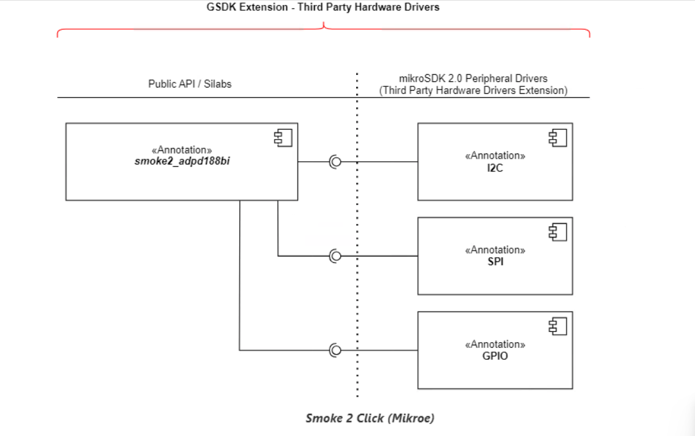
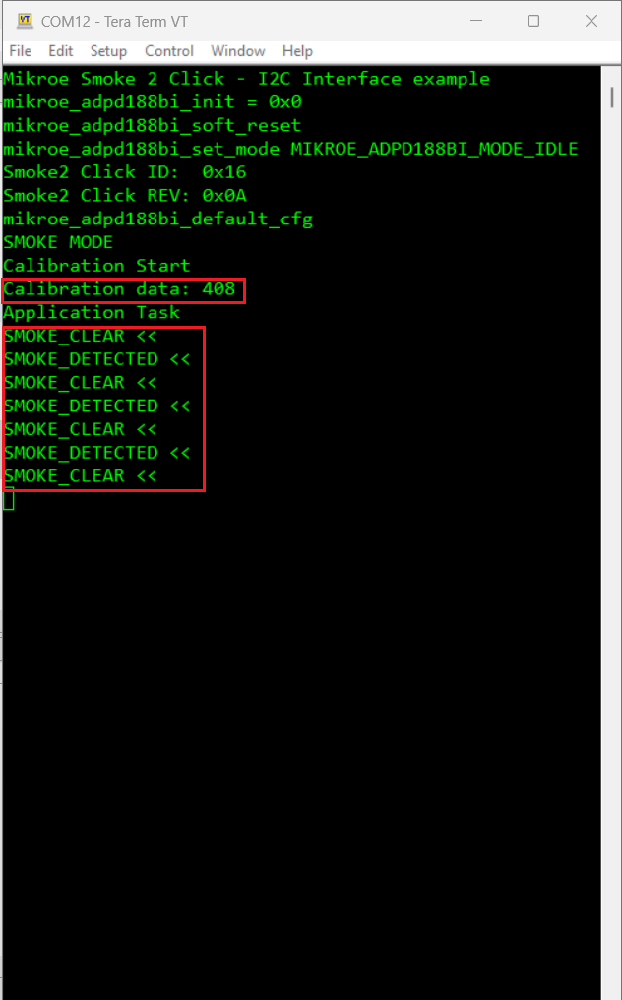

# ADPD188BI Smoke 2 Click (Mikroe) #

## Summary ##

Smoke 2 Click is based on the ADPD188BI, a complete photometric system for smoke detection using optical dual-wavelength technology from Analog Devices. The module combines the dual photodetector with two separate LEDs and a mixed-signal photometric front-end ASIC, and prevents light from going directly from the LED to the photodiode without first entering the smoke detection chamber. The dual-wavelength combination in a scattering measurement, a 470nm blue LED and an 850nm IR LED, allows particle size discrimination between different types of smoke, dust, or steam. The core circuitry stimulates the LEDs and measures the corresponding optical return signals. This integrated solution enables low power and reduces false smoke alarms in harsh environments due to dust, steam, and other nuisance sources.

The smoke chamber 28800X is designed to be used with the ADPD188BI and minimize background response while controlling the environment around the ADPD188BI module by limiting dust accumulation and keeping out insects. The ADPD188BI registers a positive signal due to light scattering from the smoke chamber. Although the smoke chamber minimizes this positive signal, there is a nonzero response in the absence of smoke. When using a smoke chamber, this background response must be accounted for if you want to accurately measure the level of particles present in the smoke chamber.

The ADPD188BI operates in one of the following three modes: Standby, Program, or Normal Sampling Mode. Standby Mode is a power-saving mode in which data collection does not occur, while the Program Mode configures and program registers. During regular operation, the ADPD188BI pulses light and collects data, and in this mode, power consumption depends on the pulse count and data rate. Besides, the ADPD188BI also requires a supply voltage of 1.8V to work regularly. Therefore, a small regulating LDO, the ADP160 from Analog Devices, provides a 1.8V out of 3.3V mikroBUS™ rail, or optionally, from a battery power source.

Smoke 2 Click provides the possibility of using both I2C and SPI serial interfaces, although only one is allowed at any given time in the actual application. All internal registers of the ADPD188BI are accessed through the selected communications interface. I2C supports Fast mode with data transfer of 400 kbps, while SPI interface support frequency up to 10MHz. This selection can be performed by positioning SMD jumpers labeled as COMM SEL to an appropriate position. Note that all the jumpers must be lined to the same side, or else the Click board™ may become unresponsive.

## Required Hardware ##

- [**XG24-EK2703A** EFR32xG24 Explorer Kit](https://www.silabs.com/development-tools/wireless/efr32xg24-explorer-kit?tab=overview)

- [**Smoke 2 Click**](https://www.mikroe.com/smoke-2-click)

**NOTE:**
Tested boards for working with this example:

| Board ID | Description  |
| ---------------------- | ------ |
| BRD2703A | [EFR32xG24 Explorer Kit - XG24-EK2703A](https://www.silabs.com/development-tools/wireless/efr32xg24-explorer-kit?tab=overview)    |
| BRD4314A | [BGM220 Bluetooth Module Explorer Kit - BGM220-EK4314A](https://www.silabs.com/development-tools/wireless/bluetooth/bgm220-explorer-kit?tab=overview)  |
| BRD4108A | [EFR32BG22 Explorer Kit Board](https://www.silabs.com/development-tools/wireless/bluetooth/bg22-explorer-kit?tab=overview)  |

## Hardware Connection ##

The Smoke 2 Click board supports MikroBus, so it can connect easily to MikroBus header of EFR32xG24 Explorer Kit. Be sure that the 45-degree corner of the Click Board™ matches the 45-degree white line of the Silicon Labs Explorer Kit. The hardware connection is shown in the image below:

## Setup ##

You can either create a project based on an example project or start with an empty example project.

### Create a project based on an example project ###

1. From the Launcher Home, add the BRD2703A to My Products, click on it, and click on the **EXAMPLE PROJECTS & DEMOS** tab. Find the example project with the filter "smoke".

2. Click **Create** button on the **Third Party Hardware Drivers - Smoke 2 Click (Mikroe) - I2C** example if user want to uses with I2C interface or **Third Party Hardware Drivers - Smoke 2 Click (Mikroe) - SPI** example if user want to uses with SPI interface. Example project creation dialog pops up -> click Create and Finish and Project should be generated.

3. Build and flash this example to the board.

### Start with an empty example project ###

1. Create an "Empty C Project" for the "EFR32xG24 Explorer Kit Board" using Simplicity Studio v5. Use the default project settings.

2. Copy the file 'app/example/mikroe_smoke2_adpd188bi/app.c' into the project root folder (overwriting the existing file).

3. Install the software components:

    - Open the .slcp file in the project.

    - Select the SOFTWARE COMPONENTS tab.

    - Install the following components:

        - [Services] → [Timers] → [Sleep Timer]
        - [Services] → [IO Stream] → [IO Stream: EUSART] → default instance name: vcom
        - [Application] → [Utility] → [Log]
        - [Third Party Hardware Drivers] → [Sensors] → [ADPD188BI - Smoke 2 Click (Mikroe) - I2C] or [ADPD188BI - Smoke 2 Click (Mikroe) - SPI]

4. Build and flash this example to the board.

**Note:**

- Make sure that the SDK extension already be installed. If not please follow [this documentation](https://github.com/SiliconLabs/third_party_hw_drivers_extension/blob/master/README.md#how-to-add-to-simplicity-studio-ide).

- Third-party Drivers Extension must be enabled for the project to install "ADPD188BI - Smoke 2 Click (Mikroe) - I2C" or "ADPD188BI - Smoke 2 Click (Mikroe) - SPI" component.

## How It Works ##

Driver Layer Diagram is shown in the image below:

After you flashed the code to the Explorer Kit and powered the connected boards, the application starts running automatically. Use Putty/Tera Term (or another program) to read the values of the serial output. Note that the EFR32xG24 Explorer Kit board uses the default baud rate of 115200.

In the below image, you can see an example of how the output is displayed. There are two modes of operation in this example. If the user uses "EXAMPLE_MODE_SMOKE" then after the driver initializes the smoke2 click sensor, it will start calibration process. The programe will continuously compare the current sensor value with the threshold value to provide smoke detection status.

If the user uses "EXAMPLE_MODE_PROXIMITY" then after the driver initializes the smoke2 click sensor, it will continuously get the raw value from channel A, channel B, and FIFO and display it to the log. These raw values ​​will be small when no smoke is detected, and will increase significantly when higher concentrations of smoke are detected.

The user can choose the mode of operation via "EXAMPLE_MODE" macro at the begining of the "app.c".

## Report Bugs & Get Support ##

To report bugs in the Application Examples projects, please create a new "Issue" in the "Issues" section of [third_party_hw_drivers_extension](https://github.com/SiliconLabs/third_party_hw_drivers_extension) repo. Please reference the board, project, and source files associated with the bug, and reference line numbers. If you are proposing a fix, also include information on the proposed fix. Since these examples are provided as-is, there is no guarantee that these examples will be updated to fix these issues.

Questions and comments related to these examples should be made by creating a new "Issue" in the "Issues" section of [third_party_hw_drivers_extension](https://github.com/SiliconLabs/third_party_hw_drivers_extension) repo.
