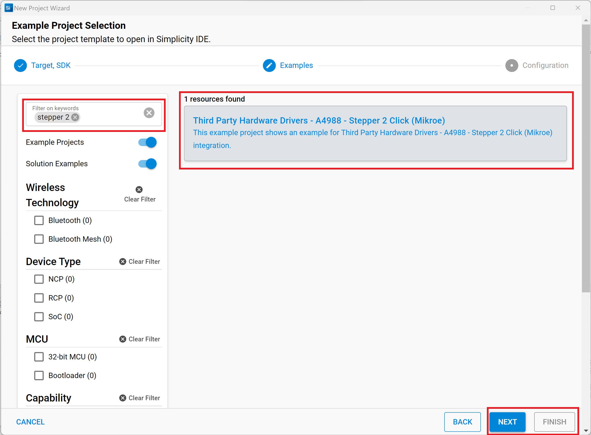

# Stepper 2 Click #

## Summary ##

This project shows the driver implementation of the Stepper 2 Click module, which implements the A4988 IC with the Silicon Labs Platform.

Stepper 2 click is a complete solution for driving bipolar stepper motors with full/half and micro-steps. It features the A4988 IC from Allegro Microsystems with DMOS low RDSON drivers on its outputs, which ensure high efficiency and reliable operation of the internal H-Bridges. This IC has the integrated translator section, used to simplify the control: using simple step control inputs from the host MCU, the stepper motor can be driven in both directions, with the predetermined step sizes. In addition, the output current is regulated allowing for noiseless operation of the stepper motor with no resonance and ringing typically observed at unregulated stepper driver designs.

## Required Hardware ##

- [**BGM220-EK4314A** BGM220 Bluetooth Module Explorer Kit (BRD4314A BGM220 Explorer Kit Board)](https://www.silabs.com/development-tools/wireless/bluetooth/bgm220-explorer-kit)

- [**Stepper 2 Click** board based on A4988 IC](https://www.mikroe.com/stepper-2-click)

**NOTE:**
Tested boards for working with this example:

| Board ID | Description  |
| ---------------------- | ------ |
| BRD4314A | [BGM220 Bluetooth Module Explorer Kit - BGM220-EK4314A](https://www.silabs.com/development-tools/wireless/bluetooth/bgm220-explorer-kit?tab=overview)  |

## Hardware Connection ##

The Stepper 2 Click Board™ supports MikroBus, so it can connect easily to BGM220P Explorer Kit's MikroBus header. Be sure that the 45-degree corner of the Click Board™ matches the 45-degree white line of the Silicon Labs Explorer Kit. In this example, we use a 28BYJ-48 12V stepper motor, so the +12V power supply and GND are connected to the Stepper 2 Click Board™. Also, four control signals for the stepper motor are connected to pins 1A, 1B, 2A, and 2B respectively. The hardware connection is shown in the image below:

## Setup ##

You can either create a project based on an example project or start with an empty example project.

### Create a project based on an example project ###

1. From the Launcher Home, add the BRD4314A to My Products, click on it, and click on the **EXAMPLE PROJECTS & DEMOS** tab. Find the example project with the filter "stepper 2".

2. Click **Create** button on the **Third Party Hardware Drivers - A4988 - Stepper 2 Click (Mikroe)** example. Example project creation dialog pops up -> click Create and Finish and Project should be generated.

3. Build and flash this example to the board.

### Start with an empty example project ###

1. Create an "Empty C Project" for the "BGM220 Explorer Kit Board" using Simplicity Studio v5. Use the default project settings.

2. Copy the file [app.c](https://github.com/SiliconLabs/third_party_hw_drivers_extension/tree/master/app/example/mikroe_stepper2_a4988) (overwriting existing file), into the project root folder.

3. Install the software components:

    - Open the .slcp file in the project.

    - Select the SOFTWARE COMPONENTS tab.

    - Install the following components:

        - [Services] → [Timer] → [Sleep Timer]
        - [Application] → [Utility] → [Log]
        - [Platform] → [Driver] → [PWM] → [mikroe]
        - [Platform] → [Driver] → [Button] → [Simple Button]
        - [Third-Party Hardware Drivers] → [A4988 - Stepper 2 Click (Mikroe)]
4. Build and flash this example to the board.

**Note:**

- Make sure that the Third-party Drivers Extension has already been installed. If not please follow [this documentation](https://github.com/SiliconLabs/third_party_hw_drivers_extension/blob/master/README.md).

- Third-party Drivers Extension must be enabled for the project to install "A4988 - Stepper 2 Click (Mikroe)" component.
- The example project is built on the BRD4314A board. For other boards, selecting the "A4988 - Stepper 2 Click (Mikroe)" component will include the components with unconfigured instances. This instance should be configurated by users.

## How It Works ##

Use Putty/Tera Term or other programs to read the serial output. The BGM220P uses by default a baudrate of 115200. You should expect a similar output to the one below. After the main program is executed, the stepper motor will start to rotate. When the user press button0, it will change the active state.

## Report Bugs & Get Support ##

To report bugs in the Application Examples projects, please create a new "Issue" in the "Issues" section of [third_party_hw_drivers_extension](https://github.com/SiliconLabs/third_party_hw_drivers_extension) repo. Please reference the board, project, and source files associated with the bug, and reference line numbers. If you are proposing a fix, also include information on the proposed fix. Since these examples are provided as-is, there is no guarantee that these examples will be updated to fix these issues.

Questions and comments related to these examples should be made by creating a new "Issue" in the "Issues" section of [third_party_hw_drivers_extension](https://github.com/SiliconLabs/third_party_hw_drivers_extension) repo.
