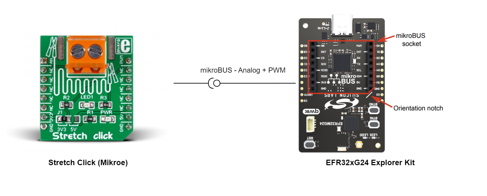
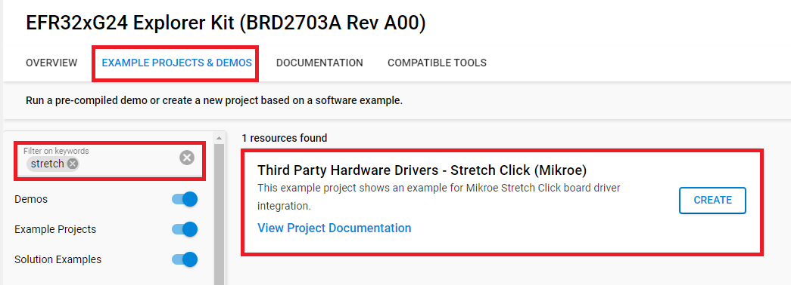
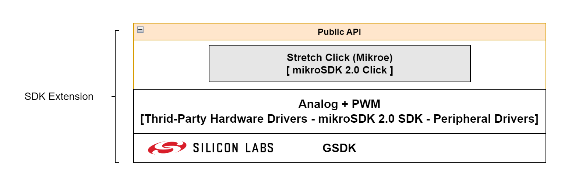
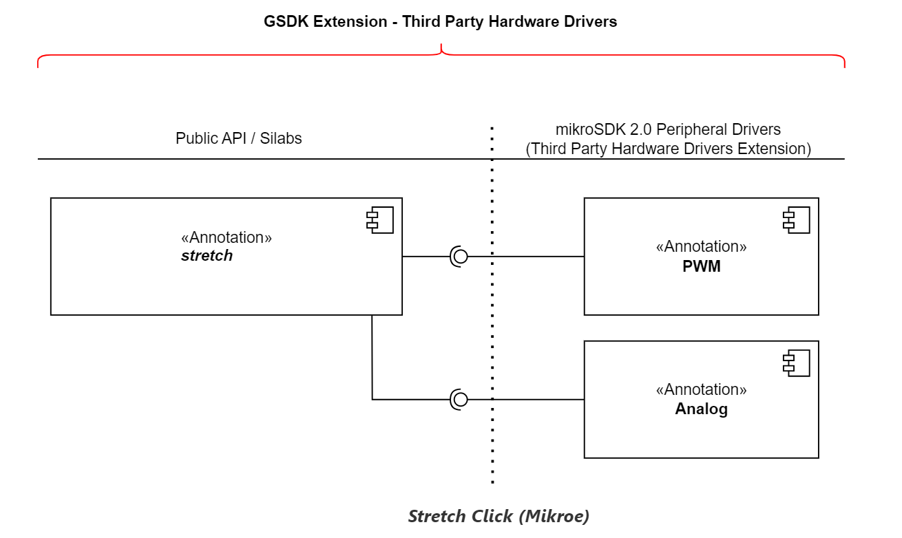
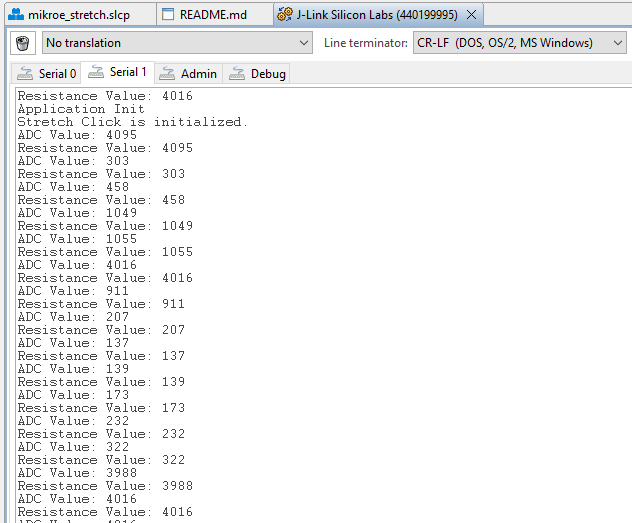

# Stretch Click (Mikroe) #

## Summary ##

This example project shows an example of Mikroe Stretch Click board driver integration with the Silicon Labs Platform.

Stretch Click is a compact add-on board for measuring stretch forces with conductive rubber cords. This board features circuitry that allows measuring the stretch forces of the 2mm diameter conductive rubber cord. This Click board™ comes equipped with the screw terminal, and two copper exposed pads, aside from the screw terminal, in addition to using the cord with alligator clamps.

## Required Hardware ##

- [**EFR32xG24-EK2703A** EFR32xG24 Explorer Kit](https://www.silabs.com/development-tools/wireless/efr32xg24-explorer-kit?tab=overview).

- [Mikroe Stretch Click](https://www.mikroe.com/stretch-click).

**NOTE:**
Tested boards for working with this example:

| Board ID | Description  |
| ---------------------- | ------ |
| BRD2703A | [xG24-EK2703A - EFR32xG24 Explorer Kit](https://www.silabs.com/development-tools/wireless/efr32xg24-explorer-kit?tab=overview)    |
| BRD4314A | [BGM220-EK4314A - BGM220 Bluetooth Module Explorer Kit](https://www.silabs.com/development-tools/wireless/bluetooth/bgm220-explorer-kit?tab=overview)  |
| BRD4108A | [BG22-EK4108A - EFR32BG22 Explorer Kit Board](https://www.silabs.com/development-tools/wireless/bluetooth/bg22-explorer-kit?tab=overview)  |

## Hardware Connection ##

The Stretch Click board supports MikroBus, so it can connect easily to EFR32xG24 Explorer Kit's MikroBus header. Be sure that the board's 45-degree corner matches the Explorer Kit's 45-degree white line.

The hardware connection is shown in the image below:

## Setup ##

You can either create a project based on an example project or start with an empty example project.

1. From the Launcher Home, add the BRD2703A to My Products, click on it, and click on the **EXAMPLE PROJECTS & DEMOS** tab. Find the example project with the filter **"stretch"**.

2. Click **Create** button on the **Third Party Hardware Drivers - Stretch Click (Mikroe)** example. Example project creation dialog pops up -> click Create and Finish and Project should be generated.

### Start with an empty example project ###

1. Create an "Empty C Project" for the "EFR32xG24 Explorer Kit Board" using Simplicity Studio v5. Use the default project settings.

2. Copy the file `app/example/mikroe_stretch/app.c` into the project root folder (overwriting the existing file).

3. Install the software components:

    - Open the .slcp file in the project.

    - Select the SOFTWARE COMPONENTS tab.

    - Install the following components:

        - [Services] → [IO Stream] → [IO Stream: USART] → default instance name: **vcom**
        - [Application] → [Utility] → [Log]
        - [Services] → [Timers] → [Sleep Timer]
        - [Third Party Hardware Drivers] → [Sensors] → [Stretch Click (Mikroe)] → use the default configuration.

4. Build and flash this example to the board.

**Note:**

- Make sure that the SDK extension already be installed. If not please follow [this documentation](https://github.com/SiliconLabs/third_party_hw_drivers_extension/blob/master/README.md#how-to-add-to-simplicity-studio-ide).

- SDK Extension must be enabled for the project to install the "Stretch Click (Mikroe)" component. Selecting this component will also include "IADC" component.

## How It Works ##

### Driver Layer Diagram ###

**Software Component**

### Testing ###

This example reads the ADC value. With ADC value, you can get stretch of the cord.

You can launch Console that's integrated into Simplicity Studio or use a third-party terminal tool like TeraTerm to receive the data from the USB. A screenshot of the console output is shown in the figure below.

This example uses the IADC0 to read the analog signal. After the sensor is initialed successfully, the application reads the analog signal every 500 milliseconds. Right after getting this value, it will be converted to a Decibel value.

To test the functionality, you can change the length of the Rubber Cord which be connected between two Alligator Clamps. The ADC value will be reduce when the length of the cord shorter and vice versa. If the ADC value lower than 500 (you can change this value on file `app/example/mikroe_stretch/app.c`), LED on Stretch click board will be turn on. Then you will see the ADC value change on the console in Simplicity Studio or other third-party terminal tools.

## Report Bugs & Get Support ##

To report bugs in the Application Examples projects, please create a new "Issue" in the "Issues" section of [third_party_hw_drivers_extension](https://github.com/SiliconLabs/third_party_hw_drivers_extension) repo. Please reference the board, project, and source files associated with the bug, and reference line numbers. If you are proposing a fix, also include information on the proposed fix. Since these examples are provided as-is, there is no guarantee that these examples will be updated to fix these issues.

Questions and comments related to these examples should be made by creating a new "Issue" in the "Issues" section of [third_party_hw_drivers_extension](https://github.com/SiliconLabs/third_party_hw_drivers_extension) repo.
