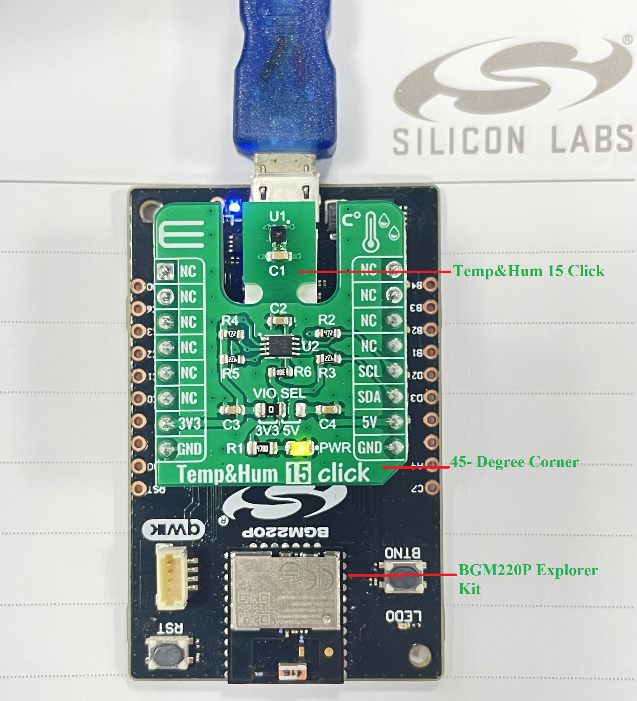
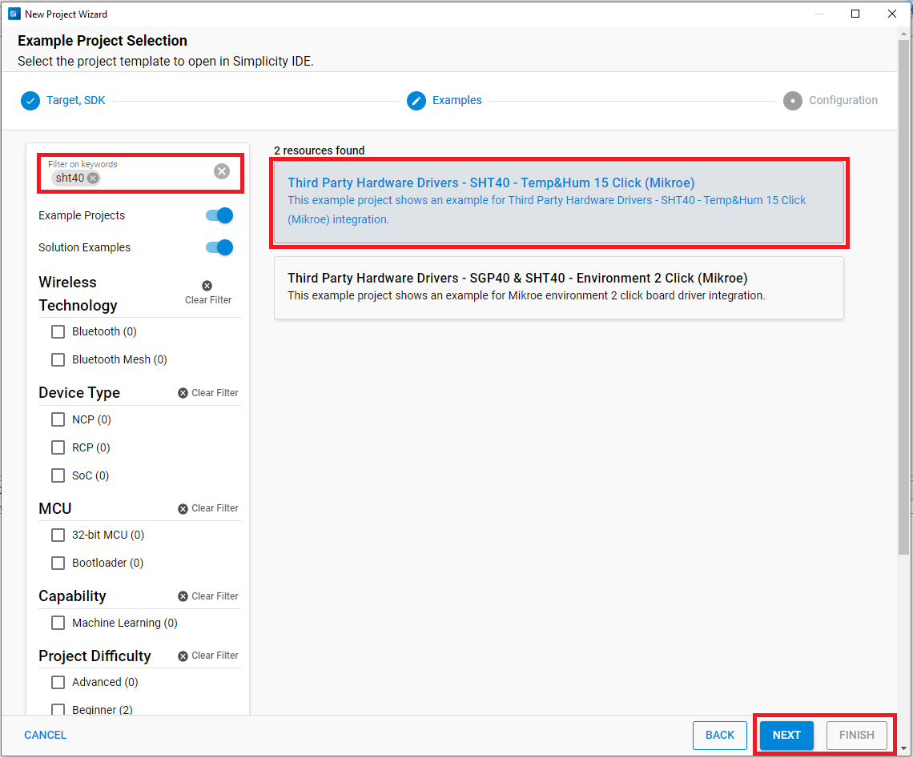

# Temp&Hum 15 Click #

## Summary ##

This project shows the driver implementation of an I2C temperature and humidity sensor using the SHT40 sensor with the Silicon Labs Platform.

Temp-Hum 15 click is a smart temperature and humidity sensing Click Board™, packed with features that allow simple integration into any design. It can measure a wide range of temperature and relative humidity values with high accuracy. This Click Board™ is an ideal solution for the development of a range of different applications, including battery-operated weather stations, thermostats and humidistats, microenvironment centers, respiratory therapy applications, air conditioners, and other similar applications.

## Required Hardware ##

- [**BGM220-EK4314A** BGM220 Bluetooth Module Explorer Kit (BRD4314A BGM220 Explorer Kit Board)](https://www.silabs.com/development-tools/wireless/bluetooth/bgm220-explorer-kit)

- [**Temp&Hum 15 Click** board based on SHT40 sensor](https://www.mikroe.com/temphum-15-click).

**NOTE:**
Tested boards for working with this example:

| Board ID | Description  |
| ---------------------- | ------ |
| BRD4314A | [BGM220 Bluetooth Module Explorer Kit - BGM220-EK4314A](https://www.silabs.com/development-tools/wireless/bluetooth/bgm220-explorer-kit?tab=overview)  |

## Hardware Connection ##

The Temp&Hum 15 Click board support MikroBus, so it can connect easily to BGM220P Explorer Kit's MikroBus header. Be sure that the 45-degree corner of the Click Board™ matches the 45-degree white-line of the Silicon Labs Explorer Kit.

The hardware connection is shown in the image below:

## Setup ##

You can either create a project based on an example project or start with an empty example project.

### Create a project based on an example project ###

1. From the Launcher Home, add the BRD4314A to My Products, click on it, and click on the **EXAMPLE PROJECTS & DEMOS** tab. Find the example project with filter sht40.

2. Click **Create** button on the **Third Party Hardware Drivers - SHT40 - Temp&Hump 15 Click (Mikroe)** example. Example project creation dialog pops up -> click Create and Finish and Project should be generated.

3. Build and flash this example to the board.

### Start with an empty example project ###

1. Create an "Empty C Project" for the "BGM220 Explorer Kit Board" using Simplicity Studio v5. Use the default project settings.

2. Copy the file [app.c](https://github.com/SiliconLabs/third_party_hw_drivers_extension/tree/master/app/example/mikroe_temphum15_sht40) (overwriting existing file), into the project root folder.

3. Install the software components:

    - Open the .slcp file in the project.

    - Select the SOFTWARE COMPONENTS tab.

    - Install the following components:

        - [Services] → [Sleep Timer]
        - [Services] → [IO Stream] → [IO Stream: USART] → default instance name: vcom
        - [Application] → [Utility] → [Log]
        - [Third Party Hardware Drivers] → [Sensors] → [SHT40 - Temp&Hump 15 Click (Mikroe)]

4. Install printf float

    - Open Properties of the Project.

    - Select C/C++ Build > Settings > Tool Settings >GNU ARM C Linker > General. Check Printf float.

        

5. Build and flash this example to the board.

**Note:**

- Make sure that the Third-party Drivers Extension has already been installed. If not please follow [this documentation](https://github.com/SiliconLabs/third_party_hw_drivers_extension/blob/master/README.md).

- Third-party Drivers Extension must be enabled for the project to install "SHT40 - Temp&Hump 15 Click (Mikroe)" component. Selecting this component will also include the "I2CSPM" component with default configurated instance: mikroe.

- The example project is built on the BRD4314A board. For other boards, selecting the "SHT40 - Temp&Hump 15 Click (Mikroe)" component will include the "I2CSPM" component with the unconfigured instance: inst0. This instance should be configurated by users.

## How It Works ##

After you flashed the code to the Explorer Kit and powered the connected boards, the application starts running automatically. Use Putty/Tera Term (or another program) to read the values of the serial output. Note that the BGM220P board uses the default baud rate of 115200.

In the below image, you can see an example of how the output is displayed. The application returns the measured temperature and humidity values automatically.

There is a timer in the code, which determines the sampling intervals; the default sensor sampling rate is 1 second. If you need more frequent sampling, it is possible to change the corresponding timer value of the app.c file.

## Report Bugs & Get Support ##

To report bugs in the Application Examples projects, please create a new "Issue" in the "Issues" section of [third_party_hw_drivers_extension](https://github.com/SiliconLabs/third_party_hw_drivers_extension) repo. Please reference the board, project, and source files associated with the bug, and reference line numbers. If you are proposing a fix, also include information on the proposed fix. Since these examples are provided as-is, there is no guarantee that these examples will be updated to fix these issues.

Questions and comments related to these examples should be made by creating a new "Issue" in the "Issues" section of [third_party_hw_drivers_extension](https://github.com/SiliconLabs/third_party_hw_drivers_extension) repo.
