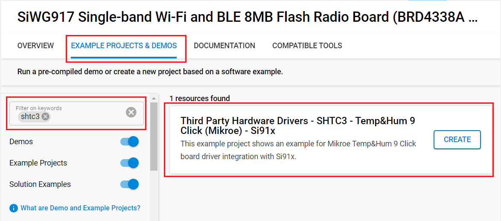

# SHTC3 - Temp&Hum 9 Click (Mikroe) #

## Summary ##

This project shows the driver implementation of an I2C temperature and humidity sensor using the SHTC3 sensor with Silicon Labs Platform.

Temp-Hum 9 click is a smart temperature and humidity sensing click board™, packed with features that allow simple integration into any design. It can measure a wide range of temperature and relative humidity values with high accuracy. This Click board™ is an ideal solution for development of a range of different applications, including battery-operated weather stations, thermostats and humidistats, microenvironment centers, respiratory therapy applications, air conditioners, and other similar applications.

## Required Hardware ##

- [BGM220 Bluetooth Module Explorer Kit](https://www.silabs.com/development-tools/wireless/bluetooth/bgm220-explorer-kit) (BRD4314A)

- Or [SiWx917 Wi-Fi 6 and Bluetooth LE 8 MB Flash SoC Pro Kit](https://www.silabs.com/development-tools/wireless/wi-fi/siwx917-pk6031a-wifi-6-bluetooth-le-soc-pro-kit) (BRD4002 + BRD4338A)

- [**Temp&Hum 9 Click** board based on SHTC3 sensor](https://www.mikroe.com/temphum-9-click).

## Hardware Connection ##

- If the BGM220P Explorer Kit is used:

  The Temp&Hum 9 Click board supports MikroBus, so it can connect easily to BGM220P Explorer Kit's MikroBus header. Be sure that the board's 45-degree corner matches the Explorer Kit's 45-degree white line.

  The hardware connection is shown in the image below:

  

- If the SiWx917 Wi-Fi 6 and Bluetooth LE 8 MB Flash SoC Pro Kit is used:

  | Description  | BRD4338A GPIO | BRD4002 EXP Header | Temp&Hum 9 Click   |
  | -------------| ------------- | ------------------ | ------------------ |
  | I2C_SDA      | ULP_GPIO_6    | EXP_16             | SDA                |
  | I2C_SCL      | ULP_GPIO_7    | EXP_15             | SCL                |

## Setup ##

You can either create a project based on an example project or start with an empty example project.

### Create a project based on an example project ###

1. From the Launcher Home, add your device to My Products, click on it, and click on the **EXAMPLE PROJECTS & DEMOS** tab. Find the example project filtering by *shtc3*.

2. Click **Create** button on the project:

   - **Third Party Hardware Drivers - SHTC3 - Temp&Hump 9 Click (Mikroe)** example if the BGM220P Explorer Kit is used.
   

   - **Third Party Hardware Drivers - SHTC3 - Temp&Hump 9 Click (Mikroe) - Si91x** example if the SiWx917 Wi-Fi 6 and Bluetooth LE 8 MB Flash SoC Pro Kit is used.
   

   Example project creation dialog pops up -> click Create and Finish and Project should be generated.

3. Build and flash this example to the board.

### Start with an empty example project ###

1. Create an "Empty C Project" for the your board using Simplicity Studio v5. Use the default project settings.

2. Copy the file `app/example/mikroe_temphum9_shtc3/app.c` into the project root folder (overwriting existing file).

3. Install the software components:

    - Open the .slcp file in the project.

    - Select the SOFTWARE COMPONENTS tab.

    - Install the following components:

      **If the BGM220P Explorer Kit is used:**

        - [Services] → [Timers] → [Sleep Timer]
        - [Services] → [IO Stream] → [IO Stream: USART] → default instance name: vcom
        - [Application] → [Utility] → [Log]
        - [Third Party Hardware Drivers] → [Sensors] → [SHTC3 - Temp&Hump 9 Click (Mikroe)] → use default configuration

      **If the SiWx917 Wi-Fi 6 and Bluetooth LE 8 MB Flash SoC Pro Kit is used:**

        - [WiSeConnect 3 SDK] → [Device] → [Si91x] → [MCU] → [Service] → [Sleep Timer for Si91x]
        - [WiSeConnect 3 SDK] → [Device] → [Si91x] → [MCU] → [Peripheral] → [I2C] → [i2c2]
        - [Third Party Hardware Drivers] → [Sensors] → [SHTC3 - Temp&Hump 9 Click (Mikroe)] → use default configuration

4. Install printf float

    - Open Properties of the project.

    - Select C/C++ Build > Settings > Tool Settings >GNU ARM C Linker > General. Check Printf float.

        

5. Build and flash this example to the board.

**Note:**

- Make sure that the SDK extension already be installed. If not please follow [this documentation](https://github.com/SiliconLabs/third_party_hw_drivers_extension/blob/master/README.md#how-to-add-to-simplicity-studio-ide).

- SDK Extension must be enabled for the project to install "SHTC3 - Temp&Hump 9 Click (Mikroe)" component.

## How It Works ##

The example performs simultaneous temperature and relative humidity measurements and logs both values via serial output.

You can use Putty or another program to read the serial output. The BGM220 Explorer Kit board uses a baudrate of 115200 by default. You should expect a similar output to the one below.

## Report Bugs & Get Support ##

To report bugs in the Application Examples projects, please create a new "Issue" in the "Issues" section of [third_party_hw_drivers_extension](https://github.com/SiliconLabs/third_party_hw_drivers_extension) repo. Please reference the board, project, and source files associated with the bug, and reference line numbers. If you are proposing a fix, also include information on the proposed fix. Since these examples are provided as-is, there is no guarantee that these examples will be updated to fix these issues.

Questions and comments related to these examples should be made by creating a new "Issue" in the "Issues" section of [third_party_hw_drivers_extension](https://github.com/SiliconLabs/third_party_hw_drivers_extension) repo.
