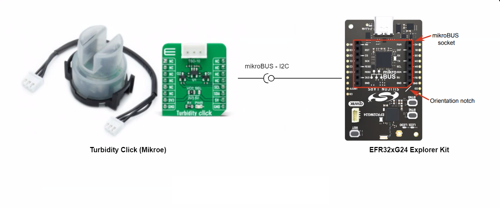
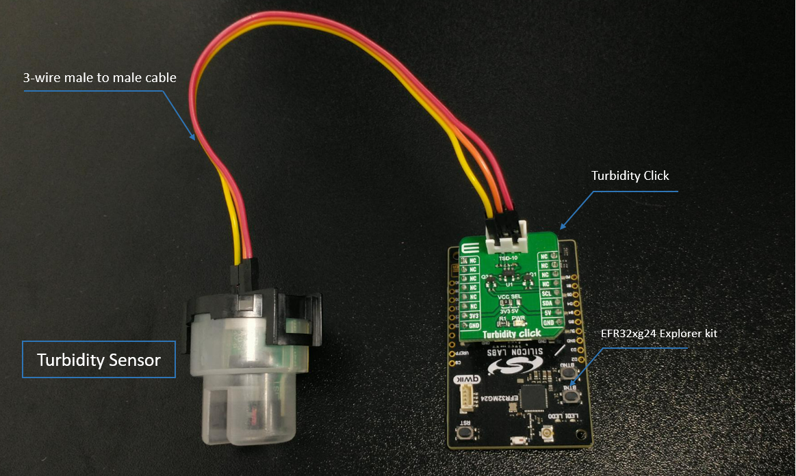
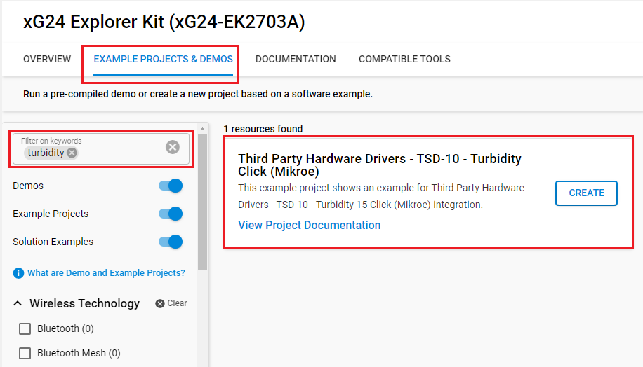
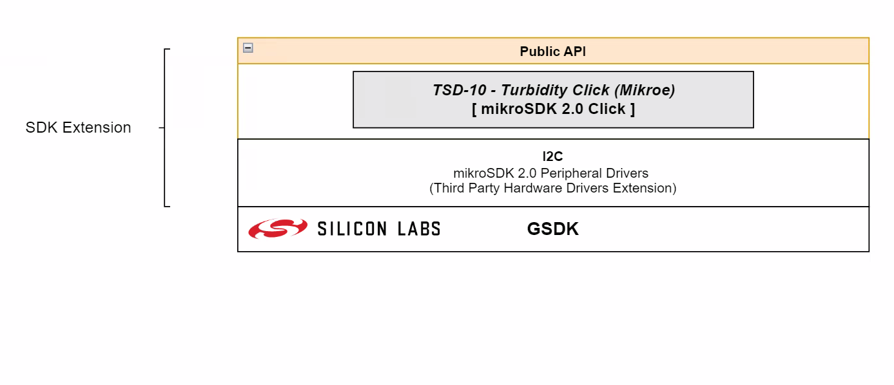
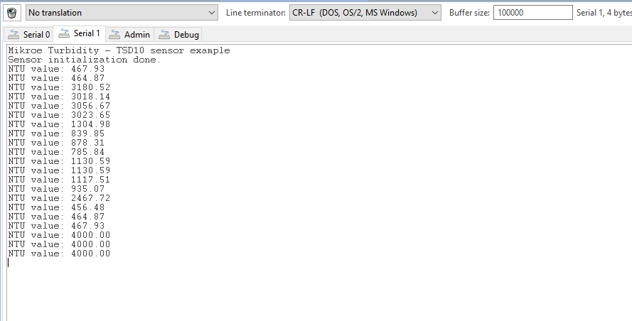

# TSD-10 - Turbidity Click (Mikroe) #

## Summary ##

This project shows the implementation of a Turbidity driver using Turbidity Click and TSD10 sensor with an EFR32xG24 explorer kit.

Turbidity Click Bundle: This bundle gives you everything you need to take high-accuracy turbidity measurements. It allows users to combine Turbidity Sensor with Turbidity Click via an additional 3-wire Male to Male Cable - 15 cm to measure the relative clarity of any liquid. Turbidity Click allows users to upgrade their projects with a sensor that senses the cloudiness or haziness of a fluid caused by large numbers of individual particles invisible to the naked eye.

The sensor can be used in various domains. For example, with the washing machines application, depending on the sensor value, the washing controller can determine the amount of soil in the water and make decisions on how long to wash in all cycles. By measuring the turbidity of the wash water, the washing machine can conserve energy on lightly soiled loads by only washing as long as necessary. This will result in energy savings for the consumer.

## Required Hardware ##

- [**EFR32xG24-EK2703A** EFR32xG24 Explorer Kit (BRD2703A xG24 Explorer Kit Board)](https://www.silabs.com/development-tools/wireless/efr32xg24-explorer-kit?tab=overview).

- [**Turbidity Click** board carries MCP3221 Low-Power 12-Bit A/D Converter](https://www.mikroe.com/turbidity-click).

- [**Turbidity Sensor - TSD10**](https://www.mikroe.com/tsd-10-turbidity-sensor).

- [**3-wire Male to Male Cable - 15 cm**](https://www.mikroe.com/3-wire-male-to-male-cable-15-cm).

## Hardware Connection ##

The Turbidity Click board supports MikroBus, so it can connect easily to EFR32xG24 Explorer Kit's MikroBus header. Be sure that the board's 45-degree corner matches the Explorer Kit's 45-degree white line. The Turbidity Click features one 1x3 2.5mm connector suitable for connecting a Turbidity sensor via an additional 3-wire Male to Male Cable - 15 cm.

The hardware connection will look like the figure below:

## Setup ##

You can either create a project based on an example project or start with an empty example project.

### Create a project based on an example project ###

1. From the Launcher Home, add the BRD2703A  to My Products, click on it, and click on the **EXAMPLE PROJECTS & DEMOS** tab. Find the example project with the filter 'turbidity'.

2. Click **Create** button on the **Third Party Hardware Drivers - TSD-10 - Turbidity Click (Mikroe)** example. Example project creation dialog pops up -> click Create and Finish and Project should be generated.

3. Build and flash this example to the board.

### Start with an empty example project ###

1. Create an "Empty C Project" for the "EFR32xG24 Explorer Kit Explorer Kit Board" using Simplicity Studio v5. Use the default project settings.

2. Copy the file `app/example/mikroe_turbidity_tsd10/app.c` into the project root folder (overwriting the existing file).

3. Install the software components:

    - Open the .slcp file in the project.

    - Select the SOFTWARE COMPONENTS tab.

    - Install the following components:

        - [Services] → [Timers] → [Sleep Timer]
        - [Services] → [IO Stream] → [IO Stream: USART] → default instance name: vcom
        - [Application] → [Utility] → [Log]
        - [Third-Party Hardware Drivers] → [Sensor] → [TSD-10 - Turbidity Click (Mikroe)]

4. Install printf float

    - Open Properties of the project.
    - Select C/C++ Build → Settings → Tool Settings → GNU ARM C Linker → General. Check Printf float.

      

5. Build and flash this example to the board.

**Note:**

- Make sure that the SDK extension already be installed. If not please follow [this documentation](https://github.com/SiliconLabs/third_party_hw_drivers_extension/blob/master/README.md#how-to-add-to-simplicity-studio-ide).

- Third-party Hardware Drivers Extension must be enabled for the project to install the "TSD-10 - Turbidity Click (Mikroe)" component.

## How It Works ##

### Driver Layer Diagram ###

### Testing ###

The application monitors and displays Nephelometric Turbidity Units (NTU). Results are being sent to the USART Terminal.

- The Turbidity sensor measures the amount of transmitted light to determine the turbidity of water. XG24 Explorer kit will read the NTU value. With NTU value in a range of 0 to 4000 corresponds with the turbidity level of water (for example, 0 NTU means water is clean, and NTU is 3000 which means water is cloudy).

- You can launch Console that's integrated into Simplicity Studio or use a third-party terminal tool like Tera Term to receive the data from the USB. A screenshot of the console output is shown in the figure below:

  

- Looking at the figure above, we can know the NTU value and determine the amount of soil in the water, depending on that, the controller can take some actions.

## Report Bugs & Get Support ##

To report bugs in the Application Examples projects, please create a new "Issue" in the "Issues" section of [third_party_hw_Drivers_extension](https://github.com/SiliconLabs/third_party_hw_Drivers_extension) repo. Please reference the board, project, and source files associated with the bug, and reference line numbers. If you are proposing a fix, also include information on the proposed fix. Since these examples are provided as-is, there is no guarantee that these examples will be updated to fix these issues.

Questions and comments related to these examples should be made by creating a new "Issue" in the "Issues" section of [third_party_hw_Drivers_extension](https://github.com/SiliconLabs/third_party_hw_Drivers_extension) repo.
