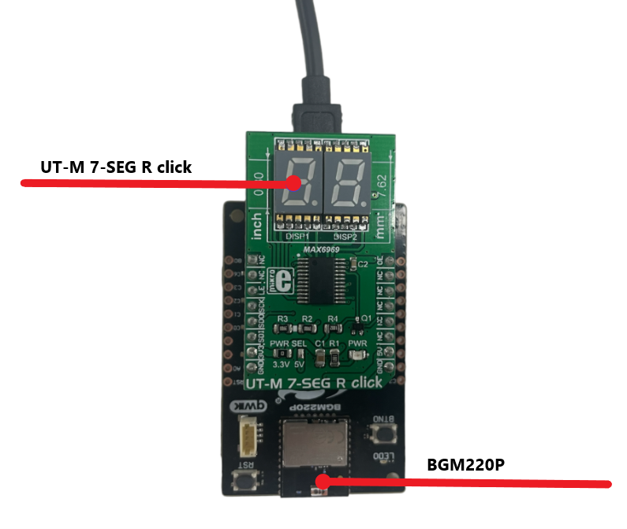
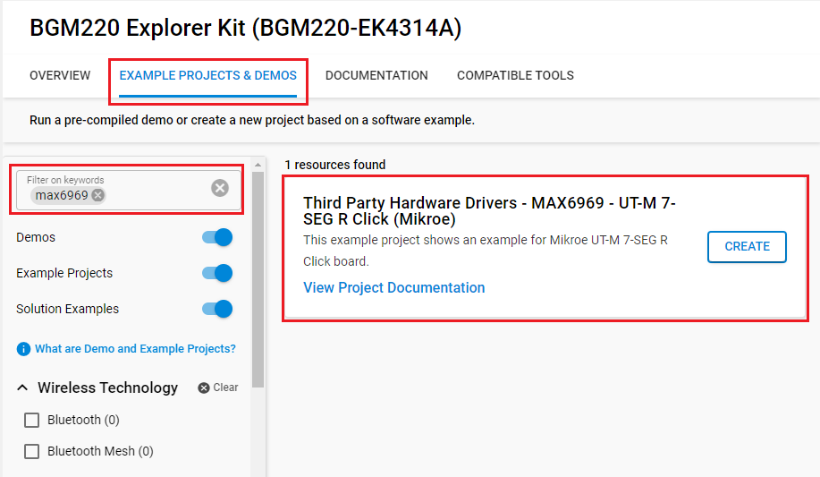

# MAX6969 - UT-M 7-SEG R Click (Mikroe) #

## Summary ##

This project aims to show the hardware driver that is used to interface with the MAX6969 constant-current LED driver via APIs of GSDK.

UT-M 7-SEG R click carries two SMD ultra-thin LED 7-SEG displays and the MAX6969 constant-current LED driver from Analog Devices. The click is designed to run on either 3.3V or 5V power supply. It communicates with the target microcontroller over SPI interface.

## Required Hardware ##

- [A BGM220 Explorer Kit board](https://www.silabs.com/development-tools/wireless/bluetooth/bgm220-explorer-kit).

- [UT-M 7-SEG R Click](https://www.mikroe.com/ut-m-7-seg-r-click).

## Hardware Connection ##

The UT-M 7-SEG R Click board supports MikroBus, so it can connect easily to BGM220P Explorer Kit's MikroBus header. Be sure that the board's 45-degree corner matches the Explorer Kit's 45-degree white line.

The hardware connection is shown in the image below:

## Setup ##

You can either create a project based on an example project or start with an empty example project.

### Create a project based on an example project ###

1. From the Launcher Home, add the BRD4314A to My Products, click on it, and click on the **EXAMPLE PROJECTS & DEMOS** tab. Find the example project with filter max6969

2. Click **Create** button on the **Third Party Hardware Drivers - MAX6969 - UT-M 7-SEG R Click (Mikroe)** example. Example project creation dialog pops up -> click Create and Finish and Project should be generated.

3. Build and flash this example to the board.

### Start with an empty example project ###

1. Create an "Empty C Project" for the "BGM220 Explorer Kit Board" using Simplicity Studio v5. Use the default project settings.

2. Copy the file `app/example/mikroe_utm7segr_max6969/app.c` into the project root folder (overwriting existing file).

3. Install the software components:

    - Open the .slcp file in the project.

    - Select the SOFTWARE COMPONENTS tab.

    - Install the following components:

        - **[Services] → [Timers] → [Sleep Timer]**
        - **[Third Party Hardware Drivers] → [Display & LED] → [MAX6969 - UT-M 7-SEG R Click (Mikroe)]**

4. Build and flash this example to the board.

**Note:**

- Make sure that the SDK extension already be installed. If not please follow [this documentation](https://github.com/SiliconLabs/third_party_hw_drivers_extension/blob/master/README.md#how-to-add-to-simplicity-studio-ide).

- SDK Extension must be enabled for the project to install "MAX6969 - UT-M 7-SEG R Click (Mikroe)" component.

## How It Works ##

This example demonstrates some of the available features of the 7-Segment LED module. After initialization, the application draws numbers from 0 to 99 on the screen.

## Report Bugs & Get Support ##

To report bugs in the Application Examples projects, please create a new "Issue" in the "Issues" section of [third_party_hw_drivers_extension](https://github.com/SiliconLabs/third_party_hw_drivers_extension) repo. Please reference the board, project, and source files associated with the bug, and reference line numbers. If you are proposing a fix, also include information on the proposed fix. Since these examples are provided as-is, there is no guarantee that these examples will be updated to fix these issues.

Questions and comments related to these examples should be made by creating a new "Issue" in the "Issues" section of [third_party_hw_drivers_extension](https://github.com/SiliconLabs/third_party_hw_drivers_extension) repo.
