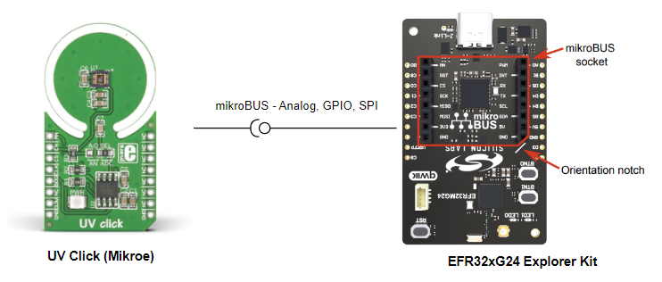
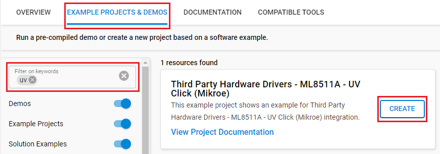
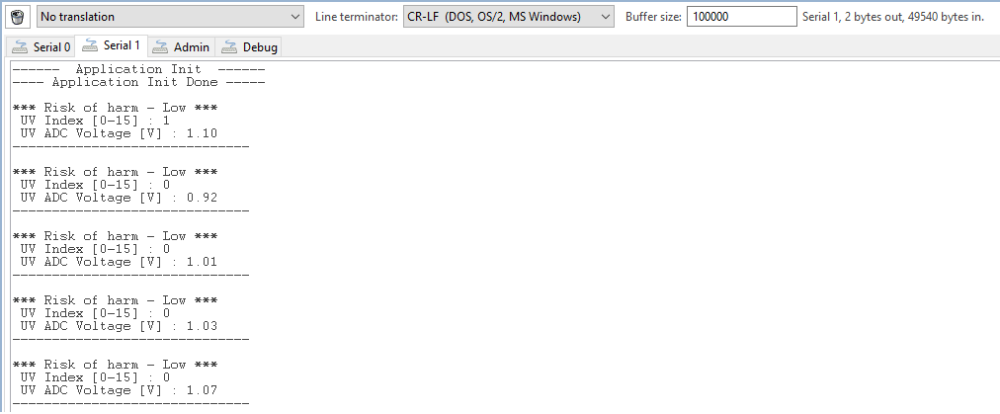

# ML8511A - UV Click (Mikroe) #

## Summary ##

This project aims to show the hardware driver that is used to interface with the UV Click driver from Mikroe via APIs of GSDK.

UV Click is a compact add-on board that alerts users of excessive ultraviolet radiation levels. This board features the ML8511A, an ultraviolet light sensor suitable for acquiring UV intensity indoors or outdoors from Rohm Semiconductor. The ML8511A is equipped with an internal amplifier converting photocurrent to voltage depending on the UV intensity working with a wavelength between 280-390nm. It outputs an analog voltage linearly related to the measured UV intensity (mW/cm2), which can be later processed in analog or digital form. Also, the power consumption can be reduced using the available power management mode. This UV Click board is suitable for various applications, such as determining exposure to ultraviolet radiation in a laboratory or environmental settings, weather stations, industrial manufacturing, and many more.

## Required Hardware ##

- [EFR32xG24 Explorer Kit](https://www.silabs.com/development-tools/wireless/efr32xg24-explorer-kit?tab=overview)

- [UV CLICK](https://www.mikroe.com/uv-click)

## Hardware Connection ##

The UV Click board supports MikroBus, so it can connect easily to EFR32xG24 Explorer Kit. Be sure that the board's 45-degree corner matches the Explorer Kit's 45-degree white line.

The hardware connection is shown in the image below:

## Setup ##

You can either create a project based on an example project or start with an empty example project.

### Create a project based on an example project ###

1. From the Launcher Home, add the BRD2703A to My Products, click on it, and click on the **EXAMPLE PROJECTS & DEMOS** tab. Find the example project with filter **UV**.

2. Click **Create** button on the **Third Party Hardware Drivers - ML8511A - UV Click (Mikroe)** example. Example project creation dialog pops up -> click Create and Finish and Project should be generated.

3. Build and flash this example to the board.

### Start with an empty example project ###

1. Create an "Empty C Project" for the "EFR32xG24 Explorer Kit" using Simplicity Studio v5. Use the default project settings.

2. Copy the file `app/example/mikroe_uv_ml8511a/app.c` into the project root folder (overwriting the existing file).

3. Install the software components:

    - Open the .slcp file in the project.

    - Select the SOFTWARE COMPONENTS tab.

    - Install the following components:

        - **[Services] → [Timers] → [Sleep Timer]**
        - **[Services] → [IO Stream] → [IO Stream: EUSART]** → default instance name: vcom
        - [Application] → [Utility] → [Log]
        - **[Third Party Hardware Drivers] → [Sensors] → [ML8511A - UV Click (Mikroe)]**

4. Install printf float

    - Open Properties of the project.
    - Select C/C++ Build > Settings > Tool Settings >GNU ARM C Linker > General. Check Printf float.
        

5. Build and flash this example to the board.

**Note:**

- Make sure that the SDK extension already be installed. If not please follow [this documentation](https://github.com/SiliconLabs/third_party_hw_drivers_extension/blob/master/README.md#how-to-add-to-simplicity-studio-ide).

- Third-party drivers extension must be enabled for the project to install "ML8511A - UV Click (Mikroe)" component.

## How It Works ##

### Testing ###

After setting up all the required components, flash the code to the Explorer Kit, the application will start measuring the ultraviolet radiation value and evaluate the harm of the surrounding environment every 1 second. You can visualize the changes of these values on the Console Window.

## Report Bugs & Get Support ##

To report bugs in the Application Examples projects, please create a new "Issue" in the "Issues" section of [third_party_hw_drivers_extension](https://github.com/SiliconLabs/third_party_hw_drivers_extension) repo. Please reference the board, project, and source files associated with the bug, and reference line numbers. If you are proposing a fix, also include information on the proposed fix. Since these examples are provided as-is, there is no guarantee that these examples will be updated to fix these issues.

Questions and comments related to these examples should be made by creating a new "Issue" in the "Issues" section of [third_party_hw_drivers_extension](https://github.com/SiliconLabs/third_party_hw_drivers_extension) repo.
