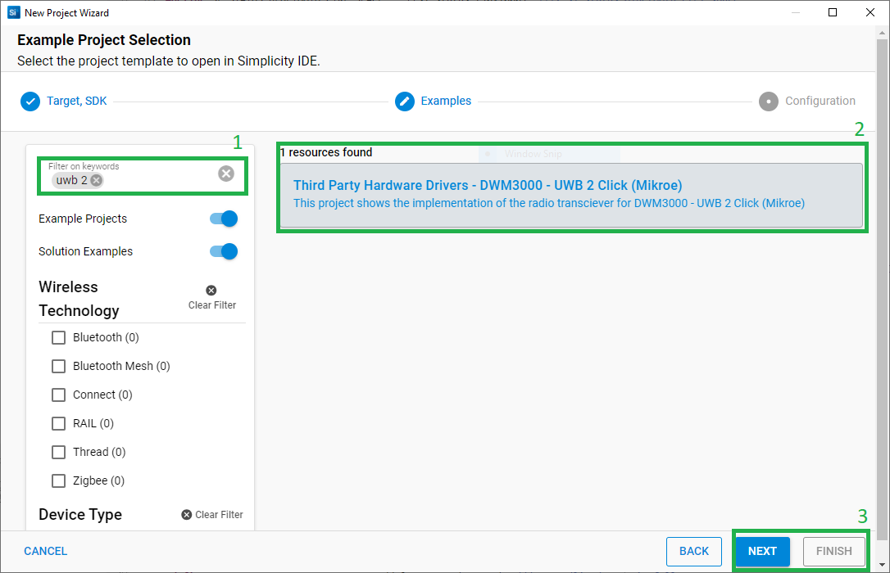
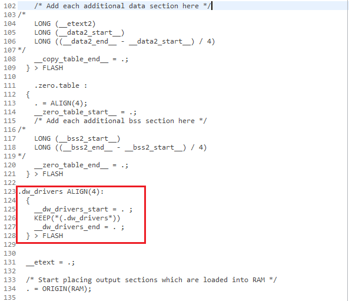
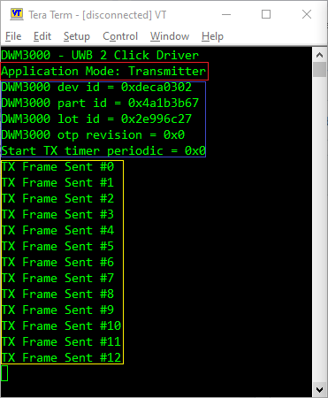
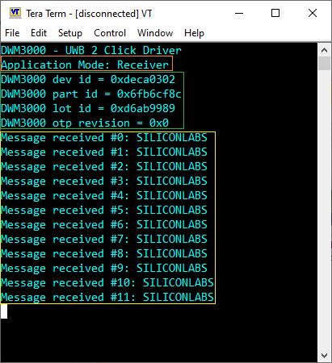

# DWM3000 - UWB 2 Click (Mikroe) #

## Summary ##

This example project showcases the driver integration of the Mikroe DWM3000 - UWB 2 Click board™.

UWB 2 Click board™ is an Ultra-Wideband transceiver. It features the DWM3000, an IEEE 802.15-z UWB transceiver module from Qorvo. This module fully aligns with FiRaTM PHY, MAC, and certification development. It uses an integrated UWB antenna to establish wireless communication in UWB channels 5 (6.5GHz) and 9 (8GHz). This Click board™ is optimized for developing precision real-time positioning system (RTLS) applications using two-way ranging diagrams or Time Difference of Arrival (TDoA). It can also be applied in many other fields such as agriculture, automation & building controls, factory automation, healthcare, safety & security and warehousing & logistics.

## Required Hardware ##

- [EFR32xG24 Explorer Kit](https://www.silabs.com/development-tools/wireless/efr32xg24-explorer-kit?tab=overview)

- [UWB 2 Click board™](https://www.mikroe.com/uwb-2-click)

**NOTE:**
Tested boards for working with this example:

| Board ID | Description  |
| ---------------------- | ------ |
| BRD2703A | [xG24-EK2703A - EFR32xG24 Explorer Kit](https://www.silabs.com/development-tools/wireless/efr32xg24-explorer-kit?tab=overview)    |
| BRD4314A | [BGM220-EK4314A - BGM220P Bluetooth Module Explorer Kit](https://www.silabs.com/development-tools/wireless/bluetooth/bgm220-explorer-kit?tab=overview)  |
| BRD4108A | [BG22-EK4108A - EFR32BG22 Explorer Kit Board](https://www.silabs.com/development-tools/wireless/bluetooth/bg22-explorer-kit?tab=overview)  |

## Hardware Connection ##

The DWM3000 - UWB 2 Click board™ supports MikroBus. Therefore, it can connect easily to the MikroBus header of the EFR32xG24 Explorer Kit. Be sure that the 45-degree corner of the board matches the 45-degree white line of the Explorer Kit. The hardware connection is shown in the image below:


## Setup ##

You can either create a project based on an example project or start with an empty example project.

### Create a project based on an example project ###

1. From the Launcher Home, add the BRD2703A to My Products, click on it, and click on the **EXAMPLE PROJECTS & DEMOS** tab. Find the example project filtering by "uwb 2".

2. Click **Create** button on the **Third Party Hardware Drivers - DWM3000 - UWB 2 Click (Mikroe)** example. Example project creation dialog pops up -> click Create and Finish and Project should be generated.



3. Build and flash this example to the board.

### Start with an empty example project ###

1. Create an "Empty C Project" for the "EFR32xG24 Explorer Kit" using Simplicity Studio v5. Use the default project settings.

2. Copy all of the files in the "app/example/mikroe_uwb2_dwm3000/app_files" folder into the project root folder (overwriting the existing file).

3. Install the software components:

    - Open the *.slcp file in the project.

    - Select the SOFTWARE COMPONENTS tab.

    - Install the following components:

        - **[Services] → [IO Stream] → [IO Stream: EUSART]** → default instance name: vcom
        - **[Application] → [Utility] → [Log]**
        - **[Application] → [Utility] → [Assert]**
        - **[Services] → [Timers] → [Sleep Timer]**
        - **[Third Party Hardware Drivers] → [Wireless Connectivity] → [DWM3000 - UWB 2 Click (Mikroe)]** → use default configuration

4. Editing the Linker File:
    - From the project root folder, open "autogen/linkerfile.ld" file and copy the following section to the autogenerated linker:
    ```
        .dw_drivers ALIGN(4): 
        {
            __dw_drivers_start = . ;
            KEEP(*(.dw_drivers*))
            __dw_drivers_end = . ;
        } > FLASH
    ```
    The final "linkerfile.ld" file after editing is shown in the image below:

    

5. Build and flash this example to the board.

**Note:**

- Make sure that the SDK extension has already been installed. If not, please follow [this documentation](https://github.com/SiliconLabs/third_party_hw_drivers_extension/blob/master/README.md#how-to-add-to-simplicity-studio-ide).

- SDK Extension must be enabled for the project to install "DWM3000 - UWB 2 Click (Mikroe)" component.

## How It Works #

After you flash the code to the Explorer Kit and power the connected boards, the application starts running automatically. Use Putty/Tera Term (or another program) to read the values of the serial output. Note that the EFR32xG24 Explorer Kit board uses the default baud rate of 115200.

First, the user must have two boards to run this demo example, one for the Transmitter, and one for Receiver. The user can decide whether to use the device in Transmitter (Tx) or Receiver (Rx) mode by macro "DEMO_APP_TRANSMITTER" in the "app.c" file.

In Tx mode, the main program initializes the driver, reads some information and checks communication with the dwm3000 device. After that, it transmits a packet message periodically. There is a periodic timer in the code, which determines the transmitting intervals; the default transmitting intervals rate is 2000 ms. If you need more frequent transmitting, it is possible to change the value of the macro "TRANSMITTING_INTERVAL_MSEC" in the "app.c" file. The screenshot of the console is shown in the image below:



In Rx mode, the main program initializes the driver, reads some information and checks communication with the dwm3000 device. After that, the device enters receiver mode, and it prints each received packet. The screenshot of the console is shown in the image below:



## Report Bugs & Get Support ##

To report bugs in the Application Examples projects, please create a new "Issue" in the "Issues" section of [third_party_hw_drivers_extension](https://github.com/SiliconLabs/third_party_hw_drivers_extension) repo. Please reference the board, project, and source files associated with the bug, and reference line numbers. If you are proposing a fix, also include information on the proposed fix. Since these examples are provided as-is, there is no guarantee that these examples will be updated to fix these issues.

Questions and comments related to these examples should be made by creating a new "Issue" in the "Issues" section of [third_party_hw_drivers_extension](https://github.com/SiliconLabs/third_party_hw_drivers_extension) repo.