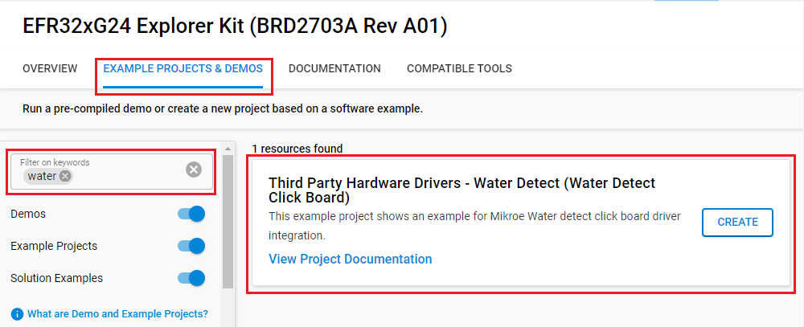
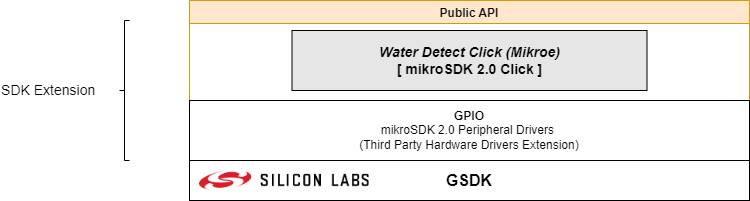
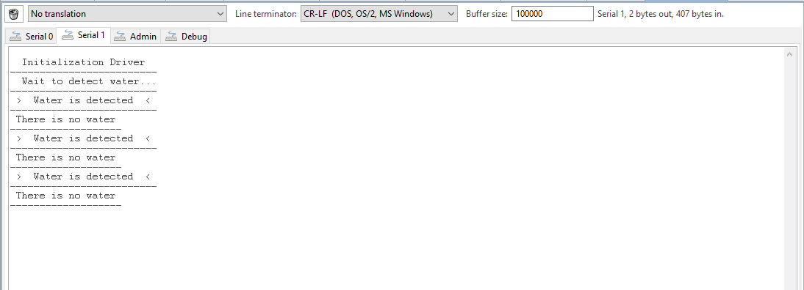

# Water Detect Click Driver #

## Summary ##

This example project shows an example for Mikroe Water Detect Click board driver integration.

Water Detect click is used for detecting water and other electroconductive liquids. If the detection area is wet the output of Microchip's MCP606 CMOS op-amp will go positive, signaling the presence of liquid.

This device can be used as a household flood alarm sensor, or rain detector for smart buildings. It is also usable for water tanks where it acts as a limit switch of pumping.

## Required Hardware ##

- [EFR32xG24 Explorer Kit](https://www.silabs.com/development-tools/wireless/efr32xg24-explorer-kit?tab=overview).

- [Water Detect Click](https://www.mikroe.com/water-detect-click).

## Hardware Connection ##

The Water Detect Click board support MikroBus, so it can connect easily to EFR32xG24 Explorer Kit's MikroBus header. Be sure that the board's 45-degree corner matches the Explorer Kit's 45-degree white line.

The hardware connection is shown in the image below:

## Setup ##

You can either create a project based on a example project or start with an empty example project.

### Create a project based on a example project ###

1. From the Launcher Home, add the BRD2703A to MyProducts, click on it, and click on the **EXAMPLE PROJECTS & DEMOS** tab. Find the example project with filter water

2. Click **Create** button on the **Third Party Hardware Drivers - Water Detect (Water Detect Click Board)** example. Example project creation dialog pops up -> click Create and Finish and Project should be generated.

3. Build and flash this example to the board.

### Start with an empty example project ###

1. Create an "Empty C Project" for the "EFR32xG24 Explorer Kit" using Simplicity Studio v5. Use the default project settings.

2. Copy the file app/example/mikroe_water_detect/app.c (overwriting existing file), into the project root folder.

3. Install the software components:

    - Open the .slcp file in the project.

    - Select the SOFTWARE COMPONENTS tab.

    - Install the following components:

        - **[Services] → [IO Stream] → [IO Stream: USART]** → default instance name: vcom
        - **[Application] → [Utility] → [Log]**
        - **[Application] → [Service] → [Simple timer service]**
        - **[Third Party Hardware Drivers] → [Sensors] → [Water Detect Click (Mikroe)]** → use default configuration.
            

4. Build and flash this example to the board.

**Note:**

- Make sure the SDK extension already be installed. If not please follow [this documentation](https://github.com/SiliconLabs/third_party_hw_drivers_extension/blob/master/README.md).

- SDK Extension must be enabled for the project to install "Water Detect Click (Mikroe)" component.

## How It Works ##

### Driver Layer Diagram ###

### Testing ###

You can choose the mode of operation by selecting the corresponding macro MIKROE_WATER_DETECT_MODE_INTERRUPT or MIKROE_WATER_DETECT_MODE_POLLING.

You can launch Console that's integrated into Simplicity Studio or use a third-party terminal tool like TeraTerm to receive the data from the USB. A screenshot of the console output and  an actual test image are shown in the figure below.

## Report Bugs & Get Support ##

To report bugs in the Application Examples projects, please create a new "Issue" in the "Issues" section of [third_party_hw_drivers_extension](https://github.com/SiliconLabs/third_party_hw_drivers_extension) repo. Please reference the board, project, and source files associated with the bug, and reference line numbers. If you are proposing a fix, also include information on the proposed fix. Since these examples are provided as-is, there is no guarantee that these examples will be updated to fix these issues.

Questions and comments related to these examples should be made by creating a new "Issue" in the "Issues" section of [third_party_hw_drivers_extension](https://github.com/SiliconLabs/third_party_hw_drivers_extension) repo.
