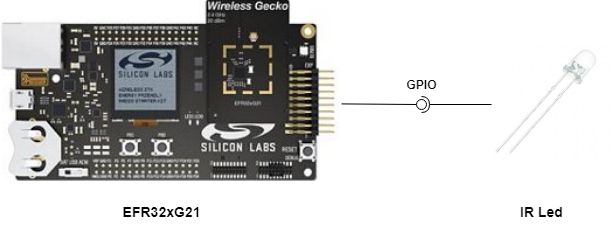
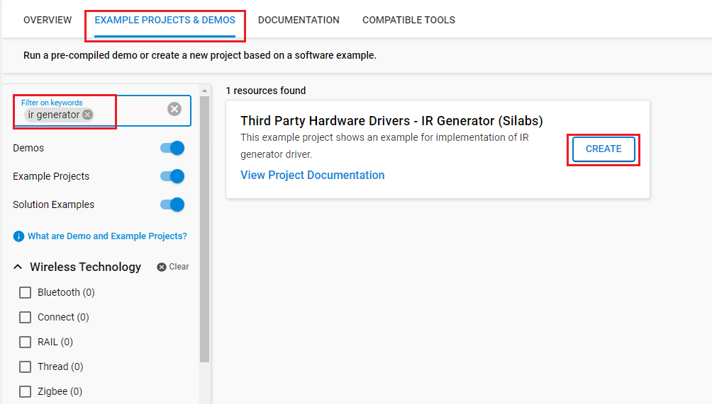
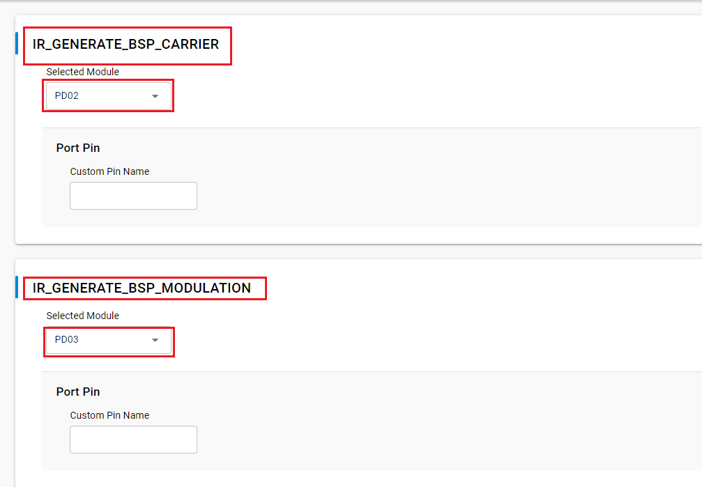
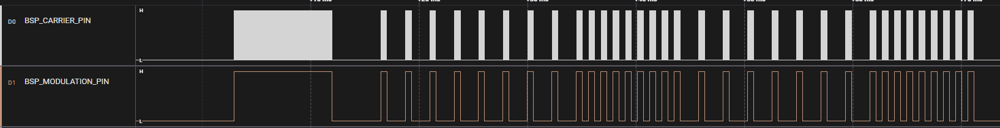

# IR Generator Driver #

## Summary ##

This project shows the implementation of IR generator driver using WSTK kit. IR Generator is widely used in remote controls, used in controlling home appliances such as TV remotes, air conditioners...

## Required Hardware ##

- [EFR32xG21 Wireless Gecko Starter Kit](https://www.silabs.com/development-tools/wireless/efr32xg21-wireless-starter-kit?tab=overview)
- [IR Led](https://www.robomart.com/ir-led-3mm)

**NOTE:**
Tested boards for working with this example:

| Board ID | Description  |
| ---------------------- | ------ |
| BRD4180A | [SiLabs EFR32xG21 Radio Board BRD4180A](https://www.silabs.com/development-tools/wireless)    |
| BRD4182A | [SiLabs EFR32xG22 Radio Board BRD4182A](https://www.silabs.com/development-tools/wireless/slwrb4182a-efr32xg22-wireless-gecko-radio-board) |

## Hardware Connection ##

The hardware connection is shown in the image below:

The table below shows the connection between the Board and the IR LED. You can replace PD2 with another pin via config in the software component.

| EFR32 pin | IR LED  |
| ---------------------- | ------ |
| PD2 | Connect to long pin of the LED  |
| GND | Connect to short pin of the LED |

## Setup ##

You can either create a project based on an example project or start with an empty example project.

### Create a project based on an example project ###

1. From the Launcher Home, add the BRD4180A to MyProducts, click on it, and click on the **EXAMPLE PROJECTS & DEMOS** tab. Find the example project with the filter "ir generate"

2. Click **Create** button on the **Third Party Hardware Drivers - IR Generate (Silabs)** example. Example project creation dialog pops up -> click Create and Finish and Project should be generated.

3. Build and flash this example to the board.

### Start with an empty example project ###

1. Create an "Empty C Project" for the "EFR32xG21 Radio Board" using Simplicity Studio v5. Use the default project settings.

2. Copy the file app/example/silabs_ir_generate/app.c (overwriting existing file), into the project root folder.

3. Install the software components:

    - Open the .slcp file in the project.

    - Select the SOFTWARE COMPONENTS tab.

    - Install the following components:

        - **[Services] → [IO Stream] → [IO Stream: USART]** → default instance name: vcom
        - **[Application] → [Utility] → [Log]**
        - **[Platform] → [Board Control]** -> Enable Virtual COM UART
        - **[Third Party Hardware Drivers] → [Miscellaneous] → [IR Generator (Silabs)]** → use default configuration:
        

4. Build and flash this example to the board.

**Note:**

- Make sure the SDK extension already be installed. If not please follow [this documentation](https://github.com/SiliconLabs/third_party_hw_drivers_extension/blob/master/README.md).

- SDK Extension must be enabled for the project to install "IR_GENERATE_DRV (Sillabs)" component.

## API ##

Based on the operation, the keypad driver API can be broken into 2 categories:

- Initialization.
    - ir_generate_init() function initialize the keypad with the callback.
    - code_t ir_code, set the IR protocol, currently supporting NEC and SONY type.
    - ir_callback_t cb, is called if one frame stream is sent.
- Running the IR generates
    - ir_generate_stream() function configures the data that desire to send and start, repeat flag use in NEC IR protocol.
    - ir_generate_stop() function can stop the IR generate.

## How It Works ##

### Software Workflow ###

After initialization, the system is in idle status. When IR send is required, configure the stream according to the given data, and send out all the stream bits. If don't get the stop command, it keeps repeating. If no need to repeat the IR signal, the system will back to idle status.  Start/stop can control by key events. The demo is keep sending the IR signal after initializing, for the NEC type you can find it send 4 repeat frame then restart.

### Testing ###

You can use Logic Analyzer to be able to measure the signal from Carrier Pin. A screenshot of the output and an actual test image is shown in the figure below.  

You can test this project with real devices from manufacturers like NEC and SONY.

## Report Bugs & Get Support ##

To report bugs in the Application Examples projects, please create a new "Issue" in the "Issues" section of [third_party_hw_drivers_extension](https://github.com/SiliconLabs/third_party_hw_drivers_extension) repo. Please reference the board, project, and source files associated with the bug, and reference line numbers. If you are proposing a fix, also include information on the proposed fix. Since these examples are provided as-is, there is no guarantee that these examples will be updated to fix these issues.

Questions and comments related to these examples should be made by creating a new "Issue" in the "Issues" section of [third_party_hw_drivers_extension](https://github.com/SiliconLabs/third_party_hw_drivers_extension) repo.
