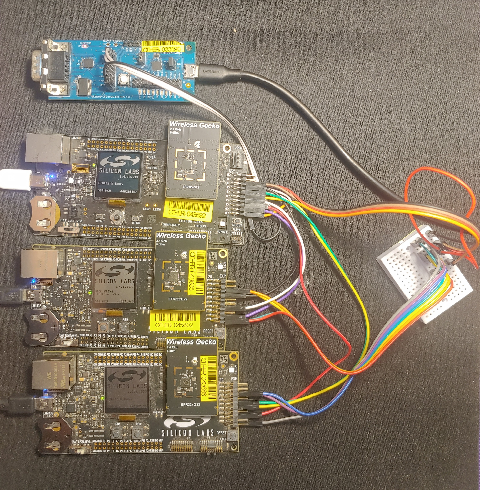
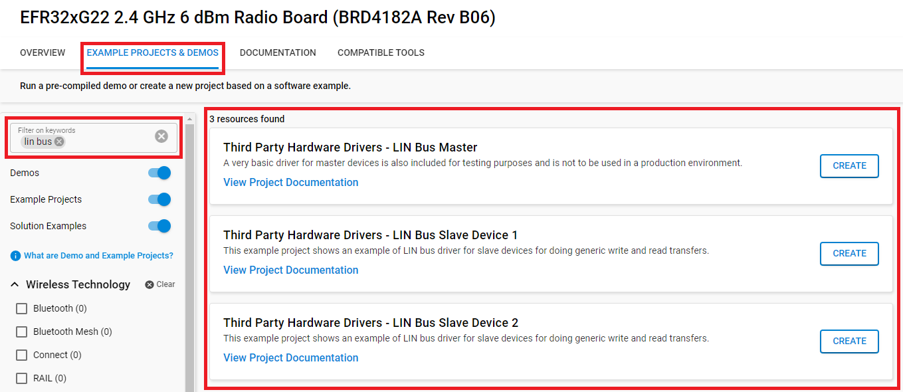
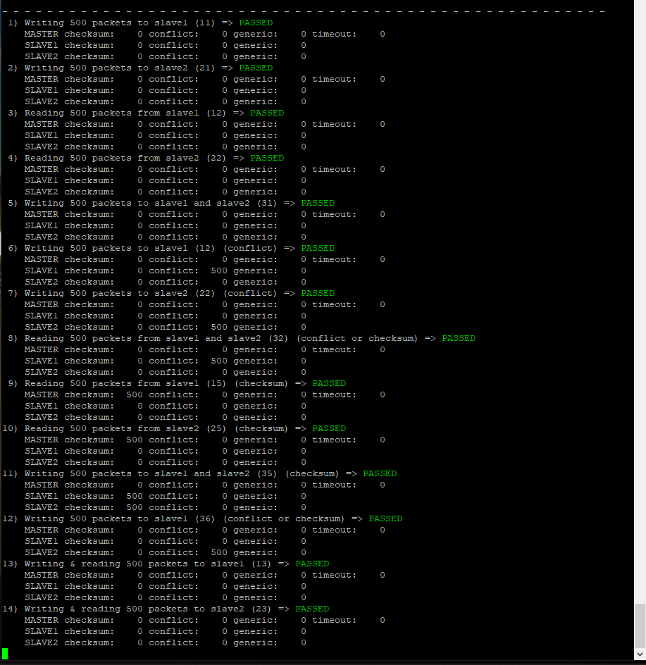

# LIN bus slave driver #

## Summary ##

The projects implement a simple LIN bus driver for slave devices for doing generic write and read transfers and are based on the Bluetooth – SoC Empty project. A very basic driver for master devices is also included for testing
purposes and is not to be used in a production environment.

A key point was to not disturb the Bluetooth LE communication due to its time-critical nature, so the slave side has been implemented by keeping performance in mind, striving for keeping the code as short and fast as possible. Most things are done in the background via interrupt handlers and DMA transfers, and the compilation is optimized with a fixed set of compiler parameters. As the bus is driven solely by the master side, data transfers are executed on predefined endpoints, and the connection with the upper layers of the application are provided via callbacks.

## Required Hardware ##

- 3 x [EFR32MG22 2.4 GHz 6 dBm Radio Board BRD4182A](https://www.silabs.com/documents/public/user-guides/ug430-brd4182a-user-guide.pdf)

**NOTE:**
Tested boards for working with this example:

| Board ID | Description  |
| --- | --- |
| BRD4182A | [EFR32MG22 2.4 GHz 6 dBm Radio Board BRD4182A](https://www.silabs.com/documents/public/user-guides/ug430-brd4182a-user-guide.pdf) |

## Connections Required ##

The testing environment consists of a master device and two slave devices. Connections are made through the expansion header. All the LIN_TX and LIN_RX pins should be connected together on every devices, connected to the single-wire bus, and at least pulled up by a 5-10K resistor to 3.3V. An external USB-to-serial converter is required to access the console. For more detail please refer to the ["Pin assignments](#pin-assignments) and ["Testing environment"](#testing-environment) section.



## Setup ##

You can either create a project based on an example project or start with an empty example project.

### Create a project based on an example project ###

1. From the Launcher Home, add the BRD4182A to My Products, click on it, and click on the **EXAMPLE PROJECTS & DEMOS** tab. Find the example project with filter "LIN bus".

2. Click **Create** button to create the example project. There are 3 projects that need to be generated to run this example:

    - **Third Party Hardware Drivers - LIN bus slave device 1**: An example of using LIN bus slave driver with several endpoints for testing purpose. It also include a simple BLE example to demonstrate that the driver is not disturb the Bluetooth LE communication.
    - **Third Party Hardware Drivers - LIN bus slave device 2**: Another LIN slave node with difference enpoints.
    - **Third Party Hardware Drivers - LIN bus master**: A basic driver for master node which comunicate with 2 slave and do some test case.

    

3. Build and flash this example to the board.

### Start with an empty example project ###

#### Master device ####

1. Create an "Empty C" project for the BRD4182A using SimplicityStudio 5. Use the default project settings. Be sure to connect and select the BRD4182A from the "Debug Adapters" on the left before creating a project.

2. Then copy the files: app/example/silabs_lin_bus/master/app.c, app/example/silabs_lin_bus/master/sl_lin_test_master.c, app/example/silabs_lin_bus/master/sl_lin_test_master.h, app/example/silabs_lin_bus/master/system.h into the project root folder and overwriting existing file.

3. Uninstall software components in the .slcp

    - **[Service] → [Device Initialization] → [Automatic Device Initialization]**

4. Install software components in the .slcp

    - **[Services] → [IO Stream] → [IO Stream: USART]** → default instance name: vcom
    - **[Platform] → [Peripheral] → [LDMA]**
    - **[Platform] → [Peripheral] → [LETIMER]**
    - **[Platform] → [Peripheral] → [USART]**
    - **[Platform] → [Peripheral] → [PRS]**
    - **[Services] → [Clocks] → [HFXO Manager]**
    - **[Services] → [Power Manager] → [Power Manager]**
    - **[Services] → [Device Initialization] → [Peripherals] → [Core]**
    - **[Services] → [Device Initialization] → [Peripherals] → [Clocks]**
    - **[Services] → [Device Initialization] → [Peripherals] → [DC-DC Converter]**
    - **[Services] → [Device Initialization] → [Peripherals] → [Energy Management Unit (EMU)]**
    - **[Services] → [Device Initialization] → [Peripherals] → [Low Frequency Crystal Oscillator (LFXO)]**
    - **[Services] → [Device Initialization] → [Peripherals] → [High Frequency Crystal Oscillator (HFXO)]**
    - **[Thid Party] → [Tiny printf]**

5. Save the files, build and ready to flash or debug.

6. Launch a terminal or console, open the communication to your device.

#### Slave device ####

1. Create an "Bluetooth - SoC Empty" project for the BRD4182A using SimplicityStudio 5. Use the default project settings. Be sure to connect and select the BRD4182A from the "Debug Adapters" on the left before creating a project.

2. Then copy the files app/example/silabs_lin_bus/slave/app.c into the project root folder and overwriting existing file.

3. Install software components in the .slcp
    - **[Third Party Hardware Drivers] → [Services] → [LIN bus slave]**
    - **[Services] → [IO Stream] → [IO Stream: USART]** → default instance name: vcom
    - **[Platform] → [Driver] → [LED] → [Simple LED]** component with the default instance name: **led0** and **led1**.

4. Add preprocessor to project build option: SL_LIN_SLAVE1 for slave node 1 and SL_LIN_SLAVE2 for slave node 2

5. Save the files, build and ready to flash or debug.

## How It Works ##

### Quirks and caveats ###

The LIN 2.x specification does not define various key elements, which makes an implementation providing 100% compliance in every environment impossible with the given restricted set of peripherals. However, the implemented functionality shall be enough to cover the most common use cases, or could be tweaked to add the missing features, given that they are not too complex.

- The WAKEUP signal is not required and is actually ignored. After not receiving data (during the 100-millisecond quiet time on the master), the device will simply go back to sleep, virtually making the signal "no effect".
- The BREAK symbol triggers a wakeup by itself, and by the time the master sends the 1-bit delimiter, the slave is ready to receive the packet.
- Response space and inter-byte spaces are not controllable. Data is transferred by DMA which sends/receives bytes as soon as possible, while the response space of a read request depends on the time required to set up the DMA transfer in the TX direction.
- The exact length of the BREAK symbol is not checked, and is assumed to be at least 300 microseconds long (time needed until the high frequency clock gets stable after a wakeup from low-power mode), but this is guaranteed by the spec. However, the automatic baud rate detection of the USART peripheral enforces the first successfully received byte to be 0x55 (the SYNC byte) and the implementation checks if the PID field arrives too soon compared to the falling edge of the detected BREAK symbol.
- When a slave device connects to the bus during an ongoing transfer, it might misdetect the first falling edge as the beginning of a BREAK symbol. In this case the baud rate might also be miscalculated due to recognizing a proper square-wave sequence as a SYNC byte. Measures have been added to detect and ignore possibly incorrect transfers and suspend the bus until the end of the given window (9.1 milliseconds after the falling edge, defined below), then retry the reception by detecting the next falling edge as a BREAK symbol. This process is repeated until the sleep-wakeup point ultimately falls into a longer dominant state of the bus, after which the first falling edge shall really be the start of a WAKEUP signal or a BREAK symbol.
- The slave device is expected to be operated in a time-division multiplexing environment, where the master device polls the bus periodically with a given constant interval. The device should auto-learn the period which is not possible for various reasons, so a predefined configurable interval of 10 milliseconds is assumed, and a timeout of 9.1 milliseconds is in effect, at about the halfway between the end of a maximum-sized packet transmitted at 20 kbit/s data rate +40% to account for clock drifting (8.68 milliseconds in total) and the end of a 10-millisecond wide window
Frames with diagnostics or reserved IDs in the 60..63 range are not supported, and are ignored.
- As a consequence, the "go to sleep" command described in the section 2.6.3 of the 2.2A spec is also not supported, but actually it's not required at all as the device automatically enters low-power sleep mode at the end of every connection window and remains there until the next falling edge is detected on the bus (most likely meaning the falling edge of a WAKE signal or a BREAK symbol).
- Only the low-level part of the WAKEUP signal generation is implemented, which keeps the bus in the recessive state (low level) for at least 250 microseconds. The upper layer doing the repeating as shown in figure 2.17 and figure 2.18 of the spec shall be implemented in the application based on its own timing (possibly done by the sleep timer component).
- Event triggered frames are not implemented.
- The master's frame interval is expected to be at least 10 milliseconds. This might be lowered slightly, given that the SL_LIN_TIMEOUT is adjusted accordingly, but it's not a problem if the period is actually longer than 10 milliseconds. If a frame is received too close to the previous one, it might be processed as additional trailing bytes (junk) of that frame, before detecting an error. After an automatic recovery, the device shall again be in sync with the master

### Project structure ###

The slave project targets the EFR32MG22 chip on the BRD4182A radio board with the BRD4002A WSTK Pro mainboard. It includes the slave side of the LIN bus implementation with a couple of endpoints set up for the testing environment.

The master project also targets the BRD4182A radio board and contains a minimalistic implementation of the master side of the LIN bus with a testing environment set up to communicate with the slave devices. The slave side of the LIN bus implementation can be found in the sl_lin_s2.c and sl_lin.h files and is documented in the API documentation section. The dma_master.c and dma_master.h files contain generic code to invoke callbacks on DMA completion and are dependencies of the LIN bus driver. So is the system.h file, which contains a couple of performance optimization-related macros. So, for any new projects created these files shall be copied in.

The driver requires the following components:

- GPIO
- LDMA
- LETIMER
- PRS
- TIMER
- USART
- Power Manager
- Digital Phase-Locked Loop (DPLL)
- RAM interrupt vector initialization
For the testing environment:
- LEDs configured according to the WSTK/radio board in use

#### Used peripherals ####

- LDMA channel 4 TX on the LIN bus
- LDMA channel 5 RX on the LIN bus
- EXTI line 3 Wakeup detection for the LIN bus
- PRS channel 4 Signal detector for the LIN bus
- LETIMER Timeout detection
- TIMER3 Used in WAKEUP signal generation
- USART1 Serial port used for implementing the LIN bus

#### Pin assignments ####

Required pins:
| Pin | Name | Description |
| --- | --- | --- |
| PB02 | LIN_TX | TX pin of the LIN bus (available as EXP_15) |
| PB03 | LIN_RX | RX pin of the LIN bus (available as EXP_16) |

Supported roles and recommended locations:
| Pin | Name | Role | Description |
| --- | --- | --- | --- |
| PA05 | CHECKSUM_ERR | Testing | Indicates a checksum error detection to the master |
| PA06 | CONFLICT_ERR | Testing | Indicates a conflict detection to the master
| PA07 | GENERIC_ERR | Testing | Indicates a generic error detection (framing) to the master |
| PA05 | UART_ACT | Performance measurement | Toggled when entering/exiting the UART IRQ handler |
| PA06 | DMA_ACT | Performance measurement | Toggled when entering/exiting a DMA callback |
| PA07 | WAKEUP_ACT | Performance measurement | Toggled when entering/exiting the wakeup IRQ handler |
| PA08 | TIMEOUT_ACT | Performance measurement | Toggled when entering/exiting the timeout IRQ handle |

#### Project configuration #####

The only configurable element in the project is the SL_LIN_TIMEOUT macro, which defines the windows width in which frames are transmitted/received and is counted in 32.768 kHz clock ticks. The default 300 units equals to a timespan of 9.1 milliseconds, covering the transmission time of the longest possible packet transmitted at 20 kbits/sec and shall be adjusted if the baud rate is changed.

### API documentation ###

The communication on the bus is endpoint-based, where IDs can be registered as either writable or readable endpoints. Operations on endpoints induce the invocation of callbacks after the given transfers have been completed. The signature of such callbacks is:

```c
typedef void (*sl_lin_callback_t)(uint8_t frame_id, bool writable, uint8_t *data, int len, bool success);
```

- The **frame_id** parameter identifies an endpoint the data transfer happened on.
- The directionality of the transfer could be determined from the ID, but to make things simpler, it's also indicated by the writable parameter.
- The data parameter points to the data just received/transmitted. The buffer is only expected to be valid during the scope of the callback's invocation, so the data shall be copied elsewhere for later use if required, possibly a FIFO,
which is processed from the main loop. Also, the callback shall return as soon as possible to not disturb the communication handling. The len parameter contains the number of valid bytes in the buffer.
- If the success parameter is true, then the operation has completed successfully, otherwise it has failed due to some reason. The application could use this information to update some fields, for example.

Endpoints could be registered by the following functions:

```c
sl_status_t sl_lin_slave_register_writable_endpoint(uint8_t frame_id, int len, sl_lin_callback_t callback, bool enhanced_checksum);
sl_status_t sl_lin_slave_register_readable_endpoint(uint8_t frame_id, int len, sl_lin_callback_t callback, uint8_t *initdata, bool enhanced_checksum);
```

- The enhanced_checksum parameter controls how the checksums are calculated and verified. Enabling this adds the PID to the checksum calculation.
- The *initdata* parameter points to the data to be initially copied into the readable endpoint's buffer before enabling it. If the parameter is NULL, then the endpoint's buffer is filled with zeros. A readable endpoint's data buffer could be updated later by invoking the following function:

```c
sl_status_t sl_lin_slave_update_readable_endpoint(uint8_t frame_id, const uint8_t *data);
```

- The data parameter points to the data to be copied into the readable endpoint's buffer. Changing the length is only possible via unregistering and re-registering the given endpoint. Endpoints could be unregistered by invoking the following function:

```c
sl_status_t sl_lin_slave_unregister_endpoint(uint8_t frame_id);
```

The LIN bus could be initialized and made operational by calling:

```c
void sl_lin_slave_init(void);
```

- After this function call, the device automatically reacts to IDs that have been registered by sending/receiving the data depending on the directionality on the endpoint, and calling the registered callback afterwards, if there's any.

### Testing environment ###

The testing environment consists of a master device and two slave devices called slave1 and slave2. The slaves run identical software on either board, except their configuration is different, which depends on the presence of SL_LIN_SLAVE1 or SL_LIN_SLAVE2 preprocessor macros. The ofilm_lin_slave project is configured to behave as slave1, and the ofilm_lin_slave_test project is configured to behave as slave2, but this can be changed as needed.
The master device has the following pin configuration:

| Pin | Name | Description |
| --- | --- | --- |
| PB02 | LIN_TX | TX pin of the LIN bus |
| PB03 | LIN_RX | RX pin of the LIN bus
| PA05 | SLAVE1_GENERIC | Detect/count generic errors on the slave1 device
| PA06 | SLAVE2_GENERIC | Detect/count generic errors on the slave2 device
| PC00 | SLAVE2_CHECKSUM | Detect/count checksum errors on the slave2 device
| PC01 | SLAVE1_CHECKSUM | Detect/count checksum errors on the slave1 device
| PC02 | SLAVE2_CONFLICT | Detect/count conflict errors on the slave2 device
| PC03 | SLAVE1_CONFLICT | Detect/count conflict errors on the slave1 device
| PD02 | USART0_TX | TX pin of the serial console
| PD03 | USART0_RX | RX pin of the serial console

The LIN_TX and LIN_RX pins shall be connected together on every device, connected to the single-wire bus, and at least pulled up by a 5-10K resistor to 3.3V.
The SLAVE1_* and SLAVE2_* pins shall be connected to the appropriate pins on the given devices.
Make sure that a GND connection as also provided between the boards.
As the VCOM TX and RX pins had to be used for different purposes due to the limitations of pin assignments and GPIO routing, the serial console of the master device is only available on the PD02 and PD03 pins, and an external USB-to-serial converter is required to access the console.
The devices have the following IDs configured:

| Endpoint | Description |
| --- | --- |
| 11 | Writable endpoint on slave1 |
| 12 | Readable endpoint on slave1, answers 0xde 0xad 0xbe 0xef 0xca 0xfe 0xba 0xbe |
| 13 | Writable endpoint on slave1 |
| 14 | Readable endpoint on slave1, echoes back what was written to endpoint 13 (or 0xcc ...) |
| 15 | Same as endpoint 12, but with injected checksum error |
| 21 | Writable endpoint on slave2 |
| 22 | Readable endpoint on slave2, answers 0xca 0xfe 0xba 0xbe 0xde 0xad 0xbe 0xef |
| 23 | Writable endpoint on slave2 |
| 24 | Readable endpoint on slave2, echoes back what was written to endpoint 23 (or 0xcc ...) |
| 25 | Same as endpoint 22, but with injected checksum error |
| 31 | Writable endpoint on slave1 and slave2 devices |
| 32 | Readable endpoint on slave1 and slave2 devices, an access triggers a conflict on the bus between slave1 and slave2 |
| 35 | Same as endpoint 31, but with injected checksum error from the master |
| 36 | Writable on slave1 and readable on slave2, a write request triggers a conflict on the bus between the master and slave2 |

A conflict is detected on a device when it tries to drive the bus to the dominant state while it is in the recessive state, and in this case, it should back off until the end of the given frame is reached. As the outcome depends on not only the actual data transmitted, but also the relative timing, it's not possible to tell who the winner will be. The winning device shall continue transmitting its message undisturbed as if nothing has happened. Depending on the location on the conflict, the master might detect a checksum error or a timeout condition too.

- Test cases 1 and 2 write to endpoints 11 and 21 respectively. As there's no indication about the successful outcome of a transfer, test cases 13 and 14 write to endpoints 13 and 23 and read the data back from endpoints 14 and 24. If the received data does not match the transmitted data, an error is reported.
- Test cases 3 and 4 read data from endpoints 12 and 22.
- Test case 5 writes to both devices at once on the endpoint 31.
- Test case 6 and 7 write to endpoint 12 and 22, which are readable endpoints, so the bus gets driven by two devices at the same time. Either the master or the slave1/slave2 device shall detect a conflict, and the sum of detected conflicts shall be equal to the number of frames transmitted.
- Test case 8 reads from endpoint 32, which is answered by both devices at the same time, causing a conflict on the bus. Either slave device shall detect a conflict, but not both, and the sum of detected conflicts shall be equal to the number of frames transmitted.
- Test cases 9 and 10 read from endpoint 15 and 25, expecting checksum errors to happen on the master device (which are caused forcibly by the slave devices).
- Test case 11 writes to endpoint 35 with a damaged checksum, expecting the slave devices to detect the errors.
- Test case 12 writes to endpoint 36, which is a writable endpoint on the slave1 device, but readable on the slave2 device, causing a conflict on the bus. Either the master or the slave device shall detect a conflict, but not both, and the sum of conflicts detected should be equal to the number of frames transmitted



## Report Bugs & Get Support ##

To report bugs in the Application Examples projects, please create a new "Issue" in the "Issues" section of [third_party_hw_drivers_extension](https://github.com/SiliconLabs/third_party_hw_drivers_extension) repo. Please reference the board, project, and source files associated with the bug, and reference line numbers. If you are proposing a fix, also include information on the proposed fix. Since these examples are provided as-is, there is no guarantee that these examples will be updated to fix these issues.

Questions and comments related to these examples should be made by creating a new "Issue" in the "Issues" section of [third_party_hw_drivers_extension](https://github.com/SiliconLabs/third_party_hw_drivers_extension) repo.
