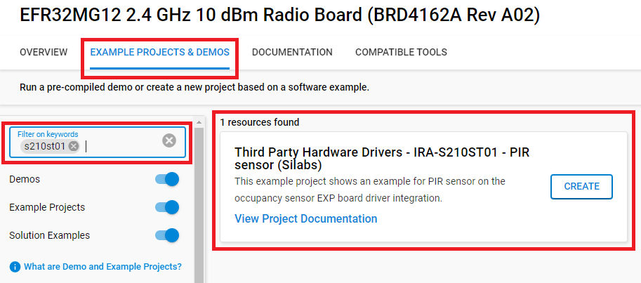

# PIRA-S210ST01 - PIR Sensor (Silabs) #

## Summary ##

This project shows the implementation of PIR sensor driver using the PIR sensor on the occupancy sensor EXP board.

The target application of the PIR sensor would be smart lighting or alarm systems in home automation. Whenever a certain motion of the human body is detected, the system will either turn on the light or the alarm.

## Required Hardware ##

- [EFR32MG12 2.4 GHz 10 dBm Radio Board BRD4162A](https://www.silabs.com/documents/public/reference-manuals/brd4162a-rm.pdf)
- Wireless Starter Kit Mainboard (BRD4001A)
- Occupancy Sensor EXP board (BRD8030A)

The driver should work with minimal porting on other series 1 EFM/EFR devices and with other
PIR sensors having similar designs as the one on the Occupancy Sensor EXP board.

**NOTE:**
Tested boards for working with this example:

| Board ID | Description  |
| ---------------------- | ------ |
| BRD4162A | [EFR32MG12 2.4 GHz 10 dBm Radio Board BRD4162A](https://www.silabs.com/documents/public/reference-manuals/brd4162a-rm.pdf)    |
| BRD4161A | [EFR32MG12 2.4 GHz 19 dBm Radio Board BRD4161A](https://www.silabs.com/documents/public/reference-manuals/brd4161a-rm.pdf)    |

## Hardware Connection ##

Connect the occupancy sensor EXP board to the WSTK board through the expansion header.

## Setup ##

You can either create a project based on an example project or start with an empty example project.

### Create a project based on an example project ###

1. From the Launcher Home, add the BRD4162A to My Products, click on it, and click on the **EXAMPLE PROJECTS & DEMOS** tab. Find the example project with filter s210st01.

2. Click **Create** button on the **Third Party Hardware Drivers - IRA-S210ST01 - PIR sensor (Silabs)** example. Example project creation dialog pops up -> click Create and Finish and Project should be generated.

3. Build and flash this example to the board.

### Start with an empty example project ###

1. Create a "Platform - Empty C Project" project for the "EFR32MG12 Radio Board (BRD4162A)" using Simplicity Studio v5. Use the default project settings. Be sure to connect and select the "EFR32MG12 Radio Board (BRD4162A)" from the "Debug Adapters" on the left before creating a project.

2. Copy the file `app/example/silabs_pir_ira_s210st01/app.c` into the project root folder (overwriting the existing file).

3. Install the software components:
  
    - Open the .slcp file in the project.
    - Select the *SOFTWARE COMPONENTS* tab.
    - Install the following components:
      - **[Third Party Hardware Drivers] → [Sensor] → [IRA-S210ST01 - PIR Sensor (Silabs)]**.
      - **[Platform] → [Driver] → [LED] → [Simple LED]** component with the default instance name: **led0**.

## How It Works ##

Whenever motion is detected, the LED0 on the WSTK Mainboard will be turned on. If no motion is detected for 4 seconds, the LED0 will be turned off.

### API Documentation ###

Based on the operation, the PIR sensor driver API can be broken into 4 categories:

- Initialization.
  - pir_init() function will power up the PIR sensor and initialize all peripherals required to perform the measurement
  - pir_configure() function is not currently implemented yet. The PIR sensor we used is an analog sensor which doesn't have internal registers to program.
- Running the Motion Detection
  - pir_start() and pir_stop() functions are used to start/stop ADC measurements.
  - pir_detect_motion() is a simple algorithm that tells if motion is detected. It also adaptively updates the ADC threshold to trigger interrupts.
- Callbacks
  - pir_adc_irq_callback() function is called in ADC IRQ. It's up to the application layer to decide how to set up flags/events to call the motion detection algorithm.
  - pir_motion_detection_callback() function is called in the motion detection algorithm to notify the application layer whenever motion on/off is detected.
- Debug Utilities
  - The application layer can provide a buffer for the PIR driver to save PIR samples to a sample queue for debugging purpose.

### Peripherals Usage ###

The figure above shows an overview of all peripherals used in the PIR sensor driver.

- Yellow blocks are external hardware components.
- Green blocks are peripherals that can operate in EM2.
  - 3 GPIOs, PRS, CRYTIMER(32Hz) and ADC are MUST have.
  - OPAMP can be either external or internal.
  - LETIMER is optional for processing/debugging samples.
- Motion detection can only run in EM0 as shown in the blue block.

### Software Workflow ###

After initialization, users can call `pir_start()` function to start ADC measurements (32Hz). If an ADC interrupt is received, MCU will be wakened up to buffer ADC samples and call the `pir_adc_irq_callback()` function. Users should run the motion detection algorithm on the latest ADC sample to detect motions.

## Report Bugs & Get Support ##

To report bugs in the Application Examples projects, please create a new "Issue" in the "Issues" section of [third_party_hw_drivers_extension](https://github.com/SiliconLabs/third_party_hw_drivers_extension) repo. Please reference the board, project, and source files associated with the bug, and reference line numbers. If you are proposing a fix, also include information on the proposed fix. Since these examples are provided as-is, there is no guarantee that these examples will be updated to fix these issues.

Questions and comments related to these examples should be made by creating a new "Issue" in the "Issues" section of [third_party_hw_drivers_extension](https://github.com/SiliconLabs/third_party_hw_drivers_extension) repo.