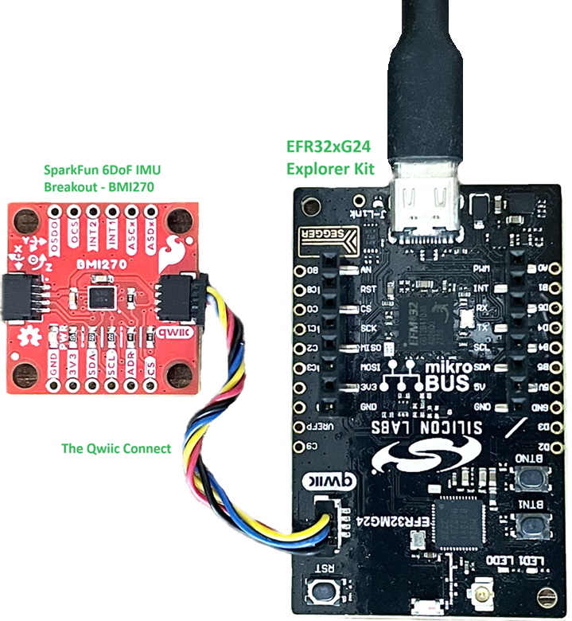
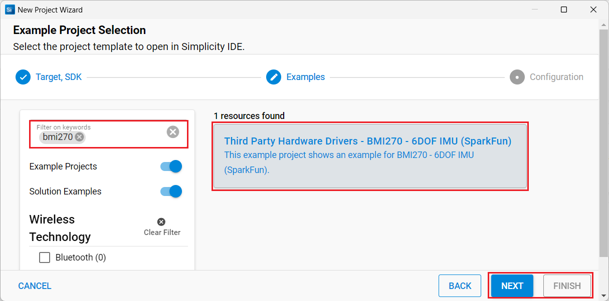
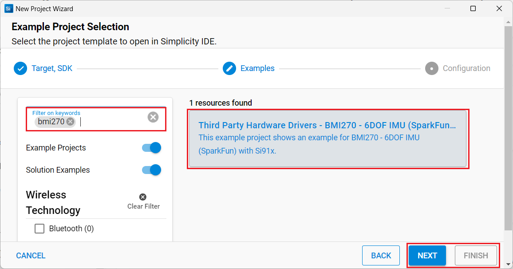
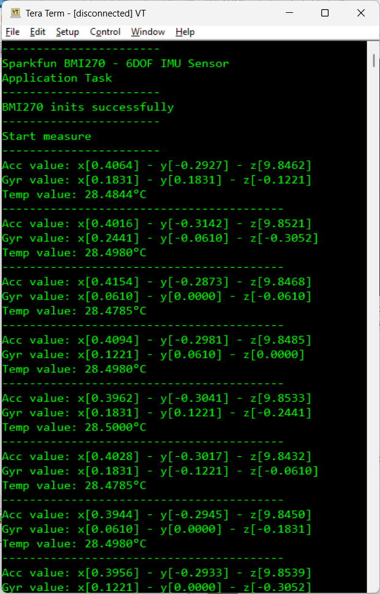

# BMI270 - 6DoF IMU Breakout (SparkFun) #

## Summary ##

This example project showcases the driver integration of the SparkFun BMI270 - 6DoF IMU Breakout.

The SparkFun BMI270 6DoF IMU Breakout is a Qwiic-enabled breakout board based on the ultra-low power BMI270 from Bosch. This chip is a highly integrated, low-power IMU optimized for wearables providing precise acceleration, angular rate measurement, and intelligent on-chip motion-triggered interrupt features. Not only does the BMI270 comprise a fast and sensitive accelerometer and gyro pair, but it also contains several intelligent, on-chip motion-triggered interrupt features.

## Required Hardware ##

- [EFR32xG24 Explorer Kit](https://www.silabs.com/development-tools/wireless/efr32xg24-explorer-kit?tab=overview)
- Or [SiWx917 Wi-Fi 6 and Bluetooth LE 8 MB Flash SoC Pro Kit](https://www.silabs.com/development-tools/wireless/wi-fi/siwx917-pk6031a-wifi-6-bluetooth-le-soc-pro-kit) (BRD4002 + BRD4338A)
- [SparkFun 6DoF IMU Breakout - BMI270 (Qwiic)](https://www.sparkfun.com/products/22397)

**NOTE:**
Tested boards for working with this example:

| Board ID | Description  |
| ---------------------- | ------ |
| BRD2703A | [xG24-EK2703A - EFR32xG24 Explorer Kit](https://www.silabs.com/development-tools/wireless/efr32xg24-explorer-kit?tab=overview)    |
| BRD4314A | [BGM220-EK4314A - BGM220P Bluetooth Module Explorer Kit](https://www.silabs.com/development-tools/wireless/bluetooth/bgm220-explorer-kit?tab=overview)  |
| BRD4108A | [BG22-EK4108A - EFR32BG22 Explorer Kit Board](https://www.silabs.com/development-tools/wireless/bluetooth/bg22-explorer-kit?tab=overview)  |
| BRD4338A | [SiWx917 Wi-Fi 6 and Bluetooth LE 8 MB Flash SoC Pro Kit](https://www.silabs.com/development-tools/wireless/wi-fi/siwx917-pk6031a-wifi-6-bluetooth-le-soc-pro-kit)  |

## Hardware Connection ##

- **If the "EFR32xG24 Explorer Kit" is used**:
  
    The SparkFun 6DoF IMU Breakout - BMI270 supports Qwiic, so it can connect easily to the Qwiic header of the EFR32xG24 Explorer Kit. The hardware connection is shown in the image below:

    

- **If the "SiWx917 Wi-Fi 6 and Bluetooth LE 8 MB Flash SoC Pro Kit" is used**:
  
    The hardware connection is shown in the table below:

  | Description  | BRD4338A GPIO | BRD4002 EXP Header | BMI270 - 6DoF IMU Breakout|
  | -------------| ------------- | ------------------ | ------------------ |
  | I2C_SDA      | ULP_GPIO_6    | EXP_16             | SDA                |
  | I2C_SCL      | ULP_GPIO_7    | EXP_15             | SCL                |

## Setup ##

You can either create a project based on an example project or start with an empty example project.

### Create a project based on an example project ###

1. From the Launcher Home, add your board to My Products, click on it, and click on the **EXAMPLE PROJECTS & DEMOS** tab. Find the example project filtering by "bmi270".

2. Click on the **Create** button on the project:

    - **Third Party Hardware Drivers - BMI270 - 6DOF IMU (SparkFun)** example if the "EFR32xG24 Explorer Kit" is used
    

    - **Third Party Hardware Drivers - BMI270 - 6DOF IMU (SparkFun) - Si91x** example if the "SiWx917 Wi-Fi 6 and Bluetooth LE 8 MB Flash SoC Pro Kit" is used
    

    - Example project creation dialog pops up -> click Create and Finish and Project should be generated.
3. Build and flash this example to the board.

### Start with an empty example project ###

1. Create an "Empty C Project" for your board using Simplicity Studio v5. Use the default project settings.

2. Copy all of the files in the "app/example/silabs_6dof_imu_bmi270/app.c" folder into the project root folder (overwriting the existing file).

3. Install the software components:

    - Open the *.slcp file in the project.

    - Select the SOFTWARE COMPONENTS tab.

    - Install the following components:

        - **If the "EFR32xG24 Explorer Kit" is used:**
            - [Services] → [IO Stream] → [IO Stream: EUSART] → default instance name: vcom
            - [Application] → [Utility] → [Log]
            - [Application] → [Utility] → [Assert]
            - [Platform] → [Driver] → [I2C] → [I2CSPM] → qwiic instance
            - [Third Party Hardware Drivers] → [Sensor] → [BMI270 - 6DOF IMU Breakout (Sparkfun)] → use default configuration

        - **If the "SiWx917 Wi-Fi 6 and Bluetooth LE 8 MB Flash SoC Pro Kit" is used**
            - [Application] → [Utility] → [Assert]
            - [WiSeConnect 3 SDK] → [Device] → [Si91x] → [MCU] → [Peripheral] → [I2C] → [i2c2]
            - [Third Party Hardware Drivers] → [Sensor] → [BMI270 - 6DOF IMU Breakout (Sparkfun)] → use default configuration

4. Install "Printf float"

    - Open Properties of the project.

    - Select C/C++ Build > Settings > Tool Settings > GNU ARM C Linker > General > Check "Printf float".

5. Build and flash this example to the board.

**Note:**

- Make sure that the SDK extension has already been installed. If not, please follow [this documentation](https://github.com/SiliconLabs/third_party_hw_drivers_extension/blob/master/README.md#how-to-add-to-simplicity-studio-ide).

- SDK Extension must be enabled for the project to install the "BMI270 - 6DOF IMU Breakout (Sparkfun)" component.

## How It Works #

After you flash the code and power the connected boards, the application starts running automatically. Use Putty/Tera Term (or another program) to read the values of the serial output. Note that the "EFR32xG24 Explorer Kit" or the "SiWx917 Wi-Fi 6 and Bluetooth LE 8 MB Flash SoC Pro Kit" uses the default baud rate of 115200.

First, the main program initializes the driver, configs some parameters and checks communication with the bmi270 device. After that, it read the accelerometer, gyroscope and temperature data periodically. There is a periodic timer in the code, which determines the sampling intervals; the default sampling interval rate is 500 ms. If you need more frequent sampling, it is possible to change the value of the macro "READING_INTERVAL_MSEC" in the "app.c" file. The screenshot of the console is shown in the image below:

## Report Bugs & Get Support ##

To report bugs in the Application Examples projects, please create a new "Issue" in the "Issues" section of [third_party_hw_drivers_extension](https://github.com/SiliconLabs/third_party_hw_drivers_extension) repo. Please reference the board, project, and source files associated with the bug, and reference line numbers. If you are proposing a fix, also include information on the proposed fix. Since these examples are provided as-is, there is no guarantee that these examples will be updated to fix these issues.

Questions and comments related to these examples should be made by creating a new "Issue" in the "Issues" section of [third_party_hw_drivers_extension](https://github.com/SiliconLabs/third_party_hw_drivers_extension) repo.
