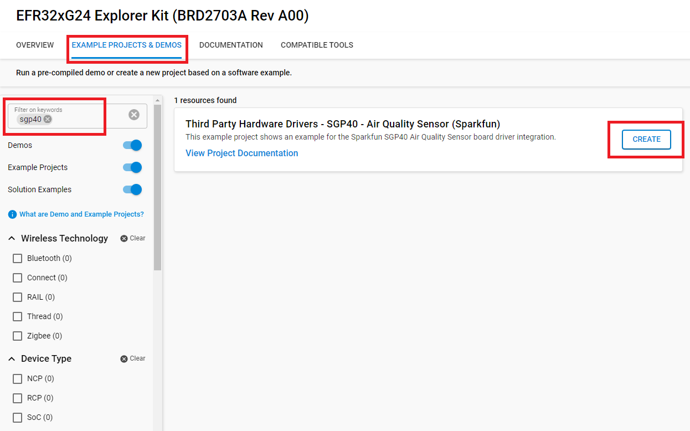
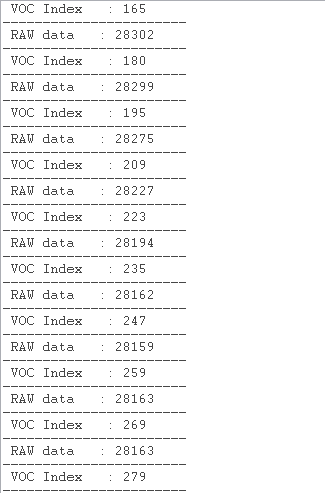

# SGP40 - Air Quality Sensor (Sparkfun) #

## Summary ##

This project shows the implementation of a SGP40 that is new digital VOC (volatile organic compounds) sensor designed for easy integration into air purifiers or demand-controlled ventilation, integrated on the Air Quality Sensor.

You can use this example as reference for creating your own indoor air quality monitoring application. You can visualize the measured volatile organic compound (VOC) level by a display or you can transfer the measurements to a data center or mobile phone, which can trigger warning messages or start air freshener devices.

## Required Hardware ##

- [EFR32xG24 Explorer Kit](https://www.silabs.com/development-tools/wireless/efr32xg24-explorer-kit).

- [Air Quality Sensor](https://www.sparkfun.com/products/18345).

## Hardware Connection ##

The Air Quality Sensor support Qwiic, so it can connect easily to EFR32xG24 Explorer Kit's Qwiic header.

The hardware connection is shown in the image below:

## Setup ##

You can either create a project based on a example project or start with an empty example project.

### Create a project based on a example project ###

1. From the Launcher Home, add the BRD2703A to MyProducts, click on it, and click on the **EXAMPLE PROJECTS & DEMOS** tab. Find the example project with filter sgp40

2. Click **Create** button on the **Third Party Hardware Drivers - SGP40 - Air Quality Sensor (Sparkfun)** example. Example project creation dialog pops up -> click Create and Finish and Project should be generated.

3. Build and flash this example to the board.

### Start with an empty example project ###

1. Create an "Empty C Project" for the "BGM220 Explorer Kit Board" using Simplicity Studio v5. Use the default project settings.

2. Copy the file app/example/mikroe_waterdetect_mcp606/app.c (overwriting existing file) into the project root folder.

3. Install the software components:

    - Open the .slcp file in the project.

    - Select the SOFTWARE COMPONENTS tab.

    - Install the following components:

        - **[Services] → [IO Stream] → [IO Stream: USART]** → default instance name: vcom
        - **[Application] → [Utility] → [Log]**
        - **[Third Party Hardware Drivers] → [Sensors] → [SGP40 - Air Quality Sensor (Sparkfun)]**

4. Build and flash this example to the board.

**Note:**

- Make sure the SDK extension already be installed. If not please follow [this documentation](https://github.com/SiliconLabs/third_party_hw_drivers_extension/blob/master/README.md).

- SDK Extension must be enabled for the project to install "SGP40 - Air Quality Sensor (Sparkfun)" component. Selecting this component will also include the "I2CSPM" component with default configurated instance: qwiic.

- The example project are built on the BRD2703A board. For another boards, selecting the "SGP40 - Air Quality Sensor (Sparkfun)" component will include the "I2CSPM" component with unconfigured instance: inst0. This instance should be configurated by users.

## How It Works ##

You can launch Console that's integrated into Simplicity Studio or use a third-party terminal tool like TeraTerm to receive the data from the USB. A screenshot of the console output and  an actual test image are shown in the figure below.
- Test the sensor and start to measure.

- After put the sensor near a lighter.

- After put the sensor away from lighter.

## Report Bugs & Get Support ##

To report bugs in the Application Examples projects, please create a new "Issue" in the "Issues" section of [third_party_hw_drivers_extension](https://github.com/SiliconLabs/third_party_hw_drivers_extension) repo. Please reference the board, project, and source files associated with the bug, and reference line numbers. If you are proposing a fix, also include information on the proposed fix. Since these examples are provided as-is, there is no guarantee that these examples will be updated to fix these issues.

Questions and comments related to these examples should be made by creating a new "Issue" in the "Issues" section of [third_party_hw_drivers_extension](https://github.com/SiliconLabs/third_party_hw_drivers_extension) repo.
