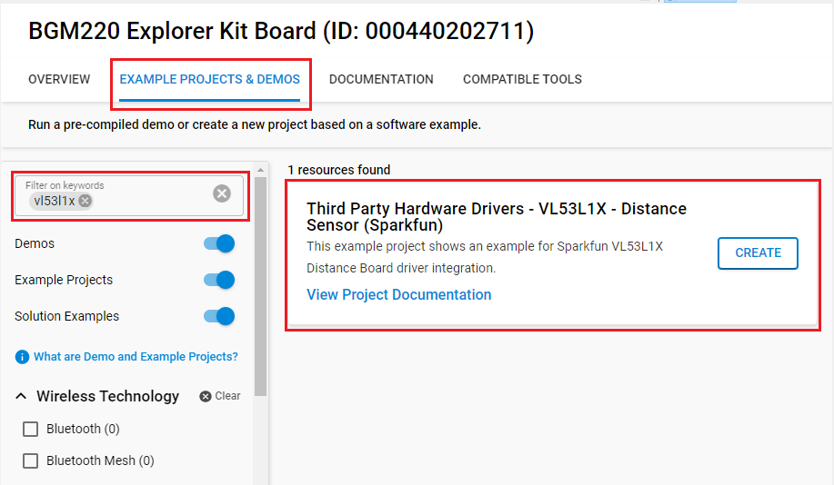

# VL53L1X - Distance Sensor Breakout (Sparkfun) #

## Summary ##

This project shows the integration of the ST's [VL53L1x distance sensor ultra-lite driver](https://www.st.com/en/imaging-and-photonics-solutions/vl53l1x.html#tools-software) API with GSDK.

VL53L1X is a state-of-the-art, Time-of-Flight (ToF), laser-ranging sensor.
It is the fastest miniature ToF sensor on the market with accurate ranging up to 4 m and fast ranging frequency up to 50 Hz. It is housed in a miniature and reflowable package, which integrates an SPAD receiving array from a 940 nm invisible Class1 laser emitter. It incorporates physical infrared filters and optics to achieve the best ranging performance in various ambient lighting conditions. By combining this sensor with Silicon Labs wireless technology, you can make your own applications, such as distance monitoring, people counting and so on.

## Hardware Required ##

- [BGM220 Explorer Kit board](https://www.silabs.com/development-tools/wireless/bluetooth/bgm220-explorer-kit)
- [SparkFun Distance Sensor Breakout - 4 Meter, VL53L1X (Qwiic)](https://www.sparkfun.com/products/14722) or [MikroE LIGHTRANGER 4 Click](https://www.mikroe.com/lightranger-4-click)

## Connections Required ##

A VL53L1X sensor board can be easily connected up with two I2C wires (SDA and SCL) along with 3v3 and GND. For the designated boards, SparkFun Qwiic compatible STEMMA QT connectors can be used.

## Setup ##

To test this application, you should connect the BMG220 Explorer Kit Board to the PC using a microUSB cable. 

You can either create a project based on an example project or start with an empty example project.

### Create a project based on an example project ###

1. From the Launcher Home, add the BRD4314A to My Products, click on it, and click on the **EXAMPLE PROJECTS & DEMOS** tab. Find the example project with filter: vl53l1x.

2. Click **Create** button on the **Third Party Hardware Drivers - VL53L1X - Distance Sensor (Sparkfun)** example. Example project creation dialog pops up -> click Create and Finish and Project should be generated.

3. Build and flash this example to the board.

### Start with an empty example project ###

1. Create an "Empty C Project" project for the "BGM220 Explorer Kit Board" using Simplicity Studio 5. Use the default project settings. Be sure to connect and select the BGM220 Explorer Kit Board from the "Debug Adapters" on the left before creating a project.

2. Copy the file `app/example/sparkfun_distance_vl53l1x/app.c` into the project root folder  (overwriting existing file).

3. Install the software components:

   - Open the .slcp file in the project.

   - Select the SOFTWARE COMPONENTS tab.

   - Install the following components
      - [Services] → [Timers] → [Sleep Timer]
      - [Services] → [IO Stream] → [IO Stream: USART] → instance name: **vcom**
      - [Application] →  [Utility] → [Log]
      - **[Third Party Hardware Drivers] → [Sensors] → [VL53L1X - Distance Sensor Breakout (Sparkfun)]**
    ***

4. Build and flash the project to your device.

**Note:**

- Make sure that the SDK extension already be installed. If not please follow [this documentation](https://github.com/SiliconLabs/third_party_hw_drivers_extension/blob/master/README.md#how-to-add-to-simplicity-studio-ide).

- SDK Extension must be enabled for the project to install **VL53L1X - Distance Sensor Breakout (Sparkfun) - I2C** component.

## How It Works ##

### API Overview ###

The driver is divided into three layers, a platform, a core, and an interface layer. The core layer implements the key features, the platform layer provides integration to the host microcontroller hardware-dependent codes. (In practice it integrates the I2CSPM platform service.). Above these levels, the upper layer provides an interface with standard Silabs return codes and complies with Silicon Labs coding standards. 

`sparkfun_vl53l1_platform.c`: Integrates the Silabs I2CSPM driver for I2C communication.

`sparkfun_vl53l1x_core.c`: ST Ultra-Lite Driver Core API, implements VL53L1X sensor core features.

`sparkfun_vl53l1x_calibration.c`: ST Ultra-Lite Driver Calibration API, implements VL53L1X sensor calibration features.

`sparkfun_vl53l1x.c`: Implements public interfaces to interact with ST ULD Core features.

### Testing ###

Use Putty or another program to read the serial output. The BGM220P uses by default a baudrate of 115200. You should expect a similar output to the one below.

## Report Bugs & Get Support ##

To report bugs in the Application Examples projects, please create a new "Issue" in the "Issues" section of [third_party_hw_drivers_extension](https://github.com/SiliconLabs/third_party_hw_drivers_extension) repo. Please reference the board, project, and source files associated with the bug, and reference line numbers. If you are proposing a fix, also include information on the proposed fix. Since these examples are provided as-is, there is no guarantee that these examples will be updated to fix these issues.

Questions and comments related to these examples should be made by creating a new "Issue" in the "Issues" section of [third_party_hw_drivers_extension](https://github.com/SiliconLabs/third_party_hw_drivers_extension) repo.
