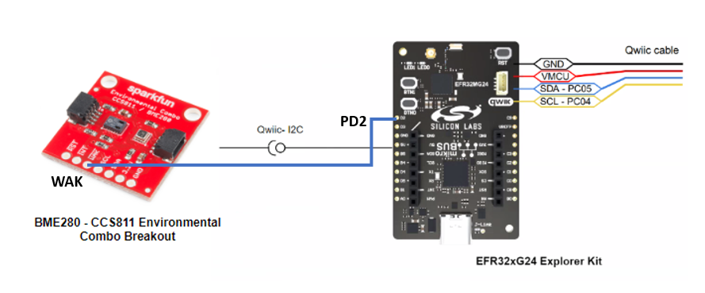
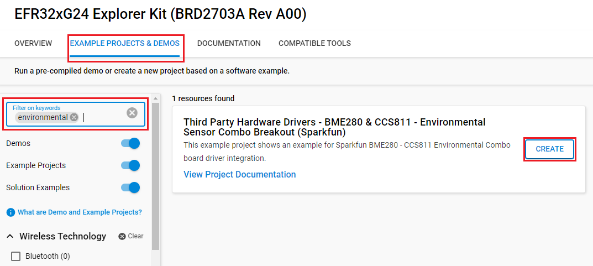
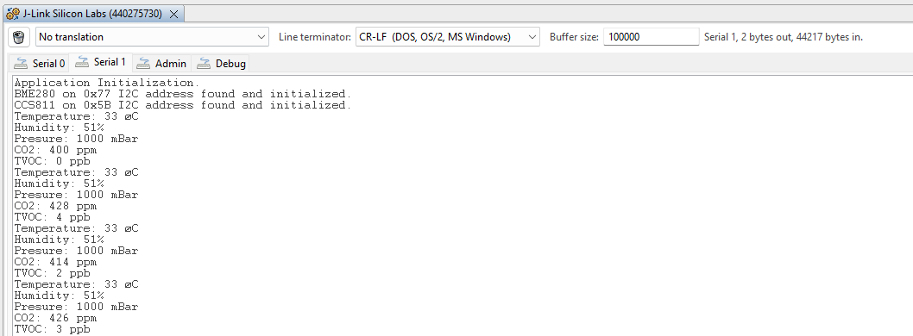

# BME280 - CCS811 Environmental Sensor Combo Breakout #

## Summary ##

This example project shows an example for environmental parameter collection with Sparkfun BME280 - CCS811 Environmental Sensor Combo Breakout Board driver integration with the Silicon Labs Platform.

The CCS811/BME280 (Qwiic) Environmental Combo Breakout works together to take care of all of your atmospheric quality sensing needs with the CCS811 and BME280 ICs. The CCS811 is an exceedingly popular sensor, providing readings for equivalent CO2 (or eCO2) in the parts per million (PPM) and total volatile organic compounds in the parts per billion (PPB). The BME280 provides humidity, temperature, and barometric pressure. It is easy to interface with them via I2C.

## Hardware Required ##

- [EFR32xG24-EK2703A Explorer Kit Board](https://www.silabs.com/development-tools/wireless/efr32xg24-explorer-kit?tab=overview)

- [BME280 - CCS811 SparkFun Environmental Combo Breakout (Qwiic)](https://www.sparkfun.com/products/14348)
  
  or [BME280 - SparkFun Atmospheric Sensor (Qwiic)](https://www.sparkfun.com/products/15440)

  or [CCS811 - SparkFun Air Quality Breakout](https://www.sparkfun.com/products/retired/14193)

## Connections Required ##

The Environmental Sensor support Qwiic, so it can connect easily to EFR32xG24 Explorer Kit's Qwiic header.

The hardware connection is shown in the image below:

**Note:**

- If you want to conserve power, you should connect the **PD2** pin on the EFR32MG24 board to the **WAK** pin on the Environmental Combo Breakout board to change the sensor's active and sleep states. The hardware connection is shown in the image below:

## Setup ##

You can either create a project based on an example project or start with an empty example project.

### Create a project based on an example project ###

1. From the Launcher Home, add the BRD2703A to My Products, click on it, and click on the **EXAMPLE PROJECTS & DEMOS** tab. Find the example project with filter **environmental**

2. Click **Create** button on the **Third Party Hardware Drivers - BME280 & CCS811 - Environmental Sensor Combo Breakout (Sparkfun)** example. Example project creation dialog pops up -> click Create and Finish and Project should be generated.

3. Build and flash this example to the board.

### Start with an empty example project ###

1. Create an "Empty C Project" for the "EFR32MG24 Explorer Kit Board" using Simplicity Studio v5. Use the default project settings.

2. Copy the file [app.c](https://github.com/SiliconLabs/third_party_hw_drivers_extension/tree/master/app/example/sparkfun_environmental_bme280_ccs811) (overwriting the existing file), into the project root folder.

3. Install the software components:

    - Open the .slcp file in the project.

    - Select the SOFTWARE COMPONENTS tab.

    - Install the following components:

        - [Services] → [IO Stream] → [IO Stream: USART] → default instance name: vcom
  
        - [Application] → [Utility] → [Log]
  
        - [Application] → [Service] → [Simple timer service]
  
        - [Third Party Hardware Drivers] → [Sensors] → [BME28 - Atmospheric Sensor (Sparkfun)]
        - [Third Party Hardware Drivers] → [Sensors] → [CCS811 - Air Quality Sensor (Sparkfun)]

4. Build and flash this example to the board.

**Note:**

- Make sure that the **Third-party Drivers Extensions** is installed. To install the extension, follow [this documentation](https://github.com/SiliconLabs/third_party_hw_drivers_extension/blob/master/README.md).

- **Third-party Drivers Extensions** must be enabled for the project to install "BME280 - Atmospheric Sensor (Sparkfun)" or "CCS811 - Air Quality Sensor (Sparkfun)" component. Selecting this component will also include the "I2CSPM" component with default configurated instance: qwiic.

## How It Works ##

The driver is using an I2C channel to initialize and read out both sensors. If just one sensor is needed, you can delete the header of the other sensor and source file.

The driver uses a simple timer for timings. Also, a higher-level kit driver I2CSPM (I2C simple poll-based master mode driver) is used for initializing the I2C peripheral as master mode and performing the I2C transfer.

This example is used to measure environmental parameters: temperature, humidity, pressure, CO2, and TVOC.

You can launch Console that's integrated into Simplicity Studio or use a third-party terminal tool like TeraTerm to receive the data from the USB. A screenshot of the console output is shown in the figure below.

## Report Bugs & Get Support ##

To report bugs in the Application Examples projects, please create a new "Issue" in the "Issues" section of [third_party_hw_drivers_extension](https://github.com/SiliconLabs/third_party_hw_drivers_extension) repo. Please reference the board, project, and source files associated with the bug, and reference line numbers. If you are proposing a fix, also include information on the proposed fix. Since these examples are provided as-is, there is no guarantee that these examples will be updated to fix these issues.

Questions and comments related to these examples should be made by creating a new "Issue" in the "Issues" section of [third_party_hw_drivers_extension](https://github.com/SiliconLabs/third_party_hw_drivers_extension) repo.

