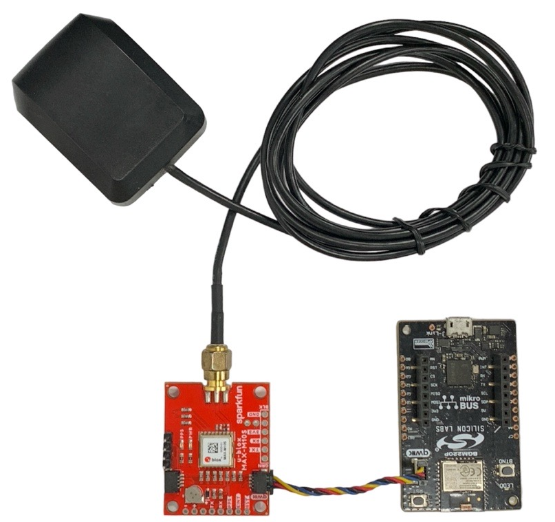
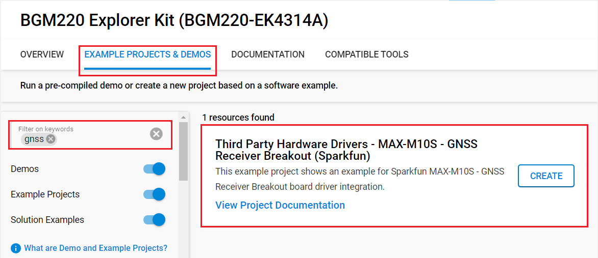
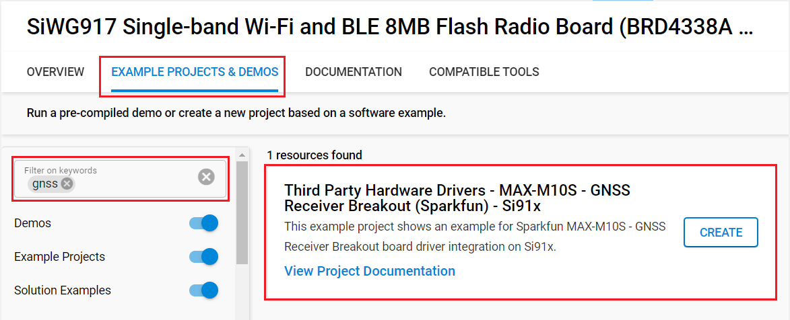
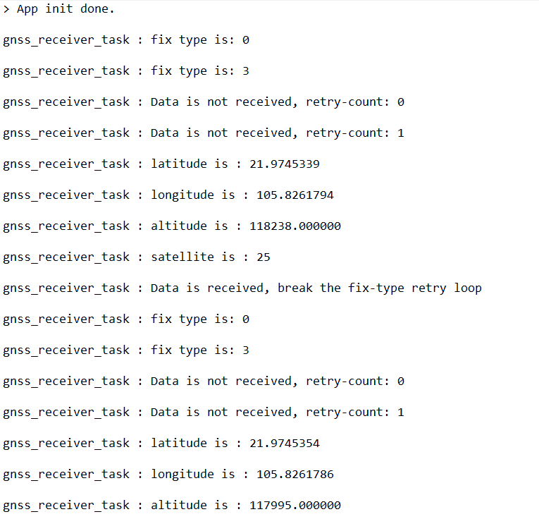

# MAX-M10S - SparkFun GNSS Receiver Breakout #

## Summary ##

This example project shows an example for Sparkfun MAX-M10S GNSS Receiver Breakout based on I2C communication.

The SparkFun MAX-M10S GNSS Receiver Breakout is an ultra-low-power, high performance, miniaturized GNSS board that is perfect for battery operated applications. It does not need much space, such as asset trackers and wearable devices. The MAX-M10S module from u-blox has an extremely low power consumption; it is less than 25mW in continuous tracking mode.

## Required Hardware ##

- [A BGM220 Explorer Kit board](https://www.silabs.com/development-tools/wireless/bluetooth/bgm220-explorer-kit)

- Or [SiWx917 Wi-Fi 6 and Bluetooth LE 8 MB Flash SoC Pro Kit](https://www.silabs.com/development-tools/wireless/wi-fi/siwx917-pk6031a-wifi-6-bluetooth-le-soc-pro-kit) (BRD4002 + BRD4338A)

- [SparkFun GNSS Receiver Breakout - MAX-M10S (Qwiic)](https://www.sparkfun.com/products/18037)

- Option: [GPS/GNSS Magnetic Mount Antenna](https://www.sparkfun.com/products/14986)

## Hardware Connection ##

- If the BGM220P Explorer Kit is used:

  You simply connect a *SparkFun GNSS Receiver Breakout board* to a *BGM220 Explorer Kit* board using a Qwiic cable.

  

- If the SiWx917 Wi-Fi 6 and Bluetooth LE 8 MB Flash SoC Pro Kit is used:

  | Description  | BRD4338A GPIO | BRD4002 EXP Header | SparkFun Micro OLED Breakout |
  | -------------| ------------- | ------------------ | ---------------------------- |
  | I2C_SDA      | ULP_GPIO_6    | EXP_16             | SDA                          |
  | I2C_SCL      | ULP_GPIO_7    | EXP_15             | SCL                          |

## Setup ##

To test this application, you can either create a project based on an example project or start with a "Empty C Project" project based on your hardware.

### Create a project based on an example project ###

1. From the Launcher Home, add your device to My Products, click on it, and click on the **EXAMPLE PROJECTS & DEMOS** tab. Find the example project filtering by *gnss*.

2. Click **Create** button on the project:

   - **Third Party Hardware Drivers - MAX-M10S - GNSS Receiver Breakout (Sparkfun)** example if the BGM220P Explorer Kit is used.
   
   - **Third Party Hardware Drivers - MAX-M10S - GNSS Receiver Breakout (Sparkfun) - Si91x** example if the SiWx917 Wi-Fi 6 and Bluetooth LE 8 MB Flash SoC Pro Kit is used.
   

   Example project creation dialog pops up -> click Create and Finish and Project should be generated.

3. Build and flash this example to the board.

### Start with an empty example project ###

1. Create an "Empty C Project" for the your board using Simplicity Studio v5. Use the default project settings.

2. Copy the file `app/example/sparkfun_gnss_max_m10s/app.c` into the project root folder (overwriting existing file).

3. Install the software components:
    - Open the .slcp file in the project.
    - Select the SOFTWARE COMPONENTS tab.
    - Install the following components:

      **If the BGM220P Explorer Kit is used:**

        - [Services] → [Timers] → [Sleep Timer]
        - [Services] → [IO Stream] → [IO Stream: USART] → default instance name: vcom
        - [Application] → [Utility] → [Log]
        - [platform] → [Driver] → [I2C] → [I2CSPM] → default instance name: qwiic
        - [Third Party Hardware Drivers] → [Wireless Connectivity] → [MAX-M10S - GNSS Receiver Breakout - I2C]

      **If the SiWx917 Wi-Fi 6 and Bluetooth LE 8 MB Flash SoC Pro Kit is used:**

        - [WiSeConnect 3 SDK] → [Device] → [Si91x] → [MCU] → [Service] → [Sleep Timer for Si91x]
        - [WiSeConnect 3 SDK] → [Device] → [Si91x] → [MCU] → [Peripheral] → [I2C] → [i2c2]
        - [Third Party Hardware Drivers] → [Wireless Connectivity] → [MAX-M10S - GNSS Receiver Breakout - I2C]

4. Install printf float

    - Open Properties of the project.

    - Select C/C++ Build > Settings > Tool Settings >GNU ARM C Linker > General. Check Printf float.

5. Build and flash the project to your device.

**Note:**

- Make sure that the SDK extension has already be installed. If not, follow [this documentation](https://github.com/SiliconLabs/third_party_hw_drivers_extension/blob/master/README.md#how-to-add-to-simplicity-studio-ide).

- SDK Extension must be enabled for the project to install "MAX-M10S - GNSS Receiver Breakout - I2C" component.

## How It Works ##

The example performs getting the longitude and latitude coordinates and logs both values via serial output.

You can use Putty or another program to read the serial output. You should expect a similar output to the one below.

## Report Bugs & Get Support ##

To report bugs in the Application Examples projects, please create a new "Issue" in the "Issues" section of [third_party_hw_drivers_extension](https://github.com/SiliconLabs/third_party_hw_drivers_extension) repo. Please reference the board, project, and source files associated with the bug, and reference line numbers. If you are proposing a fix, also include information on the proposed fix. Since these examples are provided as-is, there is no guarantee that these examples will be updated to fix these issues.

Questions and comments related to these examples should be made by creating a new "Issue" in the "Issues" section of [third_party_hw_drivers_extension](https://github.com/SiliconLabs/third_party_hw_drivers_extension) repo.
