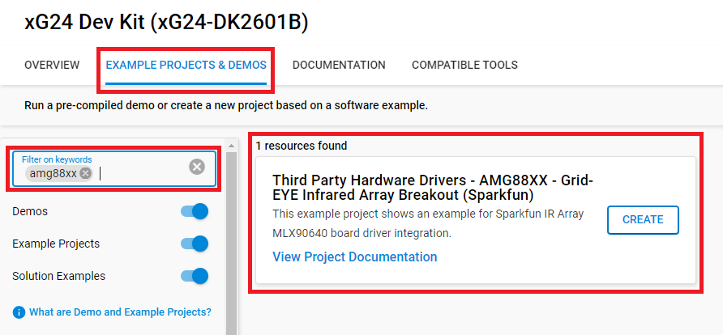
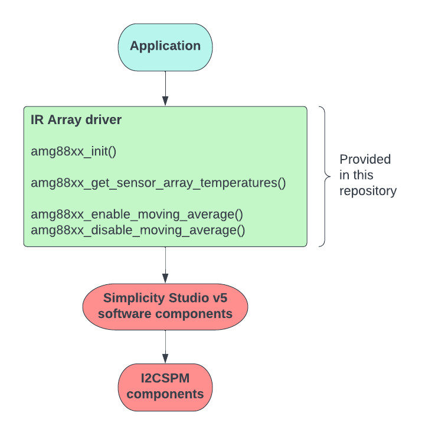

# AMG8833 Grid-EYE Infrared Array Breakout (Sparkfun) #

## Summary ##

This project shows the implementation of the [Panasonic amg88xx infrared array](https://industry.panasonic.eu/components/sensors/industrial-sensors/grid-eye/amg88xx-high-performance-type/amg8833-amg8833) driver using the [EFR32xG24 Dev Kit](https://www.silabs.com/development-tools/wireless/efr32xg24-dev-kit?tab=overview) and the [SparkFun Grid-EYE AMG8833 infrared array](https://www.sparkfun.com/products/14607). The driver includes every known functionality of the amg88xx device, such as sensor readings, power settings, interrupt setup, and more.

The Grid-EYE from Panasonic is an 8x8 thermopile array. This means you have a square array of 64 pixels each capable of independent temperature detection. It’s like having thermal camera (or Predator’s vision), just in really low resolution. It's part of SparkFun's Qwiic system, so it is easier to connect to get your low-resolution infrared image.
## Required Hardware ##

- [EFR32xG24 Dev Kit (BRD2601B)](https://www.silabs.com/development-tools/wireless/efr32xg24-dev-kit?tab=overview)
- [SparkFun Grid-EYE Infrared Array Breakout - AMG8833 (Qwiic)](https://www.sparkfun.com/products/14607)

**NOTE:**
Tested boards for working with this example:

| Board ID | Description  |
| ---------------------- | ------ |
| BRD2704A | [SparkFun Thing Plus Matter - MGM240P - BRD2704A](https://www.sparkfun.com/products/20270) |
| BRD2601B | [EFR32xG24 Dev Kit - xG24-DK2601B](https://www.silabs.com/development-tools/wireless/efr32xg24-dev-kit?tab=overview)   |
| BRD2703A | [EFR32xG24 Explorer Kit - XG24-EK2703A](https://www.silabs.com/development-tools/wireless/efr32xg24-explorer-kit?tab=overview)    |
| BRD4108A | [BG22 Bluetooth SoC Explorer Kit - BG22-EK4108A](https://www.silabs.com/development-tools/wireless/bluetooth/bg22-explorer-kit?tab=overview)    |
| BRD4314A | [BGM220 Bluetooth Module Explorer Kit - BGM220-EK4314A](https://www.silabs.com/development-tools/wireless/bluetooth/bgm220-explorer-kit?tab=overview)    |

## Connections Required ##

The breakout board is connected to the dev kit with a Qwiic connector

## Setup ##

You can either create a project based on an example project or start with an empty example project.

### Create a project based on an example project ###

1. From the Launcher Home, add the BRD2601B to My Products, click on it, and click on the **EXAMPLE PROJECTS & DEMOS** tab. Find the example project with filter "amg88xx".

2. Click **Create** button on the **Third Party Hardware Drivers - AMG88XX - Grid-EYE Infrared Array Breakout (Sparkfun)** example. Example project creation dialog pops up -> click Create and Finish and Project should be generated.

3. Build and flash this example to the board.

### Start with an empty example project ###

1. Create an "Empty C Project" project for the EFR32xG24 Dev Kit using SimplicityStudio 5. Use the default project settings. Be sure to connect and select the EFR32xG24 Dev Kit from the "Debug Adapters" on the left before creating a project.

2. Copy the files `app/example/sparkfun_ir_array_amg88xx/app.c`, `app/example/sparkfun_ir_array_amg88xx/app_cli_command_table.c`, `app/example/sparkfun_ir_array_amg88xx/app_ir_array_cli_cmds.c` into the project root folder (overwriting the existing file).

3. Install software components in the .slcp

    - **[Services] → [IO Stream] → [IO Stream: USART]** → default instance name: vcom
    - **[Services] → [Command Line interface] → [CLI Instance(s)]** → new instance name: vcom
    - **[Third Party Hardware Drivers] → [Sensors] → [AMG88XX - Grid-EYE Infrared Array Breakout (Sparkfun)]** → use default configuration

4. Save the files, build and ready to flash or debug.

5. Launch a terminal or console, open the communication to your device.

6. The device communicates over CLI. If you type help, you will see a description how to control the device.

## How It Works ##

The following diagram presents the operation of the driver.

The application only needs to call `amg88xx_init()` function once at startup. With `amg88xx_get_sensor_array_temperatures()` function, it is possible to request an array of temperatures for all 64 pixels. For more features or possibilities, please refer to the API function descriptions found in amg88xx_get_sensor_array_temperatures.h.

The amg88xx_init() requires 2 parameters: an I2CSPM instance and an I2C server address.
The I2CSPM instance is created by adding the I2CSPM software component. The I2C address for the AMG8833 module is 0x69, so it's recommended to use the AMG88XX_ADDRESS_OPEN macro. You have to select the temperature scale (either Celsius, or Fahrenheit) to display the temperature.

However, it's possible to change the server address by entering a custom address as a parameter.

## File and API Documentation ##

`ir_array_amg88xx_driver.c` - This is the top-level API implementation.

- `amg88xx_init` : Initialise the driver.
- `amg88xx_get_thermistor_temperature` : Gets the thermistor temperature.
- `amg88xx_get_sensor_array_temperatures` : Gets the temperatures of the IR sensor array.
- `amg88xx_wake` : Puts the device to normal mode from any other state.
- `amg88xx_sleep` : Puts device into sleep mode.
- `amg88xx_60_sec_standby` : Puts the device into 60 seconds update interval mode.
- `amg88xx_10_sec_standby` : Puts the device into 10 seconds update interval mode.
- `amg88xx_enable_moving_average` : Enables "Twice Moving Average".
- `amg88xx_disable_moving_average` : Disables "Twice Moving Average".

## Generating image with Python ##

There is a Python script included in the repository `temperatue_array_visualiser.py` which could control the device over serial port and print out the actual temperature array. In the script, you can setup your serial port number.
The required Python package for the app: numpy, seaborn, matplotlib.pylab, pyserial.

Below is the thermal image which is generated by the [temperatue_array_visualiser.py](temperatue_array_visualiser.py) script.

## Report Bugs & Get Support ##

To report bugs in the Application Examples projects, please create a new "Issue" in the "Issues" section of [third_party_hw_drivers_extension](https://github.com/SiliconLabs/third_party_hw_drivers_extension) repo. Please reference the board, project, and source files associated with the bug, and reference line numbers. If you are proposing a fix, also include information on the proposed fix. Since these examples are provided as-is, there is no guarantee that these examples will be updated to fix these issues.

Questions and comments related to these examples should be made by creating a new "Issue" in the "Issues" section of [third_party_hw_drivers_extension](https://github.com/SiliconLabs/third_party_hw_drivers_extension) repo.
