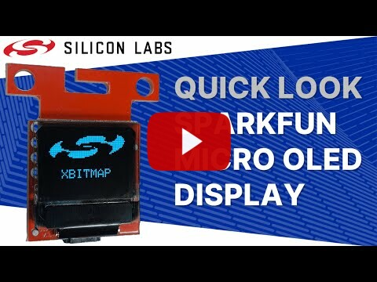
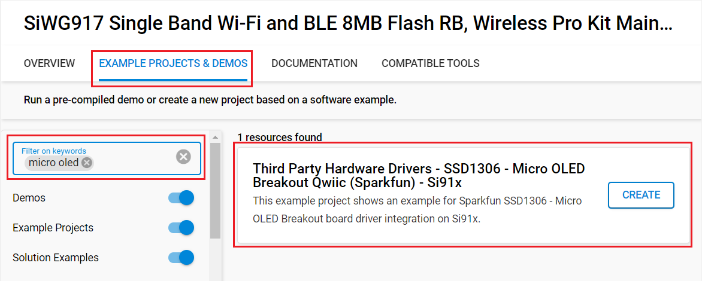

# SSD1306 - SparkFun Micro OLED Breakout #

## Summary ##

This project shows the implementation of the OLED driver using a **SparkFun Micro OLED Breakout (Qwiic) board** with Silicon Labs Platform based on I2C communication.

The SparkFun Micro OLED Breakout (Qwiic) board carries a monochrome, 64 x 48px and blue-on-black OLED display. It uses an SSD1306 controller to drive the display. Its built-in functionalities include contrast control, normal or inverse image display, vertical and horizontal scrolling functions and more. It can be used for applications where bright and crisp blue text or icons need to be displayed such as MP3 player, home appliances.

For more information about the SSD1306 controller, see the [specification page](https://cdn.sparkfun.com/assets/learn_tutorials/3/0/8/SSD1306.pdf).

>Please note that this is a monochrome OLED driver.

## Quick Look Video ##

## Required Hardware ##

- [A BGM220 Explorer Kit board](https://www.silabs.com/development-tools/wireless/bluetooth/bgm220-explorer-kit)

- Or [SiWx917 Wi-Fi 6 and Bluetooth LE 8 MB Flash SoC Pro Kit](https://www.silabs.com/development-tools/wireless/wi-fi/siwx917-pk6031a-wifi-6-bluetooth-le-soc-pro-kit) (BRD4002 + BRD4338A)

- [A SparkFun Micro OLED Breakout (Qwiic) board](https://www.sparkfun.com/products/14532)

## Hardware Connection ##

- If the BGM220P Explorer Kit is used:

  You simply connect a *SparkFun Micro OLED Breakout (Qwiic) board* to a *BGM220 Explorer Kit* board using a Qwiic cable.

  

- If the SiWx917 Wi-Fi 6 and Bluetooth LE 8 MB Flash SoC Pro Kit is used:

  | Description  | BRD4338A GPIO | BRD4002 EXP Header | SparkFun Micro OLED Breakout |
  | -------------| ------------- | ------------------ | ---------------------------- |
  | I2C_SDA      | ULP_GPIO_6    | EXP_16             | SDA                          |
  | I2C_SCL      | ULP_GPIO_7    | EXP_15             | SCL                          |

**Note:** There are several jumpers on *SparkFun Micro OLED Breakout (Qwiic) board* that can be changed to facilitate several different functions. The first of which is the ADDR jumper. The ADDR jumper can be used to change the I2C address of the board. The default jumper is open by default, pulling the address pin high and giving us an I2C address of 0X3D. Closing this jumper will ground the address pin, giving us an I2C address of 0X3C.

The second of which is the I2C pull-up jumper. If multiple boards are connected to the I2C bus, the equivalent resistance goes down, increasing your pull-up strength. If multiple boards are connected on the same bus, make sure only one board has the pull-up resistors connected.

## Setup ##

To test this application, you should connect your board to the PC using a micro USB cable.

### Create a project based on an example project ###

1. From the Launcher Home, add your device to My Products, click on it, and click on the **EXAMPLE PROJECTS & DEMOS** tab. Find the example project filtering by *micro oled*.

2. Click **Create** button on the project:

   - **Third Party Hardware Drivers - SSD1306 - Micro OLED Breakout Qwiic (Sparkfun)** example if the BGM220P Explorer Kit is used.
   
   - **Third Party Hardware Drivers - SSD1306 - Micro OLED Breakout Qwiic (Sparkfun) - Si91x** example if the SiWx917 Wi-Fi 6 and Bluetooth LE 8 MB Flash SoC Pro Kit is used.
   

   Example project creation dialog pops up -> click Create and Finish and Project should be generated.

3. Build and flash this example to the board.

### Start with an empty example project ###

1. Create an "Empty C Project" for the your board using Simplicity Studio v5. Use the default project settings.

2. Copy the file `app/example/sparkfun_micro_oled_ssd1306/app.c` into the project root folder (overwriting existing file).

3. Install the software components:
    - Open the .slcp file in the project.
    - Select the SOFTWARE COMPONENTS tab.
    - Install the following components:

      **If the BGM220P Explorer Kit is used:**

        - [Services] → [Timers] → [Sleep Timer]
        - [Platform] → [Driver]→ [Button] → [Simple Button] → default instance name: **btn0**
        - [Platform] → [Driver] → [I2C] → [I2CSPM] → default instance name: **qwiic**
        - [Third Party Hardware Drivers] → [Display & LED] → [SSD1306 - Micro OLED Breakout (Sparkfun) - I2C] → use default configuration
        - [Third Party Hardware Drivers] → [Services] → [GLIB - OLED Graphics Library]

      **If the SiWx917 Wi-Fi 6 and Bluetooth LE 8 MB Flash SoC Pro Kit is used:**

        - [WiSeConnect 3 SDK] → [Device] → [Si91x] → [MCU] → [Service] → [Sleep Timer for Si91x]
        - [WiSeConnect 3 SDK] → [Device] → [Si91x] → [MCU] → [Hardware] → [Button] → [btn0]
        - [WiSeConnect 3 SDK] → [Device] → [Si91x] → [MCU] → [Peripheral] → [I2C] → [i2c2]
        - [Third Party Hardware Drivers] → [Display & LED] → [SSD1306 - Micro OLED Breakout (Sparkfun) - I2C] → use default configuration
        - [Third Party Hardware Drivers] → [Services] → [GLIB - OLED Graphics Library]

4. Build and flash the project to your device.

**Note:**

- Make sure that the SDK extension already be installed. If not please follow [this documentation](https://github.com/SiliconLabs/third_party_hw_drivers_extension/blob/master/README.md#how-to-add-to-simplicity-studio-ide).

- SDK Extension must be enabled for the project to install "SSD1306 - Micro OLED Breakout (Sparkfun) - I2C" component.

## How It Works ##

After initialization, the OLED displays the text with the font 6x8. If Button 0 is pressed the OLED will display an image with some graphic effects.

The OLED display will look something like the GIF below.

## Report Bugs & Get Support ##

To report bugs in the Application Examples projects, please create a new "Issue" in the "Issues" section of [third_party_hw_drivers_extension](https://github.com/SiliconLabs/third_party_hw_drivers_extension) repo. Please reference the board, project, and source files associated with the bug, and reference line numbers. If you are proposing a fix, also include information on the proposed fix. Since these examples are provided as-is, there is no guarantee that these examples will be updated to fix these issues.

Questions and comments related to these examples should be made by creating a new "Issue" in the "Issues" section of [third_party_hw_drivers_extension](https://github.com/SiliconLabs/third_party_hw_drivers_extension) repo.
